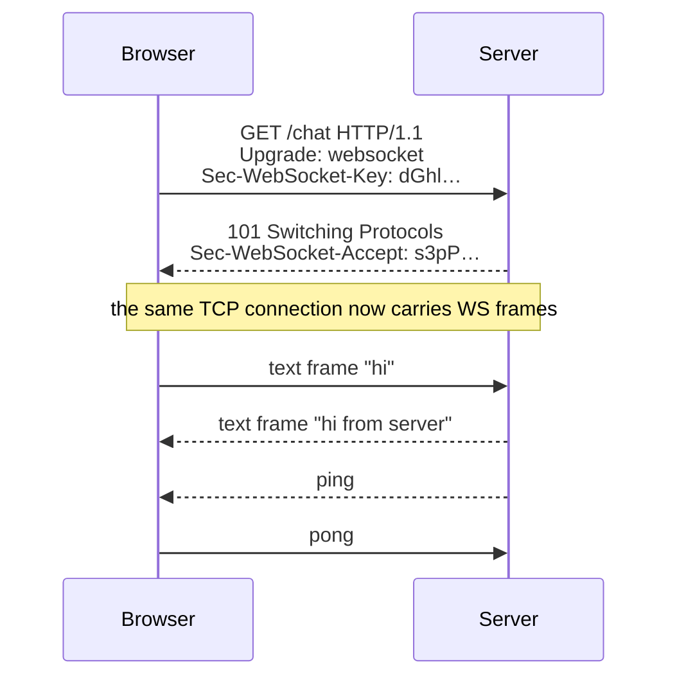
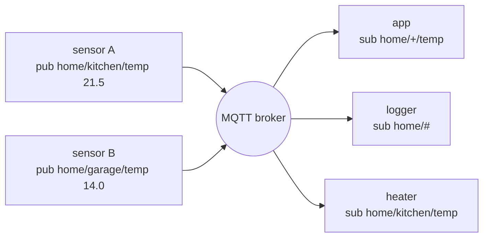
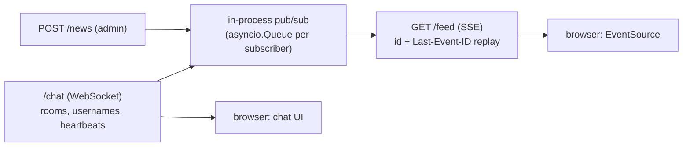

# Chapter 43 — WebSockets, gRPC, MQTT & SSE

> **Volume 1 — Computer Science Foundations** · [Contents](index.md) · ← [Chapter 42 — HTTP, REST, GraphQL & JSON-RPC](ch42-http-rest-graphql-and-json-rpc.md) · Next → [Chapter 44 — Delivery: Load Balancing, Reverse Proxies & CDN](ch44-delivery-load-balancing-reverse-proxies-and-cdn.md)

---

## Concept

Real-time/streaming protocols — WebSockets (bidirectional), gRPC (binary, streaming RPC), MQTT (pub/sub for IoT), SSE (server→client push).

**In one sentence:** when plain request/response is too slow or chatty, you keep a connection open — SSE for the server to push updates, WebSockets for both sides to talk freely, gRPC for typed, fast service-to-service calls with streams, and MQTT for tiny devices publishing to topics through a broker.

**Mental model.**

* **HTTP request/response** — sending a letter and waiting for a reply.
* **SSE** — a radio station: the server broadcasts, you only listen.
* **WebSocket** — a phone call: both talk whenever they like.
* **gRPC** — a phone call with a strict script (the `.proto` contract), in a compact language.
* **MQTT** — a bulletin board: devices pin messages to topics; anyone subscribed to a topic gets a copy.

**Comparison**

| | SSE | WebSocket | gRPC | MQTT |
|-|-----|-----------|------|------|
| Direction | server → client | both | unary, server-, client-, or bidi streaming | pub/sub through a broker |
| Transport | HTTP (text/event-stream) | HTTP upgrade → WS frames over TCP | HTTP/2 (or HTTP/3) | TCP (or WebSocket) |
| Payload | UTF-8 text lines | text or binary frames | Protobuf (binary) | binary, tiny headers (2 bytes) |
| Browser support | native `EventSource` | native `WebSocket` | via grpc-web + proxy | via WS |
| Auto-reconnect | **built in** (`Last-Event-ID`) | you write it | client libraries | client libraries, persistent sessions |
| Delivery guarantees | none beyond TCP | none beyond TCP | per call | **QoS 0 / 1 / 2** |
| Typical use | live feeds, notifications, **LLM token streaming** | chat, collaboration, games, trading UIs | microservices, mobile backends, ML serving | IoT sensors, telemetry, mobile push |

**MQTT QoS levels**

| QoS | Guarantee | Cost |
|-----|-----------|------|
| 0 | at most once (fire and forget) | cheapest |
| 1 | at least once (may duplicate) | an ACK |
| 2 | exactly once | a 4-step handshake |

Other MQTT features: *retained* messages (new subscribers get the last value), *last will* (the broker announces when a device drops), and topic wildcards (`home/+/temp`, `home/#`).

**Operating persistent connections** — each open connection costs memory and a file descriptor; load balancers need long idle timeouts; deploys must drain connections; clients need heartbeats (ping/pong) and reconnect with jittered backoff.

---

## Prereqs

* [Chapter 42 — HTTP, REST, GraphQL & JSON-RPC](ch42-http-rest-graphql-and-json-rpc.md)

---

## Diagram

**Connection models compared**

```
 REQUEST/RESPONSE (HTTP)     PERSISTENT (WebSocket)        PUBLISH/SUBSCRIBE (MQTT)
 C ──req──► S                C ══════════════ S            sensor ─pub temp─►┌────────┐
 C ◄──res── S                  ◄─msg─  ─msg─►               phone ◄─sub temp──│ broker │
 C ──req──► S                  ◄─msg─  ─msg─►              dashboard ◄───────│        │
 C ◄──res── S                one long-lived connection      senders and receivers
 new request per update      both sides send any time       never know each other

 SSE (server push)           gRPC bidi stream
 C ──GET──► S                C ═══HTTP/2 stream═══ S
 C ◄─event─ S                  ─Req─► ─Req─►
 C ◄─event─ S                  ◄─Resp─ ◄─Resp─
 C ◄─event─ S                typed messages, many streams on one connection
```

**The WebSocket upgrade**



**MQTT topics and a broker**



---

## Example

```python
# SSE with FastAPI — also how LLM APIs stream tokens
import asyncio, json
from fastapi import FastAPI
from fastapi.responses import StreamingResponse

app = FastAPI()

@app.get("/events")
async def events():
    async def gen():
        for i in range(5):
            yield f"id: {i}\nevent: tick\ndata: {json.dumps({'n': i})}\n\n"   # blank line ends an event
            await asyncio.sleep(1)
    return StreamingResponse(gen(), media_type="text/event-stream")
```

```js
const es = new EventSource("/events");                       // reconnects automatically
es.addEventListener("tick", e => console.log(JSON.parse(e.data)));

const ws = new WebSocket("wss://example.com/chat");
ws.onopen = () => ws.send("hello");
ws.onmessage = e => console.log("got", e.data);
```

```python
# WebSocket echo server (pip install websockets)
import asyncio, websockets
async def echo(ws):
    async for msg in ws:
        await ws.send(f"echo: {msg}")
async def main():
    async with websockets.serve(echo, "0.0.0.0", 8765):
        await asyncio.Future()
asyncio.run(main())
```

```protobuf
syntax = "proto3";
service Chat {
  rpc Send (Message) returns (Ack);                          // unary
  rpc Subscribe (Room) returns (stream Message);             // server streaming
  rpc Converse (stream Message) returns (stream Message);    // bidirectional
}
message Room    { string id = 1; }
message Message { string room = 1; string user = 2; string text = 3; int64 ts = 4; }
message Ack     { bool ok = 1; }
```

```bash
mosquitto_sub -h localhost -t 'home/+/temp' -q 1 &
mosquitto_pub -h localhost -t home/kitchen/temp -m 21.5 -q 1 -r   # -r: retained
```

---

## Exercises

1. Implement a WebSocket chat server.

   <details><summary>Solution</summary>Extend the echo server: keep a <code>set</code> of connected sockets per room; on each message, broadcast to all others with <code>asyncio.gather</code>, removing sockets that raise <code>ConnectionClosed</code>. Add a join message with a username, heartbeats, and a per-connection send queue with a size limit so one slow client can't block the rest.</details>

2. Define a streaming gRPC service.

   <details><summary>Solution</summary>See <code>Chat</code> above. Generate code with <code>python -m grpc_tools.protoc</code>. The server implements <code>Subscribe</code> as a generator that <code>yield</code>s messages; the client iterates the response stream. Set deadlines on every call and handle <code>CANCELLED</code> when the client leaves.</details>

3. Your WebSocket connections drop after exactly 60 seconds of silence. Why?

   <details><summary>Solution</summary>A load balancer or proxy idle timeout (for example the AWS ALB default of 60 s, or nginx's <code>proxy_read_timeout</code>). Send ping frames every ~30 s and/or raise the timeout.</details>

---

## Mini project

**A live-updates feed using SSE + a WebSocket chat room.**



**Steps**

1. SSE feed: each event gets an increasing `id`; keep the last 100 in memory; on reconnect, replay everything after `Last-Event-ID`.
2. WebSocket chat with rooms, join/leave messages, heartbeats, and back-pressure (drop slow clients).
3. One static HTML page using both.
4. Test by killing the server mid-stream: SSE resumes without gaps; the chat client reconnects with jittered backoff.
5. Load test with 1,000 idle connections; measure memory per connection.

**Done when:** restarting the server causes no missed feed events, and the chat survives network blips.

---

## Open source

* [`grpc/grpc`](https://github.com/grpc/grpc) — the core and language bindings; `doc/PROTOCOL-HTTP2.md` shows exactly how gRPC maps onto HTTP/2 frames.
* [`eclipse-mosquitto/mosquitto`](https://github.com/eclipse-mosquitto/mosquitto) — a small, widely deployed MQTT broker; perfect for local experiments.

---

## Interview

1. **"WebSocket vs SSE?"**
   <details><summary>Answer</summary>SSE is one-way (server to client) over plain HTTP. It is text-only, reconnects automatically with resume, and works through most proxies — ideal for feeds, notifications, and LLM streaming. WebSockets are full-duplex and support binary, which is needed for chat, collaboration, and games, but you handle reconnection, heartbeats, and scaling of stateful connections yourself.</details>

2. **"Why gRPC over HTTP/2?"**
   <details><summary>Answer</summary>HTTP/2 multiplexes many concurrent streams on one connection with binary framing and header compression, which gives gRPC low overhead, streaming in both directions, and flow control. Protobuf adds compact, typed messages with generated clients. The result: faster, contract-first service calls with deadlines and cancellation. Downsides: harder browser support and less human-readable traffic.</details>

---

## Checklist

- [ ] choose the right realtime protocol
- [ ] stream server→client with SSE
- [ ] define a gRPC contract

---

> [Contents](index.md) · ← [Chapter 42 — HTTP, REST, GraphQL & JSON-RPC](ch42-http-rest-graphql-and-json-rpc.md) · Next → [Chapter 44 — Delivery: Load Balancing, Reverse Proxies & CDN](ch44-delivery-load-balancing-reverse-proxies-and-cdn.md)
