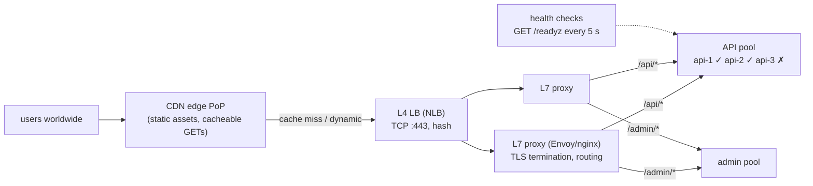
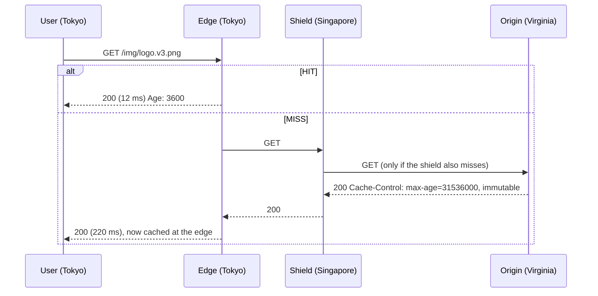
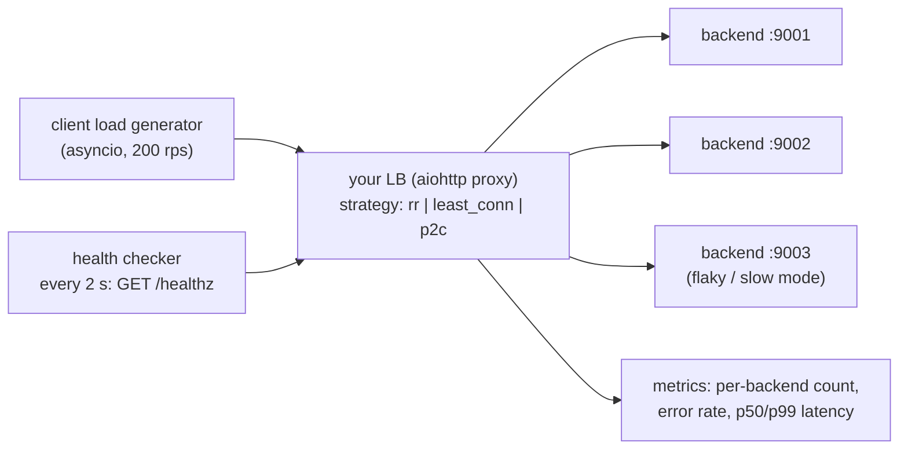

# Chapter 44 — Delivery: Load Balancing, Reverse Proxies & CDN

> **Volume 1 — Computer Science Foundations** · [Contents](index.md) · ← [Chapter 43 — WebSockets, gRPC, MQTT & SSE](ch43-websockets-grpc-mqtt-and-sse.md) · Next → [Chapter 45 — SQL & the Relational Model](ch45-sql-and-the-relational-model.md)

---

## Concept

L4 vs L7 load balancing, reverse proxies (nginx), and CDN/edge caching.

**In one sentence:** a reverse proxy stands in front of your servers and accepts every request for them; a load balancer is a reverse proxy that spreads requests across many healthy servers; and a CDN is thousands of caching reverse proxies placed near users around the world.

**Mental model — a restaurant host.** Guests never walk straight into the kitchen. The host (reverse proxy) greets them at the door, checks the reservation (TLS, auth), and seats them at whichever waiter has the fewest tables (load balancing). A waiter who is sick gets skipped (health checks). A CDN is a chain of take-away counters across the city that hold the most popular dishes ready, so most people never reach the main kitchen at all.

**L4 vs L7**

| | L4 (transport) | L7 (application) |
|-|----------------|------------------|
| Sees | IPs, ports, TCP/UDP | HTTP method, path, headers, cookies, gRPC service |
| Routes by | the 4-tuple (a hash) | `/api/*` → service A, `Host: admin.*` → service B, header or cookie rules |
| TLS | passes through (or terminates) | usually terminates |
| Features | very fast, protocol-agnostic, millions of connections | retries, rewrites, auth, rate limits, caching, compression, canary splits |
| Examples | AWS NLB, LVS/IPVS, Maglev, Katran | nginx, Envoy, HAProxy (both modes), AWS ALB, Traefik |

**Load-balancing algorithms**

| Algorithm | Picks | Good for |
|-----------|-------|----------|
| Round robin | next server in turn | identical servers, similar requests |
| Weighted round robin | in proportion to weights | mixed server sizes, canaries (5%) |
| Least connections | the server with the fewest active connections | long or uneven requests |
| Least response time / EWMA | the fastest recently | latency-sensitive traffic |
| Power of two choices | 2 random servers, then the less loaded | near-optimal and cheap at scale |
| IP / consistent hash | the same client or key → the same server | sticky sessions, cache affinity |

**Health checks** — *active*: the LB polls `GET /healthz` every few seconds, and a server is marked down after N failures and back up after M successes. *Passive* (outlier detection): eject servers that return errors to real traffic. Separate **liveness** ("the process is alive") from **readiness** ("it can serve now").

**What a reverse proxy gives you:** TLS termination, one public entry point, compression, static-file serving, buffering slow clients, request IDs, rate limiting, caching, and hiding backend topology.

**CDN** — edge PoPs (points of presence) cache responses by URL plus the `Vary` headers. A **hit** is served from a nearby edge (~10–30 ms); a **miss** goes to the origin, and the edge caches the result per `Cache-Control`. **Origin shielding** adds a regional mid-tier so a thousand edges don't all miss to the origin at once.

---

## Prereqs

* [Chapter 42 — HTTP, REST, GraphQL & JSON-RPC](ch42-http-rest-graphql-and-json-rpc.md)

---

## Diagram

**Client → CDN → LB → backend pool, with the L4/L7 split**



**Round robin skipping an unhealthy backend**

```
 requests:  r1   r2   r3   r4   r5   r6
 backend:   api1 api2 api1 api2 api1 api2      api3 is ejected (3 failed checks)
 after api3 passes 2 checks → rejoins:  r7 api3, r8 api1, …
```

**CDN hit vs origin fetch**



---

## Example

```nginx
# /etc/nginx/conf.d/app.conf
upstream api {
    least_conn;
    server 10.0.1.11:8080 max_fails=3 fail_timeout=10s;
    server 10.0.1.12:8080 max_fails=3 fail_timeout=10s;
    server 10.0.1.13:8080 weight=2;
    keepalive 64;                                  # reuse upstream connections
}

server {
    listen 443 ssl http2;
    server_name api.example.com;
    ssl_certificate     /etc/ssl/api.crt;
    ssl_certificate_key /etc/ssl/api.key;

    location /static/ {
        root /srv/app;
        add_header Cache-Control "public, max-age=31536000, immutable";
    }

    location /api/ {
        proxy_pass http://api;
        proxy_http_version 1.1;
        proxy_set_header Connection "";
        proxy_set_header Host $host;
        proxy_set_header X-Forwarded-For $proxy_add_x_forwarded_for;
        proxy_set_header X-Request-ID $request_id;
        proxy_next_upstream error timeout http_502 http_503;   # retry idempotent failures elsewhere
        proxy_read_timeout 30s;
    }
}
```

```yaml
# Envoy: active health checking on a cluster (excerpt)
clusters:
  - name: api
    lb_policy: LEAST_REQUEST
    health_checks:
      - timeout: 1s
        interval: 5s
        unhealthy_threshold: 3
        healthy_threshold: 2
        http_health_check: { path: /readyz }
```

```text
Cloudflare cache rule (conceptual)
  If: hostname eq "static.example.com" and URI path starts with "/assets/"
  Then: Cache eligible · Edge TTL 1 year · Respect origin Cache-Control: off
```

---

## Exercises

1. Configure an L7 LB with health checks.

   <details><summary>Solution</summary>Use the nginx upstream above (passive checks via <code>max_fails</code>) or Envoy/HAProxy for active checks against <code>/readyz</code>. Test: stop one backend and confirm no errors reach clients after the detection window; restart it and confirm it rejoins after N good checks. Make <code>/readyz</code> fail during shutdown so draining works.</details>

2. Explain a CDN cache hit vs origin fetch.

   <details><summary>Solution</summary>Hit: the edge has a fresh copy for the cache key and serves it locally, so latency is RTT to the nearby PoP and the origin sees nothing. Miss or expired: the edge (through the shield) requests from the origin, stores the response if cacheable, and serves it. Revalidation with <code>If-None-Match</code> can return 304 without resending the body. Fingerprinted file names (<code>app.3f9a.js</code>) allow "cache forever" without stale content.</details>

3. Why is round robin a poor choice when some requests take 10 ms and others 10 s?

   <details><summary>Solution</summary>It ignores load, so slow requests pile up on some servers while others sit idle. Least connections, least outstanding requests, or power-of-two-choices adapt to actual load.</details>

---

## Mini project

**A load balancer simulator that round-robins and removes unhealthy backends.**



**Steps**

1. Three tiny backends with switches for "healthy", "slow" (adds 500 ms), and "broken" (returns 500).
2. A proxy with a pluggable picker: round robin, least connections, power of two choices.
3. Active health checks with rise/fall thresholds; passive ejection after 5 consecutive 5xx.
4. Retry once on another backend for idempotent requests only (GET).
5. Break one backend mid-test and chart error rate and p99 per strategy.

**Done when:** with a broken backend, client-visible errors stop within one check interval, and least_conn/p2c beat round robin on p99 when one backend is slow.

---

## Open source

* [`nginx/nginx`](https://github.com/nginx/nginx) — `src/http/ngx_http_upstream_round_robin.c` implements smooth weighted round robin.
* [`envoyproxy/envoy`](https://github.com/envoyproxy/envoy) — `source/common/upstream/` has load balancers (including least-request with P2C), health checking, and outlier detection.

---

## Interview

1. **"L4 vs L7 load balancing?"**
   <details><summary>Answer</summary>L4 balances TCP/UDP connections using only addresses and ports. It is extremely fast, protocol-agnostic, and can't see requests (HTTP/2 multiplexes many requests on one connection, so balancing is coarse). L7 parses HTTP/gRPC, so it can route by path, header, or cookie, balance per request, retry, rewrite, cache, and apply auth and rate limits — at more CPU cost, and it usually terminates TLS. Common setup: L4 in front of a fleet of L7 proxies.</details>

2. **"How does a CDN reduce latency?"**
   <details><summary>Answer</summary>It serves cached content from a PoP close to the user (short RTT), terminates TCP/TLS near the user (so handshakes are fast), keeps warm, optimized connections back to the origin, and offloads the origin so it isn't overloaded. Even uncacheable requests benefit from edge termination and the CDN's private backbone.</details>

---

## Checklist

- [ ] set up health checks
- [ ] choose LB algorithm per workload
- [ ] cache at the edge

---

> [Contents](index.md) · ← [Chapter 43 — WebSockets, gRPC, MQTT & SSE](ch43-websockets-grpc-mqtt-and-sse.md) · Next → [Chapter 45 — SQL & the Relational Model](ch45-sql-and-the-relational-model.md)
