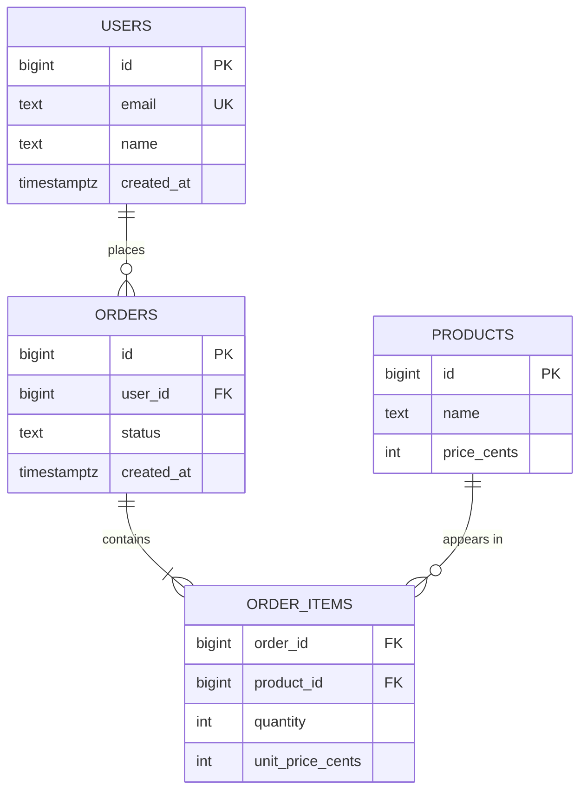
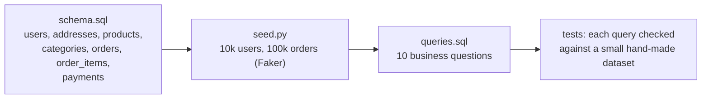

# Chapter 45 — SQL & the Relational Model

> **Volume 1 — Computer Science Foundations** · [Contents](index.md) · ← [Chapter 44 — Delivery: Load Balancing, Reverse Proxies & CDN](ch44-delivery-load-balancing-reverse-proxies-and-cdn.md) · Next → [Chapter 46 — Schema Design, Normalization & Indexing](ch46-schema-design-normalization-and-indexing.md)

---

## Concept

The relational model; SQL (SELECT/JOIN/GROUP BY/subqueries); PostgreSQL vs MySQL.

**In one sentence:** a relational database stores facts in tables of rows and columns linked by keys, and SQL is a declarative language where you describe *what* rows you want and the database figures out *how* to get them.

**Mental model — spreadsheets that reference each other.** Each table is a sheet with one kind of thing (users, orders). Every row has a unique ID (the primary key). Instead of copying a customer's name into every order, an order stores the customer's ID (a foreign key) — like a cell that points to a row in another sheet. A JOIN follows those pointers.

**Vocabulary**

| Term | Meaning |
|------|---------|
| Relation / table | a set of rows with the same columns |
| Tuple / row | one record |
| Attribute / column | a named, typed field |
| Primary key (PK) | uniquely identifies a row; never null |
| Foreign key (FK) | a column referencing another table's PK; the DB enforces it exists |
| Constraint | a rule the DB enforces: `NOT NULL`, `UNIQUE`, `CHECK (price >= 0)`, FK |
| NULL | "unknown" — `NULL = NULL` is not true; use `IS NULL` |

**Logical order of a SELECT** (not the order you write it)

| Step | Clause | Does |
|:-:|--------|------|
| 1 | `FROM` / `JOIN` | build the working set of rows |
| 2 | `WHERE` | filter rows (no aggregates here) |
| 3 | `GROUP BY` | collapse rows into groups |
| 4 | `HAVING` | filter groups (aggregates allowed) |
| 5 | `SELECT` | compute output columns; window functions |
| 6 | `DISTINCT` | remove duplicate output rows |
| 7 | `ORDER BY` | sort |
| 8 | `LIMIT` / `OFFSET` | cut |

That's why you can't use a `SELECT` alias in `WHERE` — `WHERE` runs first.

**Join types**

| Join | Returns |
|------|---------|
| `INNER JOIN` | only matching pairs |
| `LEFT JOIN` | all left rows; right columns are NULL when there's no match |
| `RIGHT JOIN` | the mirror of LEFT |
| `FULL OUTER JOIN` | all rows from both sides |
| `CROSS JOIN` | every combination (m × n) |
| Self-join | a table joined to itself (employee → manager) |
| Anti-join | "rows with no match": `LEFT JOIN … WHERE right.id IS NULL`, or `NOT EXISTS` |

**PostgreSQL vs MySQL (InnoDB)**

| | PostgreSQL | MySQL |
|-|------------|-------|
| Standards and features | very rich: CTEs, window functions, `JSONB` with indexes, arrays, custom types, partial and expression indexes, extensions (PostGIS, pgvector) | good and improving; simpler |
| Default isolation | Read Committed | Repeatable Read |
| MVCC | old row versions in the table; `VACUUM` cleans up | undo logs |
| Replication | streaming (physical), logical | binlog; very mature, many tools |
| Typical choice | complex queries, strong correctness, extensibility | simple web workloads, huge existing ecosystem |

---

## Prereqs

None. (Set operations from [Vol 0 Ch 2](../volume-0-math/ch02-sets-relations-and-functions.md) help: a table is a set of tuples.)

---

## Diagram

**An ER diagram with FK relationships**



**INNER vs LEFT JOIN on sample data**

```
 users              orders
 id │ name          id │ user_id
 ───┼──────         ───┼────────
  1 │ Ada           10 │ 1
  2 │ Bob           11 │ 1
  3 │ Cy            12 │ 2

 INNER JOIN (u.id = o.user_id)       LEFT JOIN
 name │ order                        name │ order
 Ada  │ 10                           Ada  │ 10
 Ada  │ 11                           Ada  │ 11
 Bob  │ 12                           Bob  │ 12
                                     Cy   │ NULL    ← kept, with no match
```

```
   INNER            LEFT             anti-join (LEFT … WHERE o.id IS NULL)
  ╭───╮╭───╮      ╭───╮╭───╮       ╭───╮╭───╮
  │ U ││█O │      │███││█O │       │███││ O │
  │  █││█  │      │███││█  │       │███││   │
  ╰───╯╰───╯      ╰───╯╰───╯       ╰───╯╰───╯
   overlap only    all of U         U without O
```

---

## Example

```sql
CREATE TABLE users (
  id         bigint GENERATED ALWAYS AS IDENTITY PRIMARY KEY,
  email      text NOT NULL UNIQUE,
  name       text NOT NULL,
  manager_id bigint REFERENCES users(id),
  created_at timestamptz NOT NULL DEFAULT now()
);
CREATE TABLE orders (
  id          bigint GENERATED ALWAYS AS IDENTITY PRIMARY KEY,
  user_id     bigint NOT NULL REFERENCES users(id),
  status      text NOT NULL CHECK (status IN ('pending', 'paid', 'shipped', 'cancelled')),
  total_cents int  NOT NULL CHECK (total_cents >= 0),
  created_at  timestamptz NOT NULL DEFAULT now()
);

-- Orders per user, including users with none
SELECT u.name, COUNT(o.id) AS orders, COALESCE(SUM(o.total_cents), 0) AS spent
FROM users u
LEFT JOIN orders o ON o.user_id = u.id AND o.status = 'paid'   -- filter in ON keeps the LEFT semantics
GROUP BY u.id, u.name
HAVING COUNT(o.id) < 5
ORDER BY spent DESC;

-- Self-join: each employee with their manager
SELECT e.name AS employee, m.name AS manager
FROM users e LEFT JOIN users m ON m.id = e.manager_id;

-- Subquery / anti-join: users who never ordered
SELECT name FROM users u WHERE NOT EXISTS (SELECT 1 FROM orders o WHERE o.user_id = u.id);

-- Find duplicate rows by email (case-insensitive)
SELECT lower(email), COUNT(*) FROM users GROUP BY lower(email) HAVING COUNT(*) > 1;

-- CTE + window function: each user's latest order
WITH ranked AS (
  SELECT o.*, ROW_NUMBER() OVER (PARTITION BY user_id ORDER BY created_at DESC) AS rn
  FROM orders o
)
SELECT * FROM ranked WHERE rn = 1;
```

---

## Exercises

1. Write a query with a self-join.

   <details><summary>Solution</summary>The employee → manager query above. Another: pairs of users who signed up on the same day — <code>SELECT a.name, b.name FROM users a JOIN users b ON a.created_at::date = b.created_at::date AND a.id &lt; b.id;</code>. The <code>a.id &lt; b.id</code> avoids self-pairs and mirrored duplicates.</details>

2. Explain a LEFT JOIN vs INNER JOIN result.

   <details><summary>Solution</summary>INNER keeps only rows with a match on both sides. LEFT keeps every left row and fills right-side columns with NULL when there is no match. Trap: a condition on the right table in <code>WHERE</code> (e.g. <code>WHERE o.status = 'paid'</code>) removes the NULL rows and silently turns the LEFT JOIN into an INNER JOIN; put it in <code>ON</code>.</details>

3. Why does `SELECT * FROM users WHERE manager_id = NULL` return nothing?

   <details><summary>Solution</summary>Any comparison with NULL yields UNKNOWN, not TRUE (three-valued logic). Use <code>WHERE manager_id IS NULL</code>. Similarly, <code>NOT IN (subquery)</code> returns nothing if the subquery contains a NULL; prefer <code>NOT EXISTS</code>.</details>

---

## Mini project

**A normalized schema + query set for an e-commerce store.**



**Steps**

1. Design the tables with PKs, FKs, `NOT NULL`, `UNIQUE`, and `CHECK` constraints; money as integer cents.
2. Seed realistic data with Faker (and some edge cases: users with no orders, cancelled orders).
3. Answer: revenue per month; top 10 products per category (window function); customers with no orders in 90 days (anti-join); average basket size; repeat-purchase rate; duplicate emails; each user's first order; category revenue share; orders over the user's own average (correlated subquery); running total per day.
4. Verify each query on a tiny dataset where you know the answer.

**Done when:** all 10 queries return correct results on the test dataset, and the constraints reject invalid inserts (negative price, unknown user).

---

## Open source

* [`postgres/postgres`](https://github.com/postgres/postgres) — the PostgreSQL docs' "Tutorial" and "Queries" chapters are among the best SQL references anywhere; `src/backend/parser/gram.y` is the SQL grammar.

---

## Interview

1. **"INNER vs LEFT JOIN?"**
   <details><summary>Answer</summary>INNER JOIN returns only rows with matches in both tables. LEFT JOIN returns every row of the left table, with the matched right row or NULLs. Use LEFT when missing relations matter ("users and their order count, including zero"). Watch <code>WHERE</code> filters on the right table, which turn it back into an INNER JOIN.</details>

2. **"How would you find duplicate rows?"**
   <details><summary>Answer</summary>Group by the columns that define "duplicate" and keep groups with <code>HAVING COUNT(*) &gt; 1</code>. To see or delete the extras, use <code>ROW_NUMBER() OVER (PARTITION BY those columns ORDER BY id)</code> and target <code>rn &gt; 1</code>. Then add a <code>UNIQUE</code> constraint (possibly on <code>lower(email)</code>) so it can't recur.</details>

---

## Checklist

- [ ] write all join types
- [ ] group/aggregate correctly
- [ ] design a normalized schema

---

> [Contents](index.md) · ← [Chapter 44 — Delivery: Load Balancing, Reverse Proxies & CDN](ch44-delivery-load-balancing-reverse-proxies-and-cdn.md) · Next → [Chapter 46 — Schema Design, Normalization & Indexing](ch46-schema-design-normalization-and-indexing.md)
