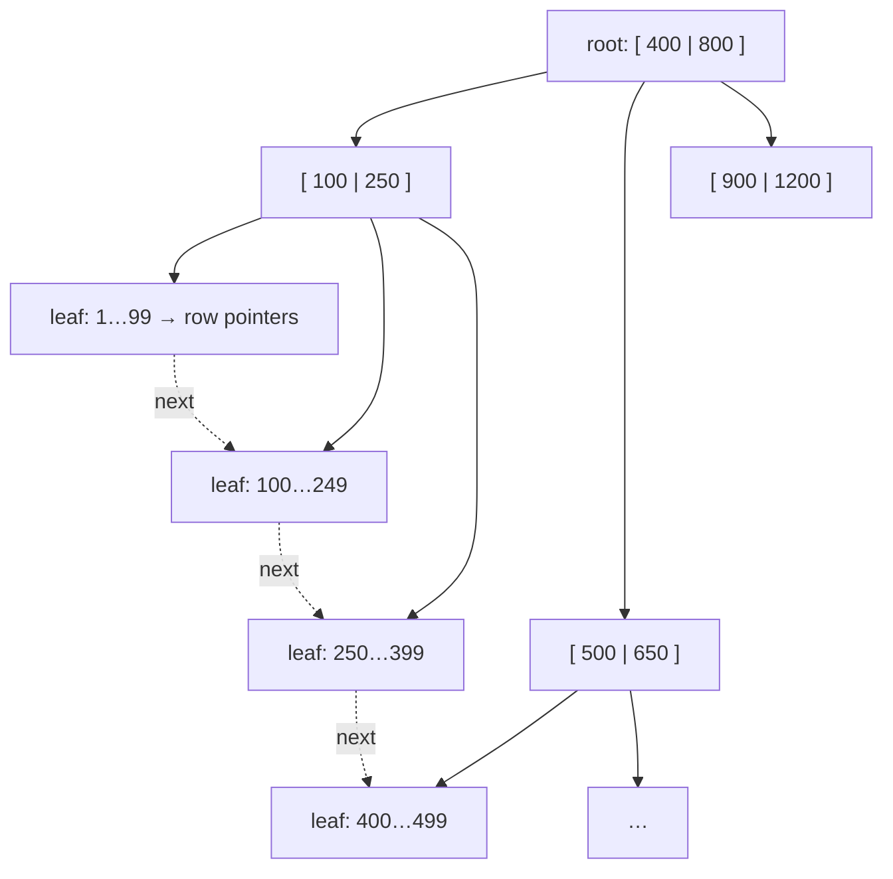
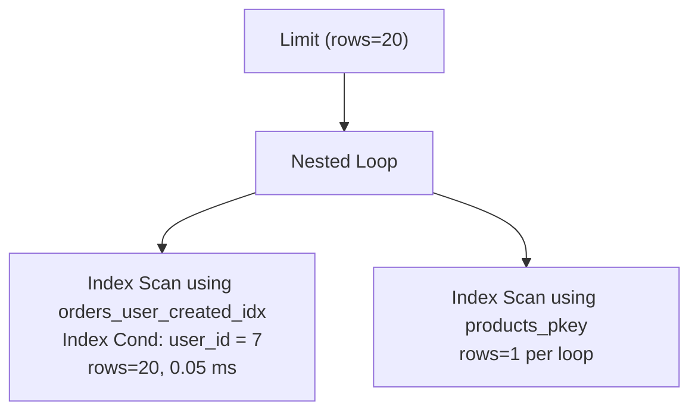
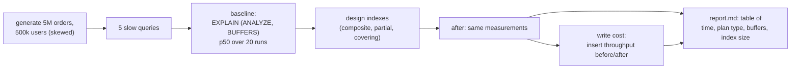

# Chapter 46 — Schema Design, Normalization & Indexing

> **Volume 1 — Computer Science Foundations** · [Contents](index.md) · ← [Chapter 45 — SQL & the Relational Model](ch45-sql-and-the-relational-model.md) · Next → [Chapter 47 — ACID, Transactions & Isolation](ch47-acid-transactions-and-isolation.md)

---

## Concept

Normal forms, denormalization trade-offs, B-tree indexes, composite indexes, and query planning (EXPLAIN).

**In one sentence:** normalization stores each fact exactly once so it can't contradict itself, denormalization deliberately copies facts to make reads faster, and indexes are sorted side-structures that let the database jump to rows instead of scanning them — and `EXPLAIN` shows you which path the planner chose.

**Mental model — a library.** Normalization: each author's biography is written once, in the author file, not photocopied into every book. An index is the card catalog, sorted by author then title: you flip straight to "Tolkien" instead of walking every shelf. A composite index is like a phone book sorted by (last name, first name): it helps you find "Smith, John" or all Smiths, but not everyone named John.

**Normal forms (the practical three)**

| Form | Rule | Violation example | Fix |
|------|------|-------------------|-----|
| **1NF** | atomic values; no repeating groups | `phones = "555-1, 555-2"` | a `phones` table, one row per phone |
| **2NF** | 1NF + every non-key column depends on the *whole* key | in `order_items(order_id, product_id, product_name)`, the name depends only on `product_id` | move the name to `products` |
| **3NF** | 2NF + no column depends on another non-key column | `orders(…, customer_id, customer_city)` — the city depends on the customer | move the city to `customers` |

"Every non-key attribute depends on the key, the whole key, and nothing but the key."

**Anomalies normalization prevents:** *update* (change a city in one row but not the others), *insert* (can't add a product until someone orders it), *delete* (deleting the last order erases the customer).

**When to denormalize** — on purpose, after measuring:

* read-heavy paths where joins dominate (feeds, dashboards) → materialized views, summary tables, cached counters;
* analytics (star schemas);
* document stores where you read the whole aggregate at once.

Cost: you must keep the copies in sync (triggers, application logic, events), and they can drift.

**B-tree indexes**

| Fact | Consequence |
|------|------------|
| Sorted, balanced tree; each node is a page (8 KB in Postgres) with hundreds of keys | lookups take ~3–4 page reads even for 100M rows |
| Leaves are linked in order | range scans and `ORDER BY` can use the index |
| Every index is updated on every write | more indexes → slower writes and more storage |
| Low-selectivity columns (`is_active` true/false) | rarely helpful alone; consider a partial index |

**Composite index order matters — the leftmost-prefix rule.** An index on `(user_id, created_at)` supports:

| Query | Uses the index? |
|-------|:-:|
| `WHERE user_id = 7` | ✓ |
| `WHERE user_id = 7 AND created_at > '2024-01-01'` | ✓ (equality first, then range) |
| `WHERE user_id = 7 ORDER BY created_at DESC LIMIT 20` | ✓ no sort needed |
| `WHERE created_at > '2024-01-01'` | ✗ (can't skip the first column; mostly) |

Rule of thumb: equality columns first, then the range or sort column. A **covering index** (`INCLUDE (total_cents)`) lets the query be answered from the index alone (an *index-only scan*).

---

## Prereqs

* [Chapter 45 — SQL & the Relational Model](ch45-sql-and-the-relational-model.md)

---

## Diagram

**A B-tree index over `orders.user_id`**



`WHERE user_id = 300`: root → A → leaf 250…399 → heap row. Three hops, not a million.

**Composite index `(user_id, created_at)` — how entries are sorted**

```
 (5, 2024-01-02)
 (5, 2024-03-09)
 (7, 2023-12-30)   ┐
 (7, 2024-02-14)   │ WHERE user_id = 7 ORDER BY created_at: one contiguous slice, already sorted
 (7, 2024-05-01)   ┘
 (9, 2024-01-15)
 created_at alone is scattered across every user_id → the index doesn't help
```

**A query plan tree from EXPLAIN**



---

## Example

```sql
-- Before: a sequential scan over 5M rows
EXPLAIN ANALYZE
SELECT id, total_cents FROM orders
WHERE user_id = 7 ORDER BY created_at DESC LIMIT 20;
--  Limit  (actual time=812.4..812.4 rows=20)
--    ->  Sort  (Sort Key: created_at DESC)  Sort Method: top-N heapsort
--          ->  Seq Scan on orders  (rows=5000000)  Filter: (user_id = 7)  Rows Removed by Filter: 4999871

CREATE INDEX CONCURRENTLY orders_user_created_idx
  ON orders (user_id, created_at DESC) INCLUDE (total_cents);

-- After: an index-only scan, no sort
--  Limit  (actual time=0.041..0.052 rows=20)
--    ->  Index Only Scan using orders_user_created_idx on orders  (rows=20)
--          Index Cond: (user_id = 7)   Heap Fetches: 0

-- Partial index: only the rows you actually query
CREATE INDEX orders_pending_idx ON orders (created_at) WHERE status = 'pending';

-- Expression index for case-insensitive lookups
CREATE UNIQUE INDEX users_email_lower_idx ON users (lower(email));
SELECT * FROM users WHERE lower(email) = lower('Ada@Example.com');
```

**Reading EXPLAIN** — look for: `Seq Scan` on big tables with selective filters; big gaps between *estimated* and *actual* rows (stale statistics → `ANALYZE`); `Sort` or `Hash` spilling to disk; `Nested Loop` with many loops over a scan; `Rows Removed by Filter` in the millions.

---

## Exercises

1. Normalize a table to 3NF.

   ```
   orders_flat(order_id, order_date, customer_id, customer_name, customer_city,
               product_id, product_name, unit_price, quantity)
   ```

   <details><summary>Solution</summary><code>customers(customer_id PK, name, city)</code>; <code>products(product_id PK, name, current_price)</code>; <code>orders(order_id PK, order_date, customer_id FK)</code>; <code>order_items(order_id FK, product_id FK, quantity, unit_price, PK(order_id, product_id))</code>. Keep <code>unit_price</code> on the order item on purpose: it records the price at purchase time, which is a different fact from the current price.</details>

2. Design the optimal index for a given query and verify with EXPLAIN.

   `SELECT * FROM tickets WHERE tenant_id = $1 AND status = 'open' ORDER BY priority DESC, created_at LIMIT 50;`

   <details><summary>Solution</summary><code>CREATE INDEX ON tickets (tenant_id, status, priority DESC, created_at);</code> — equality columns first, then the sort columns in the same order and direction. EXPLAIN should show an Index Scan with no Sort node. If <code>status = 'open'</code> is a small fraction, a partial index <code>WHERE status = 'open'</code> on <code>(tenant_id, priority DESC, created_at)</code> is smaller and faster.</details>

3. You add an index but the planner still does a `Seq Scan`. Give three reasons.

   <details><summary>Solution</summary>(1) The query returns a large fraction of the table, so a sequential scan really is cheaper. (2) Statistics are stale — run <code>ANALYZE</code>. (3) The predicate can't use the index: a function on the column (<code>WHERE date(created_at) = …</code>), a type mismatch, a leading wildcard <code>LIKE '%x'</code>, or a column that isn't the leftmost in the composite index.</details>

---

## Mini project

**Add indexes to a slow schema and measure the query-speed change.**



**Steps**

1. Load realistic, skewed data with `generate_series` in Postgres (a few heavy users, many light ones).
2. Pick 5 queries: a lookup by email, a user's recent orders, pending orders older than 1 day, revenue by day for a month, and search by name prefix.
3. Record `EXPLAIN (ANALYZE, BUFFERS)` and median time for each.
4. Add the minimal set of indexes; re-measure; record index sizes (`pg_relation_size`).
5. Measure insert throughput before and after to show the write cost.

**Done when:** every query has a before/after row in the report with plan type, time, and buffers, and you can justify each index.

---

## Open source

* [`postgres/postgres`](https://github.com/postgres/postgres) planner — `src/backend/optimizer/` (the path, cost, and plan modules) and `src/backend/access/nbtree/README`, a readable description of Postgres's B-tree (Lehman–Yao).

---

## Interview

1. **"When to denormalize?"**
   <details><summary>Answer</summary>When measured read performance matters more than write simplicity, and joins or aggregations are the bottleneck: feeds, dashboards, counters, search documents, analytics star schemas. Do it deliberately — materialized views, summary tables, cached columns — with a clear sync mechanism and ownership. Keep the normalized source of truth when possible.</details>

2. **"Why does a composite index order matter?"**
   <details><summary>Answer</summary>A composite B-tree is sorted by the first column, then the second within it, and so on. It can only be searched efficiently from the left: a condition on a later column alone matches entries scattered across the whole index. Put equality-filtered columns first, then range or sort columns, matching the query's <code>ORDER BY</code> so the sort is free.</details>

---

## Checklist

- [ ] reach 3NF
- [ ] read EXPLAIN
- [ ] index for real query patterns

---

> [Contents](index.md) · ← [Chapter 45 — SQL & the Relational Model](ch45-sql-and-the-relational-model.md) · Next → [Chapter 47 — ACID, Transactions & Isolation](ch47-acid-transactions-and-isolation.md)
