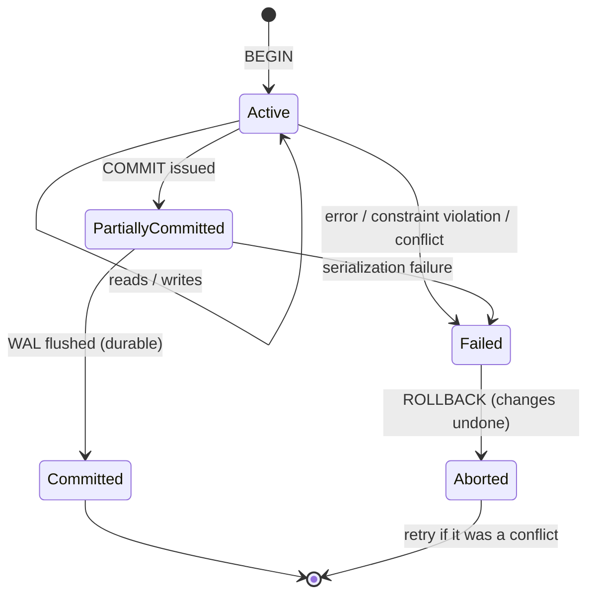
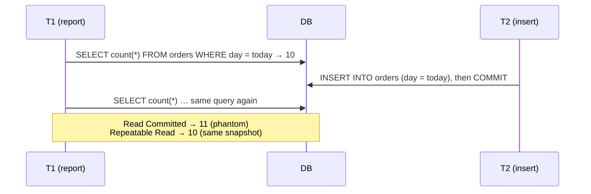
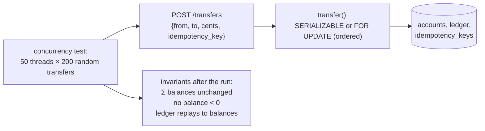

# Chapter 47 — ACID, Transactions & Isolation

> **Volume 1 — Computer Science Foundations** · [Contents](index.md) · ← [Chapter 46 — Schema Design, Normalization & Indexing](ch46-schema-design-normalization-and-indexing.md) · Next → [Chapter 48 — NoSQL: MongoDB, Cassandra & DynamoDB](ch48-nosql-mongodb-cassandra-and-dynamodb.md)

---

## Concept

Atomicity/Consistency/Isolation/Durability; transactions; isolation levels (read committed, repeatable read, serializable) and anomalies.

**In one sentence:** a transaction groups several changes into one all-or-nothing unit, and the isolation level decides how much concurrent transactions can see of each other's half-finished work — trading correctness against speed.

**Mental model — a bank teller's window.** Moving €100 from savings to checking is two steps. ACID promises that you never see the money vanish or appear twice, even if the power fails halfway (atomicity, durability), that the rules still hold afterward (consistency), and that another teller working on the same accounts at the same time doesn't mess up your math (isolation).

**ACID**

| Property | Promise | How databases do it |
|----------|---------|---------------------|
| **Atomicity** | all changes commit, or none do | an undo log / old row versions; rollback on error |
| **Consistency** | constraints hold before and after | PK, FK, UNIQUE, CHECK, triggers (plus *your* invariants) |
| **Isolation** | concurrent transactions behave as if more or less serial | locks and/or MVCC snapshots |
| **Durability** | once committed, it survives crashes | a write-ahead log (WAL) flushed with fsync before COMMIT returns; replication |

**Anomalies**

| Anomaly | What happens |
|---------|--------------|
| Dirty read | you read another transaction's *uncommitted* change, which then rolls back |
| Non-repeatable read | you read a row twice and get different values (another transaction committed in between) |
| Phantom read | you re-run a range query and new rows appear |
| **Lost update** | two transactions read-modify-write the same value; one overwrites the other |
| **Write skew** | two transactions read overlapping data, each writes a *different* row, and together they break a rule (e.g. both doctors go off call) |

**Isolation levels (as implemented in PostgreSQL)**

| Level | Dirty read | Non-repeatable | Phantom | Lost update | Write skew |
|-------|:-:|:-:|:-:|:-:|:-:|
| Read Uncommitted (behaves as Read Committed in PG) | ✗ | possible | possible | possible | possible |
| **Read Committed** (PG default) | ✗ | possible | possible | possible | possible |
| **Repeatable Read** (snapshot isolation in PG) | ✗ | ✗ | ✗ (in PG) | ✗ (one aborts) | **possible** |
| **Serializable** (SSI in PG) | ✗ | ✗ | ✗ | ✗ | ✗ (one aborts) |

✗ = prevented. At Repeatable Read and Serializable, the database may abort you with a *serialization failure* — your code must **retry** the transaction.

**MVCC (multi-version concurrency control)** — writers create new row *versions* instead of overwriting. Each transaction reads from a *snapshot*: the versions committed before it started (Repeatable Read) or before each statement (Read Committed). Readers never block writers and writers never block readers. Old versions are later cleaned up (`VACUUM` in Postgres).

**Fixing lost updates** — use an atomic update (`SET balance = balance - 100`), `SELECT … FOR UPDATE` (a pessimistic row lock), optimistic concurrency (a version column: `UPDATE … WHERE id = $1 AND version = $2`, and check the row count), or a higher isolation level plus retries.

**Keep transactions short:** long transactions hold locks, block `VACUUM`, bloat tables, and raise conflict rates. Never wait for user input or call slow external APIs inside a transaction.

---

## Prereqs

* [Chapter 45 — SQL & the Relational Model](ch45-sql-and-the-relational-model.md)

---

## Diagram

**Transaction state diagram**



**A lost update (Read Committed, read-then-write in the app)**

```
 balance = 100
 T1: SELECT balance → 100                 T2: SELECT balance → 100
 T1: UPDATE SET balance = 100 + 50        
 T1: COMMIT                               T2: UPDATE SET balance = 100 − 30
                                          T2: COMMIT
 result: 70   (expected 120 — T1's +50 was lost)
 fix: UPDATE accounts SET balance = balance + 50  (atomic)  or  SELECT … FOR UPDATE
```

**A phantom read under two isolation levels**



**MVCC row versions**

```
 row id=1:  [v1 balance=100, created by tx 90, deleted by tx 95] → [v2 balance=150, created by tx 95]
 tx 93 (started before 95 committed) sees v1   ·   tx 97 sees v2   ·   VACUUM removes v1 once no one can see it
```

---

## Example

```sql
BEGIN;
UPDATE accounts SET balance = balance - 100 WHERE id = 1 AND balance >= 100;
-- check the row count in the app: 0 rows → insufficient funds → ROLLBACK
UPDATE accounts SET balance = balance + 100 WHERE id = 2;
INSERT INTO ledger (from_id, to_id, amount_cents) VALUES (1, 2, 100);
COMMIT;

-- Pessimistic locking: lock rows in a consistent order (avoids deadlocks)
BEGIN;
SELECT id, balance FROM accounts WHERE id IN (1, 2) ORDER BY id FOR UPDATE;
-- … compute, then UPDATE both …
COMMIT;

-- Serializable with a retry loop in the app
BEGIN ISOLATION LEVEL SERIALIZABLE;
SELECT count(*) FROM doctors WHERE on_call AND shift = 'night';   -- 2
UPDATE doctors SET on_call = false WHERE id = 7;                   -- ok if count > 1
COMMIT;   -- may fail: ERROR: could not serialize access (SQLSTATE 40001) → retry
```

```python
import psycopg, time, random
from psycopg import errors

def transfer(conn, src, dst, cents, attempts=5):
    for i in range(attempts):
        try:
            with conn.transaction():
                conn.execute("SET TRANSACTION ISOLATION LEVEL SERIALIZABLE")
                cur = conn.execute("UPDATE accounts SET balance = balance - %s "
                                   "WHERE id = %s AND balance >= %s", (cents, src, cents))
                if cur.rowcount == 0:
                    raise ValueError("insufficient funds")
                conn.execute("UPDATE accounts SET balance = balance + %s WHERE id = %s", (cents, dst))
            return
        except errors.SerializationFailure:
            time.sleep((2 ** i) * 0.01 * random.random())   # jittered backoff, then retry
    raise RuntimeError("transfer failed after retries")
```

---

## Exercises

1. Reproduce a lost update and fix it with a lock.

   <details><summary>Solution</summary>Open two <code>psql</code> sessions. Both <code>BEGIN; SELECT balance FROM accounts WHERE id=1;</code>, then each <code>UPDATE … SET balance = &lt;value computed from its read&gt;</code> and commit: one change is lost. Fix: <code>SELECT … FOR UPDATE</code> in both (the second blocks until the first commits and then reads the new value), an atomic <code>SET balance = balance + x</code>, or a version column with <code>WHERE version = n</code>.</details>

2. Explain what each isolation level prevents.

   <details><summary>Solution</summary>Read Committed: no dirty reads; each statement sees the latest committed data. Repeatable Read (a PG snapshot): the whole transaction sees one snapshot — no non-repeatable or phantom reads, and a conflicting concurrent update aborts one side — but write skew is possible. Serializable: the result is equivalent to some serial order; PG detects dangerous patterns (SSI) and aborts one transaction.</details>

3. Two doctors are on call. Each, in their own transaction, checks "at least 2 on call?" and then goes off call. Which level prevents both leaving?

   <details><summary>Solution</summary>This is write skew. Repeatable Read (snapshot isolation) allows it: they update different rows, so there's no write conflict. Serializable prevents it (one transaction aborts), as does locking the relevant rows with <code>SELECT … FOR UPDATE</code>.</details>

---

## Mini project

**A money-transfer service with transactions that pass a concurrency test.**



**Steps**

1. Tables: `accounts(id, balance CHECK (balance >= 0))`, `ledger(id, from_id, to_id, cents, created_at)`, `idempotency_keys(key PK, response)`.
2. Implement `transfer` twice: (a) `SELECT … FOR UPDATE` with ordered locking, (b) `SERIALIZABLE` with a retry loop.
3. An idempotency key stored in the *same* transaction as the transfer.
4. Concurrency test: many threads doing random transfers among 10 accounts; count retries and deadlocks.
5. Check the invariants; then deliberately break the code (a read-modify-write without a lock) and watch the test fail.

**Done when:** both versions keep all invariants under load, the broken version fails the test, and retried requests with the same key never double-charge.

---

## Open source

* [`postgres/postgres`](https://github.com/postgres/postgres) (MVCC) — `src/backend/storage/lmgr/README-SSI` explains Serializable Snapshot Isolation; the docs' "Concurrency Control" chapter is essential reading.

---

## Interview

1. **"What anomalies does each isolation level allow?"**
   <details><summary>Answer</summary>Read Uncommitted: dirty reads and everything below. Read Committed: non-repeatable reads, phantoms, lost updates, write skew. Repeatable Read (ANSI): phantoms (and in snapshot implementations like PG, write skew but not phantoms). Serializable: none. Implementations vary, so know your database: MySQL's Repeatable Read uses gap locks; PG's is snapshot isolation.</details>

2. **"How does MVCC work?"**
   <details><summary>Answer</summary>Each write creates a new row version tagged with the creating transaction's ID, and marks the old version as deleted by that ID. Each transaction reads with a snapshot that defines which transaction IDs count as committed and visible. So readers see a consistent past state without locking, and writers don't block readers. Write–write conflicts are still detected. Garbage collection (VACUUM, undo purge) reclaims versions no snapshot can see.</details>

---

## Checklist

- [ ] name the ACID properties
- [ ] pick an isolation level deliberately
- [ ] keep transactions short

---

> [Contents](index.md) · ← [Chapter 46 — Schema Design, Normalization & Indexing](ch46-schema-design-normalization-and-indexing.md) · Next → [Chapter 48 — NoSQL: MongoDB, Cassandra & DynamoDB](ch48-nosql-mongodb-cassandra-and-dynamodb.md)
