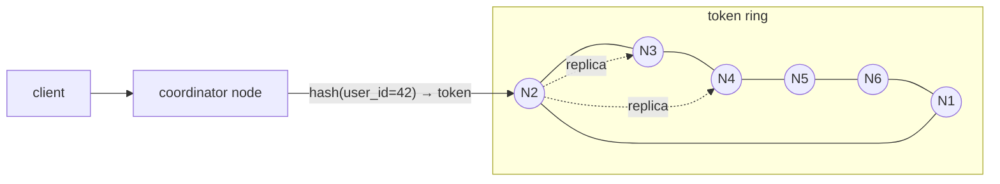
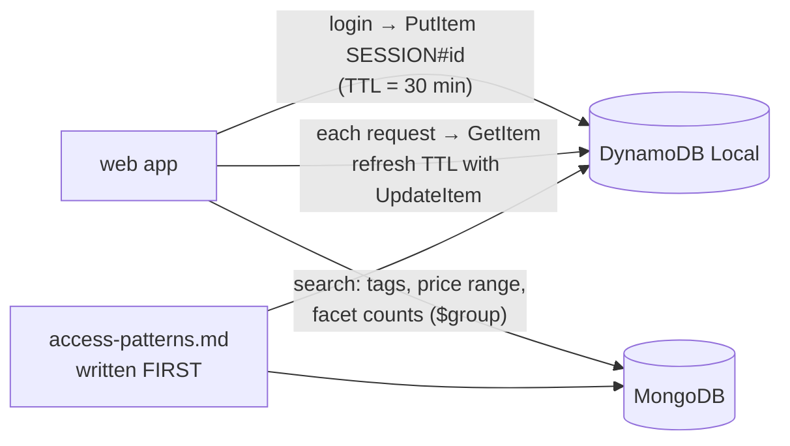

# Chapter 48 — NoSQL: MongoDB, Cassandra & DynamoDB

> **Volume 1 — Computer Science Foundations** · [Contents](index.md) · ← [Chapter 47 — ACID, Transactions & Isolation](ch47-acid-transactions-and-isolation.md) · Next → [Chapter 49 — Redis, Elasticsearch, Neo4j & Vector Databases](ch49-redis-elasticsearch-neo4j-and-vector-databases.md)

---

## Concept

Document, wide-column, and key-value/Dynamo-style stores; consistency models; when NoSQL beats SQL.

**In one sentence:** NoSQL databases give up some of SQL's flexibility — ad-hoc joins, multi-row transactions, a fixed schema — to gain easy horizontal scaling, flexible documents, or predictable single-digit-millisecond access at any size, and you design their data around your *queries* instead of around your entities.

**Mental model — storage units.**

* **Document store (MongoDB)** — a folder per customer holding everything about them in one file. Easy to read whole; awkward to cross-reference.
* **Wide-column (Cassandra, ScyllaDB)** — a huge filing cabinet where each drawer (partition) holds rows sorted by a key. Opening one drawer and reading a sorted slice is instant; searching every drawer is not allowed.
* **Key-value (DynamoDB, Redis)** — a coat check: give the ticket, get the coat. Nothing else.

**The families**

| | Document | Wide-column | Key-value / Dynamo-style |
|-|----------|-------------|--------------------------|
| Examples | MongoDB, Couchbase, Firestore | Cassandra, ScyllaDB, HBase, Bigtable | DynamoDB, Riak, Redis |
| Data unit | a JSON-like document | a row inside a partition, sorted by clustering columns | an item under a key (DynamoDB: partition key + optional sort key) |
| Query power | rich: filters, secondary indexes, aggregation pipelines | by partition key + range on clustering columns only | by key (+ sort-key range); secondary indexes as extra tables |
| Scale-out | sharding by shard key | automatic: consistent-hash ring, leaderless | fully managed partitions |
| Transactions | multi-document ACID (since 4.0), costlier | lightweight transactions (Paxos) per partition | `TransactWriteItems` (up to 100 items) |
| Sweet spot | varied, nested data; fast iteration; catalogs; CMS | write-heavy time series, feeds, messaging, IoT at huge scale | sessions, carts, user profiles, and any access pattern known in advance |

**Query-first modeling (Cassandra/DynamoDB)** — list your access patterns *first*, then design one table (or item layout) per pattern. Denormalize and duplicate freely; joins don't exist.

**Partition key design — the most important decision**

| Good partition key | Bad partition key |
|--------------------|-------------------|
| high cardinality (`user_id`, `device_id`) | low cardinality (`country`, `status`) → a few huge partitions |
| spreads writes evenly | one celebrity user → a **hot partition** |
| bounded partition size (add a time bucket: `(user_id, month)`) | unbounded growth (all events for one sensor forever) |

**Consistency knobs**

| Store | Knob |
|-------|------|
| Cassandra | per query: `ONE`, `QUORUM`, `LOCAL_QUORUM`, `ALL`. With replication factor N, reads R + writes W > N → you read your latest write |
| DynamoDB | reads are *eventually consistent* by default (half the cost); `ConsistentRead=true` for strong reads on the base table (not on global secondary indexes) |
| MongoDB | `writeConcern` (w: 1 / majority), `readConcern` (local / majority / linearizable), `readPreference` (primary / secondary) |

**When NoSQL over Postgres?** When access patterns are known and simple but scale is extreme (millions of writes per second, multi-region active-active), when data really is document-shaped and changes shape often, or when you want a serverless, zero-ops store (DynamoDB). Otherwise, Postgres (which also has `JSONB`) is usually the better default.

---

## Prereqs

* [Chapter 45 — SQL & the Relational Model](ch45-sql-and-the-relational-model.md)

---

## Diagram

**Document vs wide-column vs key-value layout**

```
 DOCUMENT (MongoDB)                    WIDE-COLUMN (Cassandra)
 {                                     partition key: user_id
   "_id": "u42",                       ┌─ partition u42 ───────────────────────────┐
   "name": "Ada",                      │ posted_at ↓ (clustering, sorted DESC)      │
   "addresses": [                      │ 2024-05-03 09:12 │ post_id p9 │ "hello"   │
     {"city": "London"}                │ 2024-05-01 18:40 │ post_id p7 │ "hi"      │
   ],                                  │ 2024-04-28 07:05 │ post_id p3 │ "first!"  │
   "orders": [{"id": 1, "total": 30}]  └───────────────────────────────────────────┘
 }                                     one partition = one node set, read as a sorted slice
 whole aggregate in one read

 KEY-VALUE / DYNAMODB (single table)
 PK            SK                   attributes
 USER#42       PROFILE              name=Ada, email=…
 USER#42       ORDER#2024-05-01#7   total=30, status=paid
 USER#42       ORDER#2024-05-03#9   total=12, status=pending
 Query PK = USER#42 AND SK begins_with "ORDER#" → the user's orders, sorted by date
```

**Cassandra's ring: partitions and replicas (RF = 3)**



With QUORUM (2 of 3), a write is acknowledged when 2 replicas have it; a QUORUM read asks 2 replicas, so it always overlaps the write.

**A hot partition**

```
 partition key = country
 US  ████████████████████████████████████  (70% of traffic → one node set melts)
 DE  ███
 IN  ██████
 fix: key = (country, user_id) or (country, bucket 0–31) spread across many partitions
```

---

## Example

```javascript
// MongoDB: a product document with embedded variants
db.products.insertOne({
  _id: "sku-123", name: "Trail Shoe", brand: "Acme", tags: ["running", "trail"],
  variants: [{ size: 42, color: "red", stock: 7 }, { size: 43, color: "red", stock: 0 }],
  price_cents: 12900
});
db.products.createIndex({ tags: 1, price_cents: 1 });
db.products.find({ tags: "trail", price_cents: { $lt: 15000 } }, { name: 1, price_cents: 1 });
```

```sql
-- Cassandra (CQL): a user's feed, newest first, bounded by month bucket
CREATE TABLE feed_by_user (
  user_id   uuid,
  month     text,           -- '2024-05' keeps partitions bounded
  posted_at timeuuid,
  post_id   uuid,
  author    text,
  body      text,
  PRIMARY KEY ((user_id, month), posted_at)
) WITH CLUSTERING ORDER BY (posted_at DESC);

SELECT * FROM feed_by_user WHERE user_id = ? AND month = '2024-05' LIMIT 50;
-- WHERE author = 'x' alone is rejected: not the partition key (no full scans by accident)
```

```python
import boto3
table = boto3.resource("dynamodb").Table("app")

table.put_item(Item={"PK": "SESSION#abc", "SK": "META", "user_id": "42", "ttl": 1735689600})
item = table.get_item(Key={"PK": "SESSION#abc", "SK": "META"}, ConsistentRead=True).get("Item")

from boto3.dynamodb.conditions import Key
orders = table.query(KeyConditionExpression=Key("PK").eq("USER#42") &
                     Key("SK").begins_with("ORDER#"), ScanIndexForward=False, Limit=20)["Items"]
```

---

## Exercises

1. Model a feed in Cassandra with the right partition key.

   <details><summary>Solution</summary>Access pattern: "latest N posts for user X". Partition key <code>(user_id, month)</code>, clustering <code>posted_at DESC</code>. Fan-out on write: when someone posts, insert into each follower's partition. For celebrities, switch to fan-out on read (merge their posts at read time) to avoid millions of writes per post.</details>

2. Explain DynamoDB's eventual consistency vs strong reads.

   <details><summary>Solution</summary>Each item is stored on 3 replicas. An eventually consistent read can hit a replica that hasn't applied the latest write yet (typically consistent within about a second) and costs half the read capacity. A strongly consistent read goes to the leader replica and always reflects all acknowledged writes; it is unavailable on global secondary indexes and during some failures. Global tables across regions are eventually consistent by default.</details>

3. Your Cassandra table uses `status` as the partition key. What goes wrong?

   <details><summary>Solution</summary>There are only a handful of partitions ("pending", "done"), so data can't spread across the cluster. The "pending" partition becomes huge and hot, and one replica set does all the work. Partition by a high-cardinality key and model "by status" as a separate, bucketed table.</details>

---

## Mini project

**A session store on DynamoDB and a product catalog on MongoDB.**



**Steps**

1. Write the access patterns first (e.g. "get session by ID", "list a user's sessions", "search products by tag + price", "facet counts by brand").
2. DynamoDB Local: a single table with `PK/SK`, a TTL attribute, and a GSI for "sessions by user"; conditional writes to prevent overwriting a session.
3. MongoDB: product documents with embedded variants; compound indexes matched to each query; an aggregation pipeline for facets.
4. Confirm each query hits an index (`explain()` in Mongo; no `Scan` in DynamoDB).
5. Load-test 10k sessions; show TTL expiry removing items.

**Done when:** every access pattern maps to one key-based query or indexed find, and nothing uses a table scan.

---

## Open source

* [`mongodb/mongo`](https://github.com/mongodb/mongo) — the server; the docs' "Data Modeling" section (embedding vs referencing) is the practical guide.
* [`scylladb/scylladb`](https://github.com/scylladb/scylladb) — a Cassandra-compatible database in C++ with a shard-per-core design. Read the Dynamo paper (2007) and the Cassandra paper for the ideas behind both.

---

## Interview

1. **"When NoSQL over Postgres?"**
   <details><summary>Answer</summary>When the workload needs horizontal write scale or multi-region active-active beyond what a single Postgres primary handles; when access patterns are few, known, and key-based; when data is naturally document-shaped with changing structure; or when you want a fully managed, serverless store with predictable latency at any size. If you need ad-hoc queries, joins, and complex transactions, Postgres is the better default.</details>

2. **"What is the CAP implication of DynamoDB?"**
   <details><summary>Answer</summary>Within a region, DynamoDB replicates each partition synchronously to a quorum of 3 zones, so it favors consistency for strongly consistent reads and stays available through a zone failure. Its default reads are eventually consistent, trading consistency for cost and availability. Global tables replicate asynchronously across regions (AP-leaning, last-writer-wins), unless you opt into the newer strong multi-region consistency mode. Under PACELC: normally it trades latency against consistency, and you choose per read.</details>

---

## Checklist

- [ ] choose a store per access pattern
- [ ] design a partition key
- [ ] know the consistency knob

---

> [Contents](index.md) · ← [Chapter 47 — ACID, Transactions & Isolation](ch47-acid-transactions-and-isolation.md) · Next → [Chapter 49 — Redis, Elasticsearch, Neo4j & Vector Databases](ch49-redis-elasticsearch-neo4j-and-vector-databases.md)
