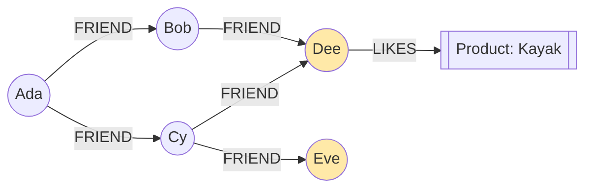
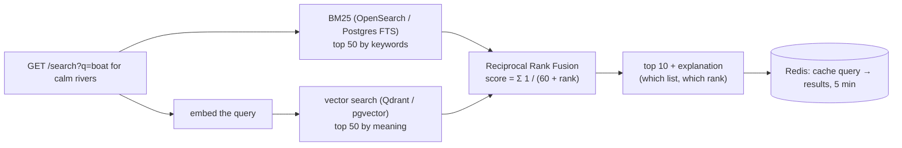

# Chapter 49 — Redis, Elasticsearch, Neo4j & Vector Databases

> **Volume 1 — Computer Science Foundations** · [Contents](index.md) · ← [Chapter 48 — NoSQL: MongoDB, Cassandra & DynamoDB](ch48-nosql-mongodb-cassandra-and-dynamodb.md) · Next → [Chapter 50 — CAP, Consistency & Consensus](ch50-cap-consistency-and-consensus.md)

---

## Concept

Caching (Redis), full-text search (Elasticsearch), graphs (Neo4j), and vector similarity (Qdrant/Milvus).

**In one sentence:** specialized databases each make one kind of question fast — Redis answers "what's the value for this key?" in microseconds from memory, Elasticsearch answers "which documents contain these words, best first?", Neo4j answers "who is connected to whom, through what?", and vector databases answer "what is most *similar in meaning* to this?".

**Mental model.**

* **Redis** — a whiteboard next to your desk: tiny, instant, and wiped if you're careless.
* **Elasticsearch** — the index at the back of a book: word → pages, with the best pages first.
* **Neo4j** — a string-and-pins detective board: follow the strings.
* **Vector DB** — a map where similar ideas sit close together; you ask "what's near this point?".

**Redis data structures**

| Type | Commands | Use |
|------|----------|-----|
| String | `SET k v EX 60`, `GET`, `INCR`, `SET k v NX` | cache, counters, locks |
| Hash | `HSET user:1 name Ada`, `HGETALL` | objects, sessions |
| List | `LPUSH`, `RPOP`, `BLPOP`, `LRANGE` | queues, recent items |
| Set | `SADD`, `SISMEMBER`, `SINTER` | tags, unique visitors, friends in common |
| Sorted set | `ZADD`, `ZRANGE … REV`, `ZINCRBY` | leaderboards, rate-limit windows, priority queues |
| Stream | `XADD`, `XREADGROUP`, `XACK` | event logs with consumer groups |
| HyperLogLog | `PFADD`, `PFCOUNT` | approximate unique counts in 12 KB |
| Bitmap / geo | `SETBIT`, `GEOSEARCH` | flags per user, "stores near me" |

**Redis persistence vs pure cache**

| Mode | Durability | Trade-off |
|------|-----------|-----------|
| none | lost on restart | fastest; pure cache |
| RDB snapshots | lose up to the last snapshot interval | compact, fast restarts |
| AOF (`appendfsync everysec`) | lose ≤ ~1 s | bigger files; rewrites |
| RDB + AOF | best of both | common for Redis as a primary store |
| Replication + Sentinel/Cluster | survives node loss | async replication can still lose recent writes |

**Elasticsearch / OpenSearch — the inverted index**

| Step | Does |
|------|------|
| Analysis | tokenize, lowercase, remove stop words, stem ("running" → "run") |
| Inverted index | term → list of doc IDs (+ positions) |
| Scoring | **BM25**: rare terms and short fields count more |
| Scaling | an index is split into shards (with replicas) across nodes |

**Graph databases (Neo4j)** — nodes and relationships are stored as direct pointers ("index-free adjacency"), so following a hop costs O(1) instead of a join. The query language is Cypher, with ASCII-art patterns: `(a:Person)-[:FRIEND]->(b)`. They win when queries are *many hops deep* or the path itself is the answer (recommendations, fraud rings, access graphs, knowledge graphs).

**Vector databases** — store embeddings (vectors from an ML model, see [Vol 0 Ch 9](../volume-0-math/ch09-linear-algebra-for-ai.md)) and find nearest neighbors by cosine or dot-product similarity. Exact search is O(n·d), so they use **approximate nearest neighbor (ANN)** indexes such as **HNSW**, a layered "small-world" graph searched greedily, in about O(log n). Examples: Qdrant, Milvus, Weaviate, pgvector (Postgres), and Elasticsearch/OpenSearch k-NN. More in [Vol 5 Ch 10](../volume-5-ai-systems/ch10-vector-databases.md).

---

## Prereqs

* [Chapter 45 — SQL & the Relational Model](ch45-sql-and-the-relational-model.md)
* [Chapter 48 — NoSQL: MongoDB, Cassandra & DynamoDB](ch48-nosql-mongodb-cassandra-and-dynamodb.md)

---

## Diagram

**An inverted index**

```
 doc 1: "Red running shoes"          term      → postings (doc: positions)
 doc 2: "Blue trail running shoe"    blue      → 2:[0]
 doc 3: "Red dress"                  dress     → 3:[1]
                                     red       → 1:[0]  3:[0]
 query "red shoe"                    run       → 1:[1]  2:[2]      (stemmed)
   red  → {1, 3}                     shoe      → 1:[2]  2:[3]      (stemmed)
   shoe → {1, 2}                     trail     → 2:[1]
   BM25 ranks doc 1 first (matches both terms), then 2 and 3
```

**A graph of nodes and edges: friends-of-friends**



Ada's friends-of-friends who aren't already friends: Dee (via Bob and Cy) and Eve.

**Vector nearest neighbors and an HNSW graph**

```
 2-D projection of embeddings                    HNSW layers (search from the top down)
        "kayak" ●                                layer 2:  ●───────────●            (few long links)
   "canoe" ●   ● "paddle"                        layer 1:  ●───●───●───●───●
            ✚ query: "boat for rivers"           layer 0:  ●─●─●─●─●─●─●─●─●─●─●    (all points)
                                                 greedy: jump far on top, refine below
        ● "invoice"   ● "tax"
 nearest 3 by cosine: canoe, kayak, paddle
```

---

## Example

```bash
redis-cli SET "product:42" '{"name":"Kayak"}' EX 60      # cache with a 60 s TTL
redis-cli TTL product:42                                 # 60
redis-cli ZINCRBY leaderboard 10 "ada"
redis-cli ZRANGE leaderboard 0 9 REV WITHSCORES          # top 10
redis-cli SET lock:job:7 "worker-3" NX PX 30000          # a simple lease lock
```

```python
import json, redis
r = redis.Redis()

def top_products(category):
    key = f"top:{category}"
    if (hit := r.get(key)) is not None:
        return json.loads(hit)
    rows = db_expensive_query(category)            # ~800 ms
    r.set(key, json.dumps(rows), ex=300)           # cache-aside, 5 min TTL
    return rows
```

```json
POST /products/_search
{
  "query": {
    "bool": {
      "must":   { "match": { "title": "red shoe" } },
      "filter": { "range": { "price_cents": { "lte": 10000 } } }
    }
  },
  "size": 10
}
```

```cypher
// Friends-of-friends Ada doesn't know yet, ranked by mutual friends
MATCH (me:Person {name: "Ada"})-[:FRIEND]->(f)-[:FRIEND]->(fof)
WHERE fof <> me AND NOT (me)-[:FRIEND]->(fof)
RETURN fof.name, count(f) AS mutual
ORDER BY mutual DESC LIMIT 10;
```

```python
from qdrant_client import QdrantClient
from qdrant_client.models import Distance, VectorParams, PointStruct

q = QdrantClient(":memory:")
q.create_collection("docs", vectors_config=VectorParams(size=4, distance=Distance.COSINE))
q.upsert("docs", [PointStruct(id=1, vector=[0.9, 0.1, 0.0, 0.2], payload={"t": "canoe"}),
                  PointStruct(id=2, vector=[0.0, 0.8, 0.6, 0.0], payload={"t": "invoice"})])
hits = q.query_points("docs", query=[0.85, 0.15, 0.05, 0.1], limit=1).points
print(hits[0].payload)                         # {'t': 'canoe'}
```

---

## Exercises

1. Cache an expensive query in Redis with TTL.

   <details><summary>Solution</summary>See <code>top_products</code> (cache-aside). Add TTL jitter (<code>300 + random(0, 60)</code>) to avoid synchronized expiry, invalidate (<code>DEL</code>) when the underlying data changes, and use a lock (<code>SET NX</code>) so only one caller recomputes a hot key. See <a href="../volume-4-high-level-design/ch05-caching-strategies.md">Vol 4 Ch 5</a>.</details>

2. Write a Cypher query for friends-of-friends.

   <details><summary>Solution</summary>See above. For "within 3 hops": <code>MATCH p = shortestPath((me)-[:FRIEND*..3]-(other)) RETURN other, length(p)</code>. In SQL, the same query needs a recursive CTE with a join per hop, which slows down fast as depth grows.</details>

3. Run a vector similarity search.

   <details><summary>Solution</summary>Embed ~100 sentences with a small model (e.g. <code>sentence-transformers/all-MiniLM-L6-v2</code>, 384 dimensions), upsert them into Qdrant or pgvector, and query with an embedded question. Compare the top-5 with exact brute-force cosine search to measure ANN recall.</details>

---

## Mini project

**A hybrid search endpoint combining full-text + vector ranking.**



**Steps**

1. Index ~5k product descriptions in both a keyword engine and a vector store.
2. `/search` runs both in parallel and merges them with Reciprocal Rank Fusion.
3. Return why each hit ranked (its keyword rank, vector rank, fused score).
4. Build 20 test queries with expected results; measure precision@10 for keyword-only, vector-only, and hybrid.
5. Cache results in Redis with a TTL; show the latency with and without the cache.

**Done when:** hybrid beats both single methods on your test set, and cached queries return in under 5 ms.

---

## Open source

* [`redis/redis`](https://github.com/redis/redis) — `src/t_zset.c` (sorted sets are a skip list plus a hash) and `src/server.c`'s single-threaded event loop.
* [`qdrant/qdrant`](https://github.com/qdrant/qdrant) — a vector database in Rust; `lib/segment/src/index/hnsw_index/` is its HNSW implementation with payload filtering.

---

## Interview

1. **"Redis persistence vs pure cache?"**
   <details><summary>Answer</summary>As a pure cache, turn persistence off: data can be rebuilt from the source of truth, so restarts only cost warm-up. As a primary store (sessions, queues, leaderboards), enable AOF (<code>everysec</code>, losing ≤1 s) and/or RDB snapshots, plus replicas with Sentinel or Cluster. Replication is asynchronous, so failover can still lose recent writes. Memory is the size limit either way, so set <code>maxmemory</code> and an eviction policy.</details>

2. **"When graph DB over SQL?"**
   <details><summary>Answer</summary>When queries traverse variable or deep relationship chains (friends-of-friends, fraud rings, dependency or permission graphs, shortest paths) and the relationships themselves matter. In SQL each hop is a join and recursive CTEs get slow as depth and fan-out grow; graph databases follow stored pointers per hop. For simple one- or two-hop relations, SQL is fine and simpler to operate.</details>

---

## Checklist

- [ ] set sensible TTLs
- [ ] know inverted-index basics
- [ ] run a vector search

---

> [Contents](index.md) · ← [Chapter 48 — NoSQL: MongoDB, Cassandra & DynamoDB](ch48-nosql-mongodb-cassandra-and-dynamodb.md) · Next → [Chapter 50 — CAP, Consistency & Consensus](ch50-cap-consistency-and-consensus.md)
