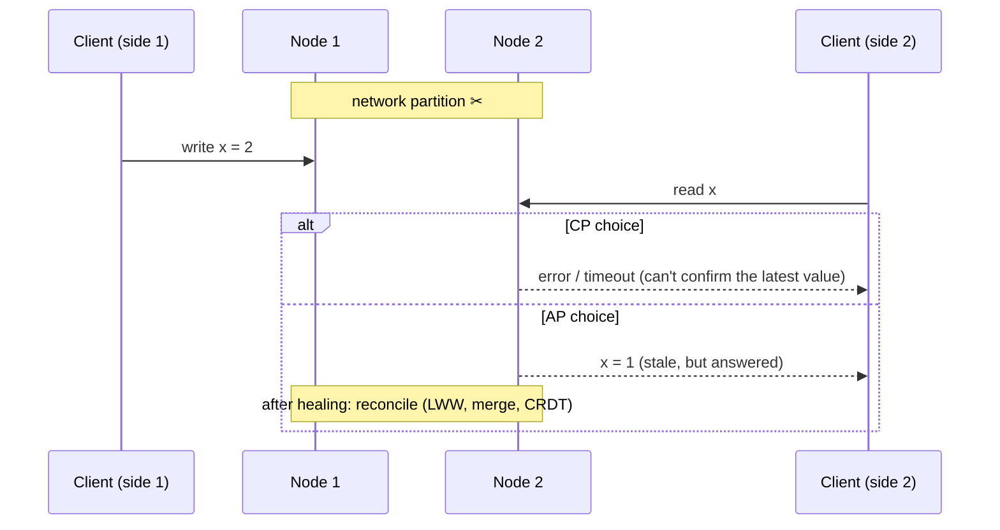
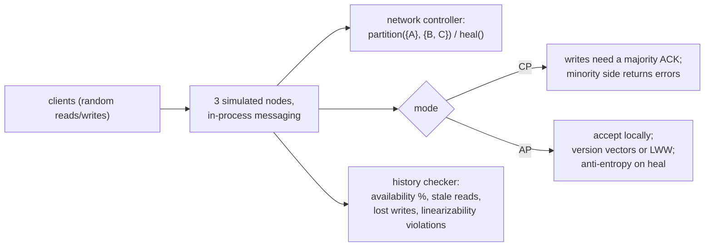

# Chapter 50 — CAP, Consistency & Consensus

> **Volume 1 — Computer Science Foundations** · [Contents](index.md) · ← [Chapter 49 — Redis, Elasticsearch, Neo4j & Vector Databases](ch49-redis-elasticsearch-neo4j-and-vector-databases.md) · Next → [Chapter 51 — Replication, Sharding, Raft & Paxos](ch51-replication-sharding-raft-and-paxos.md)

---

## Concept

CAP theorem, consistency models, the need for consensus, and how systems trade availability vs consistency.

**In one sentence:** when the network splits a replicated system in two, each side must choose between refusing requests (staying consistent) and answering with possibly stale or conflicting data (staying available), and consensus algorithms are how nodes agree on one truth despite failures.

**Mental model — two bank branches with a broken phone line.** A customer withdraws money at branch A. Branch B hasn't heard about it because the line is down. If B lets the customer withdraw again, the bank stays *available* but becomes *inconsistent*. If B refuses until the line is back, the bank stays *consistent* but becomes *unavailable*. There is no third choice while the line is down.

**CAP, stated precisely**

| Letter | Means (in the theorem) |
|--------|------------------------|
| **C** — Consistency | *linearizability*: every read sees the most recent completed write, as if there were one copy |
| **A** — Availability | every request to a non-failed node gets a (non-error) response |
| **P** — Partition tolerance | the system keeps working even if messages between nodes are lost |

Networks *do* partition, so P isn't optional. CAP really says: **during a partition, choose C or A.** When there's no partition, you can have both — but then the trade-off is latency (**PACELC**: if Partition, A or C; Else, Latency or Consistency).

**The consistency spectrum (strongest → weakest)**

| Model | Guarantee | Example systems |
|-------|-----------|-----------------|
| Linearizable (strong) | one global order matching real time; reads see the latest write | etcd, ZooKeeper, Spanner, a single Postgres primary |
| Sequential | one global order all nodes agree on, not tied to real time | |
| Causal | if A caused B, everyone sees A before B; unrelated writes may differ in order | MongoDB causal sessions, COPS |
| Read-your-writes / monotonic reads | per-client guarantees: you see your own writes; you never go back in time | sticky sessions, session tokens |
| Eventual | if writes stop, replicas converge *eventually* | DNS, Cassandra at `ONE`, S3 listings (historically) |

**Why consensus?** Leader election, distributed locks, configuration, and replicated logs all need nodes to agree on *one* value even if some crash. The FLP result says that with fully asynchronous networks, no deterministic algorithm can guarantee agreement if even one node may fail — so real algorithms (Paxos, Raft) are always *safe* and make progress when the network is "stable enough", using timeouts. They need a **majority (quorum)**: 3 nodes tolerate 1 failure; 5 tolerate 2.

**Classifying real systems (roughly)**

| System | Under a partition | Notes |
|--------|------------------|-------|
| etcd / ZooKeeper / Consul | **CP** — the minority side refuses writes (and linearizable reads) | built on Raft / ZAB |
| Postgres primary + async replicas | CP for writes (only the primary accepts); replicas may serve stale reads | failover can lose recent writes |
| Redis (single primary + replicas) | neither, strictly: async replication can lose acknowledged writes on failover | Redis Cluster favors availability within limits |
| Cassandra / DynamoDB (default) | **AP** — both sides accept writes; reconcile later (last-write-wins, read repair) | tunable per query: QUORUM → closer to CP |
| Spanner | CP with very high availability (private network, TrueTime) | |

---

## Prereqs

* [Chapter 47 — ACID, Transactions & Isolation](ch47-acid-transactions-and-isolation.md)
* [Chapter 49 — Redis, Elasticsearch, Neo4j & Vector Databases](ch49-redis-elasticsearch-neo4j-and-vector-databases.md)

---

## Diagram

**The CAP triangle with a partition**

```
                     Consistency (linearizable)
                              ▲
                             ╱ ╲
                   CP       ╱   ╲      CA — only without partitions
             etcd, ZK,     ╱     ╲         (a single-node database)
             Spanner      ╱       ╲
                         ╱         ╲
      Partition ◄───────────────────► Availability
      tolerance          AP: Cassandra, DynamoDB (default), DNS
```

**What happens during a partition**



**Majority quorums always overlap**

```
 5 replicas, write quorum W = 3, read quorum R = 3  (R + W > N)
 write lands on:  [A] [B] [C]  D   E
 read asks:        A   B  [C] [D] [E]
                          ▲ at least one replica saw the latest write
 a partition {A, B} | {C, D, E}: only the 3-node side can form a quorum and accept writes
```

**The consistency spectrum**

```
 strong ◄──────────────────────────────────────────────────────► weak
 linearizable → sequential → causal → read-your-writes → eventual
 slower, less available under partitions        faster, always answers
```

---

## Example

```bash
# etcd (CP): 3-node cluster; kill 2 nodes, then try to write
etcdctl put /config/feature on                 # OK with a quorum (2 of 3 alive)
# … stop two members …
etcdctl put /config/feature off                # Error: context deadline exceeded — no quorum → refuses
etcdctl get /config/feature --consistency=s    # serializable (possibly stale) read from the local member
```

```sql
-- Cassandra (AP, tunable). RF = 3.
CONSISTENCY ONE;       -- fastest, most available; may read stale data
INSERT INTO kv (k, v) VALUES ('x', '2');
CONSISTENCY QUORUM;    -- 2 of 3 replicas; QUORUM reads + QUORUM writes → read-your-latest-write
SELECT v FROM kv WHERE k = 'x';
-- during a partition that leaves only 1 replica reachable, QUORUM fails; ONE still answers
```

```python
# Read-your-writes on top of async replicas: route a user's reads to the
# primary for a short window after they write.
import time
LAST_WRITE = {}
def write(user, sql):
    primary.execute(sql); LAST_WRITE[user] = time.time()
def read(user, sql):
    fresh = time.time() - LAST_WRITE.get(user, 0) < 5      # replica lag budget
    return (primary if fresh else replica).execute(sql)
```

---

## Exercises

1. Classify Postgres, Redis, Cassandra by CAP.

   <details><summary>Solution</summary>Postgres (single primary): CP for writes — a partitioned-away primary can't be written through the other side, and failover risks losing unreplicated writes unless replication is synchronous. Redis with async replication: not strictly C (acknowledged writes can be lost on failover) nor fully A (a minority primary stops accepting writes with <code>min-replicas-to-write</code>). Cassandra: AP by default, tunable toward C with QUORUM. The honest answer is "it depends on configuration" — say which knob.</details>

2. Explain why a network partition forces a CP/AP choice.

   <details><summary>Solution</summary>Suppose replicas A and B can't talk and a client writes x = 2 to A. A client reading from B must get <i>some</i> response to stay available, but B can't know about the write, so it would return the old value (not linearizable). To stay consistent, B must refuse or wait (not available). No algorithm avoids this: the information simply can't cross the partition.</details>

3. Why do consensus clusters use odd sizes (3, 5), not 4?

   <details><summary>Solution</summary>A majority of 4 is 3, so 4 nodes tolerate only 1 failure — the same as 3 nodes, with more cost and more replication traffic. 5 nodes tolerate 2. An even size also allows an even split in which neither side has a majority.</details>

---

## Mini project

**A tiny KV store simulator that flips between CP and AP behavior during a partition.**



**Steps**

1. Three node objects with a dict store; messages go through a controller that can drop messages between groups.
2. CP mode: a write succeeds only if a majority acknowledges; reads go through the majority too.
3. AP mode: always accept; tag values with (timestamp, node) for last-writer-wins; on heal, exchange and merge.
4. Record every operation with start/end times; count failed requests, stale reads, and writes lost after the merge.
5. Run the same workload in both modes with a 10-second partition; show the numbers side by side.

**Done when:** CP shows errors but zero stale reads, AP shows 100% availability but measurable stale reads and lost writes — and you can explain both.

---

## Open source

* [`etcd-io/etcd`](https://github.com/etcd-io/etcd) (Raft/CP) — a strongly consistent key-value store; the `raft/` library is reused by many projects.
* [`apache/cassandra`](https://github.com/apache/cassandra) (AP) — tunable consistency, hinted handoff, read repair, and anti-entropy repair. Also read Kleppmann's essay "Please stop calling databases CP or AP" and the Jepsen analyses.

---

## Interview

1. **"What does CAP actually guarantee?"**
   <details><summary>Answer</summary>It's an impossibility result: a replicated system can't offer both linearizable consistency and availability (every non-failed node answers) while a network partition is happening. Since partitions happen, designers choose per operation what to sacrifice during one. It says nothing about latency or the no-partition case (see PACELC), and it uses very specific definitions of C and A.</details>

2. **"Linearizable vs eventually consistent?"**
   <details><summary>Answer</summary>Linearizable: every operation appears to take effect at one instant between its start and end, and all clients see one order consistent with real time — it behaves like a single copy. It costs coordination (quorums), latency, and availability under partitions. Eventual: replicas may disagree for a while but converge when writes stop — fast and always available, but clients can see stale or out-of-order data, and conflicts need resolution.</details>

---

## Checklist

- [ ] state CAP precisely
- [ ] pick consistency per workload
- [ ] know what a partition does

---

> [Contents](index.md) · ← [Chapter 49 — Redis, Elasticsearch, Neo4j & Vector Databases](ch49-redis-elasticsearch-neo4j-and-vector-databases.md) · Next → [Chapter 51 — Replication, Sharding, Raft & Paxos](ch51-replication-sharding-raft-and-paxos.md)
