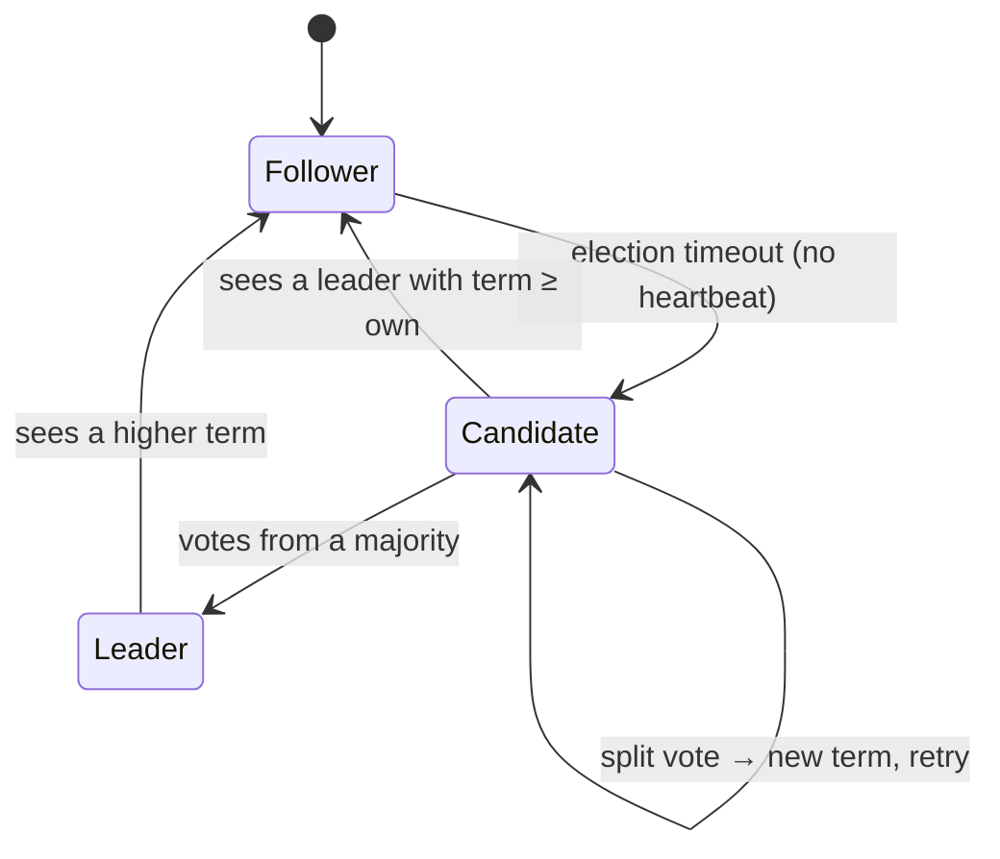
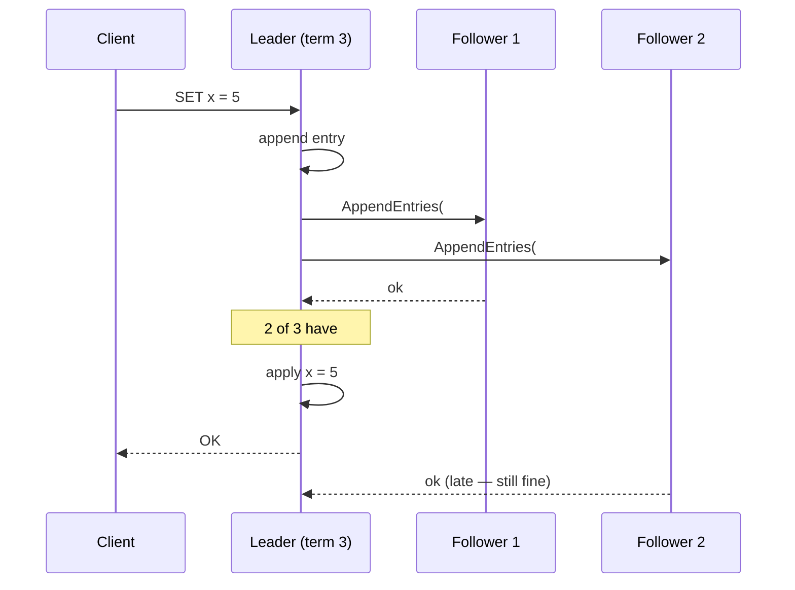
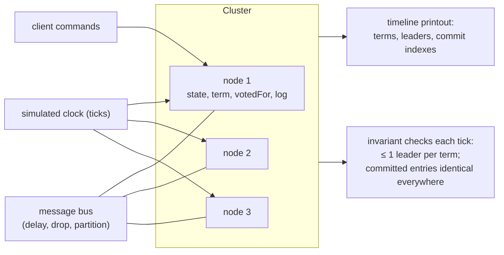

# Chapter 51 — Replication, Sharding, Raft & Paxos

> **Volume 1 — Computer Science Foundations** · [Contents](index.md) · ← [Chapter 50 — CAP, Consistency & Consensus](ch50-cap-consistency-and-consensus.md) · Next → [Chapter 52 — Event Sourcing & CQRS (Distributed View)](ch52-event-sourcing-and-cqrs-distributed-view.md)

---

## Concept

Replication strategies, sharding/partitioning, distributed locks, gossip, leader election, and the Raft/Paxos consensus families.

**In one sentence:** replication keeps copies of the same data on several machines for safety and read scale, sharding splits different data across machines for write scale, and consensus algorithms like Raft make a group of machines agree on one ordered log so that they act like a single, reliable machine.

**Mental model — a class taking notes.** Replication: several students copy the same lecture notes, so losing one notebook is fine. Sharding: each student is responsible for a different chapter, so the work spreads out. Raft: the class elects a note-taker (the leader) who reads each line aloud; a line counts as official once most of the class has written it down; if the note-taker falls asleep, the class elects a new one.

**Replication strategies**

| Strategy | Writes go to | Pros | Cons | Examples |
|----------|-------------|------|------|----------|
| Single leader (primary/replica) | the leader, which streams changes to followers | simple; no write conflicts | the leader is a bottleneck; failover is needed | Postgres, MySQL, MongoDB |
| Multi-leader | any of several leaders (often one per region) | local writes in each region | write conflicts to resolve | multi-region active-active, CouchDB |
| Leaderless | any replica; quorum reads and writes (R + W > N) | highly available | conflicts, read repair, sloppy quorums | Cassandra, DynamoDB, Riak |
| **Sync vs async** | sync: wait for replicas before ACK | sync: no loss on failover / async: fast | sync: slow, blocked by one slow replica / async: data loss on failover | semi-sync: wait for one replica |

**Sharding (partitioning)**

| Scheme | How | Good | Bad |
|--------|-----|------|-----|
| Range | shard by key ranges (A–F, G–M…) | range scans | hot spots (all new timestamps hit one shard) |
| Hash | `hash(key) mod N` | even spread | resharding moves almost everything |
| **Consistent hashing** | keys and nodes on a ring; a key goes to the next node clockwise; virtual nodes | adding a node moves only ~1/N of keys | uneven without virtual nodes |
| Directory / lookup | a service maps key → shard | flexible, supports moves | an extra hop; the directory must be highly available |

**Leader election and distributed locks — use leases, not bare locks.** A process that holds a lock can pause (GC, VM freeze) past its expiry while another process takes the lock → two holders (*split-brain*). Fix: **fencing tokens** — every lock grant carries a monotonically increasing number, and the storage rejects writes with an older token.

**Gossip** — each node periodically tells a few random peers what it knows (membership, heartbeats, versions). Information spreads to all N nodes in O(log N) rounds with no central coordinator. Used for failure detection and membership (Cassandra, Consul/Serf SWIM).

**Raft in five facts**

1. Nodes are **followers**, **candidates**, or the **leader**. Time is divided into numbered **terms**.
2. A follower that hears nothing for a randomized election timeout (150–300 ms) becomes a candidate, increments the term, votes for itself, and asks others for votes.
3. A node grants at most one vote per term, and only to a candidate whose log is at least as up to date as its own. A **majority** of votes makes a leader.
4. The leader appends client commands to its log and replicates them (`AppendEntries`). An entry is **committed** once stored on a majority; then it is applied to the state machine.
5. Safety: at most one leader per term, and a committed entry is never lost — any future leader must have it.

**Paxos vs Raft** — both reach consensus with majorities and survive f failures with 2f + 1 nodes. Paxos (Lamport, 1989) is minimal and general, but famously hard to understand and to turn into a full system (Multi-Paxos). Raft (2014) was designed for understandability, with a strong leader and a clearly specified log, elections, and membership changes. Most new systems use Raft (etcd, Consul, CockroachDB, TiKV); Google's Chubby and Spanner use Paxos.

---

## Prereqs

* [Chapter 50 — CAP, Consistency & Consensus](ch50-cap-consistency-and-consensus.md)

---

## Diagram

**Raft leader election**



**Raft log replication**



```
 logs (index: term command)
 Leader  1:1 x=1  2:1 y=2  3:2 x=3  …  7:3 x=5   commitIndex = 7
 F1      1:1 x=1  2:1 y=2  3:2 x=3  …  7:3 x=5
 F2      1:1 x=1  2:1 y=2  3:2 x=3              (catching up)
```

**A consistent-hash ring with virtual nodes**

```
                 0°
           A1 ●     ● B1          keys hash to a point; walk clockwise to the first node
       C2 ●             ● A2      "user:42" → 47° → B1 (node B)
      B2 ●               ● C1     add node D: it takes over only the arcs just before its
           A3 ●     ● C3          virtual points (~1/4 of keys move, not all of them)
                180°
```

**Gossip spreading a membership change**

```
 round 0:  ● ○ ○ ○ ○ ○ ○ ○        ● = knows "node 9 joined"
 round 1:  ● ● ○ ● ○ ○ ○ ○        each informed node tells 2 random peers
 round 2:  ● ● ● ● ● ○ ● ●
 round 3:  ● ● ● ● ● ● ● ●        ~log₂ N rounds
```

---

## Example

```python
import bisect, hashlib

class HashRing:
    def __init__(self, nodes, vnodes=100):
        self.ring = []                               # sorted list of (hash, node)
        for n in nodes:
            self.add(n, vnodes)

    @staticmethod
    def _h(key: str) -> int:
        return int.from_bytes(hashlib.md5(key.encode()).digest()[:8], "big")

    def add(self, node, vnodes=100):
        for i in range(vnodes):
            bisect.insort(self.ring, (self._h(f"{node}#{i}"), node))

    def get(self, key):
        i = bisect.bisect(self.ring, (self._h(key), "")) % len(self.ring)
        return self.ring[i][1]

ring = HashRing(["A", "B", "C"])
before = {k: ring.get(k) for k in (f"user:{i}" for i in range(10_000))}
ring.add("D")
moved = sum(before[k] != ring.get(k) for k in before)
print(f"{moved / len(before):.0%} of keys moved")      # ≈ 25%, not ≈ 75% as with mod N
```

```python
# Lease + fencing token (sketch). The store refuses stale tokens.
class Store:
    def __init__(self): self.max_token = 0; self.data = {}
    def write(self, key, value, token):
        if token < self.max_token:
            raise PermissionError(f"stale fencing token {token} < {self.max_token}")
        self.max_token = token; self.data[key] = value

# lock service grants: client A → token 33, lease 10 s
# A pauses 15 s (GC); the lease expires; client B → token 34, writes
# A wakes up and writes with token 33 → rejected. No split-brain damage.
```

```go
// etcd election (Go client): campaign for leadership with a lease
session, _ := concurrency.NewSession(cli, concurrency.WithTTL(10))
e := concurrency.NewElection(session, "/service/leader")
e.Campaign(ctx, "node-2")            // blocks until this node is the leader
// the leader key disappears if the session's lease expires → someone else wins
```

---

## Exercises

1. Explain a Raft leader election step by step.

   <details><summary>Solution</summary>(1) Followers receive heartbeats from the term-4 leader, which then crashes. (2) Follower B's randomized timeout fires first; it becomes a candidate for term 5, votes for itself, and sends RequestVote to A and C. (3) A and C haven't voted in term 5, and B's log is at least as up to date, so they grant their votes. (4) B has 3/3 (a majority), becomes leader, and immediately sends heartbeats to stop other elections. If two candidates split the vote, both time out at random and retry in term 6.</details>

2. Design a sharded store with a consistent-hash ring.

   <details><summary>Solution</summary>A ring with ~100–256 virtual nodes per physical node; each key is stored on the next 3 distinct physical nodes clockwise (RF = 3); clients or a routing layer hold the ring map (from a config service like etcd). Adding a node: it takes ranges from its neighbors and streams data before taking traffic. Hot keys: add a random suffix or cache in front. Rebalance with background copy + a switch-over.</details>

3. Why must Raft's election timeouts be randomized?

   <details><summary>Solution</summary>With equal timeouts, all followers would become candidates at the same time, split the vote, and repeat forever. Random timeouts make it likely one node starts first and wins before the others time out.</details>

---

## Mini project

**A Raft leader-election + log-replication simulator (3 nodes).**



**Steps**

1. Implement `RequestVote` and `AppendEntries` (including the log-consistency check on `prevLogIndex/prevLogTerm`) as messages on a bus.
2. Randomized election timeouts in ticks; the leader sends heartbeats every few ticks.
3. Client commands go to the leader; commit on majority; apply to a dict state machine.
4. Fault injection: crash the leader, partition one node, drop 20% of messages, heal.
5. Assert the Raft safety invariants on every tick; print a timeline.

**Done when:** under random crashes and partitions for 10,000 ticks, no invariant ever fails and the cluster keeps committing whenever a majority can talk.

---

## Open source

* [`etcd-io/etcd`](https://github.com/etcd-io/etcd) (Raft) — `etcd-io/raft` is a battle-tested Raft library (`raft.go`: `stepLeader`, `stepCandidate`, `stepFollower`).
* [`hashicorp/raft`](https://github.com/hashicorp/raft) — used by Consul, Nomad, and Vault; readable Go. Read the Raft paper ("In Search of an Understandable Consensus Algorithm") and try the visualization at raft.github.io.

---

## Interview

1. **"Raft vs Paxos?"**
   <details><summary>Answer</summary>Both solve consensus with majority quorums and the same fault tolerance (2f + 1 nodes for f failures). Classic Paxos agrees on single values; practical systems need Multi-Paxos plus many unspecified details. Raft specifies the whole replicated-log system — a strong leader, elections, log matching, membership changes — with understandability as a goal, so it is easier to implement correctly. Performance is similar.</details>

2. **"How do distributed locks avoid split-brain?"**
   <details><summary>Answer</summary>Use a consensus-backed lock service (etcd, ZooKeeper) with <i>leases</i> that expire, so a crashed holder doesn't block forever. Because a paused holder may still believe it holds the lock, also use <i>fencing tokens</i>: each grant gets a strictly increasing number, and every protected resource rejects writes carrying a lower token than it has seen. Redis-based locks without fencing are not safe for correctness.</details>

---

## Checklist

- [ ] trace Raft election
- [ ] choose a shard key
- [ ] use leases, not bare locks

---

> [Contents](index.md) · ← [Chapter 50 — CAP, Consistency & Consensus](ch50-cap-consistency-and-consensus.md) · Next → [Chapter 52 — Event Sourcing & CQRS (Distributed View)](ch52-event-sourcing-and-cqrs-distributed-view.md)
