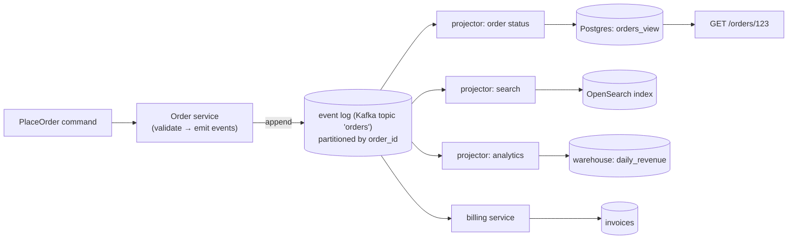
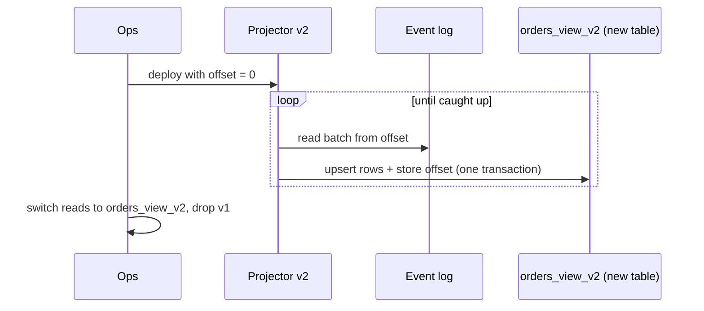
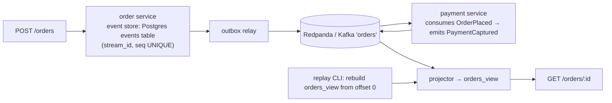

# Chapter 52 — Event Sourcing & CQRS (Distributed View)

> **Volume 1 — Computer Science Foundations** · [Contents](index.md) · ← [Chapter 51 — Replication, Sharding, Raft & Paxos](ch51-replication-sharding-raft-and-paxos.md) · Next → [Chapter 53 — ETL/ELT, Batch & Stream Processing](ch53-etl-elt-batch-and-stream-processing.md)

---

## Concept

Event sourcing and CQRS at the system level — event logs, projections, and replay.

**In one sentence:** instead of storing only the current state, you store every change as an immutable event in an ordered log, and many independent "projections" read that log to build whatever query-friendly views each part of the system needs — and can rebuild them at any time by replaying it.

**Mental model — a bank statement.** Your balance isn't the source of truth; the list of transactions is. The balance is just the sum of the list. Anyone can recompute it, and different people can build different summaries from the same list (monthly spending, tax report) without touching the original.

**Terms**

| Term | Meaning |
|------|---------|
| Event | an immutable fact in past tense: `OrderPlaced`, `PaymentCaptured` |
| Event log / store | an append-only, ordered sequence of events (per aggregate, and/or per topic) |
| Aggregate / stream | the entity whose events are ordered together (`order-123`) |
| **Command** | a request to change something (`PlaceOrder`); may be rejected |
| **Projection** (read model) | a view built by folding events: `orders_by_customer`, a search index, a dashboard |
| **CQRS** | Command Query Responsibility Segregation: separate write model (commands → events) from read models (queries) |
| Replay | rebuild a projection from event 0 |
| Snapshot | saved state at event N, so rebuilding starts from N instead of 0 |
| Upcasting | converting old event versions to new ones while reading |

**Why distribute it?** At system scale, the event log (Kafka, Pulsar, EventStoreDB) becomes the integration backbone: the order service writes events, and billing, shipping, search, analytics, and notifications each maintain their own projections — decoupled, independently scalable, each able to replay.

**Keeping projections consistent**

| Problem | Solution |
|---------|----------|
| At-least-once delivery → duplicates | **idempotent** handlers: track `last_processed_offset` per partition, or dedup by event ID, *in the same transaction* as the projection update |
| Ordering | order per aggregate by using the aggregate ID as the partition key; don't assume a global order |
| Read-after-write lag | return the new version/offset to the client; the UI polls until the projection catches up, or reads from the write model |
| Schema changes | version events (`OrderPlaced.v2`); only add optional fields; upcasters for old versions |
| Bugs in a projection | fix the code, reset the offset, **replay** into a fresh table, swap |
| Writing state + publishing events atomically | the **transactional outbox** pattern (see [Vol 4 Ch 10](../volume-4-high-level-design/ch10-event-driven-systems.md)), or make the event store the only write |

**Costs** — more moving parts; eventual consistency everywhere; event schemas become a long-lived public contract; GDPR deletion needs crypto-shredding or tombstones; "current state" queries need projections. Use it where the history *is* the product: finance, orders, audits, workflows, collaboration.

---

## Prereqs

* [Chapter 51 — Replication, Sharding, Raft & Paxos](ch51-replication-sharding-raft-and-paxos.md)

---

## Diagram

**A distributed event log → multiple projections → read models**



**Folding events into state**

```
 order-123 stream
 #1 OrderPlaced      {items: 2, total: 5000}   → status=placed   total=5000
 #2 ItemRemoved      {sku: X, price: 1500}     → status=placed   total=3500
 #3 PaymentCaptured  {amount: 3500}            → status=paid
 #4 OrderShipped     {carrier: DHL}            → status=shipped
 state = fold(apply, events, initial={})
```

**Rebuilding a projection by replay**



---

## Example

```python
from dataclasses import dataclass, field

# Events: immutable, past tense, versioned
@dataclass(frozen=True)
class Event:
    stream: str
    seq: int
    type: str
    data: dict
    version: int = 1

def apply(state: dict, e: Event) -> dict:
    match e.type:
        case "OrderPlaced":
            return {"status": "placed", "total": e.data["total"], "customer": e.data["customer"]}
        case "ItemRemoved":
            return {**state, "total": state["total"] - e.data["price"]}
        case "PaymentCaptured":
            return {**state, "status": "paid"}
        case "OrderShipped":
            return {**state, "status": "shipped"}
    return state                                       # ignore unknown events (forward compatible)

events = [
    Event("order-123", 1, "OrderPlaced", {"total": 5000, "customer": "c7"}),
    Event("order-123", 2, "ItemRemoved", {"price": 1500}),
    Event("order-123", 3, "PaymentCaptured", {"amount": 3500}),
]
state = {}
for e in events:
    state = apply(state, e)
print(state)       # {'status': 'paid', 'total': 3500, 'customer': 'c7'}
```

```python
# An idempotent projector: offset and view updated in ONE transaction
def project(conn, batch, partition):
    with conn.transaction():
        last = conn.execute("SELECT last_offset FROM projector_offsets WHERE p = %s FOR UPDATE",
                            (partition,)).fetchone()[0]
        for offset, e in batch:
            if offset <= last:
                continue                                  # already applied (redelivery)
            if e.type == "OrderPlaced":
                conn.execute("INSERT INTO orders_by_customer (customer, order_id, total) "
                             "VALUES (%s, %s, %s) ON CONFLICT DO NOTHING",
                             (e.data["customer"], e.stream, e.data["total"]))
            last = offset
        conn.execute("UPDATE projector_offsets SET last_offset = %s WHERE p = %s", (last, partition))
```

---

## Exercises

1. Design an event schema for a distributed order flow.

   <details><summary>Solution</summary>Envelope: <code>{event_id (UUID), type, version, stream_id, seq, occurred_at, causation_id, correlation_id, producer, data}</code>. Types: <code>OrderPlaced</code>, <code>OrderLineAdded</code>, <code>PaymentAuthorized</code>, <code>PaymentCaptured</code>, <code>PaymentFailed</code>, <code>OrderShipped</code>, <code>OrderCancelled</code>. Rules: past tense; include what consumers need (avoid "go call the API"); money in minor units with currency; only add optional fields; register schemas (Avro/Protobuf) with compatibility checks.</details>

2. Rebuild a projection by replaying an event log.

   <details><summary>Solution</summary>Create a new table, start a projector with offset 0 for all partitions, apply events idempotently with offsets stored in the same transaction, wait until lag reaches ~0, then switch reads with a view rename or feature flag and delete the old table. For long histories, start from a snapshot or use a compacted topic.</details>

3. A consumer crashes after updating its projection but before committing its Kafka offset. What happens, and how do you make it safe?

   <details><summary>Solution</summary>On restart it re-reads and re-applies the same events (at-least-once). Make it safe by storing the offset (or processed event IDs) in the projection database in the same transaction as the update, and skip anything already applied. Upserts and <code>ON CONFLICT DO NOTHING</code> help too.</details>

---

## Mini project

**A two-service event-sourced flow with a shared log and projections.**



**Steps**

1. The order service stores events in a Postgres `events` table with a unique `(stream_id, seq)` constraint (optimistic concurrency).
2. An outbox relay publishes new events to Kafka/Redpanda, keyed by `order_id`.
3. The payment service reacts to `OrderPlaced` and emits `PaymentCaptured` or `PaymentFailed` (idempotently, by event ID).
4. A projector builds `orders_view`; the query API reads it and returns the projection's version.
5. A replay tool rebuilds the view from zero into a new table; compare row-by-row with the old one.
6. Chaos: kill the projector mid-batch and redeliver duplicates; the view must stay correct.

**Done when:** replaying from zero produces an identical view, and duplicates or crashes never double-count.

---

## Open source

* [`apache/kafka`](https://github.com/apache/kafka) — partitioned, replicated logs with consumer groups and compaction; the backbone for event-driven projections.
* [`EventStore/EventStore`](https://github.com/EventStore/EventStore) — a database built for event sourcing: streams per aggregate, optimistic concurrency, subscriptions, and projections.

---

## Interview

1. **"Event sourcing vs state persistence?"**
   <details><summary>Answer</summary>State persistence stores the current row and overwrites it, so history is lost unless you add audit tables. Event sourcing stores every change as an immutable event and derives state by folding them, which gives a full audit trail, time travel, replays, and many independent read models. The cost: eventual consistency for reads, event versioning forever, more infrastructure, and harder ad-hoc queries on current state.</details>

2. **"How do projections stay consistent?"**
   <details><summary>Answer</summary>They're eventually consistent by design. For correctness: order events per aggregate (partition by aggregate ID), make handlers idempotent by storing the processed offset or event ID atomically with the update, handle unknown or old versions, and monitor lag. For users: return the write's version and let reads wait for the projection to reach it, or read critical data from the write side. Recover from bugs by replaying into a fresh projection.</details>

---

## Checklist

- [ ] design versioned events
- [ ] rebuild state by replay
- [ ] keep projections idempotent

---

> [Contents](index.md) · ← [Chapter 51 — Replication, Sharding, Raft & Paxos](ch51-replication-sharding-raft-and-paxos.md) · Next → [Chapter 53 — ETL/ELT, Batch & Stream Processing](ch53-etl-elt-batch-and-stream-processing.md)
