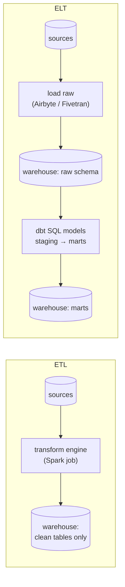
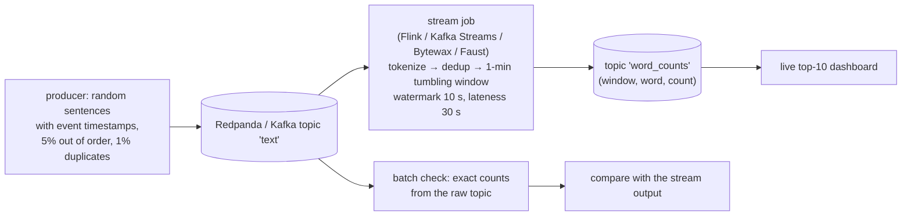

# Chapter 53 — ETL/ELT, Batch & Stream Processing

> **Volume 1 — Computer Science Foundations** · [Contents](index.md) · ← [Chapter 52 — Event Sourcing & CQRS (Distributed View)](ch52-event-sourcing-and-cqrs-distributed-view.md) · Next → [Chapter 54 — Data Lakes, Warehouses & Orchestration](ch54-data-lakes-warehouses-and-orchestration.md)

---

## Concept

Extract/Transform/Load vs ELT, batch vs stream processing, and when to use each.

**In one sentence:** data pipelines move data from where it's produced to where it's analyzed; ETL cleans it on the way, ELT loads it raw and transforms it inside the warehouse; batch processes big chunks on a schedule, and streaming processes each event as it arrives.

**Mental model — laundry.** *Batch* is doing a full load every Sunday: efficient, but your shirt from Monday waits all week. *Streaming* is washing each item the moment it's dirty: always fresh, but more effort per item. *ETL* is sorting and pre-treating stains before the machine; *ELT* is throwing everything into a giant machine (the warehouse) that is powerful enough to sort it inside.

**ETL vs ELT**

| | ETL | ELT |
|-|-----|-----|
| Transform happens | in a separate engine *before* loading | *inside* the warehouse, after loading raw data |
| Raw data kept? | often not | yes: re-transform any time |
| Tools | Spark, custom jobs, Informatica | Fivetran/Airbyte (load) + **dbt** (SQL transforms) on Snowflake / BigQuery / Databricks |
| Good when | strict privacy (strip PII before it lands), limited warehouse compute | cheap, elastic warehouse compute; analysts own SQL; "warehouse-first" |

**Batch vs stream**

| | Batch | Stream |
|-|-------|--------|
| Input | bounded (yesterday's files) | unbounded (events forever) |
| Latency | minutes to hours | milliseconds to seconds |
| Complexity | lower; easy to rerun | higher: state, windows, late data, exactly-once |
| Correctness | easy: all data present | needs event time, watermarks, dedup |
| Cost | efficient bulk compute | always-on resources |
| Examples | daily revenue, ML training sets, monthly billing | fraud detection, live dashboards, alerting, recommendations |
| Engines | Spark, dbt, SQL, Hadoop (legacy) | Flink, Kafka Streams, Spark Structured Streaming, Beam |

**Decision factors:** how fresh must the answer be? What does an hour of delay cost? How complex is the logic? Does the team know stream processing? Many teams use both: streaming for fresh approximate numbers, batch for exact, reconciled ones (the "lambda" pattern), or one streaming engine for both ("kappa").

**Streaming concepts**

| Concept | Meaning |
|---------|---------|
| Event time vs processing time | when it *happened* vs when the system *saw* it |
| Window | group events by time: **tumbling** (fixed, no overlap), **sliding/hopping** (overlapping), **session** (gaps of inactivity) |
| **Watermark** | "I believe all events up to time T have arrived"; triggers closing windows |
| Late data | events arriving after the watermark: drop, side-output, or update the result (allowed lateness) |
| Duplicates | at-least-once delivery → dedup by event ID; or exactly-once via transactional sinks + checkpoints |
| State + checkpoints | windows and counts live in state stores, snapshotted for recovery (Flink) |

---

## Prereqs

* [Chapter 52 — Event Sourcing & CQRS (Distributed View)](ch52-event-sourcing-and-cqrs-distributed-view.md)

---

## Diagram

**ETL vs ELT flow**



**A batch window vs a continuous stream**

```
 BATCH (nightly at 02:00)
 events: ─●──●─●────●──●●──●───●─●──── … ──●──►  (all of yesterday)
                                              │
                                     02:00 ███ job: aggregate everything → result at 02:40

 STREAM (1-minute tumbling windows on event time)
 events: ─●──●─●─┆──●──●●─┆─●───●─┆─●──►
 windows: [ 10:00 ]  [ 10:01 ]  [ 10:02 ]    each emits a count when its watermark passes
```

**Late data and watermarks**

```
 event time  →   10:00        10:01        10:02
 window         [──── A ────][──── B ────][──── C
 watermark                    ▲ at 10:01:05 → window A closes and emits count = 42
 an event with time 10:00:50 arrives at 10:01:20 → LATE for A:
   drop it, send it to a side output, or re-emit A with count = 43 (allowed lateness)
```

**Window types**

```
 tumbling  |■■■■|■■■■|■■■■|             fixed, back to back
 hopping   |■■■■|                        size 4, step 2 → overlapping
             |■■■■|
               |■■■■|
 session   |■■ ■■■|      |■ ■■|          closed by 5 min of inactivity per key
```

---

## Example

```sql
-- ELT: a dbt model (models/marts/daily_revenue.sql) over raw loaded data
{{ config(materialized='incremental', unique_key='day') }}
SELECT
  date_trunc('day', paid_at) AS day,
  SUM(amount_cents) / 100.0  AS revenue,
  COUNT(DISTINCT order_id)   AS orders
FROM {{ ref('stg_payments') }}          -- a staging model: cleaned raw.payments
WHERE status = 'captured'

  AND paid_at >= (SELECT max(day) FROM {{ this }})   -- only reprocess the latest day

GROUP BY 1
```

```python
# Batch: a nightly aggregate with pandas (rerunnable for any date)
import pandas as pd, sys
day = sys.argv[1]                                  # "2024-05-01"
df = pd.read_parquet(f"lake/payments/date={day}/")
out = df[df.status == "captured"].groupby("country").amount_cents.sum().reset_index()
out.to_parquet(f"lake/marts/revenue_by_country/date={day}/part.parquet")   # overwrite = idempotent
```

```python
# Stream: a windowed count with event time + dedup (framework-agnostic sketch)
from collections import defaultdict
WINDOW, LATENESS = 60, 30
counts, seen, watermark = defaultdict(int), set(), 0

def on_event(e):                     # e = {"id", "ts", "word"}
    global watermark
    if e["id"] in seen:
        return                       # duplicate from at-least-once delivery
    seen.add(e["id"])
    start = e["ts"] - e["ts"] % WINDOW
    if start + WINDOW + LATENESS < watermark:
        return print("too late, dropped", e)
    counts[(start, e["word"])] += 1
    watermark = max(watermark, e["ts"] - 5)  # heuristic: events are at most 5 s out of order
    for (s, w), c in list(counts.items()):
        if s + WINDOW <= watermark:
            print(f"window {s} {w} = {c}")   # emit (downstream must handle updates from late data)
            del counts[(s, w)]
```

---

## Exercises

1. Design an ELT pipeline into a warehouse.

   <details><summary>Solution</summary>Extract/Load: Airbyte or Fivetran (or CDC via Debezium) copies source tables into a <code>raw</code> schema every 15 min, append-only with load timestamps. Transform with dbt: <code>staging</code> models (rename, cast, dedup), <code>intermediate</code> (joins), <code>marts</code> (facts and dimensions), incremental where large. dbt tests (<code>unique</code>, <code>not_null</code>, relationships) and source-freshness checks; orchestrate with Airflow or Dagster; document lineage.</details>

2. Choose batch vs stream for a metric and justify it.

   <details><summary>Solution</summary>"Daily active users for the exec dashboard": batch — a day's delay is fine, it must be exact and deduplicated, and it's cheaper. "Card-fraud score per transaction": stream — the decision is needed in under 100 ms, before the payment completes. "Live orders-per-minute during a sale": stream for the live view, plus a batch reconciliation for the official numbers.</details>

3. Why should a batch job *overwrite* its output partition instead of appending?

   <details><summary>Solution</summary>So reruns are idempotent. If a job fails halfway or is rerun for a backfill, appending duplicates rows, while overwriting the <code>date=…</code> partition always gives the same result for the same input.</details>

---

## Mini project

**A streaming word-count pipeline with windowing.**



**Steps**

1. A producer that emits sentences with event-time timestamps, some delayed and some duplicated.
2. A stream job: split into words, dedup by event ID, count per word in 1-minute event-time windows with watermarks.
3. Handle late events inside the allowed lateness by emitting updated counts; count the dropped ones.
4. A batch job computing exact per-window counts from the full topic afterward.
5. Compare stream vs batch results; explain every difference.

**Done when:** the stream results match the batch results except for events deliberately later than the allowed lateness, and those are counted and reported.

---

## Open source

* [`apache/spark`](https://github.com/apache/spark) — batch DataFrames and Structured Streaming with watermarks (`withWatermark`, `window`).
* [`apache/flink`](https://github.com/apache/flink) — true streaming with event time, watermarks, keyed state, and exactly-once checkpoints. The "Streaming 101/102" articles and the book *Streaming Systems* explain the model.

---

## Interview

1. **"ETL vs ELT?"**
   <details><summary>Answer</summary>ETL transforms data in a separate system before loading only the cleaned result. ELT loads raw data into the warehouse first and transforms it there with SQL (dbt). ELT keeps raw history for reprocessing, uses elastic warehouse compute, and lets analysts own transformations. ETL still fits when data must be filtered or anonymized before it lands, or when warehouse compute is expensive.</details>

2. **"Batch vs stream — decision factors?"**
   <details><summary>Answer</summary>Required freshness and the cost of delay; correctness needs (exact, reconciled numbers are easier in batch); complexity (state, windows, late and duplicate data, exactly-once); cost (always-on stream jobs vs scheduled bursts); and team skills. Default to batch, and stream only the paths where low latency creates real value.</details>

---

## Checklist

- [ ] pick ELT for warehouse-first
- [ ] window streams correctly
- [ ] handle late/duplicate data

---

> [Contents](index.md) · ← [Chapter 52 — Event Sourcing & CQRS (Distributed View)](ch52-event-sourcing-and-cqrs-distributed-view.md) · Next → [Chapter 54 — Data Lakes, Warehouses & Orchestration](ch54-data-lakes-warehouses-and-orchestration.md)
