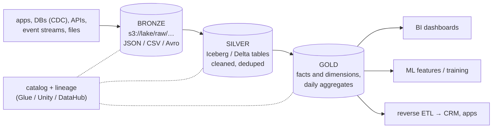
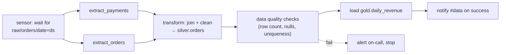
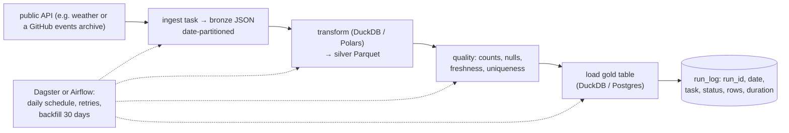

# Chapter 54 — Data Lakes, Warehouses & Orchestration

> **Volume 1 — Computer Science Foundations** · [Contents](index.md) · ← [Chapter 53 — ETL/ELT, Batch & Stream Processing](ch53-etl-elt-batch-and-stream-processing.md) · Next → [Chapter 55 — Containers: Docker, Kubernetes & Helm](ch55-containers-docker-kubernetes-and-helm.md)

---

## Concept

Lakes vs warehouses vs lakehouses, schema evolution, and pipeline orchestration (Airflow-style).

**In one sentence:** a data lake is cheap object storage holding raw files of any shape, a warehouse is a structured, fast SQL database for analysis, a lakehouse adds warehouse features (tables, transactions, schemas) directly on top of lake files, and an orchestrator runs all the pipeline steps in the right order, retrying and alerting when they fail.

**Mental model — groceries.** The lake is the pantry: everything you bought, in its original packaging, cheap to store, messy to cook from. The warehouse is the prepared-meals fridge: portioned, labeled, ready to eat, more expensive per item. A lakehouse is a pantry with a labeling system and a shelf manager. The orchestrator is the kitchen schedule: thaw at 8, cook at 9, serve at 12 — and call the chef if the oven fails.

**Lake vs warehouse vs lakehouse**

| | Data lake | Data warehouse | Lakehouse |
|-|-----------|----------------|-----------|
| Storage | object store (S3, GCS, ADLS) | the warehouse's own managed storage | object store |
| Format | any: JSON, CSV, Parquet, images, logs | proprietary columnar tables | open table formats: **Delta Lake, Apache Iceberg, Apache Hudi** over Parquet |
| Schema | on read ("figure it out later") | on write (enforced) | enforced, with evolution |
| ACID, updates, deletes | no (files) | yes | yes (a transaction log) |
| Cost | lowest | highest per TB, great performance | low storage + your choice of engine |
| Users | data engineers, ML | analysts, BI | both |
| Examples | S3 + Glue catalog | Snowflake, BigQuery, Redshift | Databricks, Iceberg + Trino/Spark/Snowflake |

**Medallion layers (a common layout)**

| Layer | Contents | Rules |
|-------|----------|-------|
| **Bronze / raw** | exactly what arrived, append-only, with load metadata | never edited; the replay source |
| **Silver / staging** | cleaned, typed, deduplicated, conformed | one row per real entity or event |
| **Gold / marts** | business-level aggregates, facts and dimensions | what dashboards and ML features read |

**Parquet** — columnar, compressed, with column statistics. Queries read only the needed columns and skip row groups by min/max. Partition folders (`date=2024-05-01/`) let engines prune whole directories.

**Schema evolution**

| Change | Safe? | How |
|--------|:-:|-----|
| Add a nullable column | ✓ | old files return NULL for it |
| Widen a type (int → bigint) | ✓ usually | table formats support it |
| Rename a column | ⚠ | Iceberg tracks columns by ID (safe); plain Parquet by name (breaks) |
| Drop a column / narrow a type | ✗ | a new version plus a migration and communication |
| Enforce at the boundary | — | schema registry / contracts; reject or quarantine bad records |

**Orchestration (Airflow, Dagster, Prefect)**

| Concept | Meaning |
|---------|---------|
| DAG | tasks plus dependencies; no cycles |
| Schedule | cron or data-driven triggers (run when upstream data lands) |
| Task retries | `retries=3, retry_delay=5 min`, exponential backoff |
| Idempotent tasks | rerunning a date gives the same result (overwrite partitions) |
| Backfill | run the DAG for past dates |
| SLAs + alerts | notify when a task fails or runs late |
| Sensors | wait for a file, table, or upstream DAG |

---

## Prereqs

* [Chapter 53 — ETL/ELT, Batch & Stream Processing](ch53-etl-elt-batch-and-stream-processing.md)

---

## Diagram

**Lake (raw) → warehouse (structured) → serving layer**



**A DAG of tasks**



**Partition pruning**

```
 s3://lake/silver/orders/
   date=2024-04-30/  part-0.parquet  part-1.parquet
   date=2024-05-01/  part-0.parquet                 ← WHERE date = '2024-05-01' reads only this folder
   date=2024-05-02/  part-0.parquet  part-1.parquet
 and inside each file, only the columns in SELECT are read (columnar)
```

---

## Example

```python
# Airflow DAG with retries, alerts, and idempotent daily partitions
from datetime import datetime, timedelta
from airflow import DAG
from airflow.operators.python import PythonOperator
from airflow.sensors.filesystem import FileSensor

def notify_failure(ctx):
    send_slack(f"❌ {ctx['task_instance'].task_id} failed for {ctx['ds']}: {ctx['exception']}")

default_args = {
    "retries": 3,
    "retry_delay": timedelta(minutes=5),
    "retry_exponential_backoff": True,
    "on_failure_callback": notify_failure,
}

with DAG("orders_daily", start_date=datetime(2024, 1, 1), schedule="0 3 * * *",
         catchup=True, default_args=default_args, max_active_runs=1) as dag:

    wait = FileSensor(task_id="wait_raw", filepath="/lake/raw/orders/date={{ ds }}/_SUCCESS",
                      poke_interval=300, timeout=6 * 3600, mode="reschedule")
    transform = PythonOperator(task_id="to_silver", python_callable=to_silver,
                               op_kwargs={"ds": "{{ ds }}"})              # overwrites date={{ ds }}
    check = PythonOperator(task_id="quality", python_callable=check_quality,
                           op_kwargs={"ds": "{{ ds }}"})
    gold = PythonOperator(task_id="to_gold", python_callable=to_gold, op_kwargs={"ds": "{{ ds }}"})

    wait >> transform >> check >> gold
```

```python
# Lakehouse table with schema evolution (Delta Lake via the deltalake package)
import pandas as pd
from deltalake import write_deltalake, DeltaTable

write_deltalake("lake/silver/orders", pd.DataFrame({"id": [1], "total": [500]}))
write_deltalake("lake/silver/orders",
                pd.DataFrame({"id": [2], "total": [700], "currency": ["EUR"]}),
                mode="append", schema_mode="merge")          # adds a nullable 'currency' column
print(DeltaTable("lake/silver/orders").to_pandas())
#    id  total currency
# 0   1    500     None
# 1   2    700      EUR
print(DeltaTable("lake/silver/orders").history()[0]["operation"])   # WRITE — time travel is available
```

---

## Exercises

1. Model a lake → warehouse flow with schema evolution.

   <details><summary>Solution</summary>Bronze: raw JSON events in <code>raw/events/date=…/</code>, never modified. Silver: an Iceberg table with explicit types, deduped by <code>event_id</code>, partitioned by day; new optional producer fields are added as nullable columns (additive evolution), and breaking changes arrive as a new event version handled in the transform. Gold: dbt models on the warehouse or engine. A schema registry in front of producers enforces backward compatibility; bad records go to a quarantine table.</details>

2. Write a DAG that retries and alerts on failure.

   <details><summary>Solution</summary>See the DAG above: <code>retries</code> with exponential backoff in <code>default_args</code>, <code>on_failure_callback</code> posting to chat or paging, a quality-check task that raises to stop downstream tasks, idempotent tasks keyed by <code>{{ ds }}</code>, and <code>max_active_runs=1</code> to avoid overlapping runs.</details>

3. Why is `SELECT *` on a Parquet table often much slower than selecting 3 columns?

   <details><summary>Solution</summary>Parquet is columnar: each column is stored separately. Selecting 3 of 100 columns reads ~3% of the bytes; <code>SELECT *</code> reads and decompresses all of them.</details>

---

## Mini project

**An orchestrated pipeline: ingest → transform → load, with retries and a run log.**



**Steps**

1. Ingest a real API into bronze, partitioned by date; store the raw response unchanged.
2. Transform with DuckDB or Polars into typed silver Parquet, deduplicated.
3. Quality checks that fail the run on bad data (e.g. zero rows, >1% nulls in a key).
4. Load gold aggregates; write every task's outcome to a `run_log` table.
5. Inject failures (API timeouts, a bad record) and show retries, alerts, and a clean backfill of 30 days.

**Done when:** rerunning any date produces identical output, failures page you with a clear message, and a 30-day backfill runs unattended.

---

## Open source

* [`apache/airflow`](https://github.com/apache/airflow) — the most widely used orchestrator; see also Dagster (asset-based) and Prefect.
* [`delta-io/delta`](https://github.com/delta-io/delta) — the Delta Lake transaction log (`_delta_log/*.json`) gives ACID and time travel on Parquet; compare with `apache/iceberg`.

---

## Interview

1. **"Lake vs warehouse?"**
   <details><summary>Answer</summary>A lake stores raw data of any format cheaply in object storage, with schema-on-read — flexible and good for ML and replays, but slow and messy for business analysis without more structure. A warehouse stores modeled, typed tables with schema-on-write and fast SQL for BI — reliable, but costlier and less flexible. Lakehouses (Iceberg, Delta) bring ACID tables and schema enforcement to lake storage, and many teams now use them to get both.</details>

2. **"How do you handle schema evolution?"**
   <details><summary>Answer</summary>Make changes additive by default (new nullable columns); enforce compatibility at the boundary with a schema registry or data contracts; use table formats that track columns by ID (Iceberg) so renames are safe; version breaking changes explicitly and migrate consumers; keep raw data so you can reprocess; and alert when an unexpected schema arrives instead of silently dropping fields.</details>

---

## Checklist

- [ ] separate raw from structured
- [ ] orchestrate with retries
- [ ] version schemas

---

> [Contents](index.md) · ← [Chapter 53 — ETL/ELT, Batch & Stream Processing](ch53-etl-elt-batch-and-stream-processing.md) · Next → [Chapter 55 — Containers: Docker, Kubernetes & Helm](ch55-containers-docker-kubernetes-and-helm.md)
