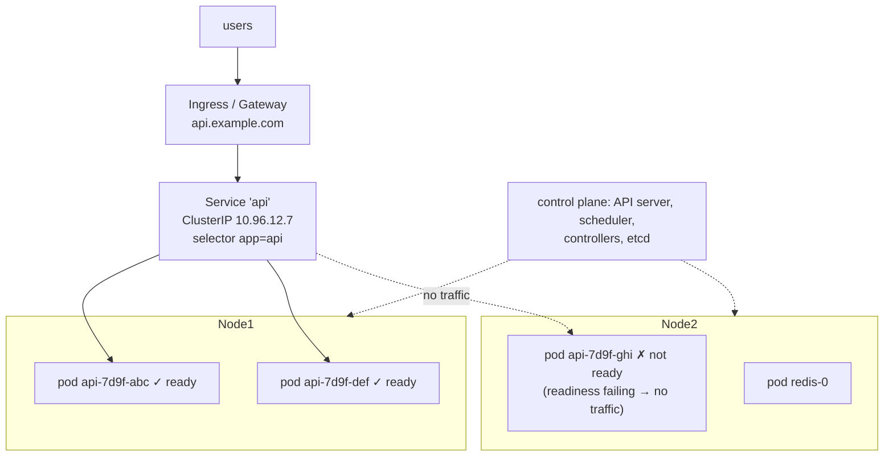
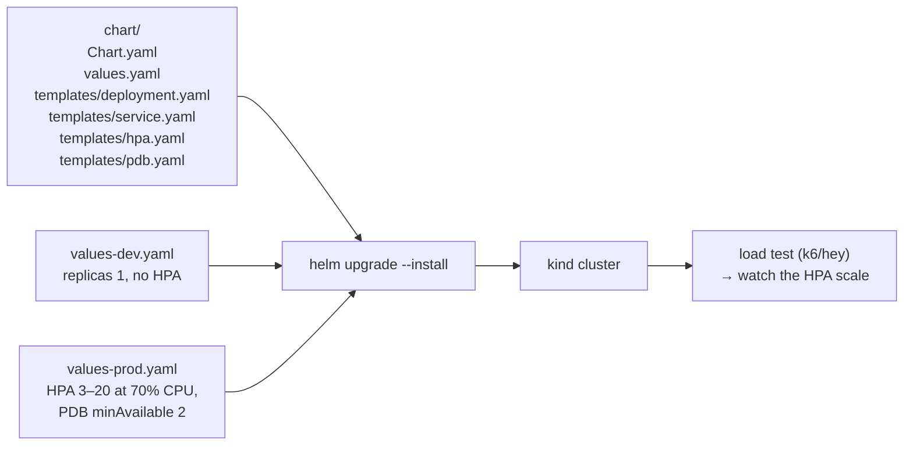

# Chapter 55 — Containers: Docker, Kubernetes & Helm

> **Volume 1 — Computer Science Foundations** · [Contents](index.md) · ← [Chapter 54 — Data Lakes, Warehouses & Orchestration](ch54-data-lakes-warehouses-and-orchestration.md) · Next → [Chapter 56 — IaC: Terraform, State & Config Drift](ch56-iac-terraform-state-and-config-drift.md)

---

## Concept

Images and containers, Kubernetes orchestration (pods, deployments, services), and Helm charts.

**In one sentence:** a container image packages your app with everything it needs so it runs the same everywhere; Kubernetes runs many containers across many machines and keeps them in the state you declared; and Helm packages the Kubernetes files so you can install and configure an app with one command.

**Mental model — shipping containers and a port.** Before standard shipping containers, every cargo was loaded differently. A Docker image is a standard box: the crane doesn't care what's inside. Kubernetes is the port authority: you say "keep 5 boxes of type X running, reachable at this address", and it places them on ships (nodes), replaces broken ones, and redirects traffic. Helm is the shipping manifest template you fill in per customer.

**Container vs VM**

| | Container | Virtual machine |
|-|-----------|-----------------|
| Isolation | process-level: Linux **namespaces** (pid, net, mount, user…) + **cgroups** (CPU/memory limits) | hardware-level: its own kernel on a hypervisor |
| Kernel | shared with the host | its own |
| Start time | milliseconds | seconds to minutes |
| Size | MBs | GBs |
| Security boundary | weaker (kernel shared); harden with seccomp, rootless, gVisor, Kata | stronger |

**Docker vocabulary**

| Term | Meaning |
|------|---------|
| Image | a read-only stack of layers + metadata (entrypoint, env), identified by a digest |
| Layer | the filesystem diff from one Dockerfile instruction; cached and shared |
| Container | a running (or stopped) instance of an image with a thin writable layer |
| Registry | stores images: Docker Hub, GHCR, ECR |
| Tag vs digest | `app:1.4` (movable) vs `app@sha256:…` (immutable) — deploy by digest |

**Kubernetes objects you'll use daily**

| Object | Purpose |
|--------|---------|
| **Pod** | 1+ containers sharing a network namespace and volumes; the unit of scheduling |
| **Deployment** | declares N replicas of a pod template; handles rolling updates and rollbacks |
| ReplicaSet | created by a Deployment; keeps exactly N pods |
| **Service** | a stable virtual IP + DNS name that load-balances to healthy pods selected by labels |
| Ingress / Gateway | HTTP routing from outside into Services |
| ConfigMap / Secret | configuration and secrets as env vars or files |
| **Probes** | `startupProbe` (still booting?), `readinessProbe` (send traffic?), `livenessProbe` (restart?) |
| HPA | HorizontalPodAutoscaler: scale replicas on CPU or custom metrics |
| Requests / limits | the resources the scheduler reserves / the ceiling (exceeding memory → OOMKilled) |
| StatefulSet, DaemonSet, Job, CronJob | stable identity + storage / one pod per node / run to completion / scheduled |

**Rolling updates** — a Deployment creates new pods (`maxSurge`), waits until they are *ready*, then removes old ones (`maxUnavailable`), step by step. Bad readiness → the rollout stalls instead of taking the service down; `kubectl rollout undo` reverts.

**The declarative loop** — you declare *desired state* (YAML); controllers keep comparing it with *actual state* and act to close the gap. You never "start a container on node 7".

---

## Prereqs

* [Chapter 17 — Linux: Processes, Signals, Services, systemd, SSH, Cron & Networking](ch17-linux-processes-signals-services-systemd-ssh-cron.md)

---

## Diagram

**Docker image → container**

```
 Dockerfile                     image layers (cached, shared)          container
 FROM python:3.12-slim   ───►   [ base OS + python      ] 45 MB   ┐
 COPY pyproject.toml, lock ─►   [ dependency manifest   ] 4 KB    │   read-only
 RUN pip install …        ───►  [ installed packages    ] 80 MB   │
 COPY src/ /app           ───►  [ your code             ] 2 MB    ┘
                                [ writable layer        ]  ◄── per container, discarded on removal
 change only src/ → only the last layer rebuilds (seconds, not minutes)
```

**A K8s cluster with pods behind a service**



**A rolling update (replicas 3, maxSurge 1, maxUnavailable 0)**

```
 step 0:  v1 v1 v1
 step 1:  v1 v1 v1 v2(starting)
 step 2:  v1 v1 v2✓            ← one v1 removed only after v2 is ready
 step 3:  v1 v2✓ v2✓
 step 4:  v2✓ v2✓ v2✓          if v2 never becomes ready, the rollout stops at step 1
```

---

## Example

```dockerfile
# Multi-stage build: small, non-root, cache-friendly
FROM python:3.12-slim AS build
WORKDIR /app
RUN pip install --no-cache-dir uv
COPY pyproject.toml uv.lock ./
RUN uv sync --frozen --no-dev --no-install-project
COPY src/ ./src/

FROM python:3.12-slim
RUN useradd --create-home --uid 10001 app
WORKDIR /app
COPY --from=build /app /app
ENV PATH="/app/.venv/bin:$PATH" PYTHONUNBUFFERED=1
USER app
EXPOSE 8080
CMD ["uvicorn", "src.main:app", "--host", "0.0.0.0", "--port", "8080"]
```

```yaml
apiVersion: apps/v1
kind: Deployment
metadata: { name: api }
spec:
  replicas: 3
  selector: { matchLabels: { app: api } }
  strategy: { rollingUpdate: { maxSurge: 1, maxUnavailable: 0 } }
  template:
    metadata: { labels: { app: api } }
    spec:
      containers:
        - name: api
          image: ghcr.io/acme/api@sha256:3f9a…     # pin by digest
          ports: [{ containerPort: 8080 }]
          resources:
            requests: { cpu: 250m, memory: 256Mi }
            limits:   { memory: 512Mi }
          readinessProbe: { httpGet: { path: /readyz, port: 8080 }, periodSeconds: 5 }
          livenessProbe:  { httpGet: { path: /healthz, port: 8080 }, periodSeconds: 10, failureThreshold: 3 }
          envFrom: [{ configMapRef: { name: api-config } }, { secretRef: { name: api-secrets } }]
---
apiVersion: v1
kind: Service
metadata: { name: api }
spec:
  selector: { app: api }
  ports: [{ port: 80, targetPort: 8080 }]
```

```bash
docker build -t api:dev . && docker run --rm -p 8080:8080 api:dev
kubectl apply -f k8s/
kubectl rollout status deploy/api
kubectl get pods -l app=api -o wide
kubectl logs -l app=api -f --max-log-requests 10
kubectl rollout undo deploy/api
helm install api ./chart -f values-prod.yaml --set image.tag=1.4.2
helm upgrade api ./chart -f values-prod.yaml --atomic   # rolls back automatically if it fails
```

---

## Exercises

1. Containerize a service and run it.

   <details><summary>Solution</summary>Use the multi-stage Dockerfile above. Check: the image size (<code>docker images</code>), that it runs as non-root (<code>docker run … id</code>), that editing only source code rebuilds only the last layers, and that it handles SIGTERM (<code>docker stop</code> finishes in under 10 s — use exec-form <code>CMD</code> so your process is PID 1 and receives the signal).</details>

2. Deploy it to K8s with a service + health probes.

   <details><summary>Solution</summary>Apply the Deployment and Service above on kind or minikube. Test readiness: make <code>/readyz</code> return 503 on one pod and watch it leave the Service's endpoints (<code>kubectl get endpointslices</code>). Test liveness: make <code>/healthz</code> hang and watch the restart count rise.</details>

3. A pod is `OOMKilled` every few hours. What do you check?

   <details><summary>Solution</summary>The memory limit vs actual usage (<code>kubectl top pod</code>, metrics over time); a memory leak (a growing heap profile); whether the runtime respects cgroup limits (JVM <code>-XX:MaxRAMPercentage</code>, Node <code>--max-old-space-size</code>); request spikes. Fix the leak, or set requests and limits from observed p99 usage plus headroom.</details>

---

## Mini project

**A Helm chart deploying a stateless service with probes and autoscaling.**



**Steps**

1. `helm create`, then trim: a Deployment, Service, HPA, PodDisruptionBudget, and ConfigMap, driven by `values.yaml`.
2. Templated probes, resources, image digest, and env; `helm lint` and `helm template` in CI.
3. `values-dev.yaml` and `values-prod.yaml` show the same chart with different settings.
4. Install on kind with metrics-server; load test; watch `kubectl get hpa -w` scale up and back down.
5. Roll out a broken image with `--atomic` and show the automatic rollback.

**Done when:** one command installs dev or prod, autoscaling reacts to load, and a bad release rolls itself back.

---

## Open source

* [`kubernetes/kubernetes`](https://github.com/kubernetes/kubernetes) — `pkg/controller/deployment/` holds the rolling-update logic; the "Concepts" docs are the best entry point.
* [`helm/helm`](https://github.com/helm/helm) — the package manager for Kubernetes; Bitnami's charts are good real-world examples to read.

---

## Interview

1. **"Container vs VM?"**
   <details><summary>Answer</summary>A VM virtualizes hardware and runs its own full kernel — strong isolation, heavier, slower to start. A container is an isolated process group on the host kernel using namespaces and cgroups — lightweight, starts in milliseconds, dense packing, identical artifacts from laptop to production, but a weaker security boundary. They are often combined: containers inside VMs.</details>

2. **"How does K8s do rolling updates?"**
   <details><summary>Answer</summary>Changing a Deployment's pod template creates a new ReplicaSet. The controller scales it up and the old one down step by step within <code>maxSurge</code> and <code>maxUnavailable</code>, and only counts new pods once their readiness probes pass. The Service routes only to ready pods, so traffic shifts gradually. If new pods never become ready, the rollout stalls (and <code>progressDeadlineSeconds</code> marks it failed); <code>kubectl rollout undo</code> returns to the previous ReplicaSet.</details>

---

## Checklist

- [ ] write a clean Dockerfile
- [ ] deploy to K8s
- [ ] template with Helm

---

> [Contents](index.md) · ← [Chapter 54 — Data Lakes, Warehouses & Orchestration](ch54-data-lakes-warehouses-and-orchestration.md) · Next → [Chapter 56 — IaC: Terraform, State & Config Drift](ch56-iac-terraform-state-and-config-drift.md)
