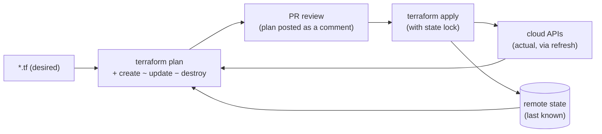
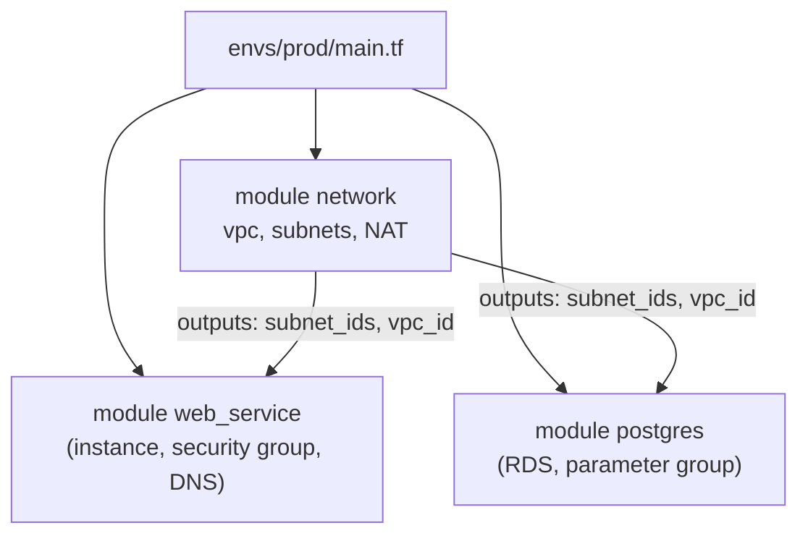
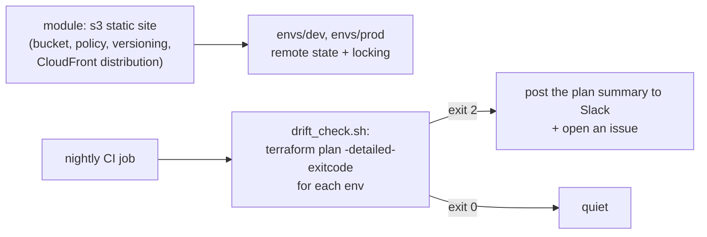

# Chapter 56 — IaC: Terraform, State & Config Drift

> **Volume 1 — Computer Science Foundations** · [Contents](index.md) · ← [Chapter 55 — Containers: Docker, Kubernetes & Helm](ch55-containers-docker-kubernetes-and-helm.md) · Next → [Chapter 57 — CI/CD & GitHub Actions](ch57-ci-cd-and-github-actions.md)

---

## Concept

Infrastructure as code, Terraform state, and detecting/configuring drift.

**In one sentence:** infrastructure as code means your servers, networks, and databases are described in version-controlled files; Terraform compares those files with what actually exists (using a state file as its memory) and shows a plan of changes; and *drift* is when someone changes the real infrastructure by hand so it no longer matches the code.

**Mental model — an architect's blueprint.** The `.tf` files are the blueprint. The state file is the builder's logbook: "wall A is the brick wall with serial #123". `terraform plan` walks the building with the blueprint and the logbook and lists every difference. Drift is someone knocking a hole in a wall without updating the blueprint — next time you build from the blueprint, the hole gets bricked up.

**Why IaC**

| Without IaC ("ClickOps") | With IaC |
|--------------------------|----------|
| changes are invisible and undocumented | every change is a reviewed pull request with history |
| environments slowly diverge | dev/staging/prod come from the same modules |
| disaster recovery = heroics | recreate from code |
| "who opened port 22 to the world?" | `git blame` |

**Terraform core concepts**

| Concept | Meaning |
|---------|---------|
| Provider | a plugin talking to an API (AWS, GCP, Kubernetes, Cloudflare, GitHub) |
| Resource | one managed object: `aws_instance.web` |
| Data source | read-only lookup of something existing: `data.aws_ami.ubuntu` |
| Variable / output / local | inputs, exported values, computed helpers |
| Module | a reusable folder of resources with inputs and outputs |
| **State** | a JSON map from resource addresses → real IDs and attributes |
| Plan / apply | compute the diff (desired vs state vs reality) / execute it |
| Workspace / separate state per env | isolate dev and prod |

**Why state is remote**

| Local `terraform.tfstate` problem | Remote backend fix (S3 + DynamoDB lock, GCS, Terraform Cloud) |
|-----------------------------------|---------------------------------------------------------------|
| lives on one laptop → lost or out of date | one shared source of truth |
| two people apply at once → corruption | **state locking** |
| contains secrets in plain text | encryption at rest + tight access control |
| no history | versioned bucket → recover old state |

**Drift: detect and reconcile**

| Step | How |
|------|-----|
| Detect | scheduled `terraform plan -detailed-exitcode` in CI (exit code 2 = changes), or `terraform plan -refresh-only` |
| Decide | was the manual change *right* (update the code) or *wrong* (re-apply the code)? |
| Reconcile | update `.tf` and apply; or `terraform apply` to revert; `terraform import` / `import` blocks for resources created by hand |
| Prevent | no console write access in prod; changes only via the pipeline; policy as code (OPA/Sentinel/Checkov) |

---

## Prereqs

* [Chapter 55 — Containers: Docker, Kubernetes & Helm](ch55-containers-docker-kubernetes-and-helm.md)

---

## Diagram

**The Terraform plan/apply cycle**



**State file vs live infra diff (drift)**

```
 code (main.tf)             state (last apply)            live AWS (someone used the console)
 ingress 443 from 0.0.0.0   ingress 443 from 0.0.0.0      ingress 443 from 0.0.0.0
                                                          ingress 22  from 0.0.0.0   ← drift!
 instance_type = t3.small   instance_type = t3.small      instance_type = t3.large  ← drift!

 terraform plan:
   ~ aws_security_group.web   − ingress 22 from 0.0.0.0/0      (would remove the manual rule)
   ~ aws_instance.web         instance_type: t3.large → t3.small
```

**Module composition**



---

## Example

```hcl
# modules/web_service/main.tf
variable "name"          { type = string }
variable "subnet_id"     { type = string }
variable "vpc_id"        { type = string }
variable "instance_type" {
  type    = string
  default = "t3.small"
}

data "aws_ami" "ubuntu" {
  most_recent = true
  owners      = ["099720109477"]                       # Canonical
  filter {
    name   = "name"
    values = ["ubuntu/images/hvm-ssd-gp3/ubuntu-noble-24.04-amd64-server-*"]
  }
}

resource "aws_security_group" "web" {
  name   = "${var.name}-web"
  vpc_id = var.vpc_id
  ingress {
    from_port   = 443
    to_port     = 443
    protocol    = "tcp"
    cidr_blocks = ["0.0.0.0/0"]
  }
  egress {
    from_port   = 0
    to_port     = 0
    protocol    = "-1"
    cidr_blocks = ["0.0.0.0/0"]
  }
}

resource "aws_instance" "web" {
  ami                    = data.aws_ami.ubuntu.id
  instance_type          = var.instance_type
  subnet_id              = var.subnet_id
  vpc_security_group_ids = [aws_security_group.web.id]
  tags                   = { Name = var.name, ManagedBy = "terraform" }
}

output "public_ip" { value = aws_instance.web.public_ip }
```

```hcl
# envs/prod/backend.tf — remote, locked, encrypted state
terraform {
  required_version = ">= 1.6"
  backend "s3" {
    bucket         = "acme-tfstate"
    key            = "prod/web.tfstate"
    region         = "eu-west-1"
    dynamodb_table = "tf-locks"      # newer versions can use use_lockfile = true instead
    encrypt        = true
  }
  required_providers {
    aws = { source = "hashicorp/aws", version = "~> 5.0" }
  }
}
```

```bash
terraform init
terraform fmt -check && terraform validate
terraform plan -out=tfplan
terraform apply tfplan
terraform plan -detailed-exitcode        # 0 = no changes, 1 = error, 2 = drift / changes
terraform state list
```

---

## Exercises

1. Write Terraform for a small stack.

   <details><summary>Solution</summary>A VPC with public and private subnets, the <code>web_service</code> module above in the public subnet, and a managed Postgres in the private one, with a security group that allows 5432 only from the web security group. Variables per environment in <code>envs/dev</code> and <code>envs/prod</code>; outputs for the IP and DB endpoint; remote state; <code>terraform plan</code> reviewed in a PR.</details>

2. Detect and reconcile drift.

   <details><summary>Solution</summary>Change the instance type in the console. Run <code>terraform plan -detailed-exitcode</code>: exit 2, with the diff shown. Decide: if the bigger size is needed, change <code>instance_type</code> in code and apply (now code and reality agree); if not, apply to revert. Put the plan in a nightly CI job that alerts on exit code 2.</details>

3. You rename a resource block from `aws_instance.web` to `aws_instance.app`. Why does the plan want to destroy and recreate the server, and how do you avoid it?

   <details><summary>Solution</summary>State is keyed by resource address; the old address disappeared and a new one appeared. Add a <code>moved { from = aws_instance.web  to = aws_instance.app }</code> block (or run <code>terraform state mv</code>) so Terraform knows it's the same object.</details>

---

## Mini project

**A Terraform module + a drift-check script that alerts on differences.**



**Steps**

1. Write a reusable module (a static site on S3 + CloudFront, or the equivalent on LocalStack or GCP) with variables, outputs, and validations.
2. Two environments using the module with separate remote states.
3. `drift_check.sh`: loop over envs, `init`, `plan -detailed-exitcode -no-color`, and capture changed resource addresses.
4. On drift, post a summary (resource, attribute, before → after) to a webhook.
5. Test by changing a bucket tag by hand; confirm the alert, then reconcile.
6. Add `checkov` or `tflint` to the PR pipeline.

**Done when:** a manual console change is reported within one run, with the exact attribute that drifted.

---

## Open source

* [`hashicorp/terraform`](https://github.com/hashicorp/terraform) — `internal/terraform/` holds the graph builder and plan/apply walk.
* [`opentofu/opentofu`](https://github.com/opentofu/opentofu) — the open-source fork (MPL-licensed) with the same workflow, plus state encryption.

---

## Interview

1. **"Why is state remote?"**
   <details><summary>Answer</summary>State is Terraform's memory of which real resource each block manages. It must be shared (so everyone plans against the same truth), locked (so two applies can't corrupt it), durable and versioned (a lost state means orphaned infrastructure), and protected (it contains secrets). A local file on a laptop has none of those properties.</details>

2. **"How do you handle config drift?"**
   <details><summary>Answer</summary>Prevent it: no manual write access in prod; all changes through PRs and a pipeline; policy checks. Detect it: scheduled <code>terraform plan -detailed-exitcode</code> (or a drift feature in Terraform Cloud or Spacelift) with alerts. Reconcile it deliberately: fold intentional changes into the code, and revert unintended ones by applying. Import resources created by hand.</details>

---

## Checklist

- [ ] version infra as code
- [ ] store state remotely
- [ ] detect drift automatically

---

> [Contents](index.md) · ← [Chapter 55 — Containers: Docker, Kubernetes & Helm](ch55-containers-docker-kubernetes-and-helm.md) · Next → [Chapter 57 — CI/CD & GitHub Actions](ch57-ci-cd-and-github-actions.md)
