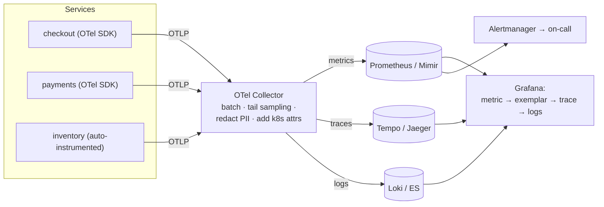
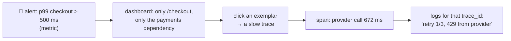
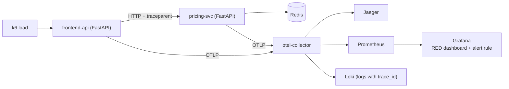

# Chapter 58 — Observability: Logs, Metrics, Traces & OpenTelemetry

> **Volume 1 — Computer Science Foundations** · [Contents](index.md) · ← [Chapter 57 — CI/CD & GitHub Actions](ch57-ci-cd-and-github-actions.md) · Next → [Chapter 59 — Cost Awareness in the Cloud](ch59-cost-awareness-in-the-cloud.md)

---

## Concept

The three pillars, instrumentation, and OpenTelemetry as the standard for collecting them.

**In one sentence:** metrics tell you *that* something is wrong, traces tell you *where* in a chain of services it's wrong, logs tell you *why* — and OpenTelemetry is the vendor-neutral standard for producing all three with shared IDs so you can jump between them.

**Mental model — a hospital patient.** Metrics are the vital-signs monitor: heart rate and temperature over time, cheap to record, great for alarms. A trace is the patient's journey through the hospital: reception → triage → X-ray → surgery, with the time spent at each step. Logs are the doctors' detailed notes at each step. The patient ID wristband (trace ID) links all three.

**The three signals**

| | Metrics | Traces | Logs |
|-|---------|--------|------|
| Is | numbers aggregated over time | a tree of timed *spans* for one request across services | timestamped events with fields |
| Answers | "is it broken? how much? trending?" | "where did this request spend its time? which service failed?" | "what exactly happened here?" |
| Cost | cheap (fixed size per series) | medium (usually sampled) | expensive at volume |
| Cardinality | must be **low** (no user IDs as labels!) | high is fine (attributes per span) | high is fine |
| Tools | Prometheus, Grafana Mimir, Datadog | Jaeger, Tempo, Zipkin, Honeycomb | Loki, Elasticsearch, CloudWatch |

**Metric types**

| Type | Example | Query |
|------|---------|-------|
| Counter (only goes up) | `http_requests_total{route,status}` | `rate(http_requests_total[5m])` |
| Gauge (up and down) | `queue_depth`, `memory_bytes` | the current value |
| Histogram (bucketed distribution) | `http_request_duration_seconds` | `histogram_quantile(0.99, …)` → p99 |

**Golden signals / RED / USE**

| Method | For | Measure |
|--------|-----|---------|
| **RED** | request-driven services | **R**ate, **E**rrors, **D**uration |
| **USE** | resources (CPU, disk, pools) | **U**tilization, **S**aturation, **E**rrors |
| Four golden signals (Google SRE) | any user-facing service | latency, traffic, errors, saturation |

**Traces** — a *trace* is one request; a *span* is one operation within it (an HTTP call, a DB query) with a start, a duration, attributes, and a parent. Context is propagated between services in the W3C `traceparent` header: `00-<trace_id>-<span_id>-01`.

**What OpenTelemetry standardizes**

| Piece | Role |
|-------|------|
| API + SDKs (every major language) | create spans, metrics, and logs in code |
| Semantic conventions | standard attribute names: `http.request.method`, `db.system`, `service.name` |
| Context propagation | `traceparent` / baggage across HTTP, gRPC, and queues |
| Auto-instrumentation | patch popular libraries (FastAPI, requests, psycopg, Django) with no code changes |
| **OTLP** | one wire protocol for all signals |
| **Collector** | receive → process (batch, sample, redact, enrich) → export to any backend |

OTel standardizes *collection*, not storage or UI — you can switch vendors without re-instrumenting.

**Alert on symptoms, not causes** — page on what users feel (error rate, latency SLO burn), not on "CPU at 80%". Use causes (CPU, GC, queue depth) on dashboards for diagnosis.

---

## Prereqs

* [Chapter 24 — Logging](ch24-logging.md)

---

## Diagram

**App emitting logs/metrics/traces → collector → backends**



**One trace across services**

```
 trace 4bf92f3577b34da6a3ce929d0e0e4736                             total 812 ms
 ├─ checkout  POST /checkout                  ████████████████████████████████  812 ms
 │  ├─ inventory  GET /reserve                ███                               64 ms
 │  ├─ payments   POST /charge                   ███████████████████████████   701 ms  ← slow
 │  │  ├─ db  SELECT … FROM cards               █                                9 ms
 │  │  └─ http  POST provider.com/v1/charges     ████████████████████████      672 ms  ← root cause
 │  └─ db  INSERT INTO orders                                               █   11 ms
 logs with trace_id=4bf92f… show: "provider latency spike, retry 1/3"
```

**From an alert to a root cause**



---

## Example

```python
# Auto + manual instrumentation with OpenTelemetry (Python)
# pip install opentelemetry-distro opentelemetry-exporter-otlp
# opentelemetry-bootstrap -a install
# run: OTEL_SERVICE_NAME=checkout opentelemetry-instrument uvicorn app:app
from opentelemetry import trace, metrics

tracer = trace.get_tracer("checkout")
meter = metrics.get_meter("checkout")
orders = meter.create_counter("orders_total", description="orders placed")
latency = meter.create_histogram("checkout_duration_seconds", unit="s")

def checkout(cart):
    with tracer.start_as_current_span("checkout") as span:
        span.set_attribute("cart.items", len(cart.items))       # high cardinality is OK on spans
        with tracer.start_as_current_span("reserve_inventory"):
            reserve(cart)
        with tracer.start_as_current_span("charge") as s:
            try:
                charge(cart)
            except PaymentError as e:
                s.record_exception(e)
                s.set_status(trace.Status(trace.StatusCode.ERROR))
                raise
        orders.add(1, {"payment_method": cart.method})          # LOW cardinality labels only
```

```python
# Prometheus client directly
from prometheus_client import Counter, Histogram, start_http_server
REQS = Counter("http_requests_total", "requests", ["route", "status"])
DUR = Histogram("http_request_duration_seconds", "latency", ["route"],
                buckets=[0.01, 0.05, 0.1, 0.25, 0.5, 1, 2.5])
start_http_server(9100)                                          # scrape target: /metrics
with DUR.labels("/checkout").time():
    ...
REQS.labels("/checkout", "200").inc()
```

```promql
# Error ratio over 5 minutes
sum(rate(http_requests_total{status=~"5.."}[5m])) / sum(rate(http_requests_total[5m]))
# p99 latency per route
histogram_quantile(0.99, sum by (le, route) (rate(http_request_duration_seconds_bucket[5m])))
```

---

## Exercises

1. Instrument a service with metrics + traces.

   <details><summary>Solution</summary>Run it under <code>opentelemetry-instrument</code> for automatic HTTP and DB spans; add manual spans around business steps; expose RED metrics (a request counter by route and status, a latency histogram); export via OTLP to a local Collector feeding Jaeger and Prometheus (a docker-compose file). Check a trace in Jaeger and a p99 panel in Grafana.</details>

2. Correlate a slow request across services via trace ID.

   <details><summary>Solution</summary>Make sure both services propagate <code>traceparent</code> (auto-instrumented HTTP clients do). Include <code>trace_id</code> in every log line (the OTel logging integration or a log formatter). Find a slow trace in Jaeger, then search logs for its <code>trace_id</code>. Enable exemplars so latency histograms link straight to example traces.</details>

3. Why is `http_requests_total{user_id="…"}` a bad metric?

   <details><summary>Solution</summary>Each distinct label combination creates a new time series. Millions of users create millions of series (cardinality explosion) and overload the metrics database. Put <code>user_id</code> on spans or logs instead, and keep metric labels bounded (route, status class, method).</details>

---

## Mini project

**Add OpenTelemetry to a service and view a trace across two services.**



**Steps**

1. Two small services; one calls the other, and the second uses Redis.
2. docker-compose with the Collector, Jaeger, Prometheus, Grafana, and Loki.
3. Auto-instrument both; add one manual span and one business metric each; add `trace_id` to logs.
4. Inject latency (a random 500 ms sleep in 5% of pricing calls) and find it through dashboard → trace → logs.
5. An alert rule: p99 > 300 ms for 5 minutes, or an error ratio > 2%.
6. Tail sampling in the Collector: keep 100% of error and slow traces, and 10% of the rest.

**Done when:** starting from the alert, you reach the exact slow span and its log lines in under a minute.

---

## Open source

* [`open-telemetry/opentelemetry-python`](https://github.com/open-telemetry/opentelemetry-python) — the SDK; the `opentelemetry-python-contrib` repo holds the auto-instrumentations; `opentelemetry-collector-contrib` has the processors and exporters.
* [`prometheus/prometheus`](https://github.com/prometheus/prometheus) — a pull-based metrics database with PromQL; read the "Instrumentation" and "Histograms and summaries" docs pages.

---

## Interview

1. **"Logs vs metrics vs traces?"**
   <details><summary>Answer</summary>Metrics are cheap aggregated numbers over time: best for dashboards, trends, and alerting, but no per-request detail and labels must stay low-cardinality. Traces show one request's path and timing across services: best for finding which hop is slow or failing; usually sampled. Logs are detailed discrete events: best for the exact why, but expensive at volume. Link them with trace IDs and exemplars.</details>

2. **"What does OTel standardize?"**
   <details><summary>Answer</summary>The APIs and SDKs to produce traces, metrics, and logs; semantic conventions for attribute names; context propagation (W3C Trace Context and baggage); the OTLP wire protocol; and the Collector for processing and routing. It deliberately doesn't standardize storage or UI, so you instrument once and choose or switch backends freely.</details>

---

## Checklist

- [ ] emit all three signals
- [ ] correlate via trace IDs
- [ ] alert on real symptoms

---

> [Contents](index.md) · ← [Chapter 57 — CI/CD & GitHub Actions](ch57-ci-cd-and-github-actions.md) · Next → [Chapter 59 — Cost Awareness in the Cloud](ch59-cost-awareness-in-the-cloud.md)
