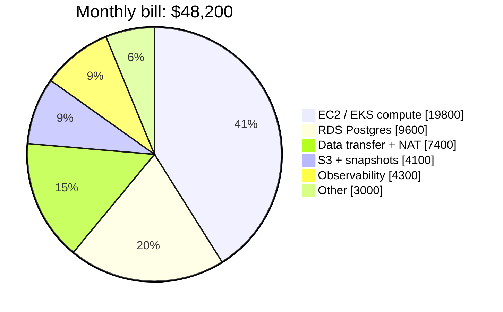
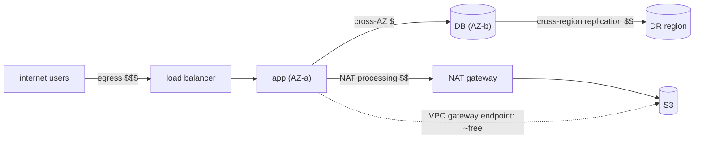
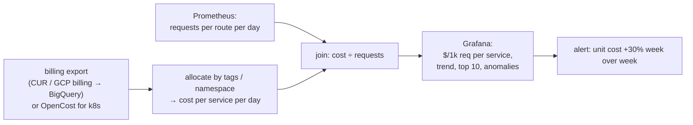

# Chapter 59 — Cost Awareness in the Cloud

> **Volume 1 — Computer Science Foundations** · [Contents](index.md) · ← [Chapter 58 — Observability: Logs, Metrics, Traces & OpenTelemetry](ch58-observability-logs-metrics-traces-and-opentelemetry.md)

---

## Concept

Cloud cost drivers, right-sizing, and designing with cost as a first-class constraint.

**In one sentence:** in the cloud every architecture decision has a monthly price tag, so good engineers know what drives the bill, measure cost per unit of value (per request, per customer), size resources to real usage, and choose purchase models that match how steady the load is.

**Mental model — a utility bill.** Compute is electricity: you pay while the lights are on, even in an empty room. Storage is rent: you pay every month for boxes in the attic you forgot about. Data transfer is shipping: moving things between cities (regions) or out to customers (egress) costs money each time. A good household turns off unused lights, clears the attic, and buys bulk for what it uses every day.

**The usual top cost drivers**

| Driver | Common waste | Typical fix |
|--------|--------------|-------------|
| Compute (VMs, containers, serverless) | over-provisioned instances at 5–15% CPU; idle dev environments running 24/7 | right-size; autoscale; schedule non-prod off at night; Graviton/ARM |
| Managed databases | the biggest instance "just in case"; unused read replicas; provisioned IOPS no one needs | right-size; storage autoscaling; serverless tiers for spiky use |
| Storage | old snapshots, unattached volumes, logs kept forever, everything in the hot tier | lifecycle policies → infrequent-access / archive tiers; TTLs; delete orphans |
| **Data transfer** | cross-AZ chatter, cross-region replication, internet egress, NAT gateway processing | keep traffic in-zone; a CDN for egress; VPC endpoints instead of NAT for S3 |
| Observability | high-cardinality metrics, DEBUG logs in prod, 100% trace sampling | sampling, log levels, retention tiers, dropping unused metrics |
| Idle / forgotten | load balancers, IPs, test clusters with no traffic | tagging + owner reports + cleanup automation |

**Purchase models**

| Model | Discount vs on-demand | Commitment | Best for |
|-------|:-:|------------|----------|
| On-demand | 0% | none | spiky, unknown, short-lived workloads |
| Savings Plans / Reserved Instances / committed-use discounts | ~30–70% | 1–3 years of spend or capacity | the steady baseline you'll run anyway |
| **Spot / preemptible** | ~60–90% | none, but can be reclaimed with ~2 min (AWS) or 30 s (GCP) notice | fault-tolerant work: batch, CI runners, stateless workers, ML training with checkpoints |
| Serverless (Lambda, Cloud Run) | pay per request/ms | none | low or bursty traffic; per-request cost at high steady volume can exceed containers |

Rule of thumb: commit to the floor of your usage, run spikes on-demand, and run interruptible work on spot.

**Unit economics** — the question isn't "is the bill big?" but "is it growing faster than the value?". Track **cost per unit**: per 1,000 requests, per active customer, per order, per GB processed, per training run. If revenue per customer is $4/month and infrastructure per customer is $3, you have a design problem, not a billing problem.

**FinOps basics** — tag every resource (`team`, `service`, `env`); show costs to the teams that create them; set budgets and anomaly alerts; review the top 10 line items monthly; make cost visible in design reviews and PRs (e.g. Infracost on Terraform plans).

---

## Prereqs

* [Chapter 56 — IaC: Terraform, State & Config Drift](ch56-iac-terraform-state-and-config-drift.md)

---

## Diagram

**A cost breakdown by service with the top spenders highlighted**



```
 top spenders                     $/month   % of bill   usage signal          action
 ████████████████████ compute     19,800    41%         avg CPU 11%           right-size, autoscale, spot for workers
 ██████████ RDS                    9,600    20%         CPU 18%, 2 idle replicas   drop replicas, one size down
 ████████ transfer + NAT           7,400    15%         S3 traffic via NAT    add a VPC gateway endpoint (≈ free)
 ████ observability                4,300     9%         DEBUG logs in prod    INFO level, 7-day hot retention
 ████ S3 + snapshots               4,100     9%         3 TB of snapshots > 1 year   lifecycle + delete
```

**Matching purchase models to the load curve**

```
 instances
   │            ╭╮          ╭─╮
   │     ╭──╮  ╭╯╰╮   ╭──╮ ╭╯ ╰╮          ░ spot (interruptible batch)
   │ ░░░╭╯  ╰──╯  ╰───╯  ╰─╯   ╰╮░░░      ▒ on-demand (the peaks)
   │▒▒▒▒▒▒▒▒▒▒▒▒▒▒▒▒▒▒▒▒▒▒▒▒▒▒▒▒▒▒▒▒      █ savings plan / reserved (the steady floor)
   │████████████████████████████████
   └──────────────────────────────────── time (a week)
```

**Where data-transfer charges hide**



---

## Example

**Right-sizing an over-provisioned cluster**

```
 before: 20 × m5.2xlarge (8 vCPU, 32 GB) on-demand, 24/7
         avg CPU 12%, p95 CPU 28%, memory p95 40%
         cost ≈ 20 × $0.384/h × 730 h ≈ $5,600/month

 after:  baseline 8 × m7g.xlarge (4 vCPU, 16 GB, ARM) on a 1-year savings plan
         + autoscale 0–12 extra on-demand for peaks
         + background workers on spot
         p95 CPU ~60% at baseline; latency SLO unchanged (verified with a load test)
         cost ≈ $1,600–2,000/month → about 65% saved
```

```python
# Unit cost per 1,000 requests, per service — the number to track weekly
monthly_cost = {"checkout": 7200.0, "search": 4100.0, "images": 2600.0}   # from tagged billing export
monthly_requests = {"checkout": 18e6, "search": 240e6, "images": 900e6}   # from metrics

for svc, cost in monthly_cost.items():
    per_k = cost / (monthly_requests[svc] / 1000)
    print(f"{svc:9s} ${per_k:.4f} per 1k requests")
# checkout  $0.4000 per 1k requests   ← expensive per request: look here first
# search    $0.0171 per 1k requests
# images    $0.0029 per 1k requests
```

```sql
-- Top cost drivers from an AWS Cost and Usage Report (CUR) in Athena
SELECT line_item_product_code AS service,
       resource_tags_user_team AS team,
       ROUND(SUM(line_item_unblended_cost), 2) AS cost
FROM cur
WHERE line_item_usage_start_date >= date_trunc('month', current_date - interval '1' month)
GROUP BY 1, 2
ORDER BY cost DESC
LIMIT 10;
```

---

## Exercises

1. Find the top cost driver in a sample bill.

   <details><summary>Solution</summary>Sort line items by cost and group by service and tag; look at the top 3. For each, compare cost to a usage signal (CPU, requests, GB). High cost with low utilization is right-sizing; high transfer cost means tracing the traffic path (NAT, cross-AZ, egress); growing storage means checking retention. In the pie above, compute leads, but the quickest win is often NAT/transfer through a VPC endpoint.</details>

2. Compute unit cost per request.

   <details><summary>Solution</summary>Unit cost = allocated monthly cost of the service ÷ monthly units. Allocate shared costs (the cluster, the LB, observability) by a fair key such as CPU-hours or request share. Track it weekly next to latency and error rate, so optimizations prove they didn't hurt reliability.</details>

3. Should a service with 2 requests per minute run on 3 always-on containers or on serverless?

   <details><summary>Solution</summary>Serverless: about 86k requests per month costs cents, while 3 always-on containers cost tens of dollars or more. Re-check at high steady traffic, where per-request pricing can exceed reserved containers. Also consider cold-start latency against your SLO.</details>

---

## Mini project

**A cost dashboard tracking spend per endpoint/service.**



**Steps**

1. Get cost data: a cloud billing export, or OpenCost on a kind/minikube cluster (namespace-level allocation).
2. Enforce tags or labels (`service`, `team`, `env`) and report untagged spend as its own line.
3. Join daily cost with daily request counts from Prometheus to get $/1k requests per service (and per route, allocated by CPU time share).
4. A Grafana dashboard: top spenders, unit-cost trends, idle resources (CPU < 10% for 7 days).
5. An anomaly alert when a service's unit cost rises more than 30% week over week.

**Done when:** the dashboard shows cost per service and per 1,000 requests, untagged spend is visible, and an artificial cost spike triggers the alert.

---

## Open source

* [`opencost/opencost`](https://github.com/opencost/opencost) — a CNCF project that allocates Kubernetes costs to namespaces, deployments, and labels from real pricing data; see also `infracost/infracost` for cost estimates on Terraform PRs.

---

## Interview

1. **"How do you reduce cloud spend safely?"**
   <details><summary>Answer</summary>Measure first: tag everything, find the top drivers, and set a unit-cost baseline plus SLO dashboards. Then take the low-risk wins: delete idle and orphaned resources, add storage lifecycle rules, schedule non-prod off, use VPC endpoints. Next, right-size using p95 utilization and load tests, and autoscale. Commit savings plans only for the proven steady floor, and use spot for interruptible work. Change one thing at a time and watch latency and errors so reliability doesn't pay for the savings.</details>

2. **"What's unit economics for infra?"**
   <details><summary>Answer</summary>Expressing infrastructure cost per unit of business value — per request, active user, order, tenant, or GB processed — instead of as a raw total. It shows whether cost grows proportionally with the business, reveals which features or customers are expensive to serve, sets targets for engineering, and turns "the bill went up" into "cost per order went from 3¢ to 5¢ after release X".</details>

---

## Checklist

- [ ] track cost per unit of value
- [ ] right-size continuously
- [ ] treat cost as a requirement

---

> [Contents](index.md) · ← [Chapter 58 — Observability: Logs, Metrics, Traces & OpenTelemetry](ch58-observability-logs-metrics-traces-and-opentelemetry.md)
