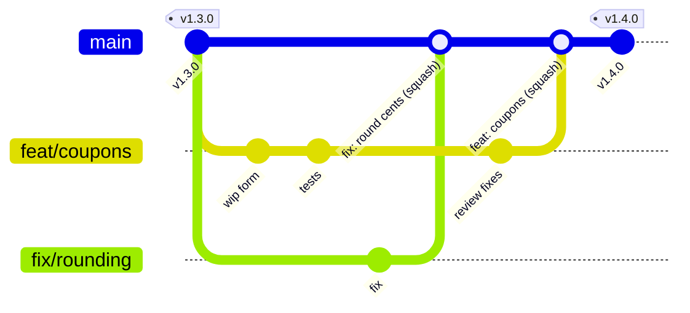
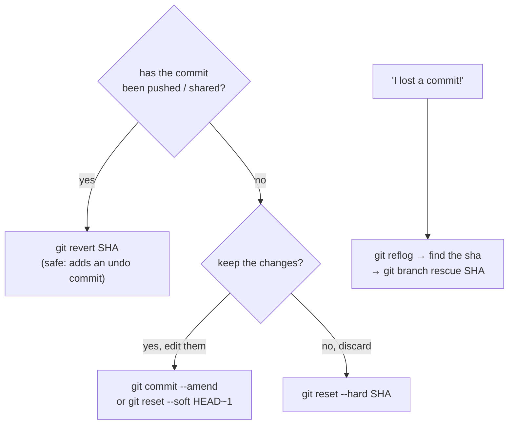
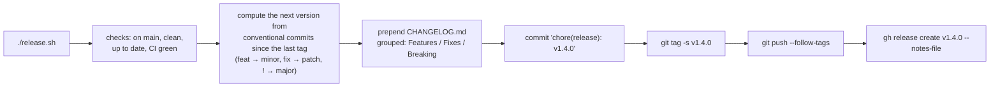

# Chapter 1 — Professional Git Workflow

> **Volume 2 — Software Engineering** · [Contents](index.md) · Next → [Chapter 2 — Monorepos](ch02-monorepos.md)

---

## Concept

Trunk-based vs GitFlow, PRs, code review flow, conventional commits, and recovering from mistakes (revert, reflog).

**In one sentence:** a professional Git workflow is a team agreement about how changes travel from a laptop to production — small branches, reviewed pull requests, readable commit messages, and safe ways to undo mistakes without rewriting anyone else's history.

**Mental model — a river and its streams.** Trunk-based development is one wide river (`main`) with short streams that flow back in within a day or two. GitFlow is a canal system with locks: `develop`, `release/*`, and `hotfix/*` branches, each with rules about what may enter. Rivers move fast; canals move carefully. Most modern teams that deploy often choose the river.

**Trunk-based vs GitFlow**

| | Trunk-based | GitFlow |
|-|-------------|---------|
| Long-lived branches | only `main` | `main` + `develop` (+ release/hotfix branches) |
| Feature branch life | hours to ~2 days | days to weeks |
| Unfinished work | hidden behind **feature flags** | kept on the feature branch |
| Merge conflicts | small, frequent | big, painful at release time |
| Release cadence | continuous; any green commit | scheduled release trains |
| Fits | web services, SaaS, CD | versioned products, several supported versions, mobile apps with store review |

**The PR flow**

1. `git switch -c feat/checkout-coupons` from an up-to-date `main`.
2. Small, focused commits; push early; open a *draft* PR for feedback.
3. CI runs; reviewers comment; you push fixups.
4. Rebase on `main` (or merge `main` in) and resolve conflicts.
5. **Squash-merge** (one clean commit on `main`) or rebase-merge (keep the curated commits).
6. Delete the branch; deploy; tag if it's a release.

**Conventional Commits** — `type(scope)!: summary`

| Type | Meaning | SemVer effect (in release tooling) |
|------|---------|--------------------------------|
| `feat` | a new feature | MINOR |
| `fix` | a bug fix | PATCH |
| `feat!` / `BREAKING CHANGE:` footer | a breaking change | MAJOR |
| `docs`, `test`, `refactor`, `perf`, `build`, `ci`, `chore` | no user-visible change | none |

A good message: summary ≤ 72 characters in the imperative ("add", not "added"); a body explaining *why*; footers such as `Refs: #123`.

**Undoing mistakes — pick the right tool**

| Situation | Tool | Rewrites history? |
|-----------|------|:-:|
| Undo a commit that's already pushed / shared | `git revert <sha>` (a new commit that undoes it) | no ✓ |
| Fix the last local commit | `git commit --amend` | yes (local only) |
| Throw away local commits | `git reset --hard <sha>` | yes |
| Lost a commit (bad reset or rebase, deleted branch) | `git reflog` → `git branch rescue <sha>` | no |
| Undo local file changes | `git restore <file>` | — |
| Update your own pushed PR branch after a rebase | `git push --force-with-lease` | yes, but only if no one else pushed |

**Never force-push a shared branch** such as `main`: others' clones diverge and their work can be silently lost. Protect `main` with branch-protection rules.

---

## Prereqs

* [Vol 1 Ch 19 — Git: Branching, Merge, Rebase & Cherry-Pick](../volume-1-cs-foundations/ch19-git-branching-merge-rebase-and-cherry-pick.md)
* [Vol 1 Ch 20 — Git: Tags, Stash, Hooks & Internals](../volume-1-cs-foundations/ch20-git-tags-stash-hooks-and-internals.md)

---

## Diagram

**Trunk-based flow: short-lived branches → PR → review → squash-merge → tag**



**GitFlow, for comparison**

```
 main     ●───────────────────────●──────────────●─────   (tags: releases only)
           \                     / \            /
 hotfix     \                   /   ●──────────●          hotfix/1.4.1
             \                 /                \
 release      \          ●───●  release/1.4      \
               \        /                         \
 develop  ●─────●──●───●──────●──────●─────────────●──
               /    \        /
 feature   ●──●      ●──●──●   (long-lived feature branches)
```

**Choosing an undo**



---

## Example

```bash
git switch main && git pull --ff-only
git switch -c feat/coupons
git commit -m "feat(checkout): accept percentage coupons

Customers can enter a code at checkout. Discounts are capped at 50%
to limit abuse (see ADR 0012).

Refs: #482"
git push -u origin feat/coupons                  # then open a PR

# Undo a bad commit that is already on main
git revert 3f9a2c1                               # creates "Revert 'feat: …'"
git push

# Recover from a bad rebase
git reflog
# 7d1e0b4 HEAD@{0}: rebase (finish): returning to refs/heads/feat/coupons
# 9c2f8aa HEAD@{5}: commit: tests for coupon cap      ← the commit that "disappeared"
git branch rescue 9c2f8aa
git cherry-pick 9c2f8aa                          # or reset the branch to it

# Update your own PR branch after rebasing, safely
git fetch origin && git rebase origin/main
git push --force-with-lease
```

```text
Branch protection for main (repository settings):
  ✓ Require a pull request before merging (1 approval, dismiss stale approvals)
  ✓ Require status checks to pass (ci / lint, ci / test)
  ✓ Require linear history (squash or rebase merges only)
  ✓ Do not allow force pushes or deletions
```

---

## Exercises

1. Recover a commit deleted by a bad rebase using reflog.

   <details><summary>Solution</summary>Make 3 commits on a branch, then run <code>git rebase -i</code> and drop one. <code>git reflog</code> lists every position HEAD has been at; find the dropped commit's SHA (or <code>HEAD@{n}</code> from before the rebase) and <code>git cherry-pick</code> it, or <code>git reset --hard HEAD@{n}</code> to undo the whole rebase. Reflog entries live for about 90 days by default and are local only.</details>

2. Write conventional commits for a multi-change PR.

   <details><summary>Solution</summary>A PR that adds CSV export, fixes a timezone bug, and renames an internal module: <code>feat(reports): add CSV export for monthly statements</code>, <code>fix(reports): use the account timezone for month boundaries</code>, <code>refactor(reports): rename builder module to statement</code>. If squash-merging, the PR title becomes the commit: <code>feat(reports): add CSV export</code>, with the fix listed in the body — or split the fix into its own PR.</details>

3. A teammate force-pushed `main` and your latest commits vanished from GitHub. How do you recover?

   <details><summary>Solution</summary>Your local clone still has them: <code>git reflog</code> or <code>git log origin/main@{1}</code> shows the old tip. Push the recovered history to a branch, compare, and restore <code>main</code> together. Then enable branch protection so it can't happen again.</details>

---

## Mini project

**Script a release: bump version → changelog → tag → signed push.**



**Steps**

1. Parse `git log $(git describe --tags --abbrev=0)..HEAD --pretty=%s` with a regex for conventional types.
2. Pick the bump: any `!` or `BREAKING CHANGE` → major; any `feat` → minor; else patch.
3. Write the new version into `pyproject.toml` / `Cargo.toml` / `package.json`.
4. Generate a grouped changelog section with links to commits and PRs.
5. Commit, create a signed annotated tag, push with `--follow-tags`, and create a GitHub release.
6. Dry-run mode (`--dry-run`) prints everything without changing anything.

**Done when:** running it after a mix of `feat` and `fix` commits produces the correct next version, a readable changelog, and a verified signed tag. (Compare with `release-please` or `semantic-release`.)

---

## Open source

* [`git/git`](https://github.com/git/git) — `Documentation/git-reflog.txt`, `git-revert.txt`, and `git-push.txt` (`--force-with-lease`).
* [`conventional-commits/conventionalcommits.org`](https://github.com/conventional-commits/conventionalcommits.org) — the specification; tools like `commitlint`, `release-please`, and `semantic-release` build on it.

---

## Interview

1. **"Trunk-based vs GitFlow?"**
   <details><summary>Answer</summary>Trunk-based keeps everyone integrating into <code>main</code> at least daily via short-lived branches, hides incomplete work behind feature flags, and relies on strong CI, so conflicts stay small and any green commit can ship. GitFlow uses long-lived <code>develop</code>, release, and hotfix branches — structured for scheduled releases and multiple supported versions, but it delays integration and makes merges painful. For continuously deployed services, trunk-based is the default.</details>

2. **"How do you undo a pushed commit safely?"**
   <details><summary>Answer</summary><code>git revert SHA</code>: it creates a new commit that applies the inverse change, so history stays intact and everyone's clones stay valid. For a merge commit, <code>git revert -m 1 &lt;merge-sha&gt;</code>. Don't reset and force-push shared branches. If the change is behind a feature flag, turning the flag off is even faster.</details>

---

## Checklist

- [ ] keep branches short-lived
- [ ] write meaningful commit messages
- [ ] never force-push shared branches

---

> [Contents](index.md) · Next → [Chapter 2 — Monorepos](ch02-monorepos.md)
