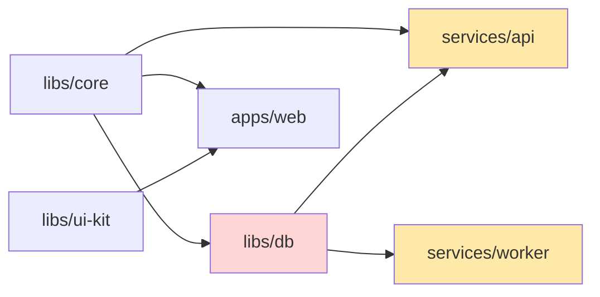
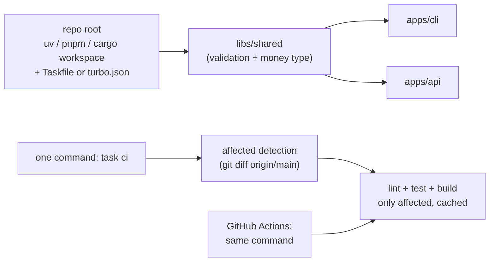

# Chapter 2 — Monorepos

> **Volume 2 — Software Engineering** · [Contents](index.md) · ← [Chapter 1 — Professional Git Workflow](ch01-professional-git-workflow.md) · Next → [Chapter 3 — Dependency Injection & Inversion of Control](ch03-dependency-injection-and-inversion-of-control.md)

---

## Concept

One repo, many projects — benefits (atomic changes, shared code) and costs (scaling, tooling); workspace tooling.

**In one sentence:** a monorepo keeps many projects in one repository so a change to shared code and all its users can land in a single reviewed commit — at the cost of needing tooling that builds and tests only what actually changed.

**Mental model — one big kitchen vs many food trucks.** Polyrepo is a fleet of food trucks: each is independent and fast to change, but sharing a new sauce recipe means visiting every truck, and they drift apart. A monorepo is one big restaurant kitchen: the sauce is changed once and every dish gets it immediately — but you need a good head chef (build tooling) so that changing the sauce doesn't mean re-cooking the entire menu.

**Monorepo vs polyrepo**

| | Monorepo | Polyrepo |
|-|----------|----------|
| Change shared code + all users | **one atomic PR** | N PRs, release the library, bump everywhere |
| Dependency versions | one version of each (the "one-version rule") | each repo drifts |
| Refactoring across projects | easy: find and fix every call site | hard: you can't see all users |
| Code discovery and reuse | high | low; copy-paste is common |
| CI | needs affected-only builds, caching | simple per repo |
| Access control | coarser (use `CODEOWNERS`, path rules) | per repo |
| Scaling Git itself | large repos need sparse checkout, partial clone | not an issue |
| Tooling | Cargo/pnpm/uv workspaces; Nx, Turborepo; Bazel, Pants, Buck2 | standard |

**Workspace basics** — a *workspace* is a root manifest that lists member packages which share one lockfile, and internal dependencies refer to each other **by path** (or `workspace:*`), so a change is picked up immediately without publishing.

**Keeping CI fast in a monorepo**

| Technique | How |
|-----------|-----|
| **Affected-only** builds | compute changed files → the packages that contain them → everything that depends on them; test only that set |
| Build graph caching | content-hashed task outputs; skip a task if its inputs are unchanged (Turborepo, Nx, Bazel remote cache) |
| Parallelism | run independent package tasks at once |
| Path-filtered workflows | `on: push: paths: ["services/api/**", "libs/core/**"]` |
| Sparse / shallow checkouts | clone only what the job needs |
| Ownership | `CODEOWNERS` routes reviews to the right team |

---

## Prereqs

* [Chapter 1 — Professional Git Workflow](ch01-professional-git-workflow.md)

---

## Diagram

**A monorepo tree with shared packages**

```
 acme/
 ├── Cargo.toml / package.json / pyproject.toml   ← workspace root, ONE lockfile
 ├── libs/
 │   ├── core/          shared domain types, validation
 │   ├── db/            database access (depends on core)
 │   └── ui-kit/        shared React components
 ├── services/
 │   ├── api/           depends on core, db
 │   └── worker/        depends on core, db
 ├── apps/
 │   └── web/           depends on ui-kit (+ core types)
 ├── tools/             scripts, codegen
 └── .github/CODEOWNERS
```

**The dependency graph across packages, and "affected" by a change**



Change `libs/db` → affected: `db`, `api`, `worker`. `core`, `ui-kit`, and `web` are skipped.

**Task caching**

```
 task: test services/api
 inputs hash = hash(source files, deps' outputs, lockfile, env, command)
   = 9f3e…  → found in the remote cache → restore logs + outputs in 0.4 s (no run)
   = a71c…  → miss → run the tests (2 min) → upload the result under a71c…
```

---

## Example

```toml
# Cargo.toml at the repo root
[workspace]
members = ["libs/core", "libs/db", "services/api", "services/worker"]
resolver = "2"

[workspace.dependencies]          # one version for everyone
serde = { version = "1", features = ["derive"] }
tokio = { version = "1", features = ["full"] }

# services/api/Cargo.toml
[dependencies]
core  = { path = "../../libs/core" }
db    = { path = "../../libs/db" }
serde = { workspace = true }
```

```yaml
# pnpm-workspace.yaml
packages:
  - "apps/*"
  - "libs/*"
```

```json
// apps/web/package.json
{ "name": "@acme/web", "dependencies": { "@acme/ui-kit": "workspace:*" } }
```

```bash
cargo build -p api                      # build one member + its dependencies
cargo test --workspace
pnpm --filter "...[origin/main]" test   # pnpm: test packages changed since main, and their dependents
npx turbo run test --filter="...[origin/main]"
```

```text
# .github/CODEOWNERS
/libs/core/      @acme/platform
/services/api/   @acme/checkout-team
/apps/web/       @acme/frontend
```

---

## Exercises

1. Set up a two-crate Rust workspace.

   <details><summary>Solution</summary><code>cargo new --lib libs/core</code> and <code>cargo new services/app</code>; a root <code>Cargo.toml</code> with <code>[workspace] members = [...]</code>; in the app, <code>core = { path = "../../libs/core" }</code>. <code>cargo build</code> at the root builds both into one shared <code>target/</code> with one <code>Cargo.lock</code>.</details>

2. Make one change that updates a shared package and all consumers.

   <details><summary>Solution</summary>Rename a function in <code>libs/core</code> (e.g. <code>parse_money</code> → <code>Money::parse</code>), let the compiler or type checker list every broken call site across the workspace, fix them all, and land it as one PR. CI tests <code>core</code> and every dependent — impossible to do atomically across polyrepos.</details>

3. Why does a monorepo push you toward a "one-version rule" for third-party dependencies?

   <details><summary>Solution</summary>With a single lockfile and shared builds, two versions of one library conflict (duplicate symbols, incompatible types passed between packages) and double the upgrade and security work. One version means one upgrade PR that fixes everything, with CI proving it for every consumer.</details>

---

## Mini project

**A small monorepo with a shared library + two apps built by one command.**



**Steps**

1. Pick one ecosystem (uv workspace, pnpm, or Cargo); create `libs/shared`, `apps/cli`, and `apps/api`, using path/workspace dependencies.
2. `task ci` (or `turbo run`) runs lint, test, and build across all packages in dependency order.
3. Add affected-only mode: diff against `origin/main`, map files to packages, and add their reverse dependencies.
4. Add task caching keyed by input hashes; show that a second run with no changes takes seconds.
5. CI uses the same command; add `CODEOWNERS`.

**Done when:** changing `libs/shared` rebuilds and tests all three packages, changing `apps/cli` touches only the CLI, and a no-op run is nearly instant.

---

## Open source

* [`rust-lang/cargo`](https://github.com/rust-lang/cargo) workspaces — the Cargo Book's "Workspaces" chapter and `workspace.dependencies` inheritance.
* [`pnpm/pnpm`](https://github.com/pnpm/pnpm) — workspaces with the `--filter "...[ref]"` affected syntax; see also Turborepo, Nx, and Bazel for build-graph caching at scale.

---

## Interview

1. **"Monorepo vs polyrepo — trade-offs?"**
   <details><summary>Answer</summary>A monorepo gives atomic cross-project changes, easy refactoring and code reuse, one set of tooling and dependency versions, and full visibility — but it needs investment in affected-only CI, caching, ownership rules, and eventually Git scaling. Polyrepos give strong isolation, independent release cadences, and simple per-repo CI, but cross-cutting changes need coordinated releases, versions drift, and shared code gets copied. Choose by how much code is shared and how often changes cross boundaries.</details>

2. **"How do you keep CI fast in a monorepo?"**
   <details><summary>Answer</summary>Build and test only what's affected (changed packages plus their dependents, from the dependency graph); cache task outputs by content hash, locally and remotely; parallelize independent tasks; use path filters and sparse checkouts; keep tests hermetic so they're cacheable; and track CI duration as a metric.</details>

---

## Checklist

- [ ] share code without copy-paste
- [ ] build only what changed
- [ ] pin internal deps by path/version

---

> [Contents](index.md) · ← [Chapter 1 — Professional Git Workflow](ch01-professional-git-workflow.md) · Next → [Chapter 3 — Dependency Injection & Inversion of Control](ch03-dependency-injection-and-inversion-of-control.md)
