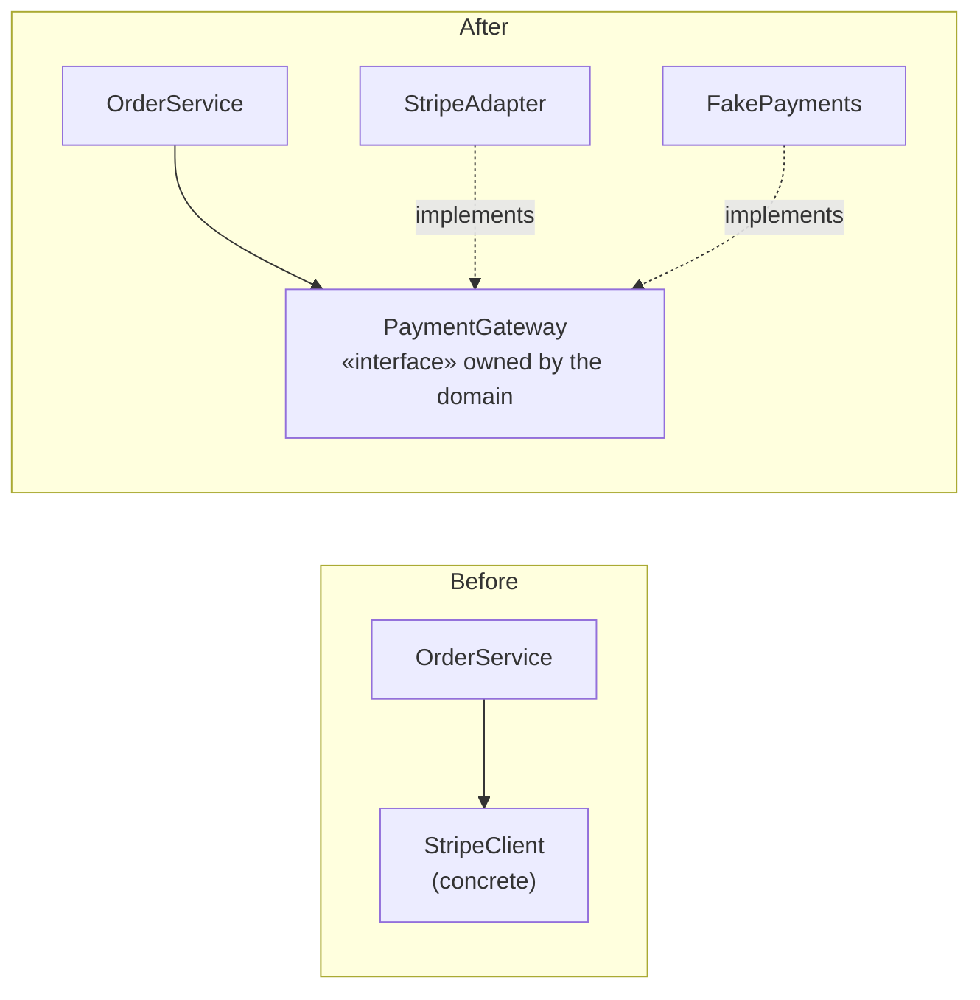
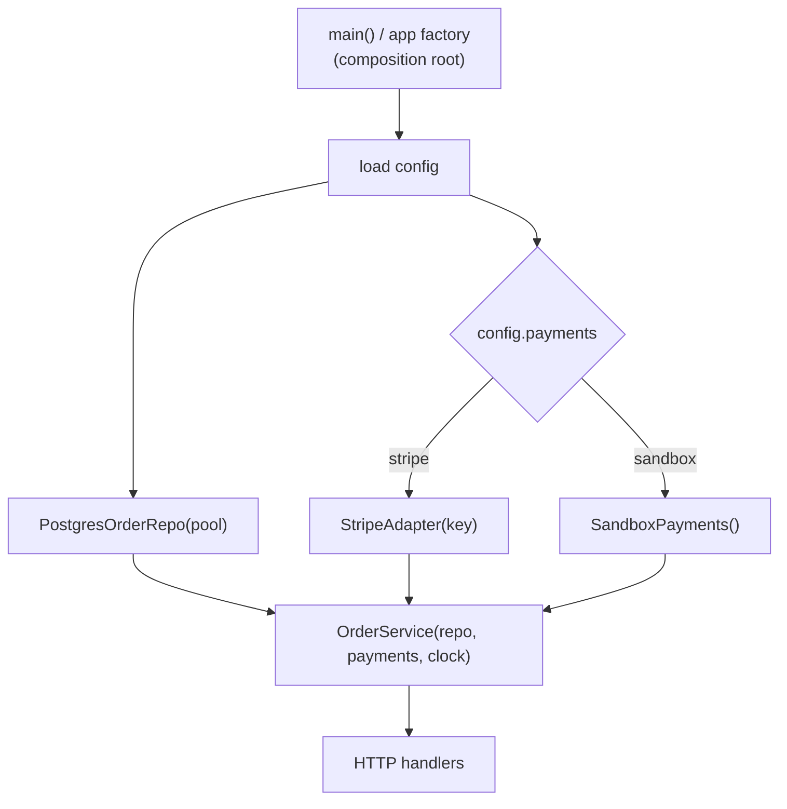
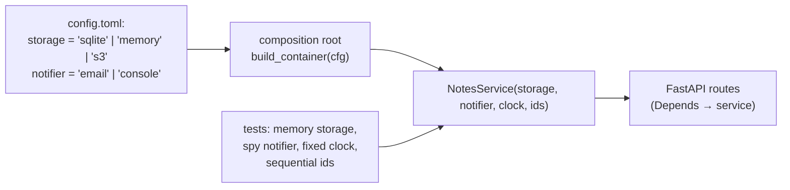

# Chapter 3 — Dependency Injection & Inversion of Control

> **Volume 2 — Software Engineering** · [Contents](index.md) · ← [Chapter 2 — Monorepos](ch02-monorepos.md) · Next → [Chapter 4 — The Testing Pyramid & Test Strategy](ch04-the-testing-pyramid-and-test-strategy.md)

---

## Concept

Inject dependencies instead of constructing them; interfaces at seams; why DI enables testing and swapping implementations.

**In one sentence:** instead of a class building the things it needs (`self.db = PostgresDB()`), it receives them from outside — so the same class works with a real database in production, a fake one in tests, and a different vendor tomorrow, without changing a line of it.

**Mental model — a lamp and a wall socket.** A lamp wired straight into the wall (hardcoded `new`) can only ever use that one circuit, and to test the bulb you need an electrician. A lamp with a plug (an injected dependency) works in any socket that follows the standard (the interface): mains power, a battery pack, or a test bench.

**Terms**

| Term | Meaning |
|------|---------|
| Dependency | something your code needs to do its job: DB, HTTP client, clock, logger, config |
| Dependency Injection (DI) | pass dependencies in (usually through the constructor) instead of creating them inside |
| **Inversion of Control (IoC)** | the general principle: *you* don't call the framework or build your collaborators — they're given to you, and the framework calls you ("don't call us, we'll call you") |
| Seam | a place where you can swap behavior without editing the code: an interface or parameter |
| Composition root | the one place (usually `main()`) where concrete objects are created and wired together |
| DI container | a library that builds the object graph for you (Spring, .NET's DI, `dependency-injector`). Optional — manual wiring is often clearer |

**Ways to inject**

| Style | Example | Use |
|-------|---------|-----|
| **Constructor** | `OrderService(repo, payments, clock)` | the default: required dependencies, immutable, obvious |
| Parameter / method | `render(template, clock=system_clock)` | a dependency needed by one call |
| Setter / property | `svc.logger = log` | optional or late dependencies (rarely a good idea) |
| Framework-provided | FastAPI `Depends(get_db)`, Spring `@Autowired` | the framework resolves them per request |

**Anti-patterns**

* `new`/constructor calls for collaborators *inside* business logic.
* **Service locator**: `Registry.get("db")` anywhere in the code — hides dependencies, just like globals.
* Singletons and module-level globals as dependencies.
* Injecting 12 things into one class — a sign it has too many responsibilities.

**The Dependency Inversion Principle (the D in SOLID)** — high-level policy (`OrderService`) should depend on an abstraction it *owns* (`PaymentGateway` interface), and low-level details (`StripeClient`) implement it. The source-code dependency points *toward* the business logic, even though control flows outward. See [Vol 3 Ch 2](../volume-3-low-level-design/ch02-solid-principles.md).

---

## Prereqs

* [Vol 1 Ch 10 — Generics, Traits, Interfaces & Abstract Classes](../volume-1-cs-foundations/ch10-generics-traits-interfaces-and-abstract-classes.md)
* [Vol 1 Ch 22 — Clean Code & Refactoring](../volume-1-cs-foundations/ch22-clean-code-and-refactoring.md)

---

## Diagram

**Hardcoded `new` vs injected dependencies**

```
 HARDCODED                                  INJECTED
 class OrderService:                        class OrderService:
   def __init__(self):                        def __init__(self, repo, payments, clock):
     self.repo = PostgresRepo("prod-db")        self.repo, self.payments, self.clock = repo, payments, clock
     self.pay  = StripeClient(API_KEY)
     self.now  = datetime.now               main():   OrderService(PostgresRepo(url), StripeClient(key), SystemClock())
                                            test:     OrderService(InMemoryRepo(), FakePayments(), FixedClock(t))
 test → hits the real DB and charges real cards      test → fast, deterministic, no network
```

**Dependency direction: before and after inversion**



**The composition root wires everything once**



---

## Example

```python
from typing import Protocol
from datetime import datetime, timezone

class PaymentGateway(Protocol):
    def charge(self, customer_id: str, cents: int) -> str: ...

class OrderRepo(Protocol):
    def save(self, order: dict) -> None: ...

class Clock(Protocol):
    def now(self) -> datetime: ...

class OrderService:
    def __init__(self, repo: OrderRepo, payments: PaymentGateway, clock: Clock):
        self.repo, self.payments, self.clock = repo, payments, clock      # no `new` here

    def place(self, customer_id: str, cents: int) -> dict:
        charge_id = self.payments.charge(customer_id, cents)
        order = {"customer": customer_id, "cents": cents,
                 "charge": charge_id, "placed_at": self.clock.now()}
        self.repo.save(order)
        return order

# Production adapters
class StripePayments:
    def __init__(self, api_key: str): self.api_key = api_key
    def charge(self, customer_id, cents): ...          # calls the Stripe API

class SystemClock:
    def now(self): return datetime.now(timezone.utc)

# Composition root
def build_app(cfg):
    repo = PostgresOrderRepo(cfg.database_url)
    payments = StripePayments(cfg.stripe_key) if cfg.payments == "stripe" else SandboxPayments()
    return OrderService(repo, payments, SystemClock())
```

```python
# Test: swap real clients for fakes — zero production changes
class FakePayments:
    def __init__(self): self.calls = []
    def charge(self, customer_id, cents):
        self.calls.append((customer_id, cents)); return "ch_test_1"

class InMemoryRepo:
    def __init__(self): self.saved = []
    def save(self, order): self.saved.append(order)

class FixedClock:
    def __init__(self, t): self.t = t
    def now(self): return self.t

def test_place_order_charges_and_saves():
    pay, repo = FakePayments(), InMemoryRepo()
    t = datetime(2024, 1, 1, tzinfo=timezone.utc)
    order = OrderService(repo, pay, FixedClock(t)).place("c1", 500)
    assert pay.calls == [("c1", 500)]
    assert repo.saved == [order] and order["placed_at"] == t
```

```rust
trait Db { fn get_user(&self, id: u64) -> Option<String>; }

struct UserService<D: Db> { db: D }            // static dispatch; or Box<dyn Db> for runtime choice
impl<D: Db> UserService<D> {
    fn new(db: D) -> Self { Self { db } }
    fn greet(&self, id: u64) -> String {
        self.db.get_user(id).map_or("hello, stranger".into(), |n| format!("hello, {n}"))
    }
}

struct MemDb;
impl Db for MemDb { fn get_user(&self, _: u64) -> Option<String> { Some("Ada".into()) } }
// test: UserService::new(MemDb).greet(1) == "hello, Ada"
```

---

## Exercises

1. Refactor a hardcoded dependency to constructor injection.

   <details><summary>Solution</summary>Find every collaborator built inside the class (<code>requests.Session()</code>, <code>datetime.now</code>, <code>boto3.client</code>). Define a small interface for what you actually use. Add a constructor parameter (optionally with a default at first, for backward compatibility), move the construction to the composition root, and remove the default once all callers pass it.</details>

2. Swap a real client for a fake in a test with zero production changes.

   <details><summary>Solution</summary>See <code>test_place_order_charges_and_saves</code>: the fake implements the same protocol, so <code>OrderService</code> is unchanged. If you have to patch module globals (<code>mock.patch("app.stripe")</code>) to test something, that's the sign the dependency wasn't injected.</details>

3. Your `ReportService` constructor takes 9 dependencies. What does that tell you?

   <details><summary>Solution</summary>It probably has several responsibilities. Split it by use case (e.g. <code>ReportBuilder</code>, <code>ReportScheduler</code>, <code>ReportMailer</code>), or group related dependencies behind a cohesive facade. DI made the problem visible; it didn't cause it.</details>

---

## Mini project

**A service wired via constructor injection with a config-chosen backend.**



**Steps**

1. Define `Storage`, `Notifier`, `Clock`, and `IdGenerator` protocols.
2. Implement at least two backends per interface (SQLite + in-memory; email + console).
3. One composition root chooses implementations from config and builds the service graph.
4. Wire FastAPI with `Depends(get_service)` so handlers never construct anything.
5. Unit tests use fakes only and run in under 1 s; one integration test uses the SQLite backend.

**Done when:** switching backends is a config change, the service code has no `import sqlite3` or `smtplib`, and tests need no mocking library.

---

## Open source

* [`spring-projects/spring-framework`](https://github.com/spring-projects/spring-framework) — the classic IoC container (`@Component`, `@Autowired`, constructor injection); read how it resolves the bean graph.
* Manual DI in [`rust-lang/rust`](https://github.com/rust-lang/rust) (traits) — Rust has no container; dependencies are generic parameters or `Box<dyn Trait>` passed into constructors, as in the example above.

---

## Interview

1. **"Why does DI help testing?"**
   <details><summary>Answer</summary>Tests can pass in fakes or stubs for slow, non-deterministic, or dangerous collaborators (DB, network, clock, payments) through the same constructor production uses. No monkey-patching, no global state, no network — tests are fast and deterministic, and the dependencies are visible in the signature.</details>

2. **"What's inversion of control?"**
   <details><summary>Answer</summary>A design principle where the flow of control or the creation of dependencies is handed to an outside party instead of being hardcoded in your code. Frameworks call your handlers (you don't call the framework's main loop), and your objects receive their collaborators instead of constructing them. DI is one form of IoC; the Dependency Inversion Principle makes high-level code depend on abstractions that low-level details implement.</details>

---

## Checklist

- [ ] no hidden `new` in constructors
- [ ] depend on interfaces, not concretions
- [ ] wire at the composition root

---

> [Contents](index.md) · ← [Chapter 2 — Monorepos](ch02-monorepos.md) · Next → [Chapter 4 — The Testing Pyramid & Test Strategy](ch04-the-testing-pyramid-and-test-strategy.md)
