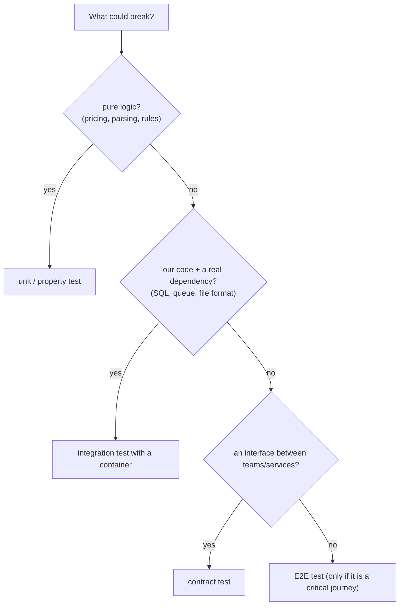
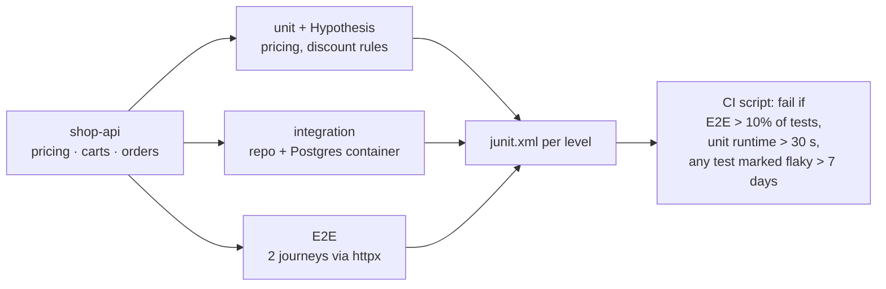

# Chapter 4 — The Testing Pyramid & Test Strategy

> **Volume 2 — Software Engineering** · [Contents](index.md) · ← [Chapter 3 — Dependency Injection & Inversion of Control](ch03-dependency-injection-and-inversion-of-control.md) · Next → [Chapter 5 — CI/CD](ch05-ci-cd.md)

---

## Concept

Unit/integration/e2e proportions, test doubles, property-based testing, and flaky-test hygiene.

**In one sentence:** a test strategy decides *what* to test at *which* level so the suite catches real bugs quickly and cheaply — lots of fast unit and property tests for logic, fewer integration tests for wiring, a thin layer of end-to-end tests for critical journeys — and treats flaky tests as bugs.

**Mental model — a building inspection.** You check every brick and beam at the factory (unit), then check that walls join properly on site (integration), then walk through the finished house once (end-to-end). Walking through the whole house to check each brick would be absurdly slow — that's a suite made only of E2E tests (the "ice-cream cone" anti-pattern).

**Proportions (a guide, not a law)**

| Level | Share | Speed per test | What it proves | Owner |
|-------|:-:|---------------|----------------|-------|
| Unit + property | ~70% | < 10 ms | logic, edge cases, invariants | every dev, every PR |
| Integration / component | ~20% | 100 ms – 2 s | DB queries, serialization, one service with real dependencies in containers | every PR |
| Contract | a few per API | fast | producer and consumer agree on the interface | both teams |
| E2E | ~5–10% | seconds – minutes | critical user journeys work end to end | CI on main / pre-release |
| Manual / exploratory | ad hoc | — | usability, surprises | QA / product |

Shapes you'll hear about: the **pyramid** (this one); the **testing trophy** (integration-heavy, popular for frontends where "unit" means little); the **ice-cream cone** (mostly E2E and manual — an anti-pattern: slow and flaky).

**Right ratio?** The one where most bugs are caught by the cheapest test that *can* catch them. Pure logic → unit. SQL correctness → integration against a real DB (mocks can't catch SQL bugs). Cross-service contracts → contract tests. "The checkout button works" → one E2E.

**Property-based testing** — instead of listing examples, state a *property* that must hold for all inputs and let the tool generate hundreds of inputs, including nasty edge cases, then *shrink* any failure to a minimal counterexample.

| Property type | Example |
|---------------|---------|
| Invariant | `sorted(xs)` is ordered and has the same elements as `xs` |
| Round trip | `decode(encode(x)) == x` |
| Oracle | a fast implementation equals a slow, obviously correct one |
| Idempotence | `normalize(normalize(s)) == normalize(s)` |
| Metamorphic | `search(q) ⊇ search(q + " extra filter")` |

**Flaky tests** — tests that pass and fail without code changes. Common causes and fixes:

| Cause | Fix |
|-------|-----|
| Time: `now()`, sleeps, timezones, DST | inject a clock; freeze time; never `sleep` to "wait" — poll for a condition |
| Order dependence / shared state | isolate: fresh fixtures, transactions rolled back per test, random test order (`pytest-randomly`) |
| Concurrency / async races | await real completion signals; deterministic schedulers |
| Randomness | seed it; log the seed |
| Network / external services | fakes, or containers pinned to a version |
| Resource leaks, ports in use | ephemeral ports, cleanup fixtures |

Policy: **quarantine** a flaky test immediately (don't let it train people to ignore red), file a ticket with an owner, fix or delete within days, and track the flake rate.

---

## Prereqs

* [Vol 1 Ch 26 — Testing: Unit, Integration, Mocking & Coverage](../volume-1-cs-foundations/ch26-testing-unit-integration-mocking-and-coverage.md)

---

## Diagram

**The testing pyramid with effort/count annotations**

```
                      ▲ cost to write & maintain, run time, flakiness
                     ╱ ╲
                    ╱E2E╲          ~15 tests · 6 min · Playwright
                   ╱─────╲         critical journeys: sign up, checkout, refund
                  ╱Contract╲       ~10 · 20 s · Pact
                 ╱──────────╲
                ╱ Integration╲     ~150 · 90 s · Postgres + Redis in containers
               ╱──────────────╲
              ╱  Unit + property╲  ~1,500 · 20 s · pure logic, fakes
             ╱────────────────────╲
             ▼ count, speed, precision of failure messages
```

**Pick the cheapest level that can catch the bug**



**Property-based testing: generate → check → shrink**

```
 property: for all lists xs, my_sort(xs) == sorted(xs)
 generated:  [], [0], [3, -1], [5, 5, 2], [2147483648, -0.0, …] …   (200 cases)
 failure found:  [3, 1, 2, 1, 0, 9, 1]
 shrunk to:      [1, 0, 1]          ← the minimal failing example (a duplicate-handling bug)
```

---

## Example

```python
# Property-based tests with Hypothesis
from hypothesis import given, strategies as st
from collections import Counter

def my_sort(xs):                       # the function under test
    return sorted(xs)

@given(st.lists(st.integers()))
def test_sort_is_ordered_and_a_permutation(xs):
    out = my_sort(xs)
    assert all(a <= b for a, b in zip(out, out[1:]))      # invariant: ordered
    assert Counter(out) == Counter(xs)                    # invariant: same elements

@given(st.dictionaries(st.text(), st.integers()))
def test_json_round_trip(d):
    import json
    assert json.loads(json.dumps(d)) == d                 # round trip

@given(st.text())
def test_slugify_is_idempotent(s):
    assert slugify(slugify(s)) == slugify(s)
```

```python
# A flaky test and its fix
import time

def test_cache_expires_FLAKY():
    cache.set("k", 1, ttl=1)
    time.sleep(1)                        # sometimes 0.999 s elapses → still cached → fails
    assert cache.get("k") is None

def test_cache_expires(fake_clock):      # deterministic
    cache = Cache(clock=fake_clock)
    cache.set("k", 1, ttl=1)
    fake_clock.advance(seconds=1.001)
    assert cache.get("k") is None
```

```ini
# pytest.ini — markers keep the levels separate
[pytest]
markers =
    integration: needs containers
    e2e: full stack, slow
addopts = -p randomly --strict-markers
# PR:      pytest -m "not e2e"          (unit + integration, < 3 min)
# nightly: pytest -m e2e
```

---

## Exercises

1. Write a property-based test for a sorting invariant.

   <details><summary>Solution</summary>See <code>test_sort_is_ordered_and_a_permutation</code>. Add stability as a property: sort pairs by key and check that items with equal keys keep their input order. Break <code>my_sort</code> on purpose (drop duplicates) and watch Hypothesis shrink to <code>[0, 0]</code>.</details>

2. Find and fix a flaky test's root cause.

   <details><summary>Solution</summary>Reproduce: run it 200 times (<code>pytest --count=200</code>) and in random order. Look for time, shared state, ordering, concurrency, or network. Typical fix: replace a <code>sleep</code> with an injected fake clock or polling for a condition; give each test its own fixture or DB transaction; seed randomness. Rerunning the test until it passes is not a fix.</details>

3. Which level would you use to test: (a) VAT calculation rules, (b) a SQL query with a window function, (c) "a user can buy and receive a confirmation email", (d) the JSON shape service A sends to service B?

   <details><summary>Solution</summary>(a) Unit plus property tests. (b) Integration against real Postgres. (c) One E2E test, with a fake email inbox. (d) A contract test (consumer-driven, e.g. Pact).</details>

---

## Mini project

**A test suite for a small API with the pyramid proportions enforced by CI.**



**Steps**

1. A small API with pricing rules, carts, and orders.
2. Unit tests + at least 3 properties (round trip, invariant, oracle) for pricing.
3. Integration tests against Postgres with a per-test transaction rollback.
4. Two E2E journeys; mark them `e2e`.
5. A CI step that counts tests per marker from the JUnit XML and fails if the shape drifts (e.g. E2E > 10% or unit tests too slow).
6. A `flaky` marker with an expiry date; CI fails when a quarantine expires.

**Done when:** CI shows the three levels with their counts and durations, and the proportion gate fails if someone adds E2E tests for pure logic.

---

## Open source

* [`pytest-dev/pytest`](https://github.com/pytest-dev/pytest) — markers, fixtures, and plugins (`pytest-xdist`, `pytest-randomly`, `pytest-rerunfailures` for *detecting* flakes).
* [`HypothesisWorks/hypothesis`](https://github.com/HypothesisWorks/hypothesis) — property-based testing with shrinking, stateful testing (`RuleBasedStateMachine`), and a failure database.

---

## Interview

1. **"What's the right unit:integration ratio?"**
   <details><summary>Answer</summary>There's no universal number; roughly 70/20/10 is a starting point. The real rule: test each behavior at the cheapest level that can actually catch its bugs. Logic-heavy code leans unit; data-access code needs real-DB integration tests; frontends often lean toward component and integration tests (the "trophy"). Watch the outcomes: fast feedback, low flake rate, and bugs caught before production.</details>

2. **"How do you handle flaky tests?"**
   <details><summary>Answer</summary>Treat them as bugs. Detect them (run failures again, track flake rate per test); quarantine immediately so the main signal stays trustworthy; assign an owner and a deadline; find the root cause (time, shared state, ordering, concurrency, network, randomness) and fix it with determinism (injected clocks, isolated fixtures, awaiting real conditions); delete tests that provide no value. Never normalize "just rerun it".</details>

---

## Checklist

- [ ] keep tests fast & deterministic
- [ ] isolate I/O in tests
- [ ] use property tests for pure logic

---

> [Contents](index.md) · ← [Chapter 3 — Dependency Injection & Inversion of Control](ch03-dependency-injection-and-inversion-of-control.md) · Next → [Chapter 5 — CI/CD](ch05-ci-cd.md)
