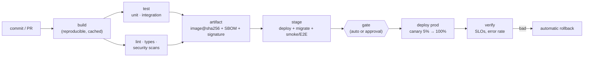
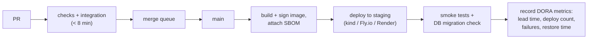

# Chapter 5 — CI/CD

> **Volume 2 — Software Engineering** · [Contents](index.md) · ← [Chapter 4 — The Testing Pyramid & Test Strategy](ch04-the-testing-pyramid-and-test-strategy.md) · Next → [Chapter 6 — Packaging & Release Engineering](ch06-packaging-and-release-engineering.md)

---

## Concept

Continuous integration (validate every change) and delivery/deployment (ship safely); pipelines as code.

**In one sentence:** CI/CD is the team's safety net and conveyor belt in one — every change is automatically built and checked, and every passing change can move to production through the same repeatable, versioned pipeline, so shipping becomes boring.

**Mental model — a car factory line.** Every car (commit) passes the same stations in the same order: frame (build), inspection (tests), paint check (lint), road test (staging), then delivery (deploy). The line itself is designed in a blueprint that is versioned and reviewed (pipeline as code). Nobody hand-builds a car in the parking lot.

This chapter is about the **practice and strategy** across a team. For the GitHub Actions mechanics (YAML, caching, environments), see [Vol 1 Ch 57](../volume-1-cs-foundations/ch57-ci-cd-and-github-actions.md).

**Principles**

| Principle | Means |
|-----------|-------|
| Integrate small and often | merge to main daily; small PRs; flags for unfinished work |
| **Every commit is validated** | the same checks on every PR; required status checks |
| Keep main green | a red main is the team's top priority; revert first, debug second |
| **Build once, promote the artifact** | the image or wheel built from commit X is what goes to staging *and* prod |
| Pipeline as code | pipeline definitions live in the repo, reviewed like code |
| Environments are reproducible | IaC ([Vol 1 Ch 56](../volume-1-cs-foundations/ch56-iac-terraform-state-and-config-drift.md)); config per environment, not per build |
| Fast feedback | < 10 min to a PR verdict; fail fast |
| Deploys are **repeatable and reversible** | one command/button; automatic rollback on bad health |
| Everything auditable | who deployed what, when, from which commit |

**DORA metrics** — the four numbers that measure delivery performance:

| Metric | Elite teams (roughly) |
|--------|-----------------------|
| Deployment frequency | on demand, many times per day |
| Lead time for changes (commit → production) | < 1 day |
| Change failure rate | ~0–15% |
| Time to restore service | < 1 hour |

Speed and stability *improve together* with good CI/CD — small changes are easier to test, review, and roll back.

**Pipeline stages and what belongs in each**

| Stage | Contents | Budget |
|-------|----------|-------:|
| Pre-commit (local) | format, lint, fast unit tests | seconds |
| PR / CI | build, lint, types, unit + integration tests, security scans (deps, secrets, SAST), coverage | < 10 min |
| Main | build the artifact once, sign it, store it with an SBOM | minutes |
| Staging deploy | deploy the artifact, run migrations, smoke / E2E / contract tests | minutes |
| Production deploy | progressive rollout (canary/blue-green, [Ch 6](ch06-packaging-and-release-engineering.md)), health checks, automatic rollback | minutes to hours |
| Post-deploy verify | SLO watch, error budget, alerting | continuous |

**Making CI fast** — caching, parallel jobs, test sharding, affected-only builds ([Ch 2](ch02-monorepos.md)), cheap checks first, flaky-test quarantine ([Ch 4](ch04-the-testing-pyramid-and-test-strategy.md)), and bigger runners for heavy builds.

---

## Prereqs

* [Chapter 1 — Professional Git Workflow](ch01-professional-git-workflow.md)

---

## Diagram

**A pipeline: commit → build → test → lint → stage → deploy → verify**



**Build once, promote everywhere**

```
                      ┌──────────► staging    (config: staging.env)
 commit 7a1c ─build─► image@sha256:3f9a…
                      └──────────► production (config: prod.env)
 ✗ never rebuild for prod — a rebuild may pull different dependencies or base images
```

**Feedback time is the key metric**

```
 PR opened ─┬─ lint 20 s ─┬─ unit 90 s ─┬─ integration 4 min ─┬─ verdict at ~5 min ✅
            │             │             │
            └─ fail here → the dev hears in 20 s, not after 25 min
```

---

## Example

```yaml
# A pipeline-as-code skeleton (GitHub Actions; the structure is the same in GitLab CI or Buildkite)
name: pipeline
on: { pull_request: {}, push: { branches: [main] } }
permissions: { contents: read }
concurrency: { group: "${{ github.ref }}", cancel-in-progress: true }

jobs:
  checks:                       # fast, parallel
    strategy: { matrix: { task: [lint, typecheck, unit, audit] } }
    runs-on: ubuntu-latest
    steps:
      - uses: actions/checkout@v4
      - uses: astral-sh/setup-uv@v3
        with: { enable-cache: true }
      - run: make ${{ matrix.task }}          # the same Makefile targets devs run locally

  integration:
    needs: checks
    runs-on: ubuntu-latest
    steps:
      - uses: actions/checkout@v4
      - run: make integration                 # docker compose up db; pytest -m integration

  artifact:
    if: github.ref == 'refs/heads/main'
    needs: [checks, integration]
    runs-on: ubuntu-latest
    permissions: { contents: read, packages: write, id-token: write }
    steps:
      - uses: actions/checkout@v4
      - run: make image IMAGE=ghcr.io/acme/api:${{ github.sha }}   # build + push + sbom + cosign sign

  staging:
    needs: artifact
    environment: staging
    runs-on: ubuntu-latest
    steps:
      - run: make deploy ENV=staging IMAGE=ghcr.io/acme/api:${{ github.sha }} && make smoke ENV=staging

  production:
    needs: staging
    environment: production       # approval gate + prod-only secrets
    runs-on: ubuntu-latest
    steps:
      - run: make deploy ENV=prod IMAGE=ghcr.io/acme/api:${{ github.sha }} STRATEGY=canary
```

```make
# Makefile — one interface for humans and CI
lint:        ; uv run ruff check . && uv run ruff format --check .
typecheck:   ; uv run mypy src
unit:        ; uv run pytest -q -m "not integration and not e2e"
integration: ; docker compose up -d db && uv run pytest -q -m integration
audit:       ; uv run pip-audit && gitleaks detect --no-banner
```

---

## Exercises

1. Write a CI workflow that runs tests + lints.

   <details><summary>Solution</summary>See the <code>checks</code> job: a matrix over Makefile targets so CI and local development share one definition. Add it as a required status check. Keep the PR path under ~10 minutes; move slow suites to <code>main</code> or nightly.</details>

2. Add caching and a manual deploy approval.

   <details><summary>Solution</summary>Enable dependency caching (setup action <code>cache</code> options, keyed on the lockfile hash) and Docker layer caching (<code>cache-from: type=gha</code>). Put production deploys in a job with <code>environment: production</code>, where the environment requires reviewers; its secrets are released only after approval. Measure pipeline time before and after.</details>

3. Your main branch is red for 2 days and people keep merging. What policy changes do you propose?

   <details><summary>Solution</summary>Require status checks to pass before merge (branch protection), so red main blocks merges. Adopt "revert first": the author of the breaking change reverts within minutes, then fixes it forward. Quarantine flaky tests so red means real. Add a merge queue that tests each PR against the latest main before merging.</details>

---

## Mini project

**Full CI/CD for a toy service: automated tests + deploy to a staging environment.**



**Steps**

1. A small service (reuse an earlier chapter's API) with unit and integration tests.
2. The pipeline above: PR checks, a merge queue or required up-to-date branches, and artifact build on main.
3. Automatic staging deploy of the exact digest; run migrations; run smoke tests against the staging URL.
4. Record DORA metrics from pipeline events (commit time → deploy time; failures; restore time) into a small table or dashboard.
5. Break a test on purpose and show the merge is blocked; break staging on purpose and show the rollback.

**Done when:** merging a PR puts it on staging with no human action, and you can show your lead time and change-failure rate.

---

## Open source

* [`actions/runner`](https://github.com/actions/runner) — the GitHub Actions job runner.
* [`gitlab-org/gitlab-runner`](https://github.com/gitlab-org/gitlab-runner) — GitLab CI's runner; its `.gitlab-ci.yml` model (stages, rules, environments) is a good comparison. Read *Accelerate* (Forsgren, Humble, Kim) for the DORA research.

---

## Interview

1. **"CI vs CD?"**
   <details><summary>Answer</summary>CI: integrate changes into main frequently, with every change automatically built and tested so problems appear within minutes. CD, as Continuous Delivery: every passing build is releasable and deploys are push-button. CD, as Continuous Deployment: every passing build goes to production automatically, protected by progressive rollout, monitoring, and automatic rollback.</details>

2. **"How do you make CI fast?"**
   <details><summary>Answer</summary>Cache dependencies and build layers; parallelize and shard; run cheap checks first and fail fast; build and test only what's affected; keep tests hermetic and deterministic; quarantine flakes; use bigger runners where CPU-bound; move slow E2E suites off the PR path; and track pipeline duration as a team metric with a budget.</details>

---

## Checklist

- [ ] every commit is validated
- [ ] deploys are repeatable
- [ ] cache dependencies

---

> [Contents](index.md) · ← [Chapter 4 — The Testing Pyramid & Test Strategy](ch04-the-testing-pyramid-and-test-strategy.md) · Next → [Chapter 6 — Packaging & Release Engineering](ch06-packaging-and-release-engineering.md)
