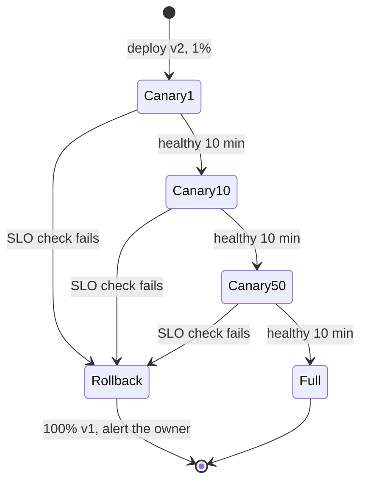
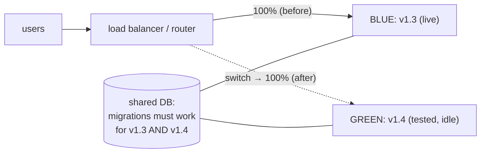
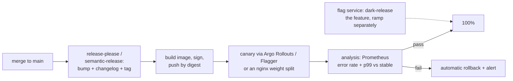

# Chapter 6 — Packaging & Release Engineering

> **Volume 2 — Software Engineering** · [Contents](index.md) · ← [Chapter 5 — CI/CD](ch05-ci-cd.md) · Next → [Chapter 7 — Code Reviews](ch07-code-reviews.md)

---

## Concept

Versioning, changelogs, artifacts, feature flags, and progressive delivery (blue-green, canary, rollbacks).

**In one sentence:** release engineering turns a green commit into a versioned, traceable artifact and gets it in front of users gradually — separating *deploying* code from *releasing* features with flags, and always keeping a fast way back.

**Mental model — a new recipe in a restaurant chain.** You package the recipe with a version number and a list of what changed (artifact + changelog). You try it in one branch first (canary), watching complaints. If fine, you roll out to all branches; if not, you go back to the old recipe tonight (rollback). A feature flag is a laminated card at each counter saying "offer the new dish: yes/no" — you can flip it without re-printing menus.

**Artifacts**

| Ecosystem | Build | Artifact | Registry |
|-----------|-------|----------|----------|
| Python | `uv build` / `poetry build` | wheel (`.whl`) + sdist | PyPI, a private index (devpi, Artifactory) |
| Rust | `cargo package` / `cargo build --release` | `.crate` / a binary | crates.io |
| Node | `npm pack` | tarball | npm |
| Services | `docker build` | OCI image, addressed by **digest** | GHCR, ECR, Artifact Registry |

Good artifacts are **immutable** (a version is never overwritten), **reproducible** (same source → same bytes), **traceable** (version → commit SHA), and **verifiable** (signature + SBOM, e.g. `cosign`, SLSA provenance).

**Versioning** — SemVer for libraries ([Vol 1 Ch 21](../volume-1-cs-foundations/ch21-build-systems-and-package-management.md)); for services, calendar versions or build numbers plus the git SHA are common. Automate the bump from Conventional Commits ([Ch 1](ch01-professional-git-workflow.md)) and generate the changelog.

**Deploy ≠ release**

| | Deploy | Release |
|-|--------|---------|
| Means | new code is running on servers | users can see or use the feature |
| Controlled by | the pipeline | **feature flags** / config |
| Undo | rollback (minutes) | flip the flag (seconds) |

**Feature flags**

| Kind | Life | Example |
|------|------|---------|
| Release toggle | days–weeks, then **delete** | hide the new checkout until it's ready |
| Experiment (A/B) | weeks | 50% see variant B |
| Ops / **kill switch** | long-lived | turn off recommendations if the service struggles |
| Permission | long-lived | premium-only features |

Flag hygiene: an owner and expiry per flag, default to the safe value when the flag service is down, test both paths, and remove dead flags (they are technical debt).

**Progressive delivery strategies**

| Strategy | How | Rollback | Cost | Risk |
|----------|-----|----------|------|------|
| Recreate | stop old, start new | redeploy old | cheap | downtime |
| Rolling | replace instances a few at a time | roll back the same way | cheap | mixed versions during the rollout |
| **Blue-green** | a full parallel environment; switch traffic at once | switch back instantly | 2× capacity during a release | all users hit the new version at once |
| **Canary** | send 1% → 10% → 50% → 100% of traffic to the new version while comparing metrics | shift traffic back | small extra | tiny blast radius; needs good metrics |
| Shadow / dark launch | copy real traffic to the new version; discard its responses | n/a | extra capacity | none for users; watch side effects |

**Rollback readiness** — keep the previous artifact; make DB migrations backward compatible (**expand → migrate → contract**, so old and new code both work mid-rollout); automate the trigger (error rate or latency above the baseline → roll back); practice it.

---

## Prereqs

* [Chapter 5 — CI/CD](ch05-ci-cd.md)

---

## Diagram

**A canary ramp: 1% → 10% → 100% with a rollback trigger**

```
 traffic to v2
 100% ┤                                   ██████████  promote
  50% ┤                        ███████████
  10% ┤             ███████████
   1% ┤  ███████████
   0% ┼──────────────────────────────────────────────► time
      │  each step: hold 10 min, compare v2 vs v1:
      │    error rate ≤ baseline + 0.5 pp?   p99 ≤ baseline × 1.1?
      │  any check fails ──► ROLLBACK: 0% to v2 in seconds
```



**Blue-green**



**Expand → migrate → contract (a safe schema change for renaming a column)**

```
 release 1 (expand):   add new column full_name; write to both; read old
 backfill:             copy name → full_name for existing rows
 release 2 (migrate):  read full_name; still write both
 release 3 (contract): stop writing name; later drop it
 at every step, the previous release still works → rollback is always safe
```

---

## Example

```bash
uv build                                           # dist/mylib-1.4.0-py3-none-any.whl
uv publish --publish-url http://localhost:3141/root/dev/   # a local devpi index
cargo package && cargo publish --dry-run
docker build -t ghcr.io/acme/api:1.4.0 . && docker push ghcr.io/acme/api:1.4.0
cosign sign ghcr.io/acme/api@sha256:3f9a…          # sign the digest, not the tag
```

```python
# A feature flag with a kill switch and a safe default (OpenFeature-style API)
from openfeature import api
client = api.get_client()

def checkout(cart, user):
    if client.get_boolean_value("new-checkout", False, evaluation_context_for(user)):
        return new_checkout(cart)          # released gradually: 5% → 50% → 100%
    return old_checkout(cart)

def recommendations(user):
    if not client.get_boolean_value("recs-enabled", True):   # kill switch for ops
        return []                           # graceful degradation
    return recs_service.for_user(user)
```

```yaml
# Argo Rollouts canary (Kubernetes) with automatic analysis
apiVersion: argoproj.io/v1alpha1
kind: Rollout
metadata: { name: api }
spec:
  strategy:
    canary:
      steps:
        - setWeight: 1
        - pause: { duration: 10m }
        - analysis: { templates: [{ templateName: error-rate }] }   # fails → automatic abort
        - setWeight: 10
        - pause: { duration: 10m }
        - setWeight: 50
        - pause: { duration: 10m }
```

---

## Exercises

1. Package a library and publish it to a local index.

   <details><summary>Solution</summary>Run a local devpi (or <code>pypiserver</code>), build with <code>uv build</code>, publish with <code>uv publish --publish-url …</code>, then in a fresh venv <code>pip install --index-url … mylib==1.4.0</code>. Try to re-publish 1.4.0 with a change and see it refused — versions must be immutable.</details>

2. Implement a feature flag with a kill switch.

   <details><summary>Solution</summary>A tiny flag store (a JSON file or Redis) read with a short cache; <code>is_enabled(name, user)</code> with percentage rollout via <code>hash(user_id + flag) % 100 &lt; pct</code> (sticky per user); a default when the store is unreachable; a kill-switch flag defaulting to "on" that ops can flip to disable an expensive feature. Test both code paths.</details>

3. A canary at 10% shows the same error rate but p99 latency up 40%. Roll back or not?

   <details><summary>Solution</summary>Roll back, or at least stop the ramp. Latency is a user-facing signal and a regression that large will likely burn the SLO at 100%. Investigate with traces from the canary pods, fix, and ramp again. Define this as an automatic analysis rule so the decision isn't made under pressure.</details>

---

## Mini project

**A release pipeline with version bump, artifact, canary deploy, and rollback.**



**Steps**

1. Automate the version and changelog from Conventional Commits.
2. Build an immutable, signed image; record digest → version → commit.
3. Canary on kind with Argo Rollouts (or two nginx upstreams with weights you script).
4. Analysis queries compare canary vs stable; abort automatically on failure.
5. Put one feature behind a flag; deploy it dark, then ramp the flag separately from the deploy.
6. Release a deliberately broken version (it returns 500 for 20% of requests) and show the automatic rollback.

**Done when:** a good release reaches 100% hands-off, a bad release is rolled back automatically within one analysis step, and you can turn the flagged feature off in seconds.

---

## Open source

* [`open-feature/open-feature`](https://github.com/open-feature/open-feature) — a vendor-neutral feature-flag API and SDKs (providers for flagd, LaunchDarkly, Unleash, and others).
* [`semver/semver`](https://github.com/semver/semver) — the Semantic Versioning spec. See also `argoproj/argo-rollouts` and `fluxcd/flagger` for canaries on Kubernetes.

---

## Interview

1. **"Blue-green vs canary?"**
   <details><summary>Answer</summary>Blue-green runs two full environments and switches all traffic at once: rollback is instant, and the new version can be fully tested before the switch, but capacity doubles during releases and every user hits the new version together. Canary shifts a small, growing share of traffic while comparing metrics against the stable version: a tiny blast radius and data-driven promotion, but it needs good metrics and routing, and both versions run side by side (so compatibility matters). Many teams use both: a canary inside a blue-green switch.</details>

2. **"Why feature flags for releases?"**
   <details><summary>Answer</summary>They decouple deploying from releasing. Code can merge and deploy continuously while hidden (trunk-based development). Features can be rolled out gradually, per segment, or as experiments. Kill switches give instant mitigation without a deploy. Risky changes can be tested in production with internal users first. The costs are flag debt and combinatorial paths, so flags need owners, expiries, and cleanup.</details>

---

## Checklist

- [ ] automate versioning
- [ ] ship behind flags
- [ ] always be able to roll back

---

> [Contents](index.md) · ← [Chapter 5 — CI/CD](ch05-ci-cd.md) · Next → [Chapter 7 — Code Reviews](ch07-code-reviews.md)
