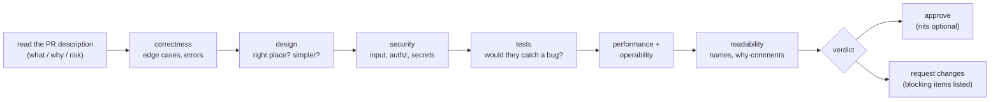
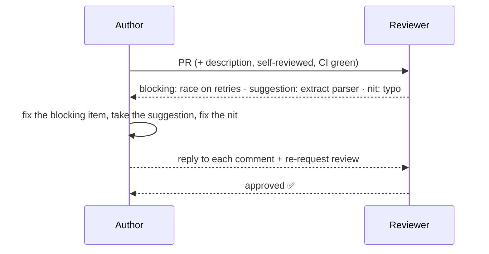
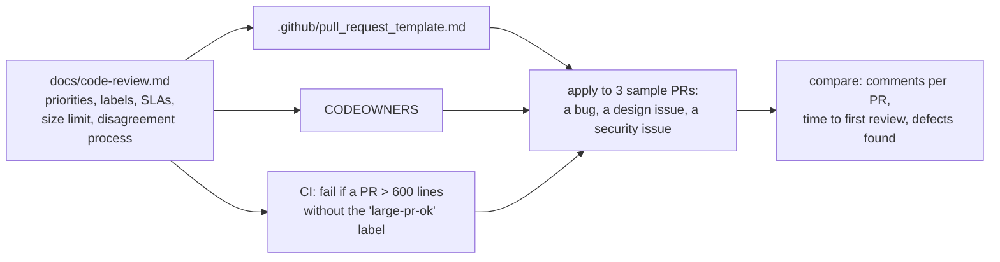

# Chapter 7 — Code Reviews

> **Volume 2 — Software Engineering** · [Contents](index.md) · ← [Chapter 6 — Packaging & Release Engineering](ch06-packaging-and-release-engineering.md) · Next → [Chapter 8 — Static Analysis & Type Safety at Scale](ch08-static-analysis-and-type-safety-at-scale.md)

---

## Concept

Reviewing for correctness, maintainability, security, and performance; giving and receiving feedback effectively.

**In one sentence:** a code review is a second pair of eyes that asks "is this correct, is it understandable, is it safe, and will we be glad we merged it in a year?" — delivered as specific, kind, prioritized feedback on a change small enough to actually read.

**Mental model — an editor, not a judge.** A good book editor doesn't rewrite the author's voice or nitpick commas that a spell checker would catch. They catch plot holes (bugs), confusing chapters (unclear design), and missing pages (missing tests) — and they explain *why*. The goal is a better book, not a winner.

**What to look for, in priority order**

| # | Area | Questions |
|:-:|------|-----------|
| 1 | **Correctness** | Does it do what the PR says? Edge cases: empty, null, huge, concurrent, retries, time zones? Error paths? |
| 2 | **Design** | Is this the right place for this code? Right abstraction? Does it fit the architecture? Simpler options? |
| 3 | **Security** | Input validated? Injection? Authorization checked (not just authentication)? Secrets? PII in logs? |
| 4 | **Tests** | Do tests cover the behavior and the edge cases? Would they fail if the code were wrong? |
| 5 | **Performance** | N+1 queries? Unbounded loops or memory? Missing indexes? Hot-path allocations? |
| 6 | **Operability** | Logs, metrics, feature flag, migration safety, rollback plan? |
| 7 | **Readability** | Names, comments on *why*, function size, dead code |
| 8 | Style | only what tools don't already enforce — which should be almost nothing ([Ch 8](ch08-static-analysis-and-type-safety-at-scale.md)) |

**For authors**

* **Keep PRs small**: aim under ~400 changed lines; review quality drops sharply beyond that. Split refactors from behavior changes.
* Write a description: *what*, *why*, *how to test*, screenshots, risks, rollout plan.
* Self-review the diff before requesting review.
* Respond to every comment (fixed / disagree with a reason / follow-up ticket).

**For reviewers**

* Review within a working day; speed matters as much as depth.
* **Label severity**: `blocking:` (must fix), `suggestion:`, `nit:`, `question:`, `praise:`.
* Comment on the code, not the person: "this function is hard to follow" not "you wrote this badly".
* Explain *why* and, where possible, offer an alternative.
* Approve with minor nits instead of another round trip.

**Disagreements** — take it to a call after two rounds of back-and-forth; decide by the team's written guidelines or by the code owner; record significant design decisions in an ADR; "disagree and commit" once decided.

---

## Prereqs

* [Vol 1 Ch 22 — Clean Code & Refactoring](../volume-1-cs-foundations/ch22-clean-code-and-refactoring.md)

---

## Diagram

**A review checklist flow**



**PR size vs review quality**

```
 defects found per 100 lines reviewed
   ▲
   │██
   │██ ██
   │██ ██ ██
   │██ ██ ██ ▅▅
   │██ ██ ██ ██ ▃▃ ▂▂ ▁▁
   └──────────────────────────► lines changed in the PR
    100 200 300 400 600 800 1000+
   "looks good to me" usually means "too big to read"
```

**The feedback lifecycle**



---

## Example

**A PR comment separating "must fix" from "nice to have"**

```text
blocking: `apply_coupon` can be called twice if the client retries after a timeout
(both requests see `used=false` before either writes). That would let one coupon
be used twice. Could we make the update conditional —
`UPDATE coupons SET used = true WHERE code = %s AND used = false` — and treat
0 rows updated as "already used"? A test with two concurrent calls would lock this in.

suggestion (non-blocking): the parsing on lines 40–72 is doing three things.
Extracting `parse_coupon_code()` would make the happy path easier to read.
Fine as a follow-up.

nit: `amt` → `amount_cents` so the unit is obvious.

praise: really nice test names — `test_expired_coupon_is_rejected_with_410`
told me exactly what the behavior is.
```

**A PR description template**

```markdown
## What
Allow percentage coupons at checkout (capped at 50%).

## Why
Marketing campaign in June; see #482 and ADR 0012 (cap rationale).

## How to test
1. `make dev` · 2. Create coupon `SUMMER20` in the admin · 3. Checkout → 20% off.

## Risk / rollout
Behind the flag `coupons-v2` (off). Migration adds a nullable column (expand-only).
Rollback: flag off; the column is unused by old code.
```

---

## Exercises

1. Review a PR with a bug and write actionable feedback.

   ```python
   def average_order_value(orders):
       total = 0
       for o in orders:
           if o.status == "paid":
               total += o.amount
       return total / len(orders)
   ```

   <details><summary>Solution</summary><code>blocking:</code> the divisor counts <i>all</i> orders, but the total counts only paid ones, so the average is understated whenever there are unpaid orders; it also raises <code>ZeroDivisionError</code> for an empty list. Suggest: <code>paid = [o.amount for o in orders if o.status == "paid"]; return sum(paid) / len(paid) if paid else 0</code>, plus tests for an empty list and mixed statuses. <code>nit:</code> use money in integer cents.</details>

2. Fix a PR based on review comments and re-request.

   <details><summary>Solution</summary>Address the blocking items first, in separate commits for easier re-review (<code>fix: guard empty list</code>). Reply to each thread: "Done in abc123", or "I'd prefer X because Y — happy to discuss", or "Good idea, filed #512 for a follow-up". Re-request review only when all threads have a response and CI is green.</details>

3. A reviewer leaves 30 style comments on spacing and quotes. What's the systemic fix?

   <details><summary>Solution</summary>Adopt an automatic formatter and linter with the team's agreed config, run it in pre-commit hooks and CI, and agree that humans don't comment on anything the tools enforce. Review time then goes to correctness and design.</details>

---

## Mini project

**Establish a review checklist and apply it to a real (or sample) PR.**



**Steps**

1. Write a one-page review guide: priorities (the table above), comment labels, a response-time target, the size guideline, and how disagreements are resolved.
2. Add a PR template and `CODEOWNERS`.
3. A small CI check that warns on very large PRs.
4. Create 3 sample PRs with seeded problems (an off-by-one, a SQL injection, a misplaced abstraction) and review them using the guide.
5. Measure time to first review and blocking issues found; adjust the guide.

**Done when:** your guide fits on one page, the seeded problems are all found using it, and the template makes authors state risk and rollback.

---

## Open source

* [`google/eng-practices`](https://github.com/google/eng-practices) — Google's public code review guide: "The Standard of Code Review", "What to look for", and "How to write code review comments". Short and excellent.

---

## Interview

1. **"What do you look for in a code review?"**
   <details><summary>Answer</summary>In priority order: correctness (does it do what's claimed, including edge cases and error paths), design (right place and abstraction, simplest option), security (validation, authorization, secrets), tests (would they catch a regression), performance and operability (queries, memory, logs, metrics, migration and rollback safety), then readability. Style is left to automated tools.</details>

2. **"How do you handle disagreeing reviewers?"**
   <details><summary>Answer</summary>Assume good intent and look for the underlying concern. Separate preference from principle: preferences go to the author's choice or team conventions. After a couple of written rounds, talk synchronously. If still stuck, the code owner or tech lead decides, guided by written standards, and significant architectural decisions get an ADR. Then disagree and commit — and revisit with data later if needed.</details>

---

## Checklist

- [ ] review for bugs, not just style
- [ ] keep PRs small
- [ ] give actionable, non-personal feedback

---

> [Contents](index.md) · ← [Chapter 6 — Packaging & Release Engineering](ch06-packaging-and-release-engineering.md) · Next → [Chapter 8 — Static Analysis & Type Safety at Scale](ch08-static-analysis-and-type-safety-at-scale.md)
