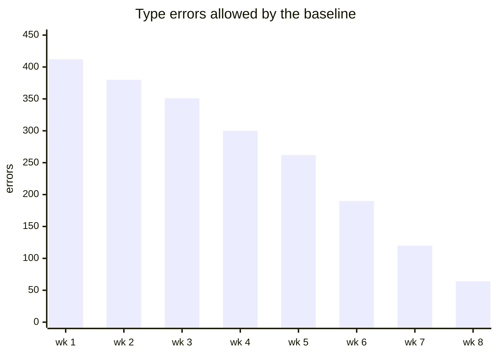
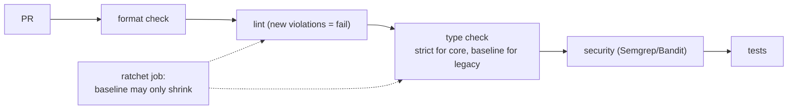
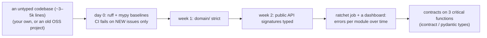

# Chapter 8 — Static Analysis & Type Safety at Scale

> **Volume 2 — Software Engineering** · [Contents](index.md) · ← [Chapter 7 — Code Reviews](ch07-code-reviews.md) · Next → [Chapter 9 — Performance Engineering](ch09-performance-engineering.md)

---

## Concept

Linters/formatters/type checkers as CI gates; gradually typing a legacy codebase; design-by-contract.

**In one sentence:** at team scale, static analysis stops being a personal preference and becomes infrastructure — enforced in CI, adopted gradually with baselines so legacy code doesn't block progress, and complemented by contracts that state what each function promises.

**Mental model — renovating a lived-in house.** You can't close the whole house to rewire it. You rewire one room at a time (module by module), put a "new wiring only" rule on every *new* room (baseline: no new violations), and mark rooms as done so no one un-does them (a strictness ratchet). Meanwhile, building codes (contracts) say what every socket must deliver.

This chapter covers **adoption at scale**. For the tools themselves (ruff, mypy, formatters, what each catches), see [Vol 1 Ch 28](../volume-1-cs-foundations/ch28-static-analysis-linters-formatters-and-type-checkers.md).

**Gradual adoption strategies**

| Strategy | How | Good for |
|----------|-----|----------|
| **Baseline** | record today's violations in a file; CI fails only on *new* ones | turning on a linter or checker in a big codebase on day one |
| **Ratchet** | the count of allowed violations may only go down; lower the baseline as you fix | steady progress without big-bang PRs |
| **Per-module strictness** | strict config for new or core packages; lenient for legacy (`[[tool.mypy.overrides]]`) | a typed core with untyped edges |
| **Type the public API first** | annotate function signatures at module boundaries | biggest payoff: callers get checked |
| Stubs for third-party code | `types-*` packages, `.pyi` stubs, `py.typed` | removing `Any` from dependencies |
| Codemods / auto-annotation | `MonkeyType`, `pyannotate`, `ruff --fix` | bootstrapping types from real runs |

**What static tools catch that tests don't**

| Static analysis | Tests |
|-----------------|-------|
| every path, including the ones no test exercises | only the paths you wrote tests for |
| `None` where a value is required, wrong argument types, typos in attribute names | whatever the inputs happen to trigger |
| unreachable code, unused variables, shadowed names | — |
| all callers of a changed signature, across the codebase | only the callers that have tests |
| cannot check *behavior* ("is the discount correct?") | checks behavior |

Use both: types prove the *shape* is right everywhere; tests prove the *behavior* is right for chosen cases.

**Design by contract** — make a function's promises explicit and checked:

| Part | Meaning | How |
|------|---------|-----|
| Precondition | what must be true on entry | validate inputs, `assert`, `icontract.require`, types like `PositiveInt` |
| Postcondition | what the function guarantees on exit | `icontract.ensure`, property tests |
| Invariant | always true for an object | class invariants, `__post_init__` checks, database constraints |

"Parse, don't validate": turn unchecked input into a type that *can only* hold valid values (`Email`, `Money`), so later code can't receive invalid data at all.

---

## Prereqs

* [Vol 1 Ch 28 — Static Analysis: Linters, Formatters & Type Checkers](../volume-1-cs-foundations/ch28-static-analysis-linters-formatters-and-type-checkers.md)

---

## Diagram

**A gradual-typing adoption map (typed core vs untyped edges)**

```
 ┌──────────────────────────────────────────────────────────────┐
 │ legacy/  (untyped, baseline: 412 errors, ratchet ↓ each sprint)│
 │   ┌──────────────────────────────────────────────────┐       │
 │   │ services/  (typed signatures; mypy default)      │       │
 │   │   ┌────────────────────────────────────┐         │       │
 │   │   │ domain/ + api/  (mypy --strict ✓)   │         │       │
 │   │   │  Money, Order, public API models    │         │       │
 │   │   └────────────────────────────────────┘         │       │
 │   └──────────────────────────────────────────────────┘       │
 └──────────────────────────────────────────────────────────────┘
   strictness grows from the core outward; new code is always strict
```

**The ratchet over time**



**Static gates in the pipeline**



---

## Example

```toml
# pyproject.toml — strict core, lenient legacy
[tool.mypy]
python_version = "3.12"
warn_unused_ignores = true
warn_redundant_casts = true

[[tool.mypy.overrides]]
module = ["acme.domain.*", "acme.api.*"]
strict = true

[[tool.mypy.overrides]]
module = ["acme.legacy.*"]
ignore_errors = true            # temporarily; tracked by the ratchet

[tool.ruff.lint]
select = ["E", "F", "B", "I", "UP", "S", "SIM", "ANN"]
[tool.ruff.lint.per-file-ignores]
"acme/legacy/**" = ["ANN"]      # don't require annotations in legacy yet
"tests/**" = ["S101"]           # allow assert in tests
```

```bash
# Baseline + ratchet for mypy (the same idea works for any linter)
mypy src > .mypy-baseline.txt || true                 # record once
# CI:
mypy src | sort > /tmp/now.txt || true
comm -13 <(sort .mypy-baseline.txt) /tmp/now.txt > /tmp/new.txt
test ! -s /tmp/new.txt || { echo "New type errors:"; cat /tmp/new.txt; exit 1; }
test "$(wc -l < /tmp/now.txt)" -le "$(wc -l < .mypy-baseline.txt)"   # the count may only go down
```

```python
# "Parse, don't validate" + contracts
from dataclasses import dataclass
from typing import NewType
import icontract

@dataclass(frozen=True)
class Money:
    cents: int
    currency: str
    def __post_init__(self):                          # invariant
        if self.cents < 0: raise ValueError("negative money")
        if len(self.currency) != 3: raise ValueError("ISO 4217 code expected")

Percent = NewType("Percent", int)

@icontract.require(lambda pct: 0 <= pct <= 50, "discount capped at 50%")
@icontract.ensure(lambda price, result: result.cents <= price.cents)
def discount(price: Money, pct: Percent) -> Money:
    return Money(price.cents * (100 - pct) // 100, price.currency)
```

```rust
#![deny(warnings)]                 // every compiler warning fails the build
#![deny(clippy::unwrap_used)]      // no unwrap() in production code
```

---

## Exercises

1. Add a type checker to a legacy module and fix the findings.

   <details><summary>Solution</summary>Run <code>mypy</code> on the module and record the baseline. Fix in order of value: public function signatures, <code>Optional</code> handling (add <code>None</code> checks), dict soup → <code>TypedDict</code> or dataclasses, then internals. Each fix PR lowers the baseline. Enable <code>strict</code> for that module when it reaches zero, so it can't regress.</details>

2. Configure a linter rule set for a team.

   <details><summary>Solution</summary>Start from correctness rules that almost everyone agrees on (pyflakes <code>F</code>, bugbear <code>B</code>, security <code>S</code>), add import sorting and pyupgrade, and let the formatter own layout. Document the rule set and the process for changing it (a PR plus a short rationale). Use per-file ignores for tests and legacy instead of disabling rules globally. Run the same config in the editor, pre-commit, and CI.</details>

3. Why is `warn_unused_ignores = true` important during a gradual migration?

   <details><summary>Solution</summary>As code gets typed, many <code># type: ignore</code> comments stop being needed. Unused ignores silently hide <i>future</i> errors on those lines. The warning forces their removal, so the escape hatches shrink along with the baseline.</details>

---

## Mini project

**Introduce strict static analysis to a small codebase with a baseline + incremental adoption.**



**Steps**

1. Pick a codebase; measure the starting counts per tool and module.
2. Add the baseline mechanism to CI so the team can adopt it on day one without fixing everything.
3. Make one core package fully strict; add a `py.typed` marker if it's a library.
4. Add the ratchet check and a small script that charts remaining errors per module.
5. Add contracts or "parse, don't validate" types to 3 critical functions, with tests for their violations.
6. Write a one-page adoption guide for the team.

**Done when:** new code can't add violations, at least one package is strict, the chart shows the baseline shrinking, and contracts catch invalid inputs at the boundary.

---

## Open source

* [`python/mypy`](https://github.com/python/mypy) — see the docs "Using mypy with an existing codebase" (the official gradual-adoption guide) and `--strict` flags.
* [`astral-sh/ruff`](https://github.com/astral-sh/ruff) — `--add-noqa` to create a baseline in one command; per-file ignores; very fast on large repos. See also Dropbox's and Instagram's write-ups on typing millions of lines of Python.

---

## Interview

1. **"How do you adopt typing in a large codebase?"**
   <details><summary>Answer</summary>Incrementally: turn the checker on with a baseline so only new errors fail CI; require types on all new code; type public interfaces and core domain modules first; make modules strict once clean and ratchet the baseline down; add stubs for dependencies; use auto-annotation tools to bootstrap; and track progress per module. Avoid big-bang rewrites — they stall and conflict with ongoing work.</details>

2. **"What do static tools catch that tests don't?"**
   <details><summary>Answer</summary>Issues on paths no test executes: <code>None</code> dereferences, wrong argument types or counts, misspelled attributes, unreachable code, unhandled enum cases, and every call site broken by a signature change — across the whole codebase in seconds. Tests can't enumerate all paths; types prove structural consistency everywhere. They don't check behavior, which is what tests are for.</details>

---

## Checklist

- [ ] gate on static analysis in CI
- [ ] type the public API first
- [ ] let tools, not humans, enforce style

---

> [Contents](index.md) · ← [Chapter 7 — Code Reviews](ch07-code-reviews.md) · Next → [Chapter 9 — Performance Engineering](ch09-performance-engineering.md)
