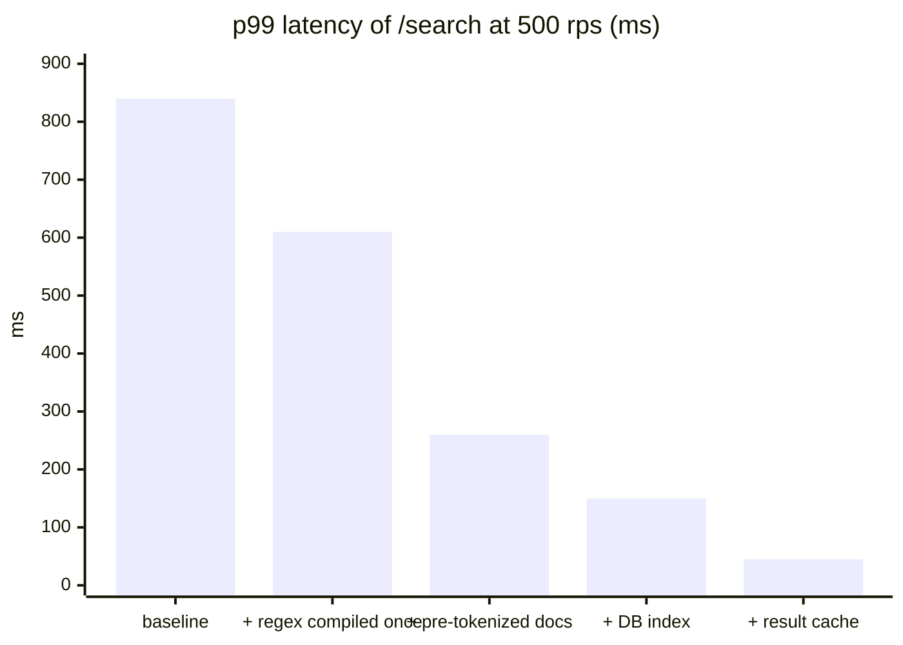
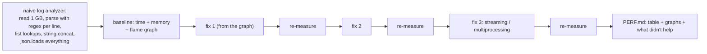

# Chapter 9 — Performance Engineering

> **Volume 2 — Software Engineering** · [Contents](index.md) · ← [Chapter 8 — Static Analysis & Type Safety at Scale](ch08-static-analysis-and-type-safety-at-scale.md) · Next → [Chapter 10 — Security & Threat Modeling](ch10-security-and-threat-modeling.md)

---

## Concept

Profiling-driven optimization, benchmarking, caching strategies, and avoiding premature optimization.

**In one sentence:** performance engineering is a loop — set a target, measure where time actually goes, fix the biggest real bottleneck, prove the gain with a trustworthy benchmark, and stop when the target is met.

**Mental model — a traffic jam.** Widening a road that's already empty doesn't help; only the bottleneck matters. If 80% of travel time is spent at one broken traffic light, repaving the rest of the road is wasted effort. Profilers show you the broken light. Benchmarks prove the repair worked.

**The loop**

```
 1. define the goal     "p99 of /search < 200 ms at 500 rps"   (not "make it faster")
 2. measure end to end  load test + traces: where is the time?  (CPU? DB? network? locks?)
 3. profile the hot path  flame graph of the slow component
 4. hypothesize + change ONE thing
 5. benchmark           before/after, repeated runs, statistics
 6. verify in production-like conditions; keep a regression benchmark in CI
 7. goal met? stop.     otherwise → 2
```

**Where time usually goes (check in this order)**

| Suspect | Symptom | Typical fix |
|---------|---------|-------------|
| I/O waits: DB, network, disk | low CPU, high latency; long spans on DB/HTTP | fix N+1 queries, add indexes ([Vol 1 Ch 46](../volume-1-cs-foundations/ch46-schema-design-normalization-and-indexing.md)), batch, cache, parallelize calls, connection pools |
| Algorithmic complexity | time grows super-linearly with input size | a better algorithm or data structure (O(n²) → O(n log n); list → set) |
| Contention | throughput plateaus as you add threads; lock wait time | shard locks, reduce critical sections, lock-free or per-thread state |
| Memory / GC | GC pauses, high allocation rate, swapping | fewer allocations, object reuse, streaming instead of loading all |
| CPU hot loops | high CPU; one function dominates the flame graph | vectorize (NumPy), move to Rust/C, reduce work per item |
| Serialization | JSON encode/decode in the flame graph | faster libraries (`orjson`), binary formats, smaller payloads |

**Latency vs throughput** — latency is how long one request takes (report p50, **p95, p99**, not averages); throughput is requests per second. Queueing theory: as utilization approaches 100%, latency explodes, so leave headroom (~60–70% utilization for latency-sensitive services).

**Benchmarking with rigor**

| Rule | Why |
|------|-----|
| Warm up first | JITs, caches, and connection pools distort the first runs |
| Run many iterations; report the distribution and a confidence interval | single runs are noise |
| Control the environment: same machine, CPU frequency pinned, nothing else running | noise hides small real differences |
| Benchmark realistic data sizes and distributions | a 10-element test says nothing about 10M |
| Prevent dead-code elimination (`black_box`) | the compiler may delete the work you're timing |
| Compare A/B with a statistical test | criterion and pyperf report significance |
| Keep benchmarks in CI with thresholds | catch regressions early |

**Premature optimization** — Knuth's full quote: "We should forget about small efficiencies, say about 97% of the time: premature optimization is the root of all evil. Yet we should not pass up our opportunities in that critical 3%." Optimization is premature when there's no measured problem, no target, and the change costs readability. It is *not* premature to choose sane data structures, avoid N+1 queries, or design for known scale.

---

## Prereqs

* [Vol 1 Ch 27 — Debugging & Profiling](../volume-1-cs-foundations/ch27-debugging-and-profiling.md)

---

## Diagram

**A flame graph pointing at the hot path**

```
 ┌─────────────────────────────────────────────────────────────────────────┐
 │ handle_search (100%)                                                    │
 ├───────────────────────────────────────────────────────┬─────────────────┤
 │ rank_results (72%)                                    │ fetch_docs (24%)│
 ├──────────────────────────────────────────┬────────────┼─────────────────┤
 │ score (61%)                              │ sort (9%)  │ db.query (22%)  │
 ├──────────────────────────────────────────┤            └─────────────────┘
 │ tokenize (48%)  ← re-tokenizes every doc │
 │   re.findall — compiled on every call    │   fix: pre-tokenize at index time
 └──────────────────────────────────────────┘        + compile the regex once
```

**A benchmark comparison chart**



**Latency vs utilization (why headroom matters)**

```
 latency
   ▲                                          │
   │                                          │
   │                                        ╱
   │                                     ╱
   │                                ╱
   │                      ____----
   │__________-------‾‾‾‾
   └──────────────────────────────────────────► utilization
   0%          50%         70%        90%  100%
```

---

## Example

```bash
# 1. Measure end to end
k6 run --vus 100 --duration 2m search.js          # p95/p99 and rps
# 2. Profile the running service (no code changes needed)
py-spy record -o flame.svg --pid $(pgrep -f uvicorn) --duration 30
perf record -g -p <pid> -- sleep 30 && perf script | stackcollapse-perf.pl | flamegraph.pl > cpu.svg
```

```python
# Before: the regex is compiled and the docs re-tokenized on every request
import re
def score(query, doc):
    words = set(re.findall(r"\w+", doc.lower()))
    return sum(w in words for w in re.findall(r"\w+", query.lower()))

# After: compile once; tokenize documents once at index time
WORD = re.compile(r"\w+")
def tokenize(s): return frozenset(WORD.findall(s.lower()))
INDEX = {doc_id: tokenize(text) for doc_id, text in corpus.items()}   # built once
def score_fast(query_tokens, doc_tokens): return len(query_tokens & doc_tokens)
```

```python
# A benchmark with statistics (pytest-benchmark, or pyperf for serious work)
def test_score_speed(benchmark):
    q = tokenize("fast red running shoes")
    result = benchmark(lambda: [score_fast(q, t) for t in INDEX.values()])
    assert result                         # prevents "optimizing away" the work
# pytest --benchmark-compare --benchmark-compare-fail=mean:10%   ← fail CI on a 10% regression
```

```rust
// criterion.rs: warm-up, many samples, confidence intervals, change detection
use criterion::{black_box, criterion_group, criterion_main, Criterion};
fn bench(c: &mut Criterion) {
    let data: Vec<u64> = (0..100_000).collect();
    c.bench_function("sum", |b| b.iter(|| black_box(&data).iter().sum::<u64>()));
}
criterion_group!(benches, bench);
criterion_main!(benches);
// output: time: [41.2 µs 41.5 µs 41.9 µs]  change: -38.1% (p = 0.00 < 0.05) Performance has improved.
```

---

## Exercises

1. Profile a slow service and optimize the real bottleneck.

   <details><summary>Solution</summary>Load test to reproduce the slowness and record p99. Look at traces first: if most time is in DB spans, it's I/O (check for N+1 queries and missing indexes). If CPU-bound, take a flame graph and look at the widest frames. Change one thing, re-measure the same way, and keep the change only if the target metric improved. Record before and after numbers in the PR.</details>

2. Write a benchmark that proves an optimization helps.

   <details><summary>Solution</summary>Use pytest-benchmark, pyperf, or criterion with realistic input sizes; warm up; run enough rounds for a tight confidence interval; compare against the saved baseline and check the change is statistically significant; guard against dead-code elimination. Commit the benchmark so CI can detect future regressions.</details>

3. A teammate proposes rewriting a service in Rust "for performance". What do you ask first?

   <details><summary>Solution</summary>What's the target and the current measurement? Where does the time go — if 90% is waiting on the database, a faster language changes almost nothing. Have cheaper fixes (queries, caching, algorithms) been tried? What does the rewrite cost in time and risk? A profile should drive the decision.</details>

---

## Mini project

**Take a naive implementation, profile it, optimize it, and document the speedup with benchmarks.**



**Steps**

1. Write (or take) a deliberately naive analyzer for a big log file with realistic inefficiencies.
2. Record the baseline: wall time, peak memory (`/usr/bin/time -v` or `memray`), and a flame graph.
3. Apply one optimization at a time, guided only by the profile; re-measure after each.
4. Include at least one change that *didn't* help, and say why (evidence beats intuition).
5. Add a benchmark to CI with a regression threshold.

**Done when:** `PERF.md` shows each step's measured effect (for example 10× total), with before/after flame graphs, and the CI benchmark catches a reintroduced slowdown.

---

## Open source

* [`google/benchmark`](https://github.com/google/benchmark) — a C++ microbenchmark library: repetitions, statistics, and `DoNotOptimize`.
* [`bheisler/criterion.rs`](https://github.com/bheisler/criterion.rs) — statistics-driven Rust benchmarking with change detection and HTML reports. See also Brendan Gregg's *Systems Performance* and the USE method.

---

## Interview

1. **"How do you find a performance bottleneck?"**
   <details><summary>Answer</summary>Start from a concrete goal and a reproducible load. Measure end to end with metrics and traces to see which component or dependency dominates latency. If it's a dependency (DB, network), inspect those calls: query plans, N+1 queries, round trips. If it's CPU, profile with a sampling profiler and read the flame graph for the widest frames. Check for contention (lock waits) and GC. Change one thing and re-measure. Never guess.</details>

2. **"When is optimization premature?"**
   <details><summary>Answer</summary>When there's no measured problem or performance target, when the code isn't on a hot path, or when the change trades clarity for gains nobody needs. It's not premature to choose appropriate algorithms and data structures, avoid known anti-patterns (N+1 queries, unbounded loads), or design for known scale requirements — those are cheap early and expensive later.</details>

---

## Checklist

- [ ] measure before optimizing
- [ ] benchmark with statistical rigor
- [ ] optimize the hot path, not the noise

---

> [Contents](index.md) · ← [Chapter 8 — Static Analysis & Type Safety at Scale](ch08-static-analysis-and-type-safety-at-scale.md) · Next → [Chapter 10 — Security & Threat Modeling](ch10-security-and-threat-modeling.md)
