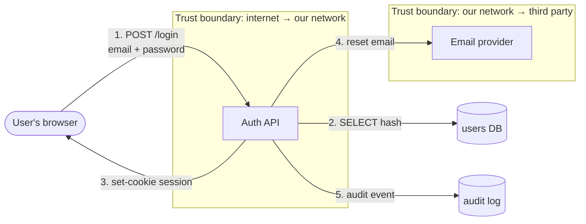
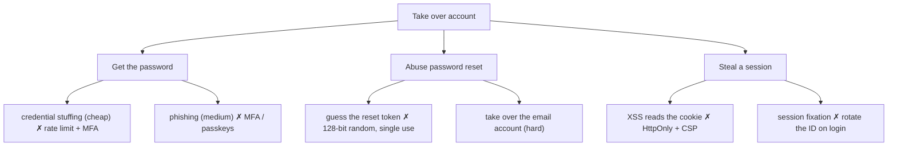
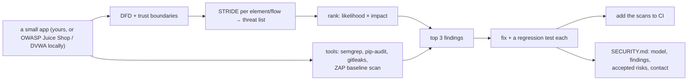

# Chapter 10 — Security & Threat Modeling

> **Volume 2 — Software Engineering** · [Contents](index.md) · ← [Chapter 9 — Performance Engineering](ch09-performance-engineering.md) · Next → [Chapter 11 — Licensing & OSS Compliance](ch11-licensing-and-oss-compliance.md)

---

## Concept

STRIDE/attack trees, the OWASP Top 10, secure defaults, secrets handling, and supply-chain security.

**In one sentence:** threat modeling is thinking like an attacker *before* building — draw how data flows, mark where trust changes hands, list what could go wrong at each boundary, and fix the most likely and damaging threats first — then back it up with secure defaults and a trustworthy supply chain.

**Mental model — securing a house.** You don't just buy a stronger front-door lock. You walk around the house: back door, windows, garage, the spare key under the mat, the delivery person you let in (trust boundaries). For each, you ask "how could someone get in, and how bad would it be?" — then fix the cheapest big risks first. Supply-chain security is checking that the locksmith himself is trustworthy.

**Threat modeling in four questions** (Shostack)

1. **What are we building?** — a data-flow diagram (DFD) with processes, data stores, external entities, flows, and **trust boundaries**.
2. **What can go wrong?** — apply STRIDE to every element and every flow that crosses a boundary.
3. **What are we going to do about it?** — mitigate, eliminate, transfer, or accept (documented).
4. **Did we do a good job?** — review, test, and update when the design changes.

**STRIDE**

| Threat | Violates | Example | Typical mitigation |
|--------|----------|---------|--------------------|
| **S**poofing | authentication | stolen session cookie; a fake webhook sender | MFA, secure cookies, signed webhooks, mTLS |
| **T**ampering | integrity | changing `price` in a request; editing data in transit | server-side validation, TLS, HMAC/signatures |
| **R**epudiation | non-repudiation | "I never made that transfer" | audit logs (append-only, timestamped, with user identity) |
| **I**nformation disclosure | confidentiality | IDOR (`/invoices/124` shows someone else's), verbose errors, PII in logs | authorization per object, least privilege, encryption, redaction |
| **D**enial of service | availability | huge uploads, expensive queries, login floods | rate limits, size limits, timeouts, quotas |
| **E**levation of privilege | authorization | a normal user calling an admin endpoint; injection → code execution | authz on every endpoint, deny by default, sandboxing |

**Attack trees** — put the attacker's goal at the root ("take over an account") and break it into ways to reach it (phish the password AND bypass MFA; OR reset the password via email takeover; OR steal a session…). Mark the cost or likelihood on each leaf; defend the cheapest paths.

**OWASP Top 10 (2021) at a glance**

| # | Category | One-line fix |
|:-:|----------|--------------|
| A01 | **Broken access control** (most common) | check authorization for every object and action on the server, deny by default |
| A02 | Cryptographic failures | TLS everywhere; strong algorithms; hash passwords with Argon2id/bcrypt; never roll your own crypto |
| A03 | **Injection** (SQL, OS command, XSS) | parameterized queries; no shell with user input; context-aware output encoding |
| A04 | Insecure design | threat model; abuse cases; secure defaults |
| A05 | Security misconfiguration | hardened defaults, no debug in prod, minimal permissions, security headers |
| A06 | Vulnerable and outdated components | dependency scanning, updates, SBOM |
| A07 | Identification and authentication failures | MFA, rate-limited logins, secure session handling |
| A08 | Software and data integrity failures | signed artifacts, verified updates, protected CI |
| A09 | Security logging and monitoring failures | log auth events and access denials; alert on them |
| A10 | Server-side request forgery (SSRF) | allow-list outbound destinations; block metadata IPs |

**Secure defaults** — deny by default; least privilege for every identity; secrets from a vault, rotated automatically ([Vol 1 Ch 25](../volume-1-cs-foundations/ch25-configuration-and-secrets-management.md)); validate on the server; fail closed; safe framework defaults (CSRF protection, auto-escaping templates, `HttpOnly; Secure; SameSite` cookies).

**Supply chain** — pin dependencies with a lockfile and hashes; scan (`pip-audit`, `osv-scanner`, Dependabot); watch for typosquatting; generate an SBOM; sign and verify artifacts (Sigstore/cosign); follow SLSA levels for build provenance; least-privilege CI tokens; pin actions to SHAs.

---

## Prereqs

* [Vol 1 Ch 25 — Configuration & Secrets Management](../volume-1-cs-foundations/ch25-configuration-and-secrets-management.md)
* [Vol 1 Ch 41 — Transport & Security: TCP, UDP, QUIC, TLS & HTTPS](../volume-1-cs-foundations/ch41-transport-and-security-tcp-udp-quic-tls.md)

---

## Diagram

**A data-flow diagram with trust boundaries and threat annotations** — a login flow



```
 flow / element           STRIDE threats                       mitigations
 1 POST /login            S: credential stuffing               rate limit per IP + account, breached-password check, MFA
                          T/I: sniffing                        TLS only, HSTS
                          D: login flood                       CAPTCHA after N failures, backoff
 2 users DB               I: SQL injection → dump hashes       parameterized queries; Argon2id hashes
 3 session cookie         S: stolen cookie (XSS)               HttpOnly, Secure, SameSite=Lax, short TTL, rotate on login
 4 reset email            S/E: account takeover via reset      single-use, 15-min, hashed token; don't reveal if the email exists
 5 audit log              R: "it wasn't me"                    append-only log with IP, user agent, outcome
```

**An attack tree: "take over a user account"**



---

## Example

```python
# SQL injection and the fix
def find_user_BAD(conn, email):
    return conn.execute(f"SELECT * FROM users WHERE email = '{email}'").fetchone()
# email = "x' OR '1'='1"  → returns the first user;  "x'; DROP TABLE users; --" → worse

def find_user(conn, email):
    return conn.execute("SELECT * FROM users WHERE email = %s", (email,)).fetchone()   # parameterized

# Broken access control (IDOR) and the fix
@app.get("/invoices/{invoice_id}")
def get_invoice_BAD(invoice_id: int, user=Depends(current_user)):
    return db.get_invoice(invoice_id)                           # any logged-in user can read any invoice

@app.get("/invoices/{invoice_id}")
def get_invoice(invoice_id: int, user=Depends(current_user)):
    inv = db.get_invoice(invoice_id)
    if inv is None or inv.account_id != user.account_id:        # authorize the OBJECT, not just the user
        raise HTTPException(404)                                # 404, so IDs can't be probed
    return inv

# Passwords
from argon2 import PasswordHasher
ph = PasswordHasher()                                          # Argon2id with sensible defaults
stored = ph.hash("correct horse battery staple")
ph.verify(stored, "correct horse battery staple")              # raises on mismatch

# OS command injection: never use shell=True with user input
import subprocess
subprocess.run(["convert", user_file, "out.png"], check=True, timeout=30)   # argument list, no shell
```

```bash
pip-audit                      # known vulnerabilities in dependencies
osv-scanner -r .
semgrep --config p/owasp-top-ten .
gitleaks detect                # committed secrets
syft . -o spdx-json > sbom.json && cosign sign-blob sbom.json
```

---

## Exercises

1. Threat-model a login flow and list mitigations.

   <details><summary>Solution</summary>See the DFD and STRIDE table above. Key outputs: rate limiting and breached-password checks (stuffing), MFA or passkeys (phishing), Argon2id hashing, parameterized queries, secure session cookies rotated on login, a single-use expiring reset token that doesn't reveal whether an email exists, generic error messages, and audit logging of login and reset events with alerts on anomalies.</details>

2. Find and fix an injection vulnerability.

   <details><summary>Solution</summary>Search for string-built queries or commands (<code>f"SELECT … {</code>, <code>+ request</code>, <code>shell=True</code>, <code>eval</code>). Prove it with a payload in a test (<code>' OR '1'='1</code>). Fix with parameterized queries, the ORM's query builder, or argument lists for subprocesses. Add a Semgrep rule to CI so the pattern can't return, and keep the payload test as a regression test.</details>

3. Why return 404 instead of 403 for another account's invoice?

   <details><summary>Solution</summary>A 403 confirms the resource exists, which lets attackers enumerate valid IDs. A 404 reveals nothing. (Also use non-sequential IDs such as UUIDs, but never rely on them instead of authorization checks.)</details>

---

## Mini project

**A security review of a small app: threat model + fix the top 3 findings.**



**Steps**

1. Draw the DFD (Mermaid is fine) with every trust boundary.
2. Walk STRIDE over each element and boundary-crossing flow; list the threats in a table.
3. Rank them by likelihood × impact; run automated scanners to find more.
4. Fix the top 3 (typically access control, injection, secrets/configuration); write a test that proves each is fixed.
5. Add the scanners to CI; write `SECURITY.md` with accepted risks and a disclosure contact.

**Done when:** each top finding has a failing-then-passing test, the scanners run on every PR, and the threat model is committed next to the code.

---

## Open source

* [`OWASP/CheatSheetSeries`](https://github.com/OWASP/CheatSheetSeries) — concise, practical guides: Authentication, Session Management, SQL Injection Prevention, Password Storage, Threat Modeling.
* [`OWASP/Top10`](https://github.com/OWASP/Top10) — the Top 10 with descriptions, examples, and prevention. See also Adam Shostack's *Threat Modeling* and the OWASP Threat Dragon tool.

---

## Interview

1. **"How do you threat-model a feature?"**
   <details><summary>Answer</summary>Diagram it: data flows, stores, external parties, and trust boundaries. For each element and each flow that crosses a boundary, apply STRIDE to list what could go wrong. Rank by likelihood and impact, then decide mitigations (or explicitly accept risks). Record it next to the design and turn mitigations into tickets and tests. Revisit when the design changes. Keep it lightweight — an hour with the right people at design time beats a big audit later.</details>

2. **"What's the most common web vuln and its fix?"**
   <details><summary>Answer</summary>Broken access control (OWASP A01): endpoints check that you're logged in but not that you may access <i>this</i> object or action (IDOR, missing admin checks, trusting client-side flags). Fix: enforce authorization on the server for every request and object, deny by default, centralize the policy, scope queries by tenant or owner, and test with other users' IDs. Injection is the classic runner-up, fixed with parameterized queries and output encoding.</details>

---

## Checklist

- [ ] draw trust boundaries
- [ ] parameterize all queries
- [ ] rotate secrets automatically

---

> [Contents](index.md) · ← [Chapter 9 — Performance Engineering](ch09-performance-engineering.md) · Next → [Chapter 11 — Licensing & OSS Compliance](ch11-licensing-and-oss-compliance.md)
