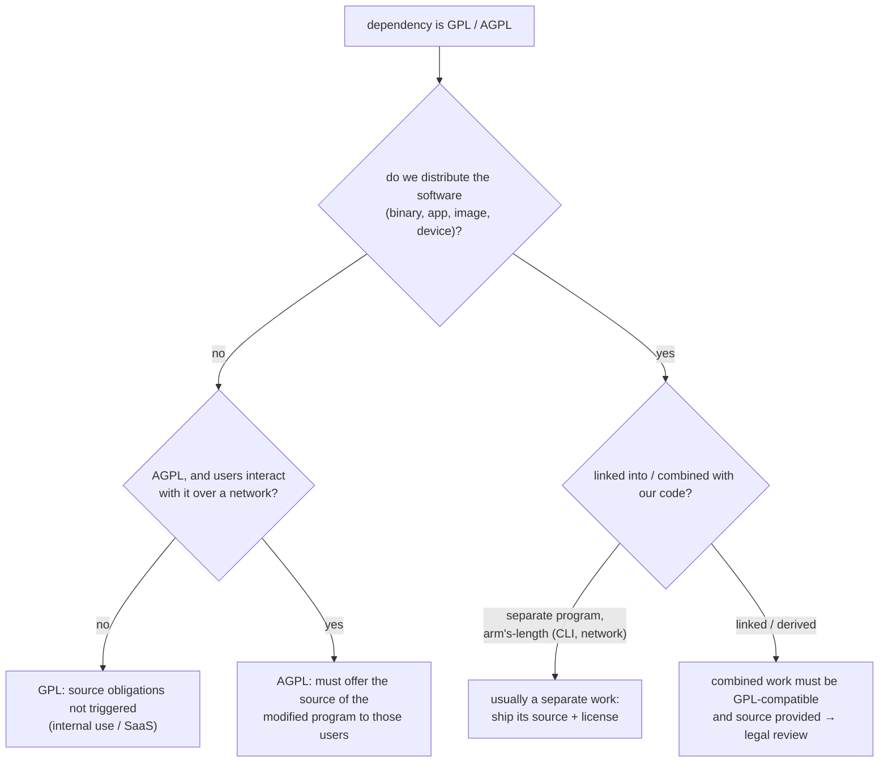
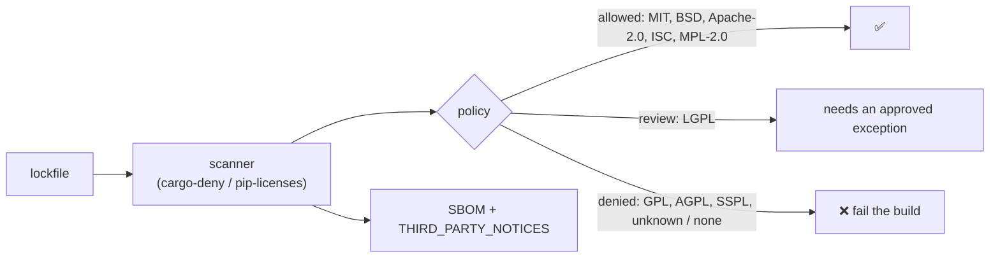
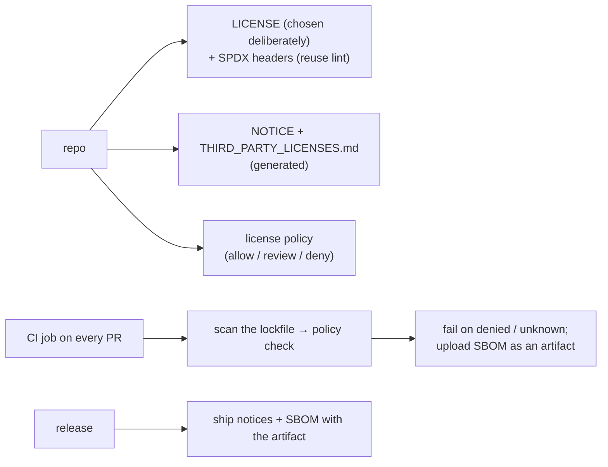

# Chapter 11 — Licensing & OSS Compliance

> **Volume 2 — Software Engineering** · [Contents](index.md) · ← [Chapter 10 — Security & Threat Modeling](ch10-security-and-threat-modeling.md) · Next → [Chapter 12 — API Design & Versioning](ch12-api-design-and-versioning.md)

---

## Concept

Licenses (MIT/Apache/GPL/AGPL), attribution, and scanning dependencies for license/security issues.

**In one sentence:** every open-source dependency comes with a license — a set of permissions and obligations — and compliance means knowing what you ship, honoring those obligations (attribution, source sharing), and catching risky licenses automatically before they reach a release.

**Mental model — borrowing tools from neighbors.** Some neighbors say "take it, just keep my name tag on it" (permissive: MIT, BSD, Apache). Some say "use it freely, but if you hand a modified version to someone else, give them the modifications too" (copyleft: GPL). One says "even if people only *use* your workshop through a window, share your modifications" (AGPL, network use). Losing track of whose tool is whose is how you end up in trouble.

*This chapter is engineering guidance, not legal advice. For real decisions, involve your legal or open-source program office.*

**The license spectrum**

| License | Type | Main obligations when you distribute | Patent grant | Typical effect on your code |
|---------|------|--------------------------------------|:-:|-----------------------------|
| MIT, BSD-2/3, ISC | permissive | keep the copyright and license notice | no (implicit at best) | none |
| **Apache-2.0** | permissive | keep the notices + **NOTICE file**; state significant changes | **yes** (with retaliation clause) | none |
| MPL-2.0 | weak copyleft (file-level) | modified MPL *files* stay MPL and their source must be shared | yes | only those files |
| LGPL-2.1/3.0 | weak copyleft (library) | share modifications to the library; allow users to relink/replace it | v3 yes | fine if you dynamically link and don't modify |
| **GPL-2.0/3.0** | strong copyleft | the whole *combined work* you distribute must be GPL, with source | v3 yes | your linked code becomes subject to the GPL when distributed |
| **AGPL-3.0** | network copyleft | GPL, plus: offering it to users **over a network** counts as distribution | yes | SaaS users are entitled to the source |
| SSPL, BSL, Elastic License | source-available (not OSI open source) | restrictions on offering it as a service / competing | varies | often banned by corporate policy |
| No license | — | **no permission at all** by default | — | you may not legally use it |

**"Distribution" is the key trigger** for GPL — shipping a binary, a mobile app, an appliance, or a Docker image to customers. Running GPL code only on your own servers doesn't trigger GPL's source obligations (AGPL closes that gap).

**Compatibility** — Apache-2.0 code can go into a GPL-3.0 project, but not into GPL-2.0-only projects; GPL code can't be relicensed as MIT. Mixed licensing in one binary must satisfy all of them together.

**Why track dependency licenses?**

* You are responsible for *transitive* dependencies too (you may have hundreds).
* Copyleft in a distributed product can force you to release source or remove the component.
* Attribution notices are a legal requirement for almost every license.
* Customers, acquirers, and regulations (SBOM requirements) ask for the list.
* Licenses change: a project can switch to a source-available license in a new version.

**Tools and formats**

| Need | Tool / standard |
|------|-----------------|
| Identify licenses | SPDX identifiers (`Apache-2.0`, `GPL-3.0-only`); `SPDX-License-Identifier:` headers |
| Scan dependencies | `pip-licenses`, `cargo-deny`, `license-checker` (npm), `go-licenses`, ScanCode, FOSSA, Snyk |
| Bill of materials | SBOM in SPDX or CycloneDX (`syft`, `cyclonedx-py`) |
| Policy in CI | an allow-list / deny-list per license, with exceptions reviewed |
| Your own repo | a `LICENSE` file, per-file SPDX headers, `NOTICE` for Apache, REUSE compliance |

---

## Prereqs

* [Vol 1 Ch 21 — Build Systems & Package Management](../volume-1-cs-foundations/ch21-build-systems-and-package-management.md)

---

## Diagram

**The permissive → copyleft spectrum**

```
 fewer obligations ◄──────────────────────────────────────────────────► more obligations

  Public domain / CC0 · Unlicense
      MIT · BSD · ISC
            Apache-2.0 (+ patent grant, NOTICE)
                  MPL-2.0 (file-level copyleft)
                        LGPL (library copyleft)
                              GPL-2.0 / GPL-3.0 (whole combined work, on distribution)
                                    AGPL-3.0 (also over the network)
  ────────────── usually OK in proprietary products ──────────┤├── needs review / policy ──
```

**Does GPL apply to my product?**



**License scanning in CI**



---

## Example

```text
# NOTICE (required when you ship Apache-2.0 code that has a NOTICE file, and good practice for your own)
Acme Invoicing
Copyright 2024 Acme Corp.

This product includes software developed by The Apache Software Foundation
(https://www.apache.org/): Apache Commons CSV, licensed under Apache-2.0.
```

```python
# SPDX-License-Identifier: Apache-2.0
# Copyright 2024 Acme Corp.
"""Per-file headers let tools identify the license without guessing."""
```

```toml
# deny.toml — cargo-deny policy
[licenses]
allow = ["MIT", "Apache-2.0", "BSD-2-Clause", "BSD-3-Clause", "ISC", "Unicode-3.0", "MPL-2.0"]
confidence-threshold = 0.9
exceptions = [
  { allow = ["LGPL-2.1"], crate = "some-dynamic-lib" },   # reviewed 2024-05, ticket LEGAL-42
]

[advisories]
yanked = "deny"                 # also fail on known security advisories
```

```bash
cargo deny check licenses advisories
pip-licenses --format=markdown --with-urls --order=license > THIRD_PARTY_LICENSES.md
pip-licenses --fail-on="GNU General Public License v3 (GPLv3);GNU Affero General Public License v3"
npx license-checker --production --failOn "GPL;AGPL"
syft dir:. -o cyclonedx-json > sbom.cdx.json
```

---

## Exercises

1. Classify a set of licenses by obligation.

   <details><summary>Solution</summary>MIT and BSD-3: keep the notices. Apache-2.0: keep the notices plus NOTICE, state your changes; includes a patent grant. MPL-2.0: share changes to MPL files. LGPL-3.0: share library changes and allow relinking. GPL-3.0: the whole distributed combined work must be GPL with source. AGPL-3.0: same as GPL, plus source for network users. SSPL: not open source, and it restricts offering the software as a service.</details>

2. Scan a project's dependencies and flag a GPL violation risk.

   <details><summary>Solution</summary>Run the scanner on the lockfile (including transitive dependencies), filter for GPL/AGPL/unknown, and for each hit record how it's used (linked library vs separate tool vs dev-only), whether you distribute, and which version introduced it. Typical outcome: move it to dev-only, replace it with a permissive alternative, isolate it as a separate process, or get a legal review. Encode the decision as a policy exception with a ticket.</details>

3. You find a useful snippet on GitHub with no LICENSE file. Can you use it?

   <details><summary>Solution</summary>Legally, no: copyright applies by default, and without a license you have no permission to copy or modify it. Ask the author to add a license, or write your own implementation.</details>

---

## Mini project

**Add a license + NOTICE + dependency license scan to a project's CI.**



**Steps**

1. Pick a license for your project and write a one-paragraph rationale (e.g. Apache-2.0 for the patent grant).
2. Add SPDX headers to source files; run `reuse lint` to verify.
3. Write a license policy (allow/review/deny) as config for your ecosystem's scanner.
4. CI job: scan all transitive dependencies, fail on denied or unknown licenses, and upload an SBOM.
5. Generate `THIRD_PARTY_LICENSES.md` at release time and include it in the artifact.
6. Add a GPL dependency on purpose and watch CI block it.

**Done when:** every release ships with notices and an SBOM, and a disallowed license can't be merged without a reviewed exception.

---

## Open source

* [`EmbarkStudios/cargo-deny`](https://github.com/EmbarkStudios/cargo-deny) — license, advisory, ban, and source checks for Rust dependency graphs.
* [`nexB/scancode-toolkit`](https://github.com/nexB/scancode-toolkit) — detects licenses and copyrights in any source tree, even without metadata. See also `choosealicense.com`, `spdx.org/licenses`, and the REUSE specification.

---

## Interview

1. **"MIT vs GPL obligations?"**
   <details><summary>Answer</summary>MIT is permissive: you may use, modify, and ship it in closed-source products, as long as you keep the copyright and license notice. GPL is copyleft: if you distribute software that includes or is derived from GPL code, the combined work must be licensed under the GPL and you must provide its complete source code. Running it only internally doesn't trigger that. AGPL extends the trigger to network use.</details>

2. **"Why track dependency licenses?"**
   <details><summary>Answer</summary>Because obligations apply to everything you ship, including transitive dependencies you never chose directly. Copyleft or source-available licenses can force source disclosure or block a product; missing attribution is itself a violation; customers, auditors, acquirers, and regulations increasingly require an SBOM; and licenses change between versions. Automated scanning with a policy in CI catches issues at the PR, not at release or in due diligence.</details>

---

## Checklist

- [ ] pick a license deliberately
- [ ] attribute correctly
- [ ] scan deps in CI

---

> [Contents](index.md) · ← [Chapter 10 — Security & Threat Modeling](ch10-security-and-threat-modeling.md) · Next → [Chapter 12 — API Design & Versioning](ch12-api-design-and-versioning.md)
