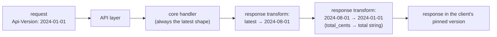
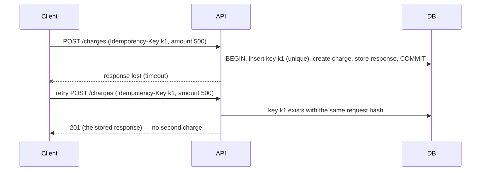
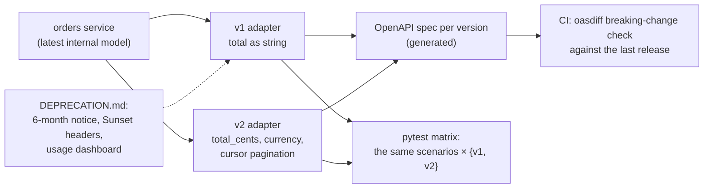

# Chapter 12 — API Design & Versioning

> **Volume 2 — Software Engineering** · [Contents](index.md) · ← [Chapter 11 — Licensing & OSS Compliance](ch11-licensing-and-oss-compliance.md) · Next → [Chapter 13 — Documentation as a System](ch13-documentation-as-a-system.md)

---

## Concept

Designing clean, evolvable APIs; naming, error contracts, pagination, idempotency; versioning (URI vs header vs field).

**In one sentence:** an API is a promise to people you may never meet, so design it to be predictable (consistent names, errors, and pagination), safe to retry (idempotency), and able to grow without breaking anyone (additive changes, explicit versions, and a deprecation policy).

**Mental model — a power socket standard.** Once millions of plugs exist, you can't move the pins. You *can* add a USB port next to them (an additive change). If you truly need a new shape, you ship a new socket type (a new version) and support the old one for years, with plenty of notice before removal.

**Design rules that age well**

| Area | Rule | Example |
|------|------|---------|
| Resources | nouns, plural, stable IDs | `/v1/customers/cus_123/invoices` |
| Naming | one convention everywhere (`snake_case` JSON is common) | `created_at`, never `createdAt` in one place and `creation_date` in another |
| Types | money as integer minor units + currency; times as ISO-8601 UTC; enums as strings | `{"amount": 1999, "currency": "eur"}` |
| Errors | one error shape for every endpoint, with a machine-readable code | `{"error": {"type": "invalid_request", "code": "amount_too_small", "param": "amount", "message": "…"}}` |
| Pagination | cursor-based for large or changing lists; a limit with a maximum | `?limit=50&starting_after=inv_9` → `{"data": [...], "has_more": true, "next_cursor": "…"}` |
| Filtering and sorting | explicit query params, allow-listed fields | `?status=paid&created[gte]=2024-01-01&sort=-created_at` |
| Idempotency | writes accept an `Idempotency-Key` header | a retried `POST /charges` returns the first result |
| Expansion | let clients opt into nested objects | `?expand[]=customer` |
| Evolution | clients must ignore unknown fields; servers add, never remove or rename | |

**Offset vs cursor pagination**

| | Offset (`?page=3`) | Cursor (`?after=<opaque>`) |
|-|-------------------|---------------------------|
| Deep pages | slow (`OFFSET 100000` scans rows) | fast (index seek `WHERE id > cursor`) |
| Items added or removed during paging | duplicates or skips | stable |
| Jump to page 57 | yes | no |
| Use for | small admin tables | feeds, large lists, public APIs |

**What makes a write idempotent** — the same request applied twice has the same effect as once. `PUT` and `DELETE` are idempotent by definition; `POST` isn't, so you add a client-generated **idempotency key**: the server stores `key → (request hash, response)`; a repeat with the same key and body returns the stored response; the same key with a different body is a `422`/`409`. Keys expire (e.g. after 24 h). The key must be recorded in the **same transaction** as the side effect.

**Additive (safe) vs breaking changes**

| Safe | Breaking |
|------|----------|
| add an optional request field | add a required request field |
| add a response field | remove or rename a field |
| add an endpoint | change a field's type or format (`"12.50"` → `1250`) |
| add a new enum value — *if* clients were told to expect unknown values | change the meaning of an existing value |
| relax validation | tighten validation, change defaults, change error codes |

**Versioning strategies**

| Strategy | Example | Pros | Cons |
|----------|---------|------|------|
| URI | `/v2/orders` | obvious, easy to route and cache | coarse; clients must change every URL |
| Header | `Accept: application/vnd.acme.v2+json` or `Api-Version: 2024-06-01` | clean URLs; per-request choice | less visible; harder to test in a browser |
| Date-pinned per account (Stripe style) | the account is pinned to `2024-06-01`; override per request with a header | many small changes, each with its own migration; old clients untouched | the server needs a translation layer per version |
| Field / query | `?version=2` | simple | easy to forget; muddles caching |

Whatever you choose: publish a **deprecation policy** (announce → `Deprecation` and `Sunset` headers → usage metrics → removal after N months), and test every supported version in CI.

---

## Prereqs

* [Vol 1 Ch 42 — HTTP, REST, GraphQL & JSON-RPC](../volume-1-cs-foundations/ch42-http-rest-graphql-and-json-rpc.md)

---

## Diagram

**An API evolution timeline showing additive vs breaking changes**

```
 2024-01  v1 launch        GET /v1/orders → {id, total, status}
 2024-03  additive ✓       + response field "currency"           (v1 clients ignore it)
 2024-05  additive ✓       + optional param ?status=             (old calls unchanged)
 2024-08  BREAKING ✗       total: "12.50" (string) → total_cents: 1250 (int)
            └─► ship as v2 (or a new dated version); v1 keeps the old shape
 2024-09  v1 deprecated    responses carry  Deprecation: true  Sunset: Sat, 01 Mar 2025
 2025-03  v1 removed       only after usage metrics show ~0 calls; 410 Gone after that
```



**An idempotent POST with a retry**



**Cursor pagination**

```
 page 1: GET /v1/invoices?limit=3            → [inv_9, inv_8, inv_7]  next_cursor = "inv_7"
 page 2: GET /v1/invoices?limit=3&after=inv_7 → [inv_6, inv_5, inv_4]
 SQL:    WHERE (created_at, id) < (:c_created, :c_id) ORDER BY created_at DESC, id DESC LIMIT 4
                                                                  (fetch limit+1 → has_more)
```

---

## Example

```python
# FastAPI: consistent errors, cursor pagination, idempotency keys
import hashlib, json
from fastapi import FastAPI, Header, HTTPException, Request
from fastapi.responses import JSONResponse

app = FastAPI()

class ApiError(Exception):
    def __init__(self, status, type_, code, message, param=None):
        self.status, self.body = status, {"error": {"type": type_, "code": code,
                                                    "message": message, "param": param}}

@app.exception_handler(ApiError)
async def api_error(_: Request, e: ApiError):
    return JSONResponse(e.body, status_code=e.status)        # ONE error shape everywhere

@app.get("/v1/invoices")
def list_invoices(limit: int = 20, after: str | None = None):
    if not 1 <= limit <= 100:
        raise ApiError(400, "invalid_request", "limit_out_of_range", "limit must be 1–100", "limit")
    rows = db.invoices_before(cursor=after, limit=limit + 1)  # one extra row → has_more
    page = rows[:limit]
    return {"data": page, "has_more": len(rows) > limit,
            "next_cursor": page[-1]["id"] if page else None}

@app.post("/v1/charges", status_code=201)
async def create_charge(req: Request, idempotency_key: str = Header(...)):
    body = await req.json()
    digest = hashlib.sha256(json.dumps(body, sort_keys=True).encode()).hexdigest()
    with db.transaction():
        prior = db.get_idempotency(idempotency_key, for_update=True)
        if prior:
            if prior.request_hash != digest:
                raise ApiError(422, "idempotency_error", "key_reused",
                               "this key was used with a different request")
            return JSONResponse(prior.response, status_code=prior.status)
        charge = db.create_charge(body["amount"], body["currency"])
        db.save_idempotency(idempotency_key, digest, 201, charge)   # same transaction
    return charge
```

```http
HTTP/1.1 200 OK
Deprecation: true
Sunset: Sat, 01 Mar 2025 00:00:00 GMT
Link: <https://docs.acme.dev/migrate-v2>; rel="deprecation"
```

---

## Exercises

1. Design an API for a resource with filtering/pagination.

   <details><summary>Solution</summary>

   ```
   GET  /v1/tickets?status=open&priority[gte]=2&assignee=u_7&sort=-updated_at&limit=50&after=tkt_91
   →    {"data": [...], "has_more": true, "next_cursor": "tkt_40"}
   GET  /v1/tickets/tkt_40?expand[]=assignee
   POST /v1/tickets              (Idempotency-Key)  → 201 + Location
   PATCH /v1/tickets/tkt_40      (If-Match: "etag")  → 200 / 412
   ```
   Allow-list the filter and sort fields; cap <code>limit</code>; make the cursor opaque (base64 of the sort key + ID); use one error shape; add a composite index matching the default sort.
   </details>

2. Evolve an API additively without breaking clients.

   <details><summary>Solution</summary>Need a <code>currency</code> on orders? Add it as a new response field (default <code>"usd"</code> for old rows) and an optional request field. Need <code>total</code> as integer cents? Add <code>total_cents</code> alongside <code>total</code>, document <code>total</code> as deprecated, measure who still reads it (API logs or SDK telemetry), and remove it only in the next version. Contract tests for old clients prove nothing broke.</details>

3. Is `PATCH /orders/1 {"quantity_increment": 1}` idempotent? How would you make it safe to retry?

   <details><summary>Solution</summary>No — each retry adds 1 again. Options: send the absolute value (<code>{"quantity": 3}</code>), use optimistic concurrency with <code>If-Match</code>, or require an <code>Idempotency-Key</code>.</details>

---

## Mini project

**A versioned REST API with a documented deprecation policy and a test matrix.**



**Steps**

1. One core model and two thin versioned adapters (URI or header — pick one and justify it in an ADR).
2. The standard error shape, cursor pagination, and idempotency keys on every POST.
3. Generate OpenAPI per version; add `oasdiff breaking` in CI so an accidental breaking change fails the build.
4. A parametrized test suite that runs every scenario against every supported version.
5. `Deprecation`/`Sunset` headers on v1, a per-version usage counter, and a written policy.

**Done when:** renaming a v1 field makes CI fail, both versions pass the same scenario matrix, and a retried POST never creates a duplicate.

---

## Open source

* [`stripe/stripe-python`](https://github.com/stripe/stripe-python) (API design reference) — together with the Stripe API docs: consistent objects, expandable fields, cursor pagination (`starting_after`), idempotency keys, and date-based versioning.
* [`googleapis/googleapis`](https://github.com/googleapis/googleapis) — Google's API definitions; read the companion API Improvement Proposals (aip.dev), e.g. AIP-158 (pagination) and AIP-180 (backward compatibility).

---

## Interview

1. **"How do you version an API?"**
   <details><summary>Answer</summary>First avoid needing to: make only additive changes and require clients to ignore unknown fields. When a breaking change is unavoidable, introduce an explicit version — a URI prefix (<code>/v2</code>) for simplicity, a header, or date-pinned versions per account with server-side translation layers (Stripe's approach). Support old versions for a published period, announce deprecation with <code>Deprecation</code>/<code>Sunset</code> headers and docs, measure usage, and remove only when traffic is gone. Run tests for every supported version in CI.</details>

2. **"What makes an API idempotent?"**
   <details><summary>Answer</summary>Repeating a request produces the same outcome as sending it once. GET, PUT, and DELETE are idempotent by design. For POST and other non-idempotent writes, the client sends a unique idempotency key; the server atomically records the key with the result (in the same transaction as the side effect) and returns the stored result for repeats, rejecting reuse of a key with a different payload. This makes retries after timeouts safe.</details>

---

## Checklist

- [ ] return consistent error shapes
- [ ] paginate large lists
- [ ] support idempotent writes

---

> [Contents](index.md) · ← [Chapter 11 — Licensing & OSS Compliance](ch11-licensing-and-oss-compliance.md) · Next → [Chapter 13 — Documentation as a System](ch13-documentation-as-a-system.md)
