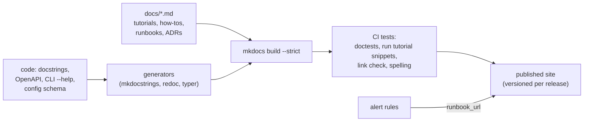
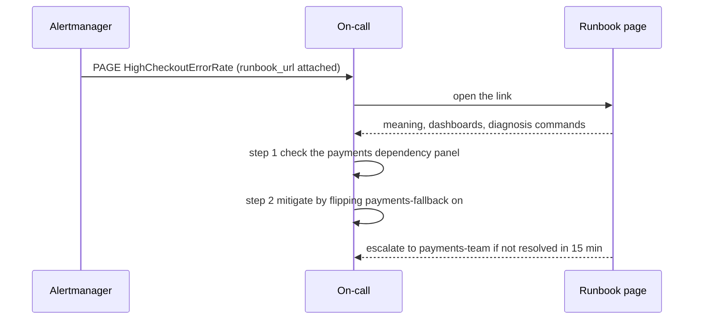
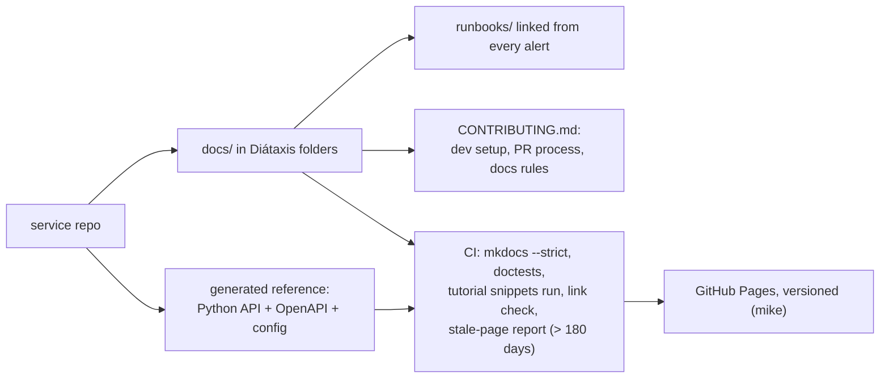

# Chapter 13 — Documentation as a System

> **Volume 2 — Software Engineering** · [Contents](index.md) · ← [Chapter 12 — API Design & Versioning](ch12-api-design-and-versioning.md) · Next → [Chapter 14 — Observability: Logs, Metrics & Traces](ch14-observability-logs-metrics-and-traces.md)

---

## Concept

Docs that stay current — doc-as-code, API references, runbooks, ADRs, and onboarding guides.

**In one sentence:** documentation stays alive only when it's treated like code — it lives in the repo, is reviewed in the same PRs, is generated from the source wherever possible, is organized by what the reader is trying to do, and is tested so it can't silently rot.

**Mental model — a city's signage system.** Street maps (reference), guided tours (tutorials), "how to get to the airport" signs (how-to guides), and the history plaques explaining why the old bridge is there (explanation). One kind of sign can't do every job. And signs that nobody maintains end up pointing to roads that no longer exist.

For the basics of READMEs, docstrings, and ADRs, see [Vol 1 Ch 23](../volume-1-cs-foundations/ch23-documentation-adrs-and-readmes.md). This chapter is about running docs as a **system** across a team.

**Diátaxis: the four documentation types**

| Type | Reader's need | Oriented to | Example | Tone |
|------|---------------|-------------|---------|------|
| **Tutorial** | "teach me" (learning) | a first success | "Build your first webhook in 15 minutes" | hand-holding, one path |
| **How-to guide** | "help me do X" (a task) | a goal | "Rotate the database password" | numbered steps, assumes basics |
| **Reference** | "tell me the facts" (information) | the machinery | API endpoints, config options, CLI flags | complete, dry, **generated** |
| **Explanation** | "help me understand" | a topic | "Why we use event sourcing for orders" (ADRs live here) | discursive, context, trade-offs |

Mixing them is the most common reason docs feel "bad": a tutorial full of reference tables, a reference page that rambles.

**Keeping docs from rotting**

| Practice | How |
|----------|-----|
| Docs as code | Markdown in the repo, next to the code it describes; published by CI |
| Generate reference | OpenAPI → API reference; docstrings → mkdocstrings / Sphinx / rustdoc; `--help` → CLI docs; config schema → options table |
| Test the docs | doctests; run tutorial code blocks in CI; link checker; `mkdocs build --strict` |
| Review in PRs | a PR template checkbox "docs updated?"; `CODEOWNERS` for docs |
| Ownership and freshness | each page has an owner and a `last reviewed` date; flag stale pages |
| Measure | search queries with no results, page feedback, support tickets that docs should have answered |

**Runbooks** — step-by-step instructions for operating the system, especially when an alert fires. A good runbook entry:

1. **Alert name and meaning** — what triggered, what users feel.
2. **Severity and who to page.**
3. **Diagnosis** — dashboards to open, exact commands/queries to run, what "normal" looks like.
4. **Mitigation** — safe actions first (scale up, flip a feature flag, fail over), with exact commands.
5. **Escalation** — when and to whom.
6. **Links** — the service's architecture page, past incidents, the owning team.

Every alert should link to its runbook section.

**Onboarding guide** — day-1 setup (one script), a system map, "your first PR" task, who owns what, glossary.

---

## Prereqs

* [Vol 1 Ch 23 — Documentation, ADRs & READMEs](../volume-1-cs-foundations/ch23-documentation-adrs-and-readmes.md)

---

## Diagram

**A documentation site architecture (Diátaxis)**

```
                        PRACTICAL (doing)
                              ▲
          ┌───────────────────┼───────────────────┐
          │   TUTORIALS       │   HOW-TO GUIDES   │
          │   learning-       │   task-           │
 STUDY    │   oriented        │   oriented        │   WORK
 (acquire)├───────────────────┼───────────────────┤   (apply)
          │   EXPLANATION     │   REFERENCE       │
          │   understanding-  │   information-    │
          │   oriented (ADRs) │   oriented (gen.) │
          └───────────────────┼───────────────────┘
                              ▼
                       THEORETICAL (knowing)
```

**The docs pipeline**



**From alert to runbook**



---

## Example

```yaml
# mkdocs.yml — Diátaxis layout + generated reference
site_name: Acme Orders
theme: { name: material, features: [navigation.sections, search.suggest] }
plugins:
  - search
  - mkdocstrings: { handlers: { python: { paths: [src] } } }
nav:
  - Tutorials:
      - Your first order: tutorials/first-order.md
  - How-to:
      - Rotate DB credentials: how-to/rotate-db-credentials.md
      - Replay a projection: how-to/replay-projection.md
  - Reference:
      - Python API: reference/api.md        # contains only ":::acme.orders" → generated
      - HTTP API: reference/openapi.md      # rendered from openapi.json
      - Configuration: reference/config.md  # generated from the settings schema
  - Explanation:
      - Architecture: explanation/architecture.md
      - Decisions (ADRs): explanation/adr/index.md
  - Operations:
      - Runbooks: runbooks/orders.md
```

````markdown
<!-- runbooks/orders.md -->
## HighCheckoutErrorRate

**Meaning:** more than 2% of `POST /checkout` return 5xx for 5 minutes. Customers can't pay.
**Severity:** SEV-2 · page `orders-oncall` · owner: #team-orders

### Diagnose
1. Open the dashboard **Orders → Checkout** and look at the *errors by dependency* panel.
2. Recent deploy? `kubectl -n orders rollout history deploy/api | tail -3`
3. Payments provider errors?
   ```bash
   kubectl -n orders logs deploy/api --since=10m | jq -r 'select(.level=="error") | .dependency' | sort | uniq -c
   ```
   Normal: fewer than 5 per minute.

### Mitigate (safest first)
1. Deployed in the last 30 min? Roll back: `kubectl -n orders rollout undo deploy/api`
2. Provider errors? Turn on the fallback provider: `flagctl set payments-fallback on`
3. Still failing after 15 min → escalate to `payments-oncall`.

### After
Open an incident doc; link it here under *Past incidents*.
````

```yaml
# The alert links to the runbook
- alert: HighCheckoutErrorRate
  expr: sum(rate(http_requests_total{route="/checkout",status=~"5.."}[5m])) / sum(rate(http_requests_total{route="/checkout"}[5m])) > 0.02
  for: 5m
  labels: { severity: page }
  annotations:
    runbook_url: https://docs.acme.dev/runbooks/orders/#highcheckouterrorrate
```

---

## Exercises

1. Turn scattered notes into the four doc types.

   <details><summary>Solution</summary>Sort each note by the reader's need: "how I set up the dev env" → a tutorial (make it a single success path); "commands to reindex search" → a how-to; "all env vars" → reference (better: generate it from the settings class); "why we chose Kafka" → explanation / an ADR. Delete duplicates and link between the types instead of repeating content.</details>

2. Write a runbook that a new on-call could follow.

   <details><summary>Solution</summary>Use the structure above: meaning in user terms, severity, exact diagnosis commands with "what normal looks like", mitigations ordered from safest to riskiest with copy-paste commands, escalation criteria, and links. Test it: have someone new follow it during a game day without help, and fix every point where they got stuck.</details>

3. Your API reference is hand-written and often wrong. What do you change?

   <details><summary>Solution</summary>Generate it from the source of truth (OpenAPI produced from the code, or code generated from the spec), publish it in CI on every release, and add contract tests so the spec and the implementation can't diverge. Keep hand-written prose for guides and explanations only.</details>

---

## Mini project

**A doc site with generated API docs, a runbook, and a contribution guide.**



**Steps**

1. Add `mkdocs-material` + `mkdocstrings` to a service from an earlier chapter; create the four Diátaxis sections.
2. Generate the Python API, HTTP API (from OpenAPI), and configuration reference; no hand-written reference.
3. Write one tutorial, two how-tos, one explanation page (link your ADRs), and runbooks for every alert.
4. `CONTRIBUTING.md` with setup, PR rules, and "docs are part of done".
5. CI: strict build, doctests, execute tutorial code blocks, link checker, and a report of pages older than 180 days.
6. Publish versioned docs per release.

**Done when:** a broken link or a failing tutorial snippet fails CI, every alert has a working `runbook_url`, and the reference updates itself when code changes.

---

## Open source

* [`mkdocs/mkdocs`](https://github.com/mkdocs/mkdocs) — Markdown → static site, configured with one YAML file.
* [`squidfunk/mkdocs-material`](https://github.com/squidfunk/mkdocs-material) — the theme most docs-as-code sites use: search, versioning, admonitions. Read diataxis.fr for the four-type framework.

---

## Interview

1. **"How do you keep docs from rotting?"**
   <details><summary>Answer</summary>Keep docs next to the code and update them in the same PR ("docs are part of done"); generate reference material from the source of truth; test docs in CI (doctests, running tutorial snippets, link checks, strict builds); give pages owners and review dates; separate doc types so each is small and focused; and use signals — failed searches, support tickets, page feedback — to find gaps.</details>

2. **"What belongs in a runbook?"**
   <details><summary>Answer</summary>For each alert: what it means in terms of user impact, severity and who to page, how to diagnose (specific dashboards, commands, queries, and what normal looks like), mitigations ordered from safest to riskiest with exact commands, when and to whom to escalate, and links to architecture docs and past incidents. It should be usable by a tired engineer who has never seen the service, and linked directly from the alert.</details>

---

## Checklist

- [ ] docs are generated where possible
- [ ] write runbooks for incidents
- [ ] review docs in PRs

---

> [Contents](index.md) · ← [Chapter 12 — API Design & Versioning](ch12-api-design-and-versioning.md) · Next → [Chapter 14 — Observability: Logs, Metrics & Traces](ch14-observability-logs-metrics-and-traces.md)
