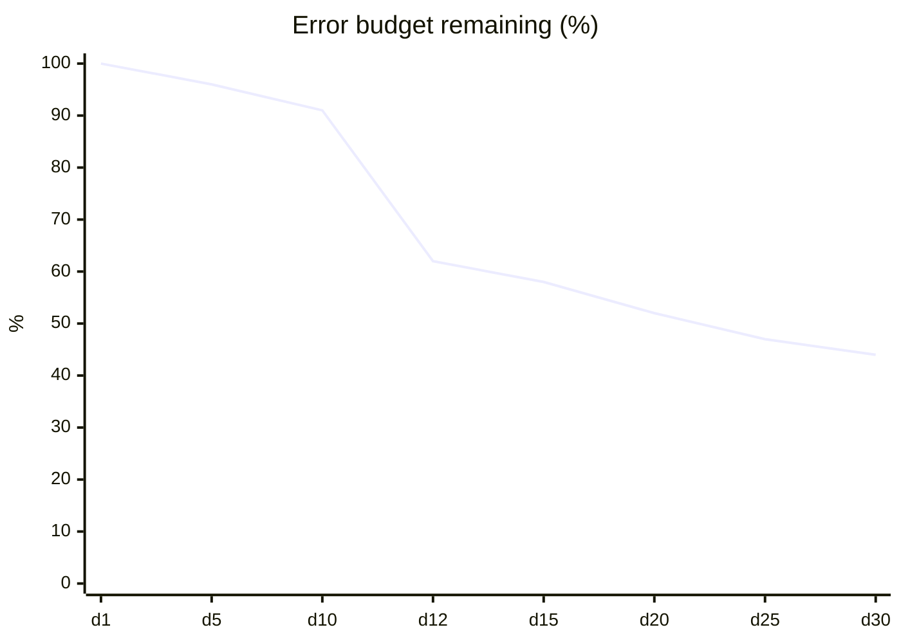
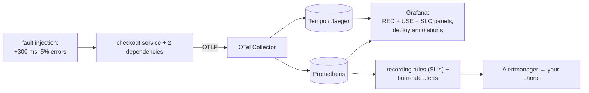

# Chapter 14 — Observability: Logs, Metrics & Traces

> **Volume 2 — Software Engineering** · [Contents](index.md) · ← [Chapter 13 — Documentation as a System](ch13-documentation-as-a-system.md) · Next → [Chapter 15 — Incident Response & Postmortems](ch15-incident-response-and-postmortems.md)

---

## Concept

The three pillars, instrumentation, dashboards, SLOs/SLIs, and debugging with traces.

**In one sentence:** observability is being able to answer new questions about your running system without shipping new code — and at team scale that means agreeing on what "working" means (SLIs and SLOs), alerting only when users are actually hurt (error-budget burn), and building dashboards and traces that lead from a symptom to a cause in minutes.

**Mental model — a car's dashboard and a mechanic's toolkit.** The speedometer and fuel gauge (SLIs) tell you what you care about while driving. The "check engine" light should come on only when something needs attention (SLO-based alerts), not every time you brake. When it does come on, the mechanic plugs in a diagnostic tool (traces, logs) to find the exact failing part.

The mechanics of emitting the three signals with OpenTelemetry are in [Vol 1 Ch 58](../volume-1-cs-foundations/ch58-observability-logs-metrics-traces-and-opentelemetry.md). This chapter is about **using** them: SLOs, dashboards, alerting, and debugging practice.

**SLI, SLO, SLA, error budget**

| Term | Meaning | Example |
|------|---------|---------|
| **SLI** (indicator) | a measured ratio of good events to all events | `good requests / all requests`, where good = status < 500 AND latency < 300 ms |
| **SLO** (objective) | the target for an SLI over a window | 99.9% of checkout requests are good over 30 days |
| **Error budget** | `1 − SLO` — how much failure is allowed | 0.1% of requests ≈ 43 minutes of full outage per 30 days |
| **SLA** (agreement) | a contract with customers, with penalties | 99.5% monthly, or service credits — always *looser* than the SLO |

**How many nines?**

| SLO | Allowed downtime per 30 days |
|-----|-----------------------------:|
| 99% | 7 h 12 min |
| 99.5% | 3 h 36 min |
| 99.9% | 43 min 12 s |
| 99.95% | 21 min 36 s |
| 99.99% | 4 min 19 s |

Each extra nine costs a lot more engineering. Choose the SLO from what users need, not from pride.

**Error budget policy** — if the budget is healthy, ship faster and take risks; if it's burning fast, freeze risky changes and prioritize reliability work. This turns "reliability vs features" arguments into a number.

**Alert on burn rate, not on every blip** — *burn rate* = how fast you consume the budget (1× = exactly on budget over the window). Multi-window, multi-burn-rate alerts (Google SRE Workbook):

| Severity | Burn rate | Long window | Short window | Budget spent when it fires |
|----------|:-:|:-:|:-:|:-:|
| Page | 14.4× | 1 h | 5 min | 2% |
| Page | 6× | 6 h | 30 min | 5% |
| Ticket | 1× | 3 days | 6 h | 10% |

The short window makes the alert stop quickly once the problem is fixed.

**Dashboards that work**

| Dashboard | For | Contents |
|-----------|-----|----------|
| Service overview (RED) | "is my service OK?" | request **R**ate, **E**rror ratio, **D**uration p50/p95/p99, per route; SLO and budget remaining |
| Resources (USE) | "is it saturated?" | **U**tilization, **S**aturation (queues, pool waits), **E**rrors for CPU, memory, DB pool, disk |
| Dependencies | "is it them?" | latency and errors per downstream call |
| Business | "are users succeeding?" | orders per minute, sign-ups, payment success |

Put SLO status at the top, show deploys as annotations, and keep the same layout for every service.

**Debugging with traces** — start from the symptom (an SLO alert or a slow p99), use an *exemplar* to jump from the latency histogram to a real slow trace, find the span that dominates (critical path), then read that span's logs via the trace ID. Compare slow traces with normal ones: what attribute is different (a tenant, a region, a payload size, a cache miss)?

---

## Prereqs

* [Vol 1 Ch 24 — Logging](../volume-1-cs-foundations/ch24-logging.md)

---

## Diagram

**A trace spanning services with spans**

```
 trace 7f3a… POST /checkout                                   0 ms ──────────────── 640 ms
 gateway    POST /checkout          ████████████████████████████████████████  640 ms
 orders       create_order            ██████████████████████████████████████  608 ms
 orders         SELECT cart (db)       █                                        20 ms
 payments       POST /charge              ███████████████████████████████      500 ms
 payments         provider API call        ██████████████████████████████      465 ms  ← critical path
 inventory      reserve stock                                          ██       40 ms
```

The critical path is `payments → provider API call` (465 ms of 640 ms).

**A RED/USE dashboard layout**

```
 ┌──────────────────────── checkout-api ─────────────────────────────┐
 │ SLO 99.9% good (30d)   current 99.93%   budget left ████████░░ 71% │
 ├──────────────────┬──────────────────┬─────────────────────────────┤
 │ Rate (rps)       │ Errors (%)       │ Duration p50 / p95 / p99    │
 │  ▂▃▅▆▆▅▆▇▆▅     │  ▁▁▁▁▁▆▁▁▁▁     │  ▁▁▁▂▂▅▂▂▂ (p99)            │
 │         ▲deploy  │       ▲ spike    │                              │
 ├──────────────────┴──────────────────┴─────────────────────────────┤
 │ USE: CPU 45% · memory 60% · DB pool waits ▁▁▅▁ · queue depth ▁▁▂▁ │
 │ Dependencies: payments p99 ▁▁▇▁ · inventory p99 ▁▁▁▁ · redis ▁▁▁▁  │
 └───────────────────────────────────────────────────────────────────┘
```

**Error budget over a 30-day window**



The drop on day 12 is an incident. After it, the team slows risky releases until the budget recovers.

---

## Example

```yaml
# Prometheus recording + alerting rules for a 99.9% availability SLO
groups:
  - name: checkout-slo
    rules:
      - record: sli:checkout_errors:ratio_rate5m
        expr: |
          sum(rate(http_requests_total{route="/checkout",status=~"5.."}[5m]))
          / sum(rate(http_requests_total{route="/checkout"}[5m]))
      - record: sli:checkout_errors:ratio_rate1h
        expr: |
          sum(rate(http_requests_total{route="/checkout",status=~"5.."}[1h]))
          / sum(rate(http_requests_total{route="/checkout"}[1h]))

      - alert: CheckoutErrorBudgetFastBurn
        expr: |
          sli:checkout_errors:ratio_rate1h > (14.4 * 0.001)
          and
          sli:checkout_errors:ratio_rate5m > (14.4 * 0.001)
        labels: { severity: page }
        annotations:
          summary: "Checkout is burning its 30-day error budget 14x too fast"
          runbook_url: https://docs.acme.dev/runbooks/checkout/#fast-burn
```

```python
# Error-budget math you should be able to do on a whiteboard
slo = 0.999
window_min = 30 * 24 * 60
budget_min = (1 - slo) * window_min
print(round(budget_min, 1))                 # 43.2 minutes of full outage allowed

burn_rate = 14.4
print(round(window_min / burn_rate / 60, 1))   # 50.0 hours to exhaust the whole budget at 14.4x
print(round(burn_rate * 60 / window_min * 100, 1))   # 2.0 % of the budget spent in 1 hour
```

```python
# Latency SLI with an exemplar link to traces (prometheus_client)
from prometheus_client import Histogram
from opentelemetry import trace
LAT = Histogram("http_request_duration_seconds", "latency", ["route"],
                buckets=[0.05, 0.1, 0.2, 0.3, 0.5, 1, 2])

def observe(route, seconds):
    ctx = trace.get_current_span().get_span_context()
    LAT.labels(route).observe(seconds, exemplar={"trace_id": format(ctx.trace_id, "032x")})
```

---

## Exercises

1. Instrument a service with metrics + traces.

   <details><summary>Solution</summary>Auto-instrument HTTP and DB with OpenTelemetry; expose RED metrics per route (a counter by status class, a latency histogram with buckets around your SLO threshold); add manual spans for key business steps; put <code>trace_id</code> in logs; attach exemplars to the latency histogram. Build the RED dashboard with deploy annotations. See <a href="../volume-1-cs-foundations/ch58-observability-logs-metrics-traces-and-opentelemetry.md">Vol 1 Ch 58</a> for the setup.</details>

2. Define an SLO and the SLI that measures it.

   <details><summary>Solution</summary>User journey: "a customer completes checkout". SLI: the proportion of <code>POST /checkout</code> requests, measured at the load balancer, that return a non-5xx status within 800 ms. SLO: 99.9% over a rolling 30 days. Error budget: 0.1% ≈ 43 minutes equivalent. Alerting: 14.4×/6× burn-rate pages and a 1× ticket. Policy: freeze risky deploys if more than 50% of the budget is spent in the first week.</details>

3. Why is "CPU > 80% for 5 minutes" a poor page?

   <details><summary>Solution</summary>High CPU isn't user pain: the service may be fine at 80% (efficient!) or broken at 20% (deadlocked). It pages people for non-problems and misses real ones. Page on symptoms (SLO burn: errors and latency users feel); keep CPU on dashboards for diagnosis and for capacity-planning tickets.</details>

---

## Mini project

**Add OpenTelemetry to a service and produce a trace view + a latency dashboard.**



**Steps**

1. Instrument the service and its dependencies; docker-compose for the Collector, Prometheus, Tempo/Jaeger, and Grafana.
2. Define one availability SLI and one latency SLI with recording rules.
3. Build the dashboard: SLO status and budget remaining on top, RED per route, USE for resources, dependency panels, deploy annotations.
4. Add multi-window burn-rate alerts with runbook links.
5. Inject faults (latency in one dependency, errors on 5% of requests) and practice: alert → dashboard → exemplar → trace → logs → cause.
6. Write down the time from alert to root cause for each drill.

**Done when:** the injected fault pages you within the expected window, and you can reach the guilty span from the alert in under 2 minutes.

---

## Open source

* [`open-telemetry/opentelemetry-python`](https://github.com/open-telemetry/opentelemetry-python) — SDK plus auto-instrumentation.
* [`prometheus/prometheus`](https://github.com/prometheus/prometheus) — recording and alerting rules. See also the Google *SRE Book* (chapters on SLOs and monitoring) and the *SRE Workbook* chapter "Alerting on SLOs"; `pyrra-dev/pyrra` and `slok/sloth` generate SLO rules for you.

---

## Interview

1. **"Logs vs metrics vs traces?"**
   <details><summary>Answer</summary>Metrics are cheap, aggregated numbers over time — best for dashboards, SLOs, and alerting, but no per-request detail and labels must stay low-cardinality. Traces follow individual requests across services with timed spans — best for finding which hop is slow or failing. Logs are detailed events — best for the exact why at a given point. In practice: alert on metrics, localize with traces, explain with logs, all joined by the trace ID.</details>

2. **"What's an SLO vs SLA?"**
   <details><summary>Answer</summary>An SLO is an internal reliability target for a user-centric indicator (e.g. 99.9% of checkouts succeed within 800 ms over 30 days); it drives alerting and the error-budget policy. An SLA is an external contract with customers that specifies consequences (credits, refunds) if a level isn't met. SLAs are set looser than SLOs, so you're alerted and act well before a contractual breach.</details>

---

## Checklist

- [ ] emit all three signals
- [ ] correlate via trace IDs
- [ ] alert on SLO burn

---

> [Contents](index.md) · ← [Chapter 13 — Documentation as a System](ch13-documentation-as-a-system.md) · Next → [Chapter 15 — Incident Response & Postmortems](ch15-incident-response-and-postmortems.md)
