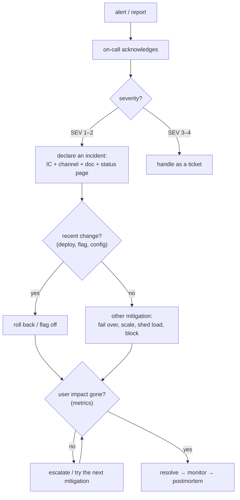
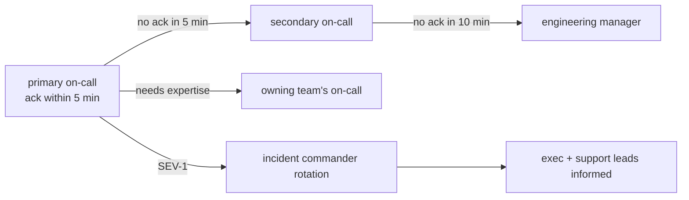
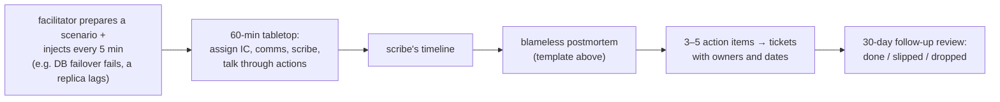

# Chapter 15 — Incident Response & Postmortems

> **Volume 2 — Software Engineering** · [Contents](index.md) · ← [Chapter 14 — Observability: Logs, Metrics & Traces](ch14-observability-logs-metrics-and-traces.md) · Next → [Chapter 16 — Production Debugging](ch16-production-debugging.md)

---

## Concept

On-call hygiene, detection→response→remediation, blameless postmortems, and driving action items.

**In one sentence:** when production breaks, the first job is to stop the bleeding (mitigate), not to find out why; clear roles and a written timeline keep a stressful hour orderly; and afterwards a blameless postmortem turns the pain into specific, owned fixes that actually get done.

**Mental model — a fire brigade.** When the alarm rings, firefighters don't investigate the cause of the fire first; they put it out and get people safe. One person commands, others each have a job, and someone radios updates to everyone waiting outside. Days later, the fire investigator asks *how* the fire started and *what* would have stopped it — without blaming the person who left the stove on, because the goal is safer buildings, not a scapegoat.

**The incident lifecycle**

| Phase | Goal | Key actions |
|-------|------|-------------|
| **Detect** | know fast, ideally before customers | SLO burn-rate alerts ([Ch 14](ch14-observability-logs-metrics-and-traces.md)), synthetic checks, customer reports |
| **Triage** | how bad, who's needed | assign a severity; declare an incident; open a channel and a doc |
| **Mitigate** | stop user impact | roll back, flip a feature flag, fail over, scale up, shed load, block bad traffic |
| **Resolve** | restore normal service | fix forward if needed; verify with metrics; monitor for recurrence |
| **Learn** | prevent recurrence | postmortem within ~5 business days; action items with owners and dates |

**Mitigate before root-causing.** The most common mistake is debugging for 45 minutes while users suffer, when a rollback would have taken 2. If something changed recently, undo it first.

**Roles (Incident Command System, simplified)**

| Role | Does | Doesn't |
|------|------|---------|
| **Incident Commander (IC)** | coordinates, decides, assigns tasks, keeps focus, calls for help | debug hands-on (in big incidents) |
| Operations / subject-matter experts | investigate and apply fixes the IC approves | make big changes without saying so |
| **Communications lead** | status page, stakeholder updates on a fixed cadence (e.g. every 30 min) | speculate about causes |
| **Scribe** | keeps a timestamped timeline in the incident doc | — |

In small teams, one person may hold several roles — but the IC role is always named explicitly.

**Severity matrix (example)**

| SEV | Impact | Examples | Response | Comms |
|-----|--------|----------|----------|-------|
| 1 | critical: core function down for many users, data loss/leak, security breach | checkout down; data exposed | page now, all hands, execs informed | status page within 15 min, updates every 30 min |
| 2 | major: significant degradation or a key feature down | payments slow for 20% of users | page on-call + owning team | status page, hourly updates |
| 3 | minor: limited impact, a workaround exists | admin export failing | on-call, business hours | internal only |
| 4 | no user impact yet | a replica lagging, a disk at 80% | ticket | none |

**On-call hygiene** — sustainable rotations (≥ 6–8 people), handoffs with notes, pages only for actionable user-impacting problems (every page links to a runbook, [Ch 13](ch13-documentation-as-a-system.md)), a target of ≤ ~2 incidents per shift, compensation or time off, and reviewing noisy alerts every week.

**Blameless postmortems** — assume everyone acted reasonably with the information and tools they had. Ask "how did the *system* allow this?" not "who did this?". People who fear blame hide information, and hidden information is how incidents repeat.

**Good action items** are specific, owned, dated, and prioritized, and they target the system: *detect* sooner, *mitigate* faster, *prevent* the class of failure. "Be more careful" is not an action item.

---

## Prereqs

* [Chapter 14 — Observability: Logs, Metrics & Traces](ch14-observability-logs-metrics-and-traces.md)

---

## Diagram

**An incident timeline (detect → mitigate → resolve → learn)**

```
 14:02  deploy v1.42 (new payment retries)
 14:09  ● impact starts: checkout errors 0.2% → 9%
 14:14  🔔 SLO fast-burn alert pages on-call                 ← time to detect: 5 min
 14:16  SEV-2 declared · IC: Ana · comms: Raj · #inc-0412 opened
 14:21  hypothesis: the new deploy (only change in the last 30 min)
 14:23  ✂ mitigation: rollback to v1.41                       ← time to mitigate: 14 min
 14:27  errors back to 0.2% · monitoring
 14:55  resolved · status page closed
 +3 days  postmortem review → 5 action items with owners
 ├─ TTD ─┤├──── TTM ─────┤├── TTR ─────────────────────────┤
```

**Response flow**



**Escalation path**



---

## Example

**A blameless postmortem template**

```markdown
# Postmortem: Checkout errors after the v1.42 deploy (2024-06-12)
Status: final · Severity: SEV-2 · Authors: Ana, Raj · Review: 2024-06-15

## Summary
For 18 minutes, ~9% of checkout attempts failed with 502. Caused by a new retry
policy that exhausted the payments connection pool. Mitigated by rollback.

## Impact
- 14:09–14:27 UTC · ~4,100 failed checkouts (~1,900 unique customers)
- Estimated lost revenue $23k (38% recovered by retry emails)
- Error budget: 34% of the 30-day budget consumed

## Timeline (UTC)
- 14:02 v1.42 deployed (canary skipped: the change was labeled "config only")
- 14:09 errors rise · 14:14 page · 14:16 SEV-2 declared · 14:23 rollback · 14:27 recovered

## Root cause and contributing factors
- Retries ×3 with no backoff on a 20-connection pool → pool exhaustion under normal load.
- Contributing: no pool-wait metric; the canary was skippable by a label; the load
  test didn't cover payment timeouts.

## What went well
- The alert fired within 5 minutes; rollback was one command.

## What went poorly / where we got lucky
- 7 minutes spent debugging before trying the obvious rollback.

## Action items
| # | Action | Type | Owner | Due | Ticket |
|---|--------|------|-------|-----|--------|
| 1 | Exponential backoff + jitter + retry budget in the payments client | prevent | Lee | 06-19 | PAY-311 |
| 2 | Alert on DB/HTTP pool wait time > 50 ms | detect | Ana | 06-21 | OBS-88 |
| 3 | Canary is mandatory for all prod deploys (no skip label) | prevent | Raj | 06-26 | CD-140 |
| 4 | Runbook: "recent deploy? roll back first" at the top | mitigate | Ana | 06-14 | DOC-52 |
| 5 | Load test includes a slow payment provider | prevent | Lee | 07-03 | PERF-19 |
```

```text
Status page update (SEV-2, 14:25 UTC)
Investigating: some customers are seeing errors at checkout. We have identified a
likely cause and are rolling back a recent change. Next update by 14:55 UTC.
```

---

## Exercises

1. Write a postmortem for a simulated outage with a clear root cause and action items.

   <details><summary>Solution</summary>Scenario: a TLS certificate expired on the internal API gateway, and every service-to-service call failed for 40 minutes. Root cause: a manually renewed certificate, not automated, with no expiry monitoring. Contributing: the renewal owner left the company; the alert fired only on user-facing errors. Actions: automate renewal (cert-manager/ACME) — prevent; alert 21 days before any certificate expires — detect; runbook for emergency certificate rotation — mitigate; inventory all certificates with owners — prevent. Each with an owner, date, and ticket.</details>

2. Design a severity + escalation matrix.

   <details><summary>Solution</summary>See the SEV table and escalation diagram above. Define severity by <i>user impact</i> (breadth × depth × data or security risk), not by technical cause; pair each level with response-time targets, who is paged, communication cadence, and whether a postmortem is required (SEV-1/2: always). Let anyone declare an incident; downgrading is cheap, while declaring late is expensive.</details>

3. During an incident, two engineers start applying different fixes at once. What went wrong, and what's the rule?

   <details><summary>Solution</summary>No one was coordinating. The IC must approve and announce every change in the incident channel ("I'm going to roll back api — any objections?"), so changes are serialized and logged in the timeline. Otherwise, you can't tell which action helped, and two changes can make things worse together.</details>

---

## Mini project

**Run a tabletop incident drill and produce a postmortem with follow-ups.**



**Steps**

1. Write a realistic scenario with timed "injects": a symptom, a misleading clue, a failed first mitigation, a customer escalation.
2. Run it with 3–5 people; assign IC, communications, scribe, and operators; the facilitator reveals what the actions show.
3. Post status updates on the agreed cadence during the drill.
4. Write the postmortem within 48 hours using the template; hold a 30-minute blameless review.
5. File action items as tickets; check them after 30 days and report the completion rate.

**Done when:** the drill has a timestamped timeline, the postmortem names system-level causes (no "human error" as root cause), and every action item has an owner, a date, and a ticket.

---

## Open source

* [`dastergon/awesome-sre`](https://github.com/dastergon/awesome-sre) — a curated list: postmortem collections, incident-management guides, and on-call practices (see Google's SRE Book chapters "Managing Incidents" and "Postmortem Culture", and PagerDuty's public incident response docs).
* [`grafana/oncall`](https://github.com/grafana/oncall) — open-source on-call scheduling, escalation chains, and alert routing.

---

## Interview

1. **"How do you run a blameless postmortem?"**
   <details><summary>Answer</summary>Write it within days, from a factual timeline built from logs, chat, and metrics. Focus on how the system — tooling, process, defaults, alerts — made the failure possible and slowed detection or recovery, assuming people acted reasonably with what they knew. Invite the people involved to explain their reasoning without fear. List contributing factors, what went well, and where you got lucky. Produce a few specific, owned, dated action items across detection, mitigation, and prevention; review them in a meeting; track them to completion; share the document widely.</details>

2. **"What do you do first during an incident?"**
   <details><summary>Answer</summary>Acknowledge, assess user impact and severity, and declare an incident with a named incident commander and a channel. Then mitigate before root-causing: if anything changed recently (deploy, flag, config), roll it back; otherwise use the fastest safe lever — fail over, scale, shed load, disable a feature. Communicate status on a regular cadence, keep a timeline, and investigate the root cause once users are no longer affected.</details>

---

## Checklist

- [ ] mitigate before root-causing
- [ ] keep a timeline
- [ ] track action items to completion

---

> [Contents](index.md) · ← [Chapter 14 — Observability: Logs, Metrics & Traces](ch14-observability-logs-metrics-and-traces.md) · Next → [Chapter 16 — Production Debugging](ch16-production-debugging.md)
