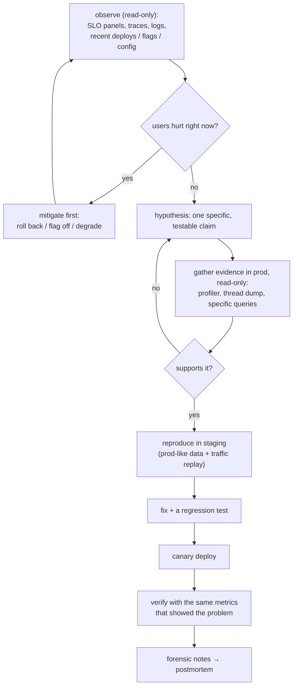
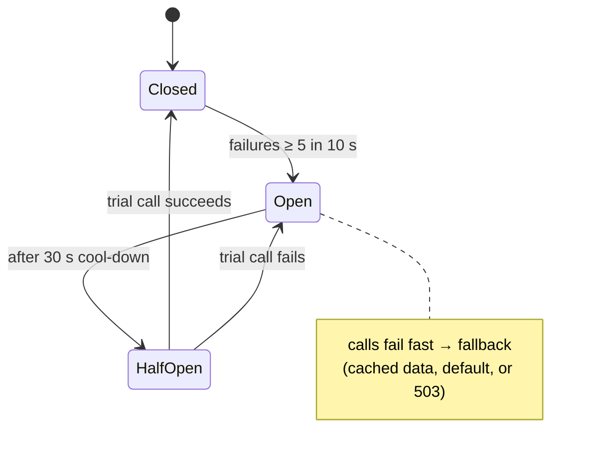
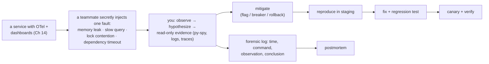

# Chapter 16 — Production Debugging

> **Volume 2 — Software Engineering** · [Contents](index.md) · ← [Chapter 15 — Incident Response & Postmortems](ch15-incident-response-and-postmortems.md)

---

## Concept

Debugging live systems safely — read-only access, replicating in staging, graceful degradation, and forensics.

**In one sentence:** production is where the real bug lives but also where mistakes hurt customers, so you debug it the way a doctor examines a patient — observe first, touch carefully, change one thing at a time, reproduce risky experiments somewhere safe, and keep switches ready to turn off whatever is failing.

**Mental model — a surgeon vs a mechanic in a garage.** A mechanic can take the engine apart on the bench (local debugging). A surgeon works on a live patient: first scans and tests (read-only observation), then a plan, then the smallest possible incision, with monitors on the whole time and a way to stop. You also practice difficult procedures on a simulator first (staging).

**Rules of engagement in production**

| Rule | Why |
|------|-----|
| **Observe before you touch**: metrics, traces, logs, recent changes | most bugs reveal themselves without any intervention |
| **Read-only by default** | read replicas, `SELECT` only, `kubectl get/logs/describe`, profilers attached in sampling mode |
| Announce what you're doing (the incident channel) | others need to know which changes are yours |
| **One change at a time**, reversible, with a noted time | otherwise you can't tell cause from effect |
| Never mutate prod data by hand without a reviewed script, a transaction, and a backup | a typo in `UPDATE` without `WHERE` is its own incident |
| Capture evidence *before* restarting (heap dump, thread dump, core dump, logs) | a restart destroys the crime scene |
| Reproduce in staging with prod-like data and traffic | experiment freely there |
| Leave instrumentation behind | the next person debugs faster |

**The toolkit (least to most invasive)**

| Tool | Shows | Risk |
|------|-------|------|
| Dashboards, traces, logs | what, where, when | none |
| `kubectl logs/describe/top`, `kubectl get events` | pod state, restarts, OOMKills, probe failures | none |
| Dynamic log level / debug flag for one tenant | extra detail | low (volume) |
| Sampling profiler: `py-spy dump`/`top`, async-profiler, `perf` | hot code, stuck threads | very low |
| Thread dump / `py-spy dump` | what every thread is doing *now* (deadlocks) | very low |
| `strace -p` / `ltrace` | syscalls: stuck on which file, socket, or lock? | medium (slows the process) |
| Heap dump / `memray attach` / `gcore` | memory leaks, object counts | medium (pauses, big files, contains PII) |
| `kubectl debug` ephemeral container | tools inside the pod's namespaces | low |
| Attaching a debugger with breakpoints | full control | **high** — pauses the process; almost never in prod |

**Graceful degradation** — design the system to lose non-essential features instead of failing entirely: serve cached or default recommendations, hide a broken widget, queue work for later, show "prices may be delayed". Built with **feature flags / kill switches** ([Ch 6](ch06-packaging-and-release-engineering.md)), **timeouts**, **bulkheads** (separate pools per dependency), and **circuit breakers**.

**Circuit breaker** — wraps calls to a dependency. After too many failures it *opens*: calls fail fast (or use a fallback) without waiting on the broken dependency, so threads aren't exhausted and the dependency can recover. After a cool-down it goes *half-open* and lets a trial request through; success closes it again. Details in [Vol 3 Ch 14](../volume-3-low-level-design/ch14-resilience-patterns-idempotency-retries-backoff-circuit-breakers.md).

**Forensics** — preserve evidence (logs, dumps, the exact artifact version, configs, recent changes), write the timeline as you go, and record what you checked and ruled out. That becomes the postmortem ([Ch 15](ch15-incident-response-and-postmortems.md)).

---

## Prereqs

* [Chapter 15 — Incident Response & Postmortems](ch15-incident-response-and-postmortems.md)
* [Vol 1 Ch 27 — Debugging & Profiling](../volume-1-cs-foundations/ch27-debugging-and-profiling.md)

---

## Diagram

**A decision flow: observe → hypothesize → reproduce in staging → fix → verify**



**Circuit breaker states**



**Graceful degradation on a product page**

```
 ┌───────────────────────────── product page ───────────────────────────────┐
 │ title, price, buy button      ← critical: must work (strict timeouts)    │
 │ reviews                       ← degrade: cached copy, 10 min old          │
 │ "customers also bought"       ← degrade: static bestsellers (breaker open)│
 │ personalized banner           ← degrade: hidden (kill switch recs=off)    │
 └──────────────────────────────────────────────────────────────────────────┘
   the recommendations service is down, but customers can still buy
```

---

## Example

```bash
# Observe (read-only)
kubectl -n shop get pods -o wide                   # restarts? which nodes?
kubectl -n shop describe pod api-7d9f-abc | tail -20   # OOMKilled? probe failures? events
kubectl -n shop logs deploy/api --since=15m | jq -c 'select(.level=="error")' | head
kubectl -n shop top pods
kubectl -n shop rollout history deploy/api         # what changed recently?

# Capture evidence before restarting anything
kubectl -n shop debug -it api-7d9f-abc --image=python:3.12 --target=api -- bash
#   inside: pip install py-spy && py-spy dump --pid 1      # where is every thread stuck?
#   memray attach 1 --duration 30 -o /tmp/leak.bin         # memory growth
strace -f -p <pid> -e trace=network,read,write -T 2>&1 | head   # blocked on which socket?
```

```python
# A circuit breaker with a fallback (minimal version; use pybreaker/resilience4j in real code)
import time

class CircuitBreaker:
    def __init__(self, max_failures=5, reset_after=30.0, clock=time.monotonic):
        self.max_failures, self.reset_after, self.clock = max_failures, reset_after, clock
        self.failures, self.opened_at = 0, None

    def call(self, fn, fallback):
        if self.opened_at is not None:
            if self.clock() - self.opened_at < self.reset_after:
                return fallback()                       # OPEN: fail fast
            self.opened_at = None                       # HALF-OPEN: allow one trial
            self.failures = self.max_failures - 1
        try:
            result = fn()
        except Exception:
            self.failures += 1
            if self.failures >= self.max_failures:
                self.opened_at = self.clock()           # trip → OPEN
            return fallback()
        self.failures = 0                               # success → CLOSED
        return result

recs_breaker = CircuitBreaker()

def recommendations(user_id):
    if not flags.is_enabled("recs"):                    # kill switch
        return BESTSELLERS
    return recs_breaker.call(lambda: recs_client.get(user_id, timeout=0.3),
                             fallback=lambda: BESTSELLERS)
```

```sql
-- Safe manual data fix: reviewed, scoped, transactional, with a check before COMMIT
BEGIN;
UPDATE orders SET status = 'paid'
WHERE id IN (SELECT order_id FROM payments WHERE captured_at > '2024-06-12 14:09' AND status = 'captured')
  AND status = 'pending';
-- expect ~412 rows; the client reports the count
SELECT count(*) FROM orders WHERE status = 'pending' AND created_at > '2024-06-12 14:00';
COMMIT;   -- or ROLLBACK if the numbers don't match the review
```

---

## Exercises

1. Diagnose a simulated production failure using only logs/metrics/traces.

   <details><summary>Solution</summary>Example: p99 jumped at 10:40 with no deploy. Metrics show DB pool wait time rising and CPU normal → contention on a dependency, not compute. Traces show slow <code>SELECT … FROM orders WHERE customer_email = …</code> spans. Logs show a new marketing job started at 10:38 running that query in a loop. Hypothesis: a missing index plus a new traffic pattern. Evidence: <code>EXPLAIN</code> on a replica shows a sequential scan. Mitigation: pause the job; fix: add the index concurrently; verify pool waits return to normal.</details>

2. Add a graceful-degradation path with a circuit breaker.

   <details><summary>Solution</summary>Wrap the non-critical dependency call in a tight timeout plus a breaker (as above), with a fallback that is cheap and safe (cached result, static default, or a hidden component). Emit metrics for breaker state and fallback count, and alert on a breaker that stays open. Test it by making the dependency hang: the page must still load within its SLO.</details>

3. A pod is using 95% memory and climbing. Why not just restart it right away?

   <details><summary>Solution</summary>A restart destroys the evidence and the leak will return. If users aren't hurt yet, first capture a heap profile or dump (<code>memray attach</code>, a JVM heap dump), note the version and traffic pattern, then restart or scale as mitigation. If users <i>are</i> hurt, mitigate first — but try to capture from one pod while restarting the others.</details>

---

## Mini project

**Inject a failure into a running service, debug it read-only, fix, and write up the forensic trail.**



**Steps**

1. Add fault-injection switches (env var or flag) to a service: memory leak, N+1 query, a lock held too long, a dependency that hangs.
2. Add a kill switch and a circuit breaker around one non-critical dependency.
3. A teammate turns one fault on without telling you which.
4. Debug using only read-only tools; log every command and what you concluded, with timestamps.
5. Mitigate without a code change (flag, breaker, rollback), then reproduce in staging, fix, and canary.
6. Write a short postmortem from the forensic log.

**Done when:** you identify the injected fault from evidence alone, users see degradation rather than an outage, and the forensic log lets someone else follow your reasoning step by step.

---

## Open source

* [`async-profiler`](https://github.com/async-profiler/async-profiler) — a low-overhead sampling profiler for the JVM (CPU, allocations, locks), safe to attach in production; for Python, `benfred/py-spy` and `bloomberg/memray`.
* [`brendangregg/perf-tools`](https://github.com/brendangregg/perf-tools) — small scripts built on ftrace/perf for live Linux diagnosis (`iosnoop`, `execsnoop`, `opensnoop`); see also the BCC/bpftrace tools and Brendan Gregg's "Linux Performance Analysis in 60 Seconds".

---

## Interview

1. **"How do you debug a production-only issue?"**
   <details><summary>Answer</summary>Mitigate first if users are affected. Then observe read-only: SLO dashboards, traces, and logs, and diff everything that changed (deploys, flags, config, traffic, data shape, dependencies). Form a specific hypothesis and test it with low-risk evidence (sampling profilers, thread and heap dumps, targeted queries on replicas), capturing evidence before any restart. Reproduce in staging with prod-like data or replayed traffic, fix with a regression test, roll out with a canary, verify with the original symptom's metrics, and document the trail.</details>

2. **"What's a circuit breaker for?"**
   <details><summary>Answer</summary>To stop a failing dependency from taking your service down with it. After a threshold of failures or timeouts, the breaker opens and calls fail fast or use a fallback instead of tying up threads and connections waiting. After a cool-down it lets trial requests through (half-open) and closes when they succeed. It limits cascading failures, gives the dependency room to recover, and enables graceful degradation.</details>

---

## Checklist

- [ ] never mutate prod state carelessly
- [ ] reproduce in staging
- [ ] add degradation knobs

---

> [Contents](index.md) · ← [Chapter 15 — Incident Response & Postmortems](ch15-incident-response-and-postmortems.md)
