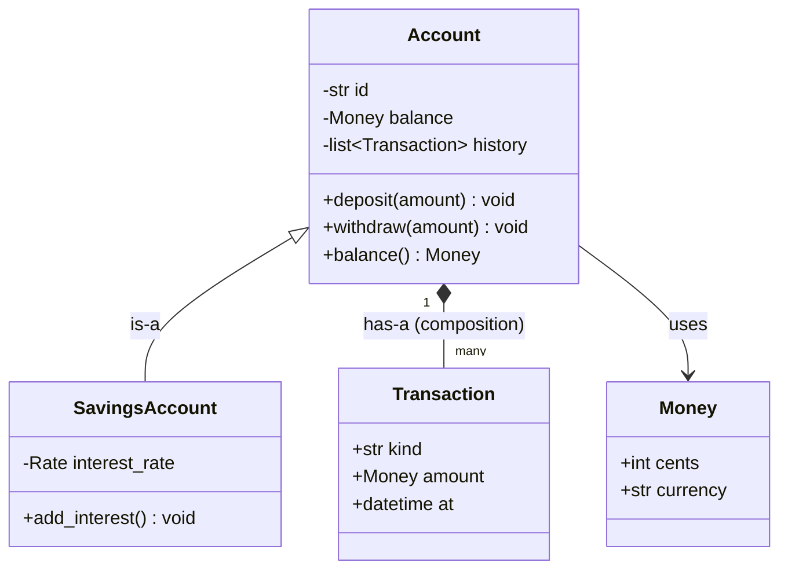
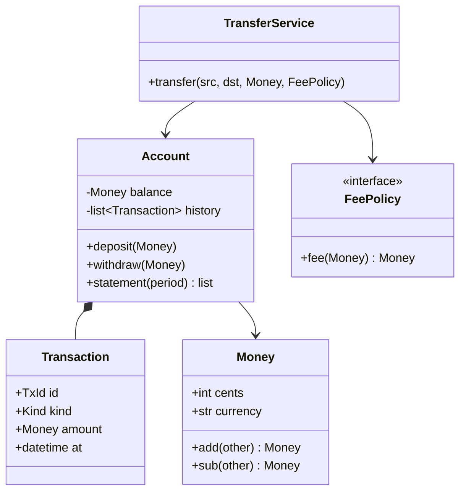

# Chapter 1 — OOP Fundamentals

> **Volume 3 — Low-Level Design** · [Contents](index.md) · Next → [Chapter 2 — SOLID Principles](ch02-solid-principles.md)

---

## Concept

Encapsulation, inheritance, composition, polymorphism; objects as data + behavior with invariants.

**In one sentence:** an object bundles data with the only operations allowed to change it, so it can guarantee its own rules (invariants) — and you build bigger behavior by composing small objects and swapping them through shared interfaces, using inheritance sparingly.

**Mental model — a vending machine.** You can't reach inside and set the coin count to a million; you press buttons (methods), and the machine enforces its rules: no snack without enough money, never a negative stock count (invariants). It's *made of* parts — a coin box, a dispenser, a display (composition). Different models all accept "insert coin" and "select item" (polymorphism), even though each works differently inside.

**The four pillars, practically**

| Pillar | What it really is for | In code |
|--------|----------------------|---------|
| **Encapsulation** | protecting invariants: the object is the only thing that can put itself into a state | private fields + methods that validate; no public setters for rule-bound data |
| **Abstraction** | exposing *what* an object does, hiding *how* | a small public interface; implementation details private |
| **Polymorphism** | many implementations behind one interface; callers don't branch on type | `shape.area()` for any shape; interfaces, traits, protocols, duck typing |
| **Inheritance** | reusing and specializing an existing class ("is-a") | `class SavingsAccount(Account)` — use sparingly |
| **Composition** | building objects out of other objects ("has-a") | `Car` *has an* `Engine`; delegate to it |

**Invariants** — statements that must be true for every object at every observable moment: `balance >= 0`, `start <= end`, `currency is a valid ISO code`, `items is never empty for a submitted order`. Encapsulation's job is to make it *impossible* to break them from outside: validate in the constructor, change state only through methods that re-check, and return copies (or immutable views) instead of internal mutable collections.

**Make invalid states unrepresentable** — design types so that a bad value can't even be constructed: `Email` instead of `str`, an enum instead of a status string, `DateRange(start, end)` that validates `start <= end`, separate `DraftOrder` and `SubmittedOrder` types instead of one class with nullable fields.

**Composition vs inheritance**

| | Inheritance ("is-a") | Composition ("has-a") |
|-|---------------------|------------------------|
| Coupling | tight: the subclass depends on the parent's *internals* ("fragile base class") | loose: depends only on the part's interface |
| Flexibility | fixed at class-definition time | parts can be swapped at runtime |
| Combining behaviors | class explosion (`FlyingSwimmingDuck`) | mix parts freely |
| Good when | a true, stable is-a with substitutability (see LSP in [Ch 2](ch02-solid-principles.md)); framework base classes | almost everything else |

Rule of thumb: **favor composition**; inherit only for genuine subtypes that honor the parent's contract.

---

## Prereqs

* [Vol 1 Ch 14 — Programming Paradigms](../volume-1-cs-foundations/ch14-programming-paradigms.md)

---

## Diagram

**A class diagram with fields/methods, is-a vs has-a**



**Encapsulation guarding an invariant**

```
                 ┌──────────── BankAccount ────────────┐
 withdraw(500) ─►│ if amount > balance: raise ✗         │
                 │ balance -= amount                    │   invariant: balance ≥ 0
 deposit(-20) ──►│ if amount <= 0: raise ✗              │   holds after EVERY method
                 │ _balance  (private)                  │
 acct._balance = -1  ✗ not part of the public interface  │
                 └──────────────────────────────────────┘
```

**Inheritance explosion vs composition**

```
 INHERITANCE                                  COMPOSITION
 Bird ── FlyingBird ── FlyingSwimmingBird      Bird
      └─ SwimmingBird ── SwimmingDivingBird    ├── movement: [Fly(), Swim()]
      └─ … one class per combination           └── sound: Quack()
                                               any combination, swappable at runtime
```

---

## Example

```python
from dataclasses import dataclass
from datetime import datetime, timezone

@dataclass(frozen=True)
class Money:
    cents: int
    currency: str = "EUR"
    def __post_init__(self):
        if len(self.currency) != 3:
            raise ValueError("currency must be an ISO 4217 code")
    def __add__(self, other: "Money") -> "Money":
        self._same(other); return Money(self.cents + other.cents, self.currency)
    def __sub__(self, other: "Money") -> "Money":
        self._same(other); return Money(self.cents - other.cents, self.currency)
    def _same(self, other):
        if other.currency != self.currency:
            raise ValueError("currency mismatch")

@dataclass(frozen=True)
class Transaction:
    kind: str
    amount: Money
    at: datetime

class InsufficientFunds(Exception): ...

class BankAccount:
    """Invariant: balance >= 0, and balance == sum of the history."""
    def __init__(self, account_id: str, currency: str = "EUR"):
        self._id = account_id
        self._balance = Money(0, currency)
        self._history: list[Transaction] = []

    @property
    def balance(self) -> Money:
        return self._balance                       # read-only; there is no setter

    @property
    def history(self) -> tuple[Transaction, ...]:
        return tuple(self._history)                # a copy: callers can't mutate our list

    def deposit(self, amount: Money) -> None:
        if amount.cents <= 0:
            raise ValueError("deposit must be positive")
        self._apply("deposit", amount, self._balance + amount)

    def withdraw(self, amount: Money) -> None:
        if amount.cents <= 0:
            raise ValueError("withdrawal must be positive")
        if amount.cents > self._balance.cents:
            raise InsufficientFunds(f"balance {self._balance.cents}, requested {amount.cents}")
        self._apply("withdraw", amount, self._balance - amount)

    def _apply(self, kind, amount, new_balance):
        self._history.append(Transaction(kind, amount, datetime.now(timezone.utc)))
        self._balance = new_balance

acct = BankAccount("acc-1")
acct.deposit(Money(1000))
acct.withdraw(Money(300))
print(acct.balance)                                # Money(cents=700, currency='EUR')
try:
    acct.withdraw(Money(5000))
except InsufficientFunds as e:
    print("refused:", e)
```

```python
# Polymorphism through a shared interface — callers never check types
from typing import Protocol

class FeePolicy(Protocol):
    def fee(self, amount: Money) -> Money: ...

class FlatFee:
    def fee(self, amount): return Money(50, amount.currency)

class PercentFee:
    def __init__(self, pct): self.pct = pct
    def fee(self, amount): return Money(amount.cents * self.pct // 100, amount.currency)

class Transfer:                                    # composition: HAS a fee policy
    def __init__(self, policy: FeePolicy): self.policy = policy
    def total(self, amount): return amount + self.policy.fee(amount)

print(Transfer(FlatFee()).total(Money(1000)).cents, Transfer(PercentFee(2)).total(Money(1000)).cents)  # 1050 1020
```

---

## Exercises

1. Refactor inheritance to composition.

   ```python
   class Logger: ...
   class FileLogger(Logger): ...
   class TimestampedFileLogger(FileLogger): ...
   class TimestampedJsonFileLogger(TimestampedFileLogger): ...
   ```

   <details><summary>Solution</summary>Split the independent concerns into parts: a <i>sink</i> (<code>FileSink</code>, <code>StdoutSink</code>), a <i>formatter</i> (<code>TextFormatter</code>, <code>JsonFormatter</code>), and <i>enrichers</i> (<code>Timestamp()</code>). Then <code>Logger(sink=FileSink("app.log"), formatter=JsonFormatter(), enrichers=[Timestamp()])</code>. Any combination is possible without new classes, and each part is testable alone.</details>

2. Design a class where no invalid state is representable.

   <details><summary>Solution</summary>A <code>DateRange</code>: frozen, validated in <code>__post_init__</code> (<code>start &lt;= end</code>, both timezone-aware), with methods that return <i>new</i> ranges (<code>extend(days)</code>) and re-validate. Or an order lifecycle modeled as separate types — <code>DraftOrder</code> (editable, may be empty) → <code>submit()</code> → <code>SubmittedOrder</code> (non-empty, immutable items, has <code>submitted_at</code>) — so "a submitted order without items" can't exist.</details>

3. Why does returning `self._history` directly break encapsulation?

   <details><summary>Solution</summary>The caller gets a reference to the internal list and can append a fake transaction or clear it, breaking the invariant "balance equals the sum of the history" without going through any method. Return a tuple or copy, or an immutable view.</details>

---

## Mini project

**A `BankAccount`/`Transaction` domain model with enforced invariants.**



**Steps**

1. An immutable `Money` value object (integer cents, currency; arithmetic refuses mixed currencies).
2. `Account` with private state; `deposit`/`withdraw` enforce `balance >= 0`; `history` is read-only.
3. A `Kind` enum instead of strings; a `Transaction` value object.
4. `TransferService` that moves money between two accounts atomically (both succeed or neither), with a pluggable `FeePolicy` (composition + polymorphism).
5. Property tests (Hypothesis): for any sequence of random operations, `balance >= 0` and `balance == sum(history)` always hold.

**Done when:** no public API call sequence can break the invariants, which the property tests prove over thousands of random sequences.

---

## Open source

* [`python/cpython`](https://github.com/python/cpython) classes — `Lib/dataclasses.py` (how `frozen=True` blocks assignment) and `Lib/fractions.py` (a well-encapsulated immutable value type).
* [`rust-lang/rust`](https://github.com/rust-lang/rust) (structs + traits as OOP) — Rust has no inheritance: private fields by default, `impl` blocks for behavior, and traits for polymorphism. See the Rust Book chapter 17, "Object-Oriented Programming Features".

---

## Interview

1. **"Composition vs inheritance?"**
   <details><summary>Answer</summary>Inheritance models is-a and reuses code, but couples the subclass to the parent's internals, fixes behavior at compile time, and multiplies classes when behaviors combine. Composition builds objects from parts behind interfaces: looser coupling, runtime swapping, and easy combination. Prefer composition; use inheritance only for true subtypes that can substitute for the parent everywhere (Liskov), or when a framework requires it.</details>

2. **"What is encapsulation really for?"**
   <details><summary>Answer</summary>Protecting invariants. It isn't about hiding fields for the sake of it: it makes the object the sole gatekeeper of its own state, so every state change passes through code that enforces the rules. That keeps bugs local (only the class can break its invariants), lets you change the internal representation without breaking callers, and makes the public interface small and meaningful.</details>

---

## Checklist

- [ ] hide fields behind methods
- [ ] make invalid states unrepresentable
- [ ] prefer composition

---

> [Contents](index.md) · Next → [Chapter 2 — SOLID Principles](ch02-solid-principles.md)
