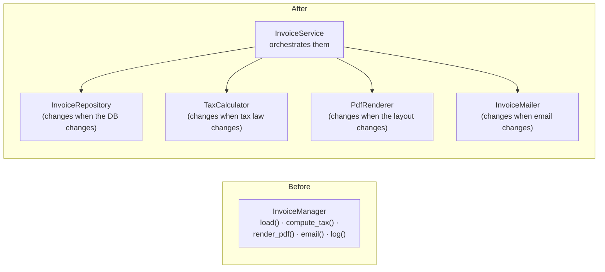
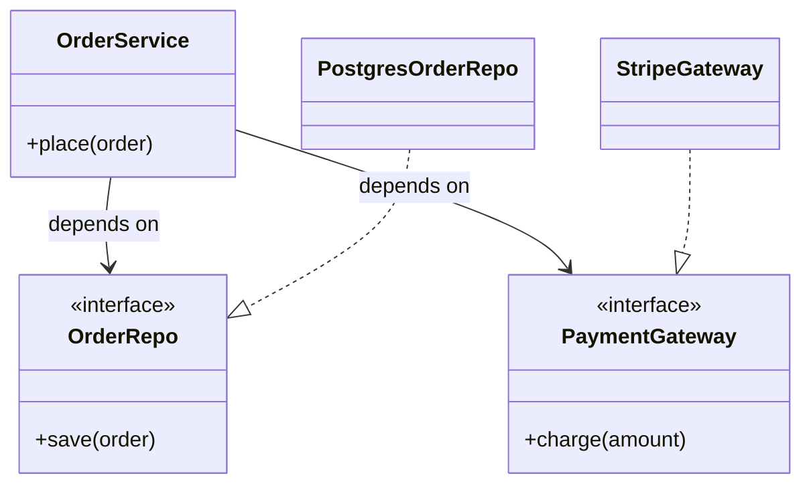
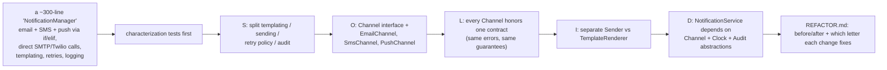

# Chapter 2 — SOLID Principles

> **Volume 3 — Low-Level Design** · [Contents](index.md) · ← [Chapter 1 — OOP Fundamentals](ch01-oop-fundamentals.md) · Next → [Chapter 3 — Design Principles (Cohesion, Coupling, YAGNI, DRY, KISS)](ch03-design-principles-cohesion-coupling-yagni-dry-kiss.md)

---

## Concept

Single responsibility, Open/closed, Liskov substitution, Interface segregation, Dependency inversion — with violations and fixes.

**In one sentence:** SOLID is five guidelines for arranging classes so that each change touches as little code as possible — one reason to change per class, new behavior added rather than edited in, subtypes that truly substitute, small focused interfaces, and business logic that depends on abstractions it owns.

**Mental model — a well-run kitchen.**

* **S** — the baker bakes, the cashier takes money. A new payment system doesn't retrain the baker.
* **O** — adding a new pizza means adding a new recipe card, not rewriting the oven's manual.
* **L** — any certified chef can cover the grill station; a "chef" who can't touch heat isn't a substitute.
* **I** — the dishwasher's checklist doesn't include "create the tasting menu".
* **D** — the head chef orders "10 kg of flour" from *a* supplier contract, not from one specific farmer's truck.

**The five principles**

| Letter | Principle | Smell (violation) | Fix |
|:-:|-----------|-------------------|-----|
| **S** | **Single Responsibility**: a module should have one reason to change (one actor it serves) | a "god class" `ReportManager` that queries the DB, calculates, formats PDF, and emails | split: `ReportRepository`, `ReportCalculator`, `PdfRenderer`, `ReportMailer` |
| **O** | **Open/Closed**: open for extension, closed for modification | a growing `if/elif` or `switch` on a type that you edit for every new case | a strategy/interface + one new class per case; register it |
| **L** | **Liskov Substitution**: subtypes must be usable anywhere the base type is, without surprises | a subclass that throws `NotImplementedError`, strengthens preconditions, weakens guarantees (`Square(Rectangle)`, a read-only list extending a mutable one) | separate abstractions, or don't inherit |
| **I** | **Interface Segregation**: clients shouldn't depend on methods they don't use | a fat `Machine` interface with `print`, `scan`, `fax`; `SimplePrinter` must stub `fax` | small role interfaces: `Printer`, `Scanner`, `Fax` |
| **D** | **Dependency Inversion**: high-level policy depends on abstractions; details implement them | `OrderService` imports and constructs `MySQLOrderTable` and `StripeClient` | `OrderService(repo: OrderRepo, payments: PaymentGateway)`; adapters implement them ([Vol 2 Ch 3](../volume-2-software-engineering/ch03-dependency-injection-and-inversion-of-control.md)) |

**LSP in detail — the contract rules.** A subtype may:

| May | May not |
|-----|---------|
| accept *more* inputs (weaker preconditions) | require *more* (stronger preconditions) |
| promise *more* (stronger postconditions) | promise *less* (weaker postconditions) |
| keep all the parent's invariants | break an invariant the parent guaranteed |
| raise the same kinds of errors | raise new, unexpected ones |

**Don't over-apply.** SOLID is a tool for managing *change*. Applying OCP to code that will never get a second variant creates needless indirection (see YAGNI in [Ch 3](ch03-design-principles-cohesion-coupling-yagni-dry-kiss.md)). Refactor toward SOLID when change actually starts to hurt.

---

## Prereqs

* [Chapter 1 — OOP Fundamentals](ch01-oop-fundamentals.md)

---

## Diagram

**S — splitting a god class**



**O — replace a switch with strategies**

```
 BEFORE (edit this function for every new shipping method)   AFTER (add a class; don't touch the old ones)
 def cost(order, method):                                    class Shipping(Protocol): def cost(self, o) -> int
     if method == "standard": return 499                     class Standard:  cost = lambda s, o: 499
     elif method == "express": return 1299                   class Express:   cost = lambda s, o: 1299
     elif method == "drone": …  ← edit, retest everything     class Drone:     … ← new file, new test
                                                             SHIPPING = {"standard": Standard(), …}
```

**L — the classic `Square(Rectangle)` violation**

```
 def stretch(r: Rectangle):
     r.width = 10; r.height = 5
     assert r.area() == 50        ✓ Rectangle      ✗ Square (setting height also set width → 25)
 Square strengthens the invariant (width == height), so it can't substitute for a mutable Rectangle.
 fix: make them siblings under an immutable Shape with area(), or don't allow mutation.
```

**I and D together**



The arrows from the details point *toward* the abstractions owned by the business layer — that's the inversion.

---

## Example

```python
from abc import ABC, abstractmethod
from typing import Protocol

# ---- O: open for extension via a strategy registry ----
class DiscountRule(Protocol):
    def applies(self, order) -> bool: ...
    def amount(self, order) -> int: ...

class BulkDiscount:
    def applies(self, o): return sum(i.qty for i in o.items) >= 10
    def amount(self, o): return o.subtotal * 5 // 100

class LoyaltyDiscount:
    def applies(self, o): return o.customer.years >= 3
    def amount(self, o): return 500

RULES: list[DiscountRule] = [BulkDiscount(), LoyaltyDiscount()]   # a new rule = a new class + one line

def best_discount(order) -> int:
    return max((r.amount(order) for r in RULES if r.applies(order)), default=0)

# ---- L: a violation and its fix ----
class Bird(ABC):
    @abstractmethod
    def move(self) -> str: ...

class FlyingBird(Bird):
    def move(self): return "flies"
    def fly_to(self, place): return f"flies to {place}"

class Sparrow(FlyingBird): ...
class Penguin(Bird):                       # NOT a FlyingBird — so it can never be asked to fly_to
    def move(self): return "swims"

# (the violation would be: class Penguin(FlyingBird): def fly_to(...): raise NotImplementedError)

# ---- I: role interfaces instead of one fat one ----
class Printer(Protocol):
    def print(self, doc) -> None: ...
class Scanner(Protocol):
    def scan(self) -> bytes: ...

class BasicPrinter:                        # implements only what it can do
    def print(self, doc): ...
class OfficeMachine:                       # implements both
    def print(self, doc): ...
    def scan(self): return b"..."

def print_invoices(p: Printer, docs):      # depends only on the role it needs
    for d in docs: p.print(d)

# ---- D: policy depends on abstractions it owns ----
class OrderRepo(Protocol):
    def save(self, order) -> None: ...

class OrderService:
    def __init__(self, repo: OrderRepo):   # not PostgresOrderRepo()
        self.repo = repo
```

---

## Exercises

1. Find and fix an LSP violation.

   ```python
   class FileStore:
       def save(self, key: str, data: bytes) -> None: ...
       def load(self, key: str) -> bytes: ...

   class ReadOnlyFileStore(FileStore):
       def save(self, key, data):
           raise PermissionError("read-only")
   ```

   <details><summary>Solution</summary>Code that receives a <code>FileStore</code> expects <code>save</code> to work; the subclass adds a new failure mode (a weaker postcondition), so it can't substitute. Fix: split the roles — <code>Readable</code> (<code>load</code>) and <code>Writable</code> (<code>save</code>) interfaces; <code>FileStore</code> implements both, <code>ReadOnlyFileStore</code> only <code>Readable</code>. Functions that only read take a <code>Readable</code>. (This is ISP fixing LSP.)</details>

2. Apply DIP to decouple a high-level module from a low-level one.

   <details><summary>Solution</summary>A <code>ReportService</code> that calls <code>boto3.client("s3").put_object(...)</code> directly: define <code>ReportStorage(Protocol)</code> with <code>put(name, data)</code> in the reports module; implement <code>S3ReportStorage</code> in an infrastructure module; inject it at the composition root. Now the report logic has no AWS imports, can be tested with an in-memory storage, and a switch to GCS touches only one adapter.</details>

3. Which principle does this violate, and why? A `User` class with `save_to_db()`, `to_json()`, `send_welcome_email()`, and `validate_password()`.

   <details><summary>Solution</summary>SRP: it changes for four different reasons (database schema, API format, email templates, password policy), each owned by a different group. Keep the domain rules on <code>User</code> (perhaps <code>validate_password</code>); move persistence to a repository, serialization to a schema/serializer, and email to a notification service.</details>

---

## Mini project

**Refactor a small codebase until all five principles hold and explain each fix.**



**Steps**

1. Write (or take) a tangled notifications module that does everything with `if channel == ...`.
2. Lock the behavior in with characterization tests.
3. Apply one principle per commit, and explain it in the commit message.
4. Add a new channel (e.g. Slack) at the end: it should need *only* a new class and one registration line (OCP proof).
5. Write `REFACTOR.md` with a before/after diagram and a table: change → principle → what future change it makes cheaper.

**Done when:** adding a channel touches no existing classes, the tests never broke, and every class can be described in one sentence without "and".

---

## Open source

* [`spring-projects/spring-framework`](https://github.com/spring-projects/spring-framework) (DIP/DI in practice) — interfaces such as `org.springframework.core.io.Resource` and `ApplicationEventPublisher`: small role interfaces with many implementations, wired by the container. Also read Robert C. Martin's original "Design Principles and Design Patterns" paper.

---

## Interview

1. **"Explain each SOLID letter with an example."**
   <details><summary>Answer</summary>S: split an <code>InvoiceManager</code> that computes, renders, and emails into three classes, because each changes for a different reason. O: add a new discount rule as a new strategy class instead of editing an <code>if/elif</code> chain. L: a <code>ReadOnlyStore</code> that throws on <code>save</code> can't substitute for a <code>Store</code>; model it as a separate interface. I: split a fat <code>Machine</code> interface into <code>Printer</code> and <code>Scanner</code> so a basic printer doesn't stub <code>scan</code>. D: <code>OrderService</code> depends on an <code>OrderRepo</code> interface it owns; <code>PostgresOrderRepo</code> implements it and is injected.</details>

2. **"What's a real LSP violation?"**
   <details><summary>Answer</summary>Common real ones: a subclass that raises <code>NotImplementedError</code> for an inherited method; an immutable collection subclassing a mutable one; <code>Square</code> extending a mutable <code>Rectangle</code>; a cached repository that returns stale data where the base promises read-your-writes; an override that requires extra setup before use. Each forces callers to check the concrete type, which is the tell. Fix with separate abstractions or composition.</details>

---

## Checklist

- [ ] one reason to change per class
- [ ] extend without modifying
- [ ] depend on abstractions

---

> [Contents](index.md) · ← [Chapter 1 — OOP Fundamentals](ch01-oop-fundamentals.md) · Next → [Chapter 3 — Design Principles (Cohesion, Coupling, YAGNI, DRY, KISS)](ch03-design-principles-cohesion-coupling-yagni-dry-kiss.md)
