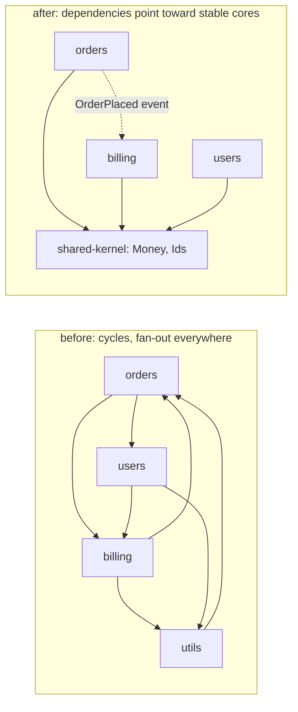
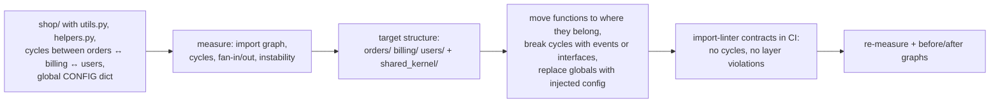

# Chapter 3 — Design Principles (Cohesion, Coupling, YAGNI, DRY, KISS)

> **Volume 3 — Low-Level Design** · [Contents](index.md) · ← [Chapter 2 — SOLID Principles](ch02-solid-principles.md) · Next → [Chapter 4 — UML & Diagramming](ch04-uml-and-diagramming.md)

---

## Concept

Cohesion vs coupling; YAGNI/DRY/KISS as heuristics, and when they conflict.

**In one sentence:** good design keeps things that change together in the same place (high cohesion) and minimizes how much separate places need to know about each other (low coupling) — while DRY, YAGNI, and KISS are rules of thumb that help, but can pull in opposite directions and must be weighed, not obeyed blindly.

**Mental model — a toolbox with drawers.** A well-organized toolbox has one drawer for screwdrivers, one for wrenches (cohesion: related things together). You can take out the screwdriver drawer without disturbing the wrenches (low coupling). A drawer labeled "misc" is low cohesion. A drawer that only opens if two others are open first is high coupling.

**Cohesion** — how strongly the parts of one module belong together.

| Level (worst → best) | Parts are together because… | Example |
|----------------------|-----------------------------|---------|
| Coincidental | no reason | `utils.py` with date helpers, a CSV parser, and an email regex |
| Logical | they're the "same kind" of thing | `handlers.py` with every HTTP handler of every feature |
| Temporal | they run at the same time | `startup()` that inits the DB, loads config, warms caches |
| Communicational | they use the same data | functions all operating on the `orders` table |
| **Functional** | they all contribute to one well-defined job | `pricing/` computing an order's price, and nothing else |

**Coupling** — how much one module depends on another's details.

| Level (worst → best) | Means | Example |
|----------------------|-------|---------|
| Content | reaches into another module's internals | `orders._cache.clear()` from outside |
| Common / global | shares global mutable state | a module-level `CONFIG` dict everyone mutates |
| Control | passes flags that steer the other's logic | `render(data, mode=3)` |
| Stamp | passes a big structure when a field would do | `send_email(user)` when it only needs `user.email` |
| **Data** | passes only the simple data needed | `send_email(to="a@b.c", subject=…)` |
| **Message / interface** | talks through a small, stable interface or events | `payments.charge(amount)`; an `OrderPlaced` event |

**Measuring coupling** — *fan-out* (how many modules this one imports) and *fan-in* (how many import it); Martin's *instability* `I = fan_out / (fan_in + fan_out)` (0 = stable, relied upon; 1 = unstable, relies on others). Stable modules should be abstract; dependencies should point toward stability. Cycles between modules are the strongest smell.

**The heuristics**

| Heuristic | Says | Protects against | Over-applied, it causes |
|-----------|------|------------------|------------------------|
| **DRY** — Don't Repeat Yourself | every piece of *knowledge* has one authoritative place | inconsistent copies of a rule (tax rate in 4 places) | "shared" helpers that couple unrelated features; flag-laden functions |
| **YAGNI** — You Aren't Gonna Need It | don't build for imagined futures | speculative generality: plugin systems with one plugin, unused parameters | refusing obvious, cheap design for known needs |
| **KISS** — Keep It Simple | the simplest thing that works | cleverness, needless layers and indirection | oversimplifying a truly complex domain |

**When DRY hurts** — DRY is about *knowledge*, not *text*. Two snippets that look the same but represent different decisions ("a user's display name" vs "an invoice's legal name") will change for different reasons. Merging them couples two features: a change for one breaks the other, and the shared function grows flags. Rule of three: tolerate duplication until the third occurrence *and* you're sure it's the same concept. "Duplication is far cheaper than the wrong abstraction" (Sandi Metz).

---

## Prereqs

* [Chapter 2 — SOLID Principles](ch02-solid-principles.md)

---

## Diagram

**A cohesion/coupling matrix with the target zone**

```
                      COUPLING  →
                 low                          high
            ┌──────────────────────┬──────────────────────┐
     high   │  ✅ TARGET            │  "distributed        │
            │  focused modules,     │   monolith": each     │
 COHESION   │  small interfaces     │   part is neat but    │
            │                       │   everything calls    │
            │                       │   everything          │
            ├──────────────────────┼──────────────────────┤
     low    │  "junk drawers":      │  ❌ BIG BALL OF MUD    │
            │  utils.py, misc/,     │  change anything,     │
            │  isolated but random  │  break everything     │
            └──────────────────────┴──────────────────────┘
```

**A tangled module graph vs a clean one**



**DRY that increased coupling**

```
 before: two similar functions            "DRY" merge                          undone
 format_user_name(u)     ─┐               format_name(x, kind, legal=False,     format_user_name(u)
 format_invoice_name(i)  ─┴─► merged ─►     uppercase=False, strip_suffix=…)   format_invoice_name(i)
                                            └ every change for invoices          each changes for its
                                              risks breaking user profiles       own reason again
```

---

## Example

```python
# The "DRY" mistake: one shared helper for two concepts
def format_name(first, last, *, legal=False, company=None, uppercase=False):
    if legal and company:                  # invoices need the company's legal name
        name = company
    else:
        name = f"{first} {last}".strip()   # profiles show a friendly name
    return name.upper() if uppercase else name

# Callers:
#   profile:  format_name(u.first, u.last)
#   invoice:  format_name(c.first, c.last, legal=True, company=c.legal_name, uppercase=True)
# A new invoice rule ("append the VAT number") now risks the profile page too.

# Undo it: duplication of TEXT is fine when the KNOWLEDGE differs
def display_name(user) -> str:
    return f"{user.first} {user.last}".strip()

def invoice_party_name(customer) -> str:
    base = customer.legal_name or f"{customer.first} {customer.last}"
    return f"{base.upper()} (VAT {customer.vat_id})" if customer.vat_id else base.upper()

# Real DRY: one authoritative place for a real rule
VAT_RATE = {"DE": 0.19, "FR": 0.20, "NL": 0.21}   # used by pricing, invoices, and reports
```

```python
# Measure coupling: fan-in, fan-out, instability, and cycles from imports
import ast, pathlib, collections

def import_graph(pkg_dir: str, pkg: str):
    graph = collections.defaultdict(set)
    for f in pathlib.Path(pkg_dir).rglob("*.py"):
        mod = f.relative_to(pkg_dir).with_suffix("").parts[0]
        for node in ast.walk(ast.parse(f.read_text(encoding="utf-8"))):
            names = []
            if isinstance(node, ast.ImportFrom) and node.module:
                names = [node.module]
            elif isinstance(node, ast.Import):
                names = [a.name for a in node.names]
            for n in names:
                parts = n.split(".")
                if parts[0] == pkg and len(parts) > 1 and parts[1] != mod:
                    graph[mod].add(parts[1])
    return graph

def report(graph):
    mods = set(graph) | {d for ds in graph.values() for d in ds}
    fan_in = {m: sum(m in ds for ds in graph.values()) for m in mods}
    for m in sorted(mods):
        out = len(graph.get(m, ()))
        inst = out / (out + fan_in[m]) if out + fan_in[m] else 0
        print(f"{m:12s} fan-in {fan_in[m]}  fan-out {out}  instability {inst:.2f}")
    cycles = [(a, b) for a in graph for b in graph[a] if a in graph.get(b, ())]
    print("cycles:", sorted({tuple(sorted(c)) for c in cycles}))
```

---

## Exercises

1. Measure coupling of two modules and reduce it.

   <details><summary>Solution</summary>Run the import-graph script (or <code>pydeps</code>, <code>import-linter</code>). Suppose <code>orders</code> and <code>billing</code> import each other (a cycle). Fix: move shared value types (<code>Money</code>, <code>OrderId</code>) into a small shared kernel both depend on; let <code>billing</code> react to an <code>OrderPlaced</code> event instead of <code>orders</code> calling billing internals; pass data, not whole objects. Re-measure: the cycle is gone and fan-out drops. Add an <code>import-linter</code> contract to CI so it can't return.</details>

2. Find a premature abstraction (YAGNI violation) and remove it.

   <details><summary>Solution</summary>Typical finds: an <code>AbstractStorageFactoryProvider</code> with one implementation; a plugin registry with one plugin; config options nobody sets; a generic <code>Repository[T]</code> used by one type. Inline it: replace the interface + factory with the concrete class and delete unused parameters. Keep a seam only where a test double or a second implementation actually exists. The code gets shorter and easier to follow; re-add the abstraction when the second real case arrives.</details>

3. Two teams' services both define `normalize_phone()`. Should you share it?

   <details><summary>Solution</summary>If it represents the same business rule (for example E.164 normalization required by your SMS provider), put it in one library or service with an owner. If each team normalizes for different reasons (display vs fraud checks), keep separate copies: they will diverge, and a shared version would couple two release cycles.</details>

---

## Mini project

**Refactor a tangled module into high-cohesion, low-coupling components.**



**Steps**

1. Start from a messy package (write one, or take an old project).
2. Generate the import graph and a table of fan-in, fan-out, and instability; list the cycles.
3. Dissolve `utils.py`: move each function next to the feature that uses it (or into a small shared kernel if truly shared).
4. Break each cycle using a shared kernel, dependency inversion, or events.
5. Replace global mutable config with injected settings.
6. Add `import-linter` contracts (forbidden imports, layers, independence) to CI; re-measure and draw the before/after graphs.

**Done when:** there are no import cycles, no junk-drawer modules, and a CI contract fails if someone reintroduces a forbidden dependency.

---

## Open source

* [`rust-lang/rust`](https://github.com/rust-lang/rust) (module boundaries) — the standard library's split into `core` (no allocation, no OS), `alloc`, and `std` is a large-scale lesson in low coupling: each layer depends only on the one below.
* [`golang/go`](https://github.com/golang/go) (packages) — Go forbids import cycles at compile time and encourages small, focused packages (`net/http`, `encoding/json`); `internal/` directories enforce boundaries. See also `seddonym/import-linter` for Python.

---

## Interview

1. **"DRY vs coupling — when does DRY hurt?"**
   <details><summary>Answer</summary>When it merges code that looks alike but represents different knowledge that changes for different reasons. The shared abstraction couples the callers: a change for one risks the others, and the function accumulates flags and special cases. DRY is about a single source of truth for a <i>rule</i>, not about deleting similar lines. Wait for the rule of three and confirm it's the same concept; otherwise prefer duplication to the wrong abstraction.</details>

2. **"What's cohesion?"**
   <details><summary>Answer</summary>The degree to which the elements of a module belong together — ideally they all serve one clearly defined purpose (functional cohesion), so a change to that purpose is local and the module is easy to name, understand, and test. Low cohesion shows up as "utils" or "manager" modules, "and" in the description, and unrelated changes landing in the same file. High cohesion inside modules plus low coupling between them is the core goal of modular design.</details>

---

## Checklist

- [ ] keep related things together
- [ ] reduce cross-module fan-in/fan-out
- [ ] say no to speculative generality

---

> [Contents](index.md) · ← [Chapter 2 — SOLID Principles](ch02-solid-principles.md) · Next → [Chapter 4 — UML & Diagramming](ch04-uml-and-diagramming.md)
