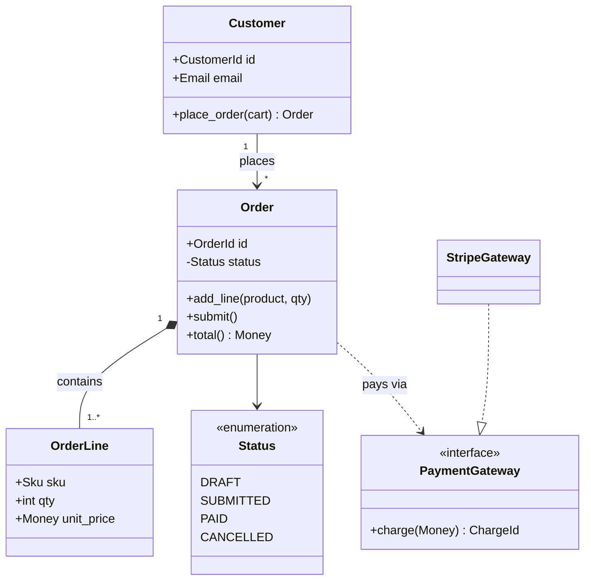
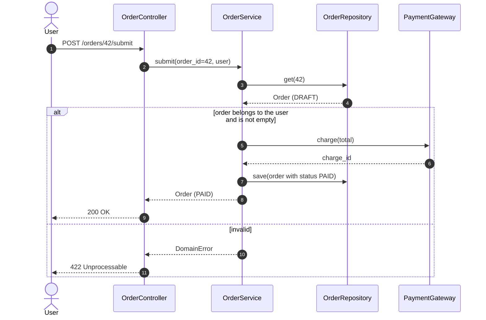
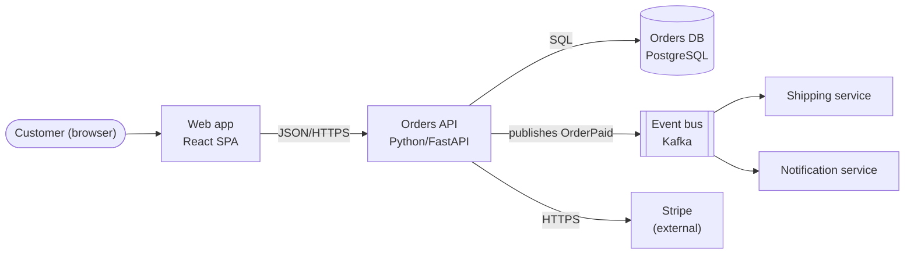
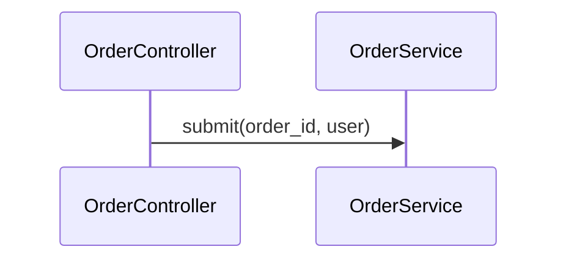
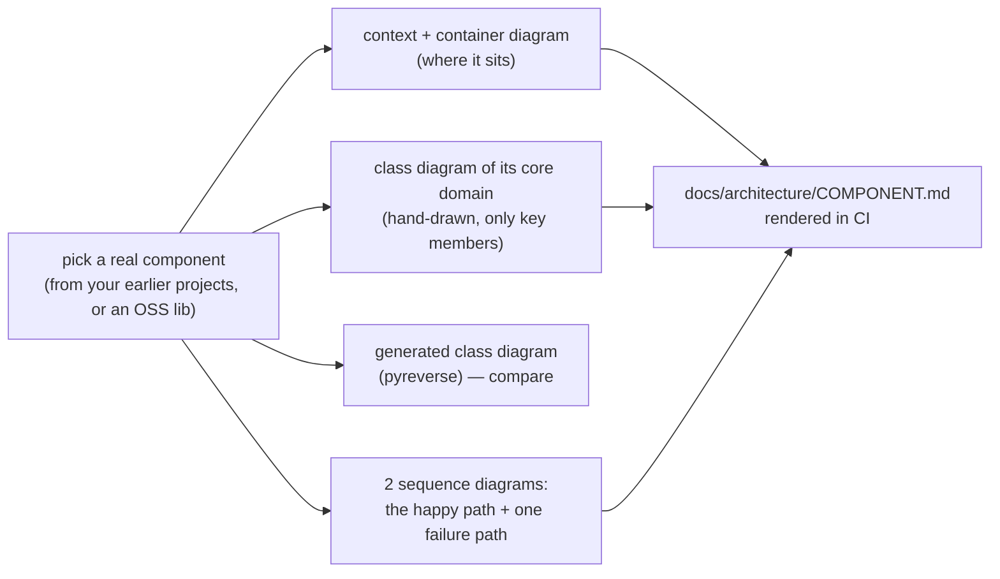

# Chapter 4 — UML & Diagramming

> **Volume 3 — Low-Level Design** · [Contents](index.md) · ← [Chapter 3 — Design Principles (Cohesion, Coupling, YAGNI, DRY, KISS)](ch03-design-principles-cohesion-coupling-yagni-dry-kiss.md) · Next → [Chapter 5 — GoF Creational Patterns](ch05-gof-creational-patterns.md)

---

## Concept

Class, sequence, and component diagrams; reading and writing the diagrams that communicate design.

**In one sentence:** a design diagram is a deliberately simplified picture that answers one question — *what things exist and how they relate* (class), *who calls whom in what order* (sequence), or *which deployable parts talk to which* (component) — at the right level of detail for its audience.

**Mental model — maps at different zoom levels.** A world map, a city map, and a floor plan are all "maps", but each answers different questions, and one map that tried to show everything would be unreadable. Diagrams are the same: choose the zoom level (altitude) and the question first, then draw only what answers it.

**The three diagrams you'll use 90% of the time**

| Diagram | Question it answers | Shows | Typical audience |
|---------|--------------------|-------|------------------|
| **Class** | what types exist, what they hold, how they relate | classes, fields, methods, relationships, multiplicity | developers designing or reviewing a module |
| **Sequence** | what happens, in what order, for one scenario | participants (lifelines), messages, returns, alt/loop blocks | developers + reviewers of a flow (login, checkout) |
| **Component** | how the system is split into parts and how they connect | services, libraries, databases, queues, interfaces | the team, architects, new joiners |

Others worth knowing: **state** (lifecycle of one object, [Vol 1 Ch 17](../volume-1-cs-foundations/ch17-linux-processes-signals-services-systemd-ssh-cron.md) has one), **activity/flowchart** (a process with decisions), **ER** (database tables, [Vol 1 Ch 45](../volume-1-cs-foundations/ch45-sql-and-the-relational-model.md)), **deployment** (what runs where). The **C4 model** gives a clean set of zoom levels: Context → Containers → Components → Code.

**Class diagram notation**

| Symbol (UML) | Mermaid | Meaning | Example |
|--------------|---------|---------|---------|
| `+` / `-` / `#` | same | public / private / protected | `-balance: Money` |
| hollow triangle ▷ | `<\|--` | inheritance (is-a) | `Account <\|-- SavingsAccount` |
| dashed + triangle | `<\|..` / `..\|>` | implements an interface | `StripeGateway ..\|> PaymentGateway` |
| filled diamond ◆ | `*--` | **composition**: the part's life is bound to the whole | `Order *-- OrderLine` |
| hollow diamond ◇ | `o--` | **aggregation**: a whole groups parts that live independently | `Team o-- Player` |
| arrow → | `-->` | association / "uses" | `Order --> Customer` |
| dashed arrow ⇢ | `..>` | dependency (temporary use) | `ReportService ..> PdfRenderer` |
| `1`, `0..1`, `*`, `1..*` | `"1" -- "*"` | multiplicity | one customer, many orders |

**Sequence diagram notation**

| Element | Meaning |
|---------|---------|
| lifeline | a participant over time (a vertical line) |
| solid arrow `->>` | a call / message |
| dashed arrow `-->>` | a return / response |
| activation bar | the participant is busy handling a call |
| `alt / else`, `opt`, `loop`, `par` | conditional, optional, repeated, parallel fragments |
| note | a comment attached to participants |

**When is a diagram worth maintaining?** When it's *expensive to rediscover* and *changes slowly*: system context and component maps, key flows (auth, payments), and domain models. Keep them as **diagrams-as-code** (Mermaid, PlantUML, Structurizr) next to the code, reviewed in PRs. Throwaway whiteboard sketches for a design discussion don't need maintaining — photograph them into the ADR and move on. Generated diagrams (from DB schemas or code) never go stale.

---

## Prereqs

* [Chapter 1 — OOP Fundamentals](ch01-oop-fundamentals.md)

---

## Diagram

*(This chapter is the diagram.)*

**Class diagram — an ordering domain**



**Sequence diagram — a request through controller → service → repo**



**Component diagram (C4 "container" level)**



**Choosing the altitude**

```
 zoom out ▲  Context     "our system, its users, the external systems it talks to"  → execs, new joiners
          │  Container   "the deployable parts: web app, API, DB, queue"             → the whole team
          │  Component   "the modules inside one container"                           → that service's devs
 zoom in  ▼  Code        "classes and methods"                                        → usually generate, don't draw
```

---

## Example

**Diagrams as code, living next to the code they describe**

````markdown
<!-- docs/architecture/checkout.md -->
# Checkout flow

The diagram below is the source of truth for the checkout sequence.
Update it in the same PR as any change to `OrderService.submit`.


````

```python
# Generate a class diagram from real code, so it can never go stale
# pip install pylint   → pyreverse ships with pylint
#   pyreverse -o mmd -p shop src/shop          (writes classes_shop.mmd, packages_shop.mmd)
# Or: an ER diagram straight from the database schema
#   pip install eralchemy && eralchemy -i postgresql://localhost/shop -o docs/erd.md
```

```text
Reading checklist for someone else's class diagram
1. Find the aggregates: which classes own others (filled diamonds)?
2. Follow the interfaces: which dependencies can be swapped?
3. Check multiplicities: can an Order exist with zero lines? (1..* says no)
4. Look for cycles between classes — often a design smell.
```

---

## Exercises

1. Draw a class diagram for a small domain.

   <details><summary>Solution</summary>A library: <code>Member "1" --> "*" Loan</code>, <code>Loan --> "1" Copy</code>, <code>Book "1" *-- "*" Copy</code> (copies don't exist without their book record), <code>Member o-- Branch</code> (a member belongs to a home branch, but both exist independently), <code>Loan</code> with <code>due_date</code> and a <code>renew()</code> method, a <code>LoanStatus</code> enumeration, and a <code>FinePolicy</code> interface implemented by <code>StandardFines</code>. Show only the fields and methods needed to discuss the design.</details>

2. Draw a sequence diagram for a login flow.

   <details><summary>Solution</summary>

   ```mermaid
   sequenceDiagram
       actor U as User
       participant W as Web
       participant A as AuthService
       participant DB as UserStore
       U->>W: submit email + password
       W->>A: login(email, password)
       A->>DB: find_by_email(email)
       DB-->>A: user (hash, mfa_enabled)
       alt password ok and MFA enabled
           A-->>W: mfa_required (challenge id)
           U->>W: enter a 6-digit code
           W->>A: verify_mfa(challenge id, code)
           A-->>W: session token
       else password ok, no MFA
           A-->>W: session token
       else wrong password
           A-->>W: 401 (generic message, attempt counted)
       end
       W-->>U: set cookie + redirect
   ```
   </details>

3. Your architecture diagram in the wiki is two years out of date. What do you change so it doesn't happen again?

   <details><summary>Solution</summary>Move it into the repo as Mermaid or Structurizr next to the code, reduce it to the level that changes slowly (containers, not classes), generate the detailed parts (ERDs, class diagrams) from the source, add "diagram updated?" to the PR template, and link it from the README so people actually see it.</details>

---

## Mini project

**Document a real component with class + sequence diagrams (Mermaid).**



**Steps**

1. Choose a component you know well (e.g. the transfer service from [Ch 1](ch01-oop-fundamentals.md), or `requests.Session`).
2. Draw the context/container view: what it talks to.
3. Hand-draw a class diagram with only the members that matter for understanding; then generate one with `pyreverse` and write down what the hand-drawn one leaves out on purpose.
4. Draw two sequence diagrams: the main flow and one error or retry flow, with `alt`/`loop` fragments.
5. Put them in `docs/architecture/`, render them in the doc site, and ask someone unfamiliar with the code to explain the flow back to you from the diagrams alone.

**Done when:** a newcomer can correctly explain the component's main flow and its key classes using only your diagrams.

---

## Open source

* [`mermaid-js/mermaid`](https://github.com/mermaid-js/mermaid) — diagrams as text, rendered natively by GitHub, GitLab, and most docs tools; its docs cover class, sequence, state, ER, and C4 syntax. See also PlantUML and Structurizr (C4) for larger models, and c4model.com.

---

## Interview

1. **"Class vs sequence diagram — what does each show?"**
   <details><summary>Answer</summary>A class diagram shows static structure: the types, their data and operations, and relationships (inheritance, composition, association) with multiplicities — what exists. A sequence diagram shows dynamic behavior for one scenario: which participants exchange which messages, in what order, including conditions and loops — what happens over time. Use class diagrams to discuss the model and responsibilities, and sequence diagrams to discuss a flow and its failure cases.</details>

2. **"When is a diagram worth maintaining?"**
   <details><summary>Answer</summary>When the information is valuable, hard to reconstruct from the code, and changes slowly: system context and container maps, key cross-service flows, and the core domain model. Keep those as diagrams-as-code in the repo, reviewed in PRs, at a high enough altitude that they don't churn. Generate low-level diagrams (class, ER) from source instead of maintaining them, and treat whiteboard sketches as disposable, captured in ADRs.</details>

---

## Checklist

- [ ] draw readable class diagrams
- [ ] show message flow in sequence diagrams
- [ ] keep diagrams at the right altitude

---

> [Contents](index.md) · ← [Chapter 3 — Design Principles (Cohesion, Coupling, YAGNI, DRY, KISS)](ch03-design-principles-cohesion-coupling-yagni-dry-kiss.md) · Next → [Chapter 5 — GoF Creational Patterns](ch05-gof-creational-patterns.md)
