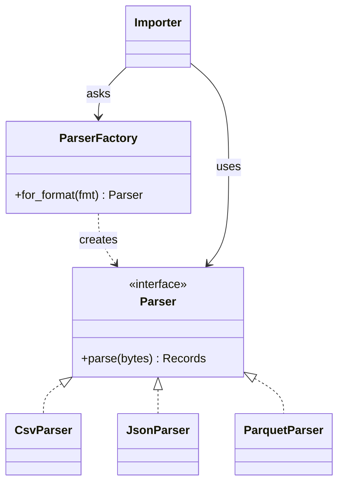
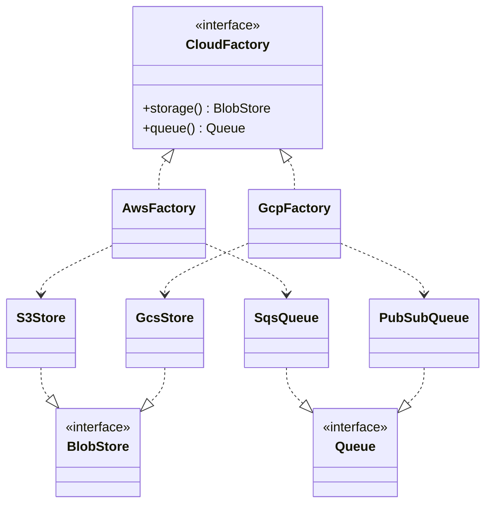
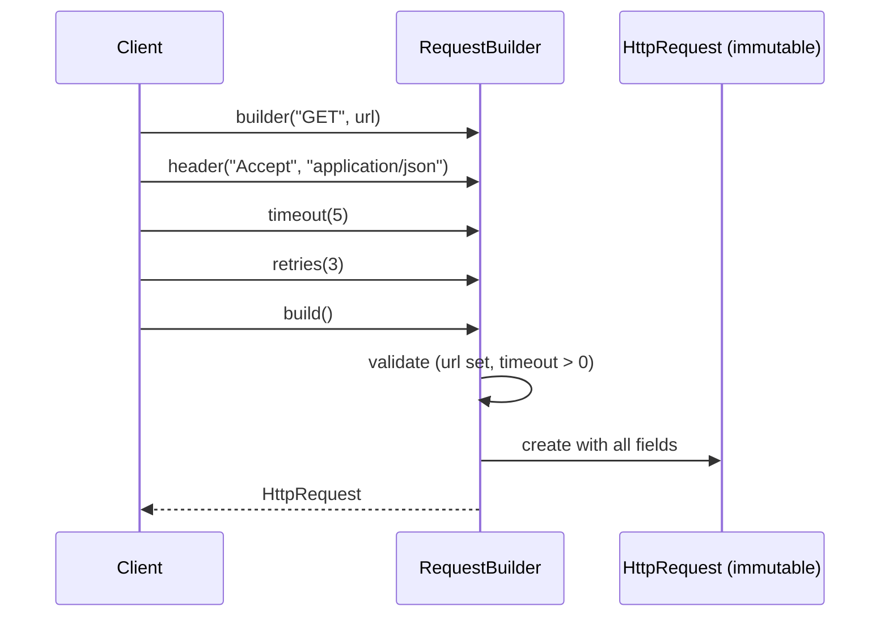
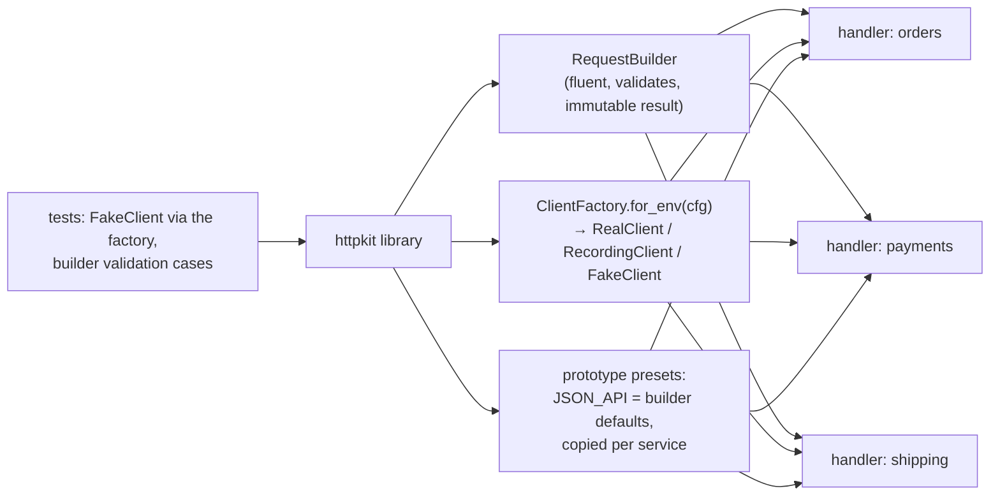

# Chapter 5 — GoF Creational Patterns

> **Volume 3 — Low-Level Design** · [Contents](index.md) · ← [Chapter 4 — UML & Diagramming](ch04-uml-and-diagramming.md) · Next → [Chapter 6 — GoF Structural Patterns](ch06-gof-structural-patterns.md)

---

## Concept

Factory Method, Abstract Factory, Builder, Singleton, Prototype — intent, structure, and when to reach for each.

**In one sentence:** creational patterns move the decision of *which* object to create and *how* to assemble it out of the code that uses it, so callers can depend on an interface while the creation logic lives in one place.

**Mental model — ordering at a restaurant.** You say "a coffee" (Factory Method) and the barista decides which machine and beans. You pick "the Italian menu" (Abstract Factory), and every dish that arrives matches that style. You build a custom burger step by step — bun, patty, no onions, extra cheese — and then say "done" (Builder). The restaurant has exactly one head chef (Singleton). A chef makes a new dish by copying yesterday's special and changing one thing (Prototype).

**The five patterns**

| Pattern | Intent | Reach for it when | Pythonic / modern form |
|---------|--------|-------------------|------------------------|
| **Factory Method** | let a method (or subclass) decide which concrete class to instantiate | callers shouldn't know concrete classes; the choice depends on input or config | a function or `dict` registry: `PARSERS[fmt]()` |
| **Abstract Factory** | create *families* of related objects that must match | several products must be consistent (UI widgets per theme; clients per cloud) | an object with `create_x()`/`create_y()` methods, chosen once |
| **Builder** | construct a complex object step by step, validating at the end | many optional parameters; invariants spanning several fields; immutable results | fluent builder, or keyword arguments + a dataclass for simple cases |
| **Singleton** | ensure one instance and a global access point | almost never; genuinely one shared resource (a process-wide registry) | a module-level instance, or better, create one at the composition root and inject it |
| **Prototype** | create objects by copying an existing instance | construction is expensive or configured at runtime; many near-identical variants | `copy.deepcopy`, `dataclasses.replace` |

**Builder vs Factory**

| | Factory | Builder |
|-|---------|---------|
| Question | *which* class to create | *how* to assemble one complex object |
| Calls | one call → a finished object | several steps → `build()` |
| Varies | the concrete type | the configuration |
| Example | `parser_for("csv")` → `CsvParser` | `HttpRequest.builder().url(…).header(…).timeout(5).build()` |

**Why Singleton is controversial**

* It's **global mutable state** in disguise: hidden dependencies, order-of-initialization bugs.
* It makes **testing hard**: you can't easily substitute a fake, and state leaks between tests.
* It hard-codes "exactly one", which often stops being true (two databases, multi-tenant).
* Thread-safe lazy initialization is subtle in some languages.

The better alternative: create one instance in `main()` and **pass it in** ([Vol 2 Ch 3](../volume-2-software-engineering/ch03-dependency-injection-and-inversion-of-control.md)) — "single instance" without "global access".

**Avoid over-applying patterns.** A factory with one product, a builder for a 3-field object, or an abstract factory with one family is ceremony. Use a pattern when it removes real duplication or decouples a real seam.

---

## Prereqs

* [Chapter 1 — OOP Fundamentals](ch01-oop-fundamentals.md)

---

## Diagram

**Factory Method**



**Abstract Factory — families that must match**



**Builder — participants**



**Singleton vs an injected single instance; Prototype**

```
 SINGLETON (global access)               INJECTED (one instance, explicit)       PROTOTYPE
 Metrics.instance().inc("x")             metrics = Metrics()   # in main()        base = Report(template, styles, …)
   hidden dependency; hard to fake       svc = Service(metrics)                  q1 = replace(base, period="Q1")
                                         test: Service(FakeMetrics())            q2 = replace(base, period="Q2")
```

---

## Example

```python
from __future__ import annotations
import csv, io, json, copy
from dataclasses import dataclass, field, replace
from typing import Protocol, Callable

# ---- Factory Method as a registry ----
class Parser(Protocol):
    def parse(self, data: bytes) -> list[dict]: ...

class CsvParser:
    def parse(self, data): return list(csv.DictReader(io.StringIO(data.decode())))

class JsonParser:
    def parse(self, data): return json.loads(data)

PARSERS: dict[str, Callable[[], Parser]] = {"csv": CsvParser, "json": JsonParser}

def parser_for(fmt: str) -> Parser:
    try:
        return PARSERS[fmt]()
    except KeyError:
        raise ValueError(f"unsupported format {fmt!r}; expected one of {sorted(PARSERS)}") from None

print(parser_for("csv").parse(b"a,b\n1,2\n"))       # [{'a': '1', 'b': '2'}]

# ---- Builder for an immutable config object with defaults ----
@dataclass(frozen=True)
class HttpRequest:
    method: str
    url: str
    headers: tuple[tuple[str, str], ...] = ()
    timeout: float = 10.0
    retries: int = 0

class RequestBuilder:
    def __init__(self, method: str, url: str):
        self._method, self._url = method.upper(), url
        self._headers: list[tuple[str, str]] = []
        self._timeout, self._retries = 10.0, 0

    def header(self, k, v): self._headers.append((k, v)); return self
    def timeout(self, s): self._timeout = s; return self
    def retries(self, n): self._retries = n; return self

    def build(self) -> HttpRequest:
        if not self._url.startswith(("http://", "https://")):
            raise ValueError("url must be absolute")
        if self._timeout <= 0 or self._retries < 0:
            raise ValueError("timeout must be > 0 and retries >= 0")
        if self._method not in {"GET", "HEAD", "PUT", "DELETE"} and self._retries:
            raise ValueError("retries only allowed for idempotent methods")   # a cross-field invariant
        return HttpRequest(self._method, self._url, tuple(self._headers), self._timeout, self._retries)

req = (RequestBuilder("get", "https://api.example.com/orders")
       .header("Accept", "application/json").timeout(5).retries(3).build())
print(req.method, req.timeout, req.retries)           # GET 5 3

# ---- Prototype ----
@dataclass(frozen=True)
class ReportSpec:
    title: str
    period: str
    sections: tuple[str, ...] = ("summary", "revenue", "churn")

base = ReportSpec("Quarterly", "Q1")
q2 = replace(base, period="Q2")                      # copy + change one field
print(q2)

# ---- "Singleton" the Pythonic way: one instance, created once, injected ----
class Metrics:
    def __init__(self): self.counts = {}
    def inc(self, k): self.counts[k] = self.counts.get(k, 0) + 1

def main():
    metrics = Metrics()                              # the single instance lives here
    run_app(metrics=metrics)                         # passed where needed, fakeable in tests
```

---

## Exercises

1. Implement a builder for a complex object.

   <details><summary>Solution</summary>An <code>EmailMessage</code> builder: <code>to()</code> (repeatable), <code>cc()</code>, <code>subject()</code>, <code>text_body()</code> / <code>html_body()</code>, <code>attach(path)</code>. <code>build()</code> validates cross-field rules — at least one recipient, a subject, at least one body, attachments under 20 MB total — and returns a frozen object. Test that invalid combinations raise and valid ones produce an immutable result. (If there were only 3 optional fields, keyword arguments on a dataclass would be simpler — say so.)</details>

2. Replace a `new` scattered across callers with a factory.

   <details><summary>Solution</summary>Before: ten call sites do <code>if env == "prod": client = S3Client(...) else: client = LocalDiskClient(...)</code>. After: one <code>storage_for(config) -&gt; BlobStore</code> factory (or an abstract factory if queue and storage must match per environment), called once at the composition root and injected. Callers depend on the <code>BlobStore</code> interface only; adding a new backend changes one function.</details>

3. When is a Singleton acceptable?

   <details><summary>Solution</summary>Rarely: for truly process-wide, stateless or read-only resources where "exactly one" is a real constraint — a logging configuration, an immutable registry built at import. Even then, prefer creating it at the composition root and passing it in, so tests can swap it.</details>

---

## Mini project

**A config/request builder library used across multiple handlers.**



**Steps**

1. `RequestBuilder` with defaults, fluent methods, cross-field validation, and an immutable `HttpRequest`.
2. Prototype presets: a `JSON_API` base request (headers, timeout) that services copy and adjust with `replace`.
3. A `ClientFactory.for_env(config)` that returns a real, recording, or fake client behind one `HttpClient` protocol.
4. Use it from three handlers; none of them construct clients or set default headers directly.
5. Tests: builder validation (a table of invalid combinations), and handlers tested with the fake client from the factory.

**Done when:** changing the default timeout or adding an auth header for every service is a one-line change in the library, and handler tests never touch the network.

---

## Open source

* [`spring-projects/spring-framework`](https://github.com/spring-projects/spring-framework) (factories) — `BeanFactory` and `FactoryBean` are factory patterns at the heart of the IoC container; Spring beans default to "singleton" *scope* managed by the container, not the global-access GoF singleton.
* [`rust-lang/rust`](https://github.com/rust-lang/rust) builder crates — `std::process::Command` and `std::thread::Builder` are builders in the standard library; the `derive_builder` and `typed-builder` crates generate them (typed-builder checks required fields at compile time).

---

## Interview

1. **"Builder vs Factory?"**
   <details><summary>Answer</summary>A factory decides <i>which</i> concrete type to create and returns it in one call, hiding the class choice behind an interface (a parser per format). A builder handles <i>how</i> to assemble one complex object step by step — many optional parts, validation across fields, often producing an immutable result. You can combine them: a factory that returns a pre-configured builder.</details>

2. **"Why is Singleton controversial?"**
   <details><summary>Answer</summary>It combines "one instance" with "global access", which makes it global mutable state: dependencies become hidden, tests can't easily substitute it and state leaks between them, initialization order and thread-safety get tricky, and "exactly one" often turns out to be false (multiple tenants or databases). Usually you want one instance created at the composition root and injected, which keeps the benefit without the global.</details>

---

## Checklist

- [ ] know each pattern's intent
- [ ] use a factory at a real seam
- [ ] avoid over-applying patterns

---

> [Contents](index.md) · ← [Chapter 4 — UML & Diagramming](ch04-uml-and-diagramming.md) · Next → [Chapter 6 — GoF Structural Patterns](ch06-gof-structural-patterns.md)
