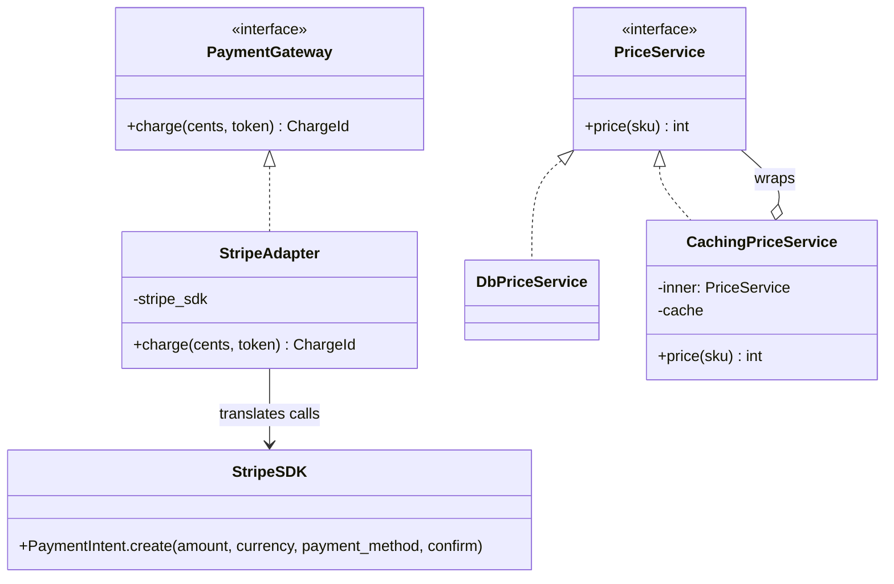
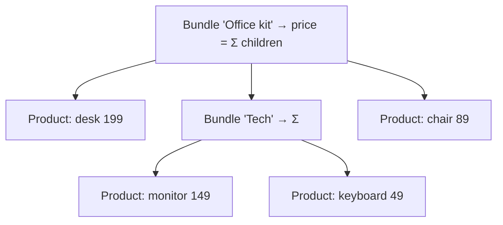
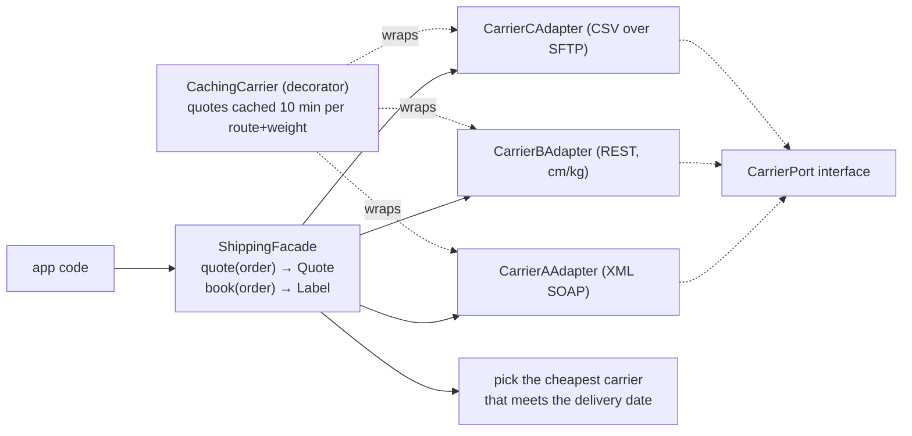

# Chapter 6 — GoF Structural Patterns

> **Volume 3 — Low-Level Design** · [Contents](index.md) · ← [Chapter 5 — GoF Creational Patterns](ch05-gof-creational-patterns.md) · Next → [Chapter 7 — GoF Behavioral Patterns](ch07-gof-behavioral-patterns.md)

---

## Concept

Adapter, Decorator, Facade, Proxy, Bridge, Composite, Flyweight.

**In one sentence:** structural patterns are ways of *wrapping and combining* objects — to make an interface fit (Adapter), add behavior without editing (Decorator), hide a mess (Facade), control access (Proxy), split an abstraction from its implementation (Bridge), treat a tree like one object (Composite), or share the heavy parts (Flyweight).

**Mental model — travel gear.** An Adapter is a plug adapter: your laptop plug stays the same; the adapter makes it fit a foreign socket. A Decorator is a phone case: the phone is unchanged, the case adds grip or a wallet, and you can stack cases. A Facade is a hotel concierge: one person who deals with taxis, restaurants, and tickets for you. A Proxy is a receptionist who decides whether you may see the manager.

**The seven patterns**

| Pattern | Intent | Same interface as the wrapped object? | Typical use |
|---------|--------|:-:|-------------|
| **Adapter** | convert one interface into the one clients expect | no — it *changes* the interface | wrapping a third-party SDK behind your own port |
| **Decorator** | add responsibilities dynamically, by wrapping | **yes** — so decorators stack | caching, logging, retries, metrics, auth around a service |
| **Facade** | one simple entry point to a complex subsystem | no — a *new, smaller* interface | `send_invoice()` over PDF + storage + email + audit |
| **Proxy** | a stand-in that controls access to the real object | yes | lazy loading, remote proxies (RPC stubs), access control, rate limiting |
| **Bridge** | separate an abstraction from its implementation so both vary independently | — | `Notification × Channel` (Email/SMS/Push) without N×M subclasses |
| **Composite** | treat single objects and groups the same way (tree) | yes | file systems, UI widget trees, org charts, pricing bundles |
| **Flyweight** | share immutable intrinsic state among many objects | yes | glyphs in an editor, map tiles, game sprites, interned strings |

**Decorator vs Proxy vs Adapter** — all three wrap an object. Ask *why*: Adapter changes the shape to fit; Decorator adds behavior and is chosen by the client; Proxy controls access and usually pretends to be the real object (the client may not know).

**Decorator vs inheritance** — inheritance fixes behavior at compile time and multiplies subclasses (`CachedLoggedRetryingClient`). Decorators compose at runtime: `Retry(Logging(Cache(client)))`, in any order and combination, following *composition over inheritance* and the open–closed principle ([Ch 2](ch02-solid-principles.md)).

**Python note** — Python's `@decorator` syntax is a *function* decorator. It is the same idea (wrap, keep the signature), applied to functions instead of objects.

---

## Prereqs

* [Chapter 5 — GoF Creational Patterns](ch05-gof-creational-patterns.md)

---

## Diagram

**Adapter (wraps an interface) vs Decorator (adds behavior) vs Facade (simplifies)**



```
 FACADE: one call hides many subsystems
            InvoiceFacade.send_invoice(order_id)
                       │
     ┌─────────┬───────┴────┬──────────┬──────────┐
     ▼         ▼            ▼          ▼          ▼
  Pricing   PdfRenderer   S3Store   EmailApi   AuditLog
 (the client knows ONE method; the subsystems stay available for power users)
```

**Stacking decorators**

```
 client ──► Retry ──► Logging ──► Cache ──► DbPriceService
            (same PriceService interface at every layer; order is a choice:
             Cache outside Retry = cached failures skip retries; inside = each retry checks the cache)
```

**Composite: a tree treated as one**



---

## Example

```python
from typing import Protocol
import functools, time, logging

# ---- Adapter: our port, their SDK ---------------------------------------
class PaymentGateway(Protocol):
    def charge(self, cents: int, token: str) -> str: ...

class FakeStripeSDK:                                  # stands in for the real third-party SDK
    def create_payment_intent(self, amount, currency, payment_method, confirm):
        return {"id": f"pi_{amount}", "status": "succeeded"}

class StripeAdapter:
    """Translates our PaymentGateway interface into the SDK's shape."""
    def __init__(self, sdk, currency="eur"):
        self.sdk, self.currency = sdk, currency
    def charge(self, cents, token):
        pi = self.sdk.create_payment_intent(amount=cents, currency=self.currency,
                                            payment_method=token, confirm=True)
        if pi["status"] != "succeeded":
            raise RuntimeError(f"payment failed: {pi['status']}")
        return pi["id"]

# ---- Decorator: same interface, extra behavior --------------------------
class PriceService(Protocol):
    def price(self, sku: str) -> int: ...

class DbPriceService:
    def __init__(self): self.calls = 0
    def price(self, sku):
        self.calls += 1; time.sleep(0.01); return {"desk": 19900, "chair": 8900}[sku]

class CachingPriceService:
    def __init__(self, inner: PriceService, ttl=60):
        self.inner, self.ttl, self.cache = inner, ttl, {}
    def price(self, sku):
        hit = self.cache.get(sku)
        if hit and time.monotonic() - hit[1] < self.ttl:
            return hit[0]
        value = self.inner.price(sku)
        self.cache[sku] = (value, time.monotonic())
        return value

class LoggingPriceService:
    def __init__(self, inner: PriceService): self.inner = inner
    def price(self, sku):
        logging.info("price lookup %s", sku)
        return self.inner.price(sku)

db = DbPriceService()
svc = LoggingPriceService(CachingPriceService(db))    # stack in any order
print(svc.price("desk"), svc.price("desk"), db.calls)  # 19900 19900 1

# ---- Function decorator (Python syntax for the same idea) ---------------
def logged(fn):
    @functools.wraps(fn)                               # keep name/docstring
    def wrapper(*a, **kw):
        logging.info("call %s", fn.__name__)
        return fn(*a, **kw)
    return wrapper

# ---- Composite -----------------------------------------------------------
class Product:
    def __init__(self, name, cents): self.name, self.cents = name, cents
    def price(self): return self.cents

class Bundle:
    def __init__(self, name, *items, discount_pct=0):
        self.name, self.items, self.discount = name, items, discount_pct
    def price(self):
        return sum(i.price() for i in self.items) * (100 - self.discount) // 100

kit = Bundle("office", Product("desk", 19900), Product("chair", 8900),
             Bundle("tech", Product("monitor", 14900), Product("keyboard", 4900)),
             discount_pct=10)
print(kit.price())                                     # 43740
print(StripeAdapter(FakeStripeSDK()).charge(500, "tok_visa"))   # pi_500
```

---

## Exercises

1. Adapt a mismatched interface without changing its callers.

   <details><summary>Solution</summary>Callers use <code>storage.put(key, bytes)</code> and <code>get(key)</code>. The new library offers <code>upload_blob(container, name, data, overwrite)</code> and <code>download_blob(...)</code>. Write <code>BlobStorageAdapter(client, container)</code> implementing <code>put</code>/<code>get</code> by translating arguments, errors (their <code>ResourceNotFoundError</code> → your <code>KeyError</code>), and return types. Only the composition root changes to build the adapter.</details>

2. Add a logging decorator to a service.

   <details><summary>Solution</summary>See <code>LoggingPriceService</code>: implement the same interface, hold the inner service, log before and after (with duration and errors), and delegate. The original class is untouched, and you can wrap any implementation, including fakes in tests.</details>

3. Is Python's `functools.lru_cache` a decorator in the GoF sense?

   <details><summary>Solution</summary>Yes in spirit: it wraps a callable, keeps the same call signature, and adds caching behavior without changing the function. The GoF version wraps <i>objects</i> behind an interface; Python's syntax applies the same idea to functions.</details>

---

## Mini project

**A facade over a messy subsystem + a caching decorator.**



**Steps**

1. Simulate three "carriers" with ugly, different APIs (units, formats, error styles).
2. Write one `CarrierPort` and an adapter per carrier that normalizes units and errors.
3. `ShippingFacade.quote(order)` asks all carriers, applies selection rules, and returns one `Quote`; `book(order)` books with the chosen carrier.
4. A `CachingCarrier` decorator caches quotes by `(from, to, weight_bucket)` for 10 minutes; stack it without editing the adapters.
5. Tests: fakes for each carrier; verify the cache hit count and the selection rules.

**Done when:** app code imports only the facade, adding a fourth carrier means one new adapter, and the cache cuts carrier calls by 90% in a replayed workload.

---

## Open source

* [`python/cpython`](https://github.com/python/cpython) `functools.wraps` (decorators) — `Lib/functools.py`: `wraps`/`update_wrapper` copy `__name__`, `__doc__`, and `__wrapped__` so decorated functions stay introspectable.
* [`rust-lang/rust`](https://github.com/rust-lang/rust) adapter traits — iterator adapters (`map`, `filter`, `take` in `library/core/src/iter/adapters/`) are decorators: each wraps an `Iterator` and is itself an `Iterator`. `BufReader<R: Read>` decorates any reader with buffering.

---

## Interview

1. **"Adapter vs Facade?"**
   <details><summary>Answer</summary>An Adapter makes one existing interface match another interface that clients already expect — usually one-to-one, often wrapping a single class (a third-party SDK behind your port). A Facade defines a <i>new, simpler</i> interface over a whole subsystem of many classes to make common tasks easy. Adapter is about compatibility; Facade is about simplicity.</details>

2. **"Decorator vs inheritance for adding behavior?"**
   <details><summary>Answer</summary>Inheritance binds behavior at compile time, and combining features multiplies subclasses (logging × caching × retry = many classes). It also couples you to the parent's internals. Decorators wrap any implementation of the interface at runtime, stack in any combination and order, keep each concern in one small class, and leave the original untouched (open–closed). Downsides: more small objects, and ordering matters.</details>

---

## Checklist

- [ ] wrap, don't fork, third-party APIs
- [ ] add behavior without editing the target
- [ ] hide complexity behind a facade

---

> [Contents](index.md) · ← [Chapter 5 — GoF Creational Patterns](ch05-gof-creational-patterns.md) · Next → [Chapter 7 — GoF Behavioral Patterns](ch07-gof-behavioral-patterns.md)
