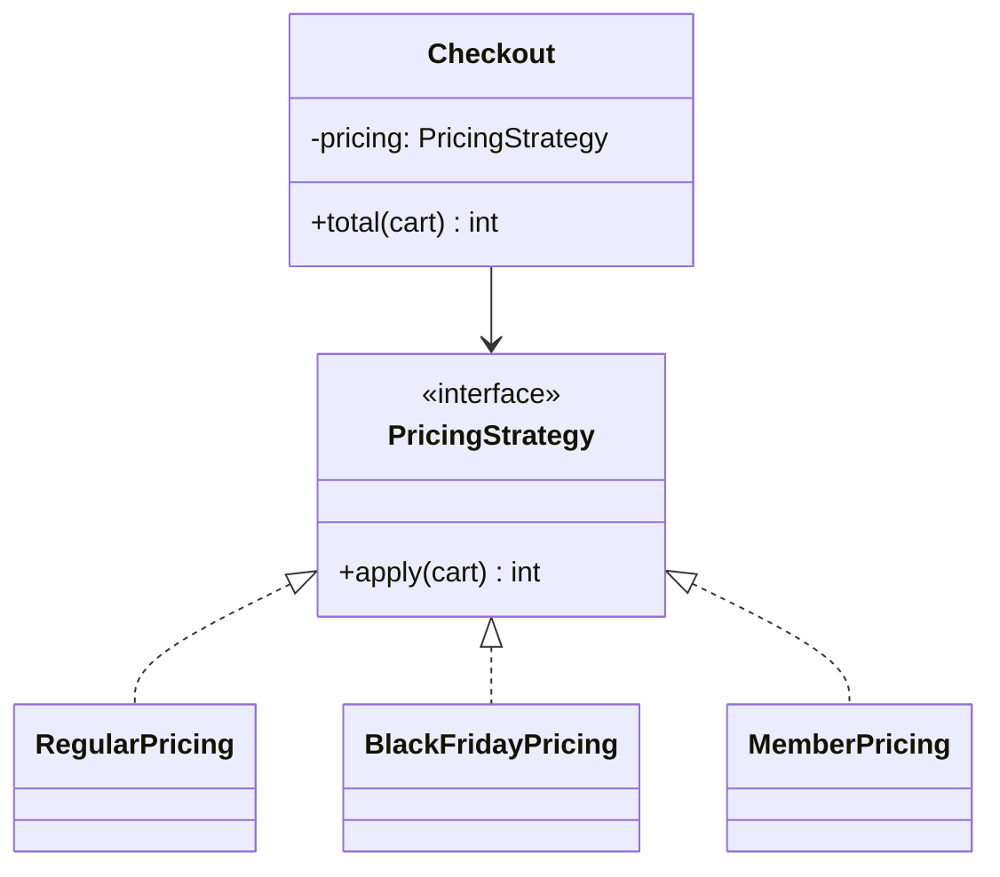
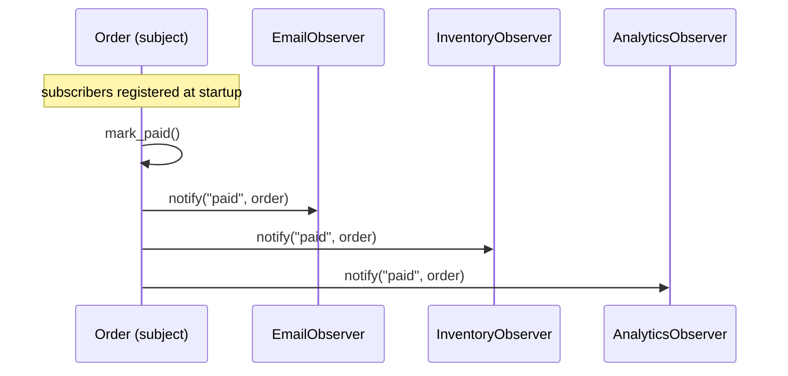
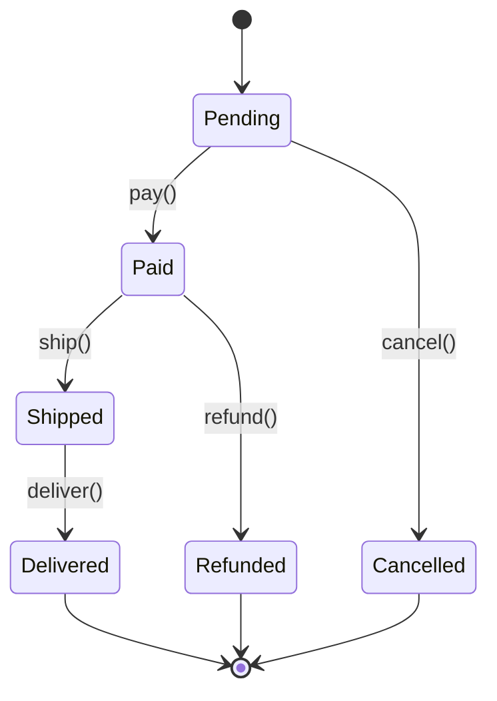
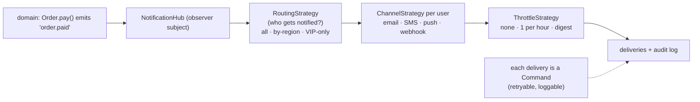

# Chapter 7 — GoF Behavioral Patterns

> **Volume 3 — Low-Level Design** · [Contents](index.md) · ← [Chapter 6 — GoF Structural Patterns](ch06-gof-structural-patterns.md) · Next → [Chapter 8 — Clean Architecture](ch08-clean-architecture.md)

---

## Concept

Strategy, Observer, Command, State, Template Method, Chain of Responsibility, Mediator, Memento, Visitor.

**In one sentence:** behavioral patterns are about *who does what and who tells whom* — swapping algorithms, notifying listeners, turning requests into objects, changing behavior with state, and passing work along a chain — so objects can collaborate without being tightly wired together.

**Mental model — running a restaurant.**

* **Strategy** — the chef picks a cooking method (grill, bake, fry) for the same dish.
* **Observer** — the kitchen bell: everyone who cares hears "order ready".
* **Command** — the order ticket: a request written down, so it can be queued, logged, or cancelled.
* **State** — the restaurant behaves differently when *open*, *closing*, or *closed*.
* **Chain of Responsibility** — a complaint goes waiter → manager → owner until someone handles it.
* **Mediator** — the head waiter coordinates so staff don't all shout at each other.

**The nine patterns**

| Pattern | Intent | Everyday use |
|---------|--------|--------------|
| **Strategy** | a family of interchangeable algorithms behind one interface | pricing rules, sorting options, retry policies, compression codecs |
| **Observer** | one subject notifies many subscribers of changes | UI data binding, domain events, webhooks (in-process) |
| **Command** | encapsulate a request as an object | undo/redo, job queues, macros, transactional scripts |
| **State** | an object changes behavior when its internal state changes | order lifecycle, TCP connection, document workflow |
| **Template Method** | a base algorithm with overridable steps | frameworks' `setUp/run/tearDown`, report generation |
| **Chain of Responsibility** | pass a request along handlers until one handles it | HTTP middleware, validation pipelines, support escalation |
| **Mediator** | central object coordinates colleagues | chat rooms, form widgets that depend on each other, air-traffic control |
| **Memento** | capture and restore state without exposing internals | undo snapshots, checkpoints |
| **Visitor** | add operations over an object structure without changing its classes | compilers walking ASTs, exporters, linters |

**Strategy vs State** — structurally identical (a context delegates to an interface). *Strategy*: the client chooses the algorithm, and strategies don't know each other. *State*: the object switches its own state object as events happen, and states usually know which state comes next.

**Observer vs pub/sub** — Observer: subscribers register directly with the subject, in process, usually synchronously; the subject knows its observer list. Pub/sub: publishers and subscribers only know a *topic* on a broker in between (Kafka, Redis, SNS); fully decoupled, often async and cross-process.

**In Python, many patterns shrink** — a Strategy can be just a function passed as an argument; Command can be a callable plus arguments; Template Method can be a higher-order function. Use classes when the "strategy" has state or several methods.

---

## Prereqs

* [Chapter 6 — GoF Structural Patterns](ch06-gof-structural-patterns.md)

---

## Diagram

**Strategy (interchangeable algorithms)**



**Observer (publish/subscribe inside one process)**



**State: an order's lifecycle**



```
 Chain of Responsibility (HTTP middleware)
 request ─► [RequestId] ─► [Auth] ─► [RateLimit] ─► [Validate] ─► handler
                             │ 401        │ 429          │ 422
                             ▼            ▼              ▼
                         any handler can stop the chain and respond
```

---

## Example

```python
from typing import Protocol, Callable
from collections import defaultdict

# ---- Strategy ------------------------------------------------------------
class PricingStrategy(Protocol):
    def apply(self, cents: int) -> int: ...

class Regular:
    def apply(self, cents): return cents

class PercentOff:
    def __init__(self, pct): self.pct = pct
    def apply(self, cents): return cents * (100 - self.pct) // 100

class Checkout:
    def __init__(self, pricing: PricingStrategy): self.pricing = pricing
    def total(self, items): return self.pricing.apply(sum(items))

print(Checkout(Regular()).total([1000, 500]), Checkout(PercentOff(20)).total([1000, 500]))   # 1500 1200

# ---- Observer ------------------------------------------------------------
class EventSource:
    def __init__(self): self._subs: dict[str, list[Callable]] = defaultdict(list)
    def subscribe(self, event, fn):
        self._subs[event].append(fn)
        return lambda: self._subs[event].remove(fn)        # unsubscribe handle
    def emit(self, event, payload):
        for fn in list(self._subs[event]):
            try:
                fn(payload)
            except Exception as e:                          # one bad observer must not break others
                print(f"observer failed: {e!r}")

orders = EventSource()
orders.subscribe("paid", lambda o: print("email receipt", o["id"]))
unsub = orders.subscribe("paid", lambda o: print("reserve stock", o["id"]))
orders.emit("paid", {"id": 42})
unsub(); orders.emit("paid", {"id": 43})                    # only the email observer now

# ---- State ---------------------------------------------------------------
class OrderState:
    name = "?"
    def pay(self, o): raise ValueError(f"cannot pay when {self.name}")
    def ship(self, o): raise ValueError(f"cannot ship when {self.name}")
    def cancel(self, o): raise ValueError(f"cannot cancel when {self.name}")

class Pending(OrderState):
    name = "pending"
    def pay(self, o): o.state = Paid()
    def cancel(self, o): o.state = Cancelled()

class Paid(OrderState):
    name = "paid"
    def ship(self, o): o.state = Shipped()

class Shipped(OrderState): name = "shipped"
class Cancelled(OrderState): name = "cancelled"

class Order:
    def __init__(self): self.state = Pending()
    def pay(self): self.state.pay(self)
    def ship(self): self.state.ship(self)
    def cancel(self): self.state.cancel(self)

o = Order(); o.pay(); o.ship(); print(o.state.name)        # shipped
try: o.cancel()
except ValueError as e: print(e)                           # cannot cancel when shipped

# ---- Command with undo -----------------------------------------------------
class AddItem:
    def __init__(self, cart, item): self.cart, self.item = cart, item
    def do(self): self.cart.append(self.item)
    def undo(self): self.cart.remove(self.item)

cart, history = [], []
for cmd in (AddItem(cart, "pen"), AddItem(cart, "ink")):
    cmd.do(); history.append(cmd)
history.pop().undo()
print(cart)                                                 # ['pen']
```

---

## Exercises

1. Implement strategy for a sorting option.

   <details><summary>Solution</summary>

   ```python
   SORTS = {
       "price_asc":  lambda ps: sorted(ps, key=lambda p: p.price),
       "price_desc": lambda ps: sorted(ps, key=lambda p: -p.price),
       "newest":     lambda ps: sorted(ps, key=lambda p: p.created, reverse=True),
       "relevance":  lambda ps: sorted(ps, key=lambda p: -p.score),
   }
   def list_products(products, sort="relevance"):
       return SORTS[sort](products)            # add a strategy = add a dict entry
   ```
   Validate <code>sort</code> against the keys at the API boundary.
   </details>

2. Build an observer that decouples producer and consumers.

   <details><summary>Solution</summary>See <code>EventSource</code>: the producer only calls <code>emit</code> and knows nothing about who listens. Consumers register at the composition root. Isolate failures per observer, return an unsubscribe handle, and consider async dispatch (a queue) if observers are slow.</details>

3. You have `if kind == "a": … elif kind == "b": …` repeated in five methods. Which pattern helps?

   <details><summary>Solution</summary>Strategy (or State, if <code>kind</code> changes over the object's life): move each branch into its own class implementing the five methods, and have the context delegate to the chosen object. Adding a kind becomes adding a class instead of editing five switch statements.</details>

---

## Mini project

**An event notification system (observer) with pluggable strategies.**



**Steps**

1. A `NotificationHub` where handlers subscribe to event names (Observer).
2. Pluggable strategies: routing (who), channel (how), throttle (how often), each an interface with 2–3 implementations.
3. Each delivery becomes a `SendNotification` command put on a queue, so it can be retried and logged.
4. Configure the strategies per event type in a small config file.
5. Tests with fake channels: verify routing, throttling (a fake clock), and that a failing channel doesn't block others.

**Done when:** adding a channel or rule is one new class plus config, and the hub never imports a concrete channel.

---

## Open source

* [`ReactiveX/RxPY`](https://github.com/ReactiveX/RxPY) — Observer taken to the extreme: observables, subscribers, and operators composing streams.
* [`rust-lang/rust`](https://github.com/rust-lang/rust) (command/state in GUIs) — the Rust Book chapter 17 builds a blog post with the State pattern (and a type-state version where invalid transitions don't compile). Iced/Elm-style GUIs model user actions as `Message` commands.

---

## Interview

1. **"Strategy vs State?"**
   <details><summary>Answer</summary>Same structure — a context delegating to an interface — but different intent. Strategy: the <i>client</i> selects an algorithm (a pricing rule, a sort order); strategies are independent, and the choice usually doesn't change on its own. State: the <i>object itself</i> swaps its state object in response to events, and each state knows the legal transitions (pending → paid → shipped). Behavior depends on lifecycle, not on caller preference.</details>

2. **"Observer vs pub/sub?"**
   <details><summary>Answer</summary>In Observer, subscribers register directly with the subject, which holds the list and notifies them, usually synchronously and in process — coupled by reference. In pub/sub, a broker or channel sits between them: publishers send to topics without knowing subscribers, and delivery is often asynchronous, persistent, and cross-process. Pub/sub gives more decoupling and scale at the cost of infrastructure and eventual consistency.</details>

---

## Checklist

- [ ] swap behavior via strategy
- [ ] decouple with observer
- [ ] know when each behavioral pattern earns its keep

---

> [Contents](index.md) · ← [Chapter 6 — GoF Structural Patterns](ch06-gof-structural-patterns.md) · Next → [Chapter 8 — Clean Architecture](ch08-clean-architecture.md)
