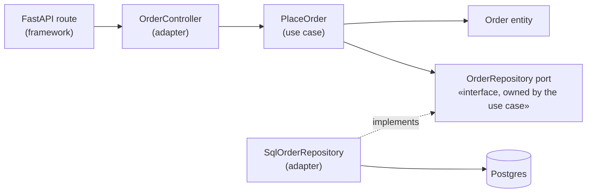
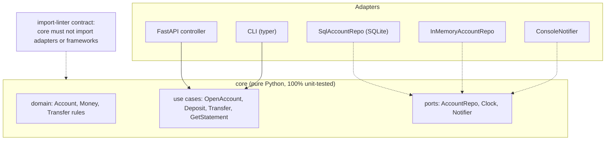

# Chapter 8 — Clean Architecture

> **Volume 3 — Low-Level Design** · [Contents](index.md) · ← [Chapter 7 — GoF Behavioral Patterns](ch07-gof-behavioral-patterns.md) · Next → [Chapter 9 — Hexagonal Architecture (Ports & Adapters)](ch09-hexagonal-architecture-ports-and-adapters.md)

---

## Concept

Entities → use cases → interface adapters → frameworks; the dependency rule pointing inward.

**In one sentence:** organize code in rings, with business rules in the middle and databases, web frameworks, and UIs on the outside, and let source-code dependencies point *only inward* — so the core never knows or cares which database or framework is plugged in.

**Mental model — a country's constitution.** The constitution (entities: core business rules) doesn't mention which brand of computer the courts use. Laws (use cases) follow the constitution. Government agencies (adapters) translate laws into forms and procedures. Buildings and phones (frameworks, DB) can be replaced without amending the constitution.

**The four rings**

| Ring | Contains | Knows about | Example |
|------|----------|-------------|---------|
| **Entities** (enterprise business rules) | core domain objects and rules | nothing outside itself | `Order`, `Money`, "an order total can't be negative" |
| **Use cases** (application business rules) | one class or function per user intention; orchestrates entities; defines **ports** (interfaces) it needs | entities, its own ports | `PlaceOrder`, `RefundPayment` |
| **Interface adapters** | controllers, presenters, gateways, repositories implementing the ports; mapping between domain and DTOs/rows | use cases, entities | `SqlOrderRepository`, `OrderController`, `OrderJsonPresenter` |
| **Frameworks & drivers** | web framework, ORM, DB, message broker, UI | everything inside (plugs in) | FastAPI, SQLAlchemy, Postgres, Kafka |

**The Dependency Rule** — *source code dependencies can only point inward*. Nothing in an inner ring can name anything in an outer ring: no `import fastapi` or `import sqlalchemy` in the domain or use cases. When control must flow outward (a use case needs to save data), the use case defines an interface (a port) and an outer adapter implements it — the Dependency Inversion Principle ([Ch 2](ch02-solid-principles.md)).

**Crossing boundaries** — pass simple data structures (DTOs, plain dataclasses) across rings, never ORM rows or HTTP request objects.

**Why isolate the domain?**

| Benefit | How |
|---------|-----|
| Fast, pure tests | the domain and use cases run with in-memory fakes, no DB or HTTP |
| Swappable technology | change the ORM, DB, or framework by writing a new adapter |
| Deferred decisions | build business logic before choosing the database |
| Readable intent | the use-case folder "screams" what the system does (`place_order.py`), not which framework it uses |

**Cost** — more files and mapping code. For a simple CRUD app it may be overkill; apply it where business rules are rich and long-lived.

---

## Prereqs

* [Chapter 2 — SOLID Principles](ch02-solid-principles.md)

---

## Diagram

**The concentric circles, with dependencies pointing inward only**

```
 ┌──────────────────────────────────────────────────────────────────┐
 │ Frameworks & drivers: FastAPI · SQLAlchemy · Postgres · Kafka     │
 │   ┌──────────────────────────────────────────────────────────┐   │
 │   │ Interface adapters: controllers · presenters · repos      │   │
 │   │   ┌──────────────────────────────────────────────────┐   │   │
 │   │   │ Use cases: PlaceOrder · RefundOrder  (+ ports)    │   │   │
 │   │   │   ┌──────────────────────────────────────────┐   │   │   │
 │   │   │   │ Entities: Order · Money · rules           │   │   │   │
 │   │   │   └──────────────────────────────────────────┘   │   │   │
 │   │   └──────────────────────────────────────────────────┘   │   │
 │   └──────────────────────────────────────────────────────────┘   │
 └──────────────────────────────────────────────────────────────────┘
        every import arrow points toward the center ──► ● 
```

**Control flow vs dependency direction**



Control flows HTTP → controller → use case → repository → DB. But the use case depends only on the *port*; the SQL adapter depends inward on that port.

**Folder layout that screams intent**

```
 src/shop/
   domain/        order.py  money.py           (no imports from outside domain/)
   application/   place_order.py  ports.py     (imports domain only)
   adapters/      sql_order_repo.py  http_api.py  stripe_payments.py
   main.py        composition root: wires adapters into use cases
```

---

## Example

```python
# domain/order.py — pure, no framework imports
from dataclasses import dataclass, field

@dataclass
class Order:
    id: str
    customer_id: str
    lines: list[tuple[str, int, int]] = field(default_factory=list)   # (sku, qty, unit_cents)
    status: str = "new"

    def add_line(self, sku, qty, unit_cents):
        if qty <= 0: raise ValueError("quantity must be positive")
        self.lines.append((sku, qty, unit_cents))

    @property
    def total_cents(self): return sum(q * p for _, q, p in self.lines)

# application/ports.py — interfaces the use case NEEDS (owned here, implemented outside)
from typing import Protocol
class OrderRepository(Protocol):
    def save(self, order: Order) -> None: ...
    def get(self, order_id: str) -> Order | None: ...

class IdGenerator(Protocol):
    def new_id(self) -> str: ...

# application/place_order.py — one use case
@dataclass(frozen=True)
class PlaceOrderInput:
    customer_id: str
    lines: list[tuple[str, int, int]]

@dataclass(frozen=True)
class PlaceOrderOutput:
    order_id: str
    total_cents: int

class PlaceOrder:
    def __init__(self, repo: OrderRepository, ids: IdGenerator):
        self.repo, self.ids = repo, ids
    def execute(self, data: PlaceOrderInput) -> PlaceOrderOutput:
        order = Order(id=self.ids.new_id(), customer_id=data.customer_id)
        for sku, qty, price in data.lines:
            order.add_line(sku, qty, price)
        if order.total_cents == 0:
            raise ValueError("empty order")
        self.repo.save(order)
        return PlaceOrderOutput(order.id, order.total_cents)

# adapters/memory.py — a swappable adapter (a SQL one has the same methods)
class InMemoryOrderRepository:
    def __init__(self): self.rows = {}
    def save(self, order): self.rows[order.id] = order
    def get(self, order_id): return self.rows.get(order_id)

class SeqIds:
    def __init__(self): self.n = 0
    def new_id(self): self.n += 1; return f"o-{self.n}"

# test: the use case runs with no DB and no web framework
out = PlaceOrder(InMemoryOrderRepository(), SeqIds()).execute(
    PlaceOrderInput("c1", [("pen", 2, 150), ("pad", 1, 400)]))
print(out)                      # PlaceOrderOutput(order_id='o-1', total_cents=700)
```

```python
# adapters/http_api.py — the framework lives at the edge
from fastapi import FastAPI, HTTPException
from pydantic import BaseModel

class OrderIn(BaseModel):
    customer_id: str
    lines: list[tuple[str, int, int]]

def make_api(place_order: PlaceOrder) -> FastAPI:
    api = FastAPI()
    @api.post("/orders", status_code=201)
    def create(body: OrderIn):
        try:
            out = place_order.execute(PlaceOrderInput(body.customer_id, body.lines))
        except ValueError as e:
            raise HTTPException(422, str(e))
        return {"id": out.order_id, "total_cents": out.total_cents}
    return api
```

---

## Exercises

1. Invert a dependency so the domain no longer imports the framework.

   <details><summary>Solution</summary>Find domain code importing SQLAlchemy models or <code>requests</code>. Define a port (Protocol) in the application layer describing what's needed (<code>OrderRepository.save/get</code>, <code>RatesProvider.rate(currency)</code>). Make the domain/use case depend on that port. Move the framework code into an adapter that implements it, and wire it in <code>main.py</code>. Verify with an import-linter rule (<code>domain</code> may not import <code>sqlalchemy</code>, <code>fastapi</code>, or <code>adapters</code>).</details>

2. Swap a SQL adapter for an in-memory one.

   <details><summary>Solution</summary>Both implement <code>OrderRepository</code>. In the composition root, choose by config (<code>REPO=memory|sql</code>). Run the same use-case test suite against both (a parametrized fixture) — a "contract test" for the port that proves the adapters behave the same.</details>

3. Where does input validation belong — the controller or the entity?

   <details><summary>Solution</summary>Both, for different rules. The controller/adapter checks <i>shape</i> (JSON types, required fields) and translates to a DTO. The entity and use case enforce <i>business</i> invariants (quantity > 0, not an empty order), so they hold no matter which adapter calls them.</details>

---

## Mini project

**A service with a pure domain layer and swappable DB/HTTP adapters.**



**Steps**

1. Write the domain and use cases first, with in-memory fakes and tests, before choosing any framework.
2. Add two driving adapters (HTTP and CLI) that call the same use cases.
3. Add two driven adapters for persistence (SQLite and in-memory); run a shared contract-test suite against both.
4. A composition root chooses adapters by config.
5. Enforce the dependency rule with `import-linter` in CI.

**Done when:** the core has zero framework imports (checked by CI), both repositories pass the same contract tests, and the CLI and HTTP API share every use case.

---

## Open source

* [`ivanpaulovich/clean-architecture-manga`](https://github.com/ivanpaulovich/clean-architecture-manga) — a .NET reference implementation with use cases, ports, presenters, and adapters. For Python, see `cosmicpython/book` (*Architecture Patterns with Python*) and the `import-linter` tool.

---

## Interview

1. **"What is the dependency rule?"**
   <details><summary>Answer</summary>Source-code dependencies must point only inward, toward higher-level policy: entities know nothing outside themselves, use cases know only entities and their own ports, adapters know use cases, and frameworks sit outermost. When an inner layer must call outward (to save data or send email), it defines an interface that an outer adapter implements, so the call goes outward at runtime while the dependency still points inward.</details>

2. **"Why isolate the domain from frameworks?"**
   <details><summary>Answer</summary>Business rules outlive frameworks and databases. Isolation makes the core fast and simple to test (no DB or HTTP), lets you swap or upgrade technology by writing new adapters, keeps framework concerns (annotations, sessions, request objects) out of business logic, lets you defer technology decisions, and makes the code express the business rather than the plumbing. The trade-off is extra mapping code, so apply it where the domain is complex.</details>

---

## Checklist

- [ ] domain has zero framework imports
- [ ] depend on ports, not adapters
- [ ] test the domain in isolation

---

> [Contents](index.md) · ← [Chapter 7 — GoF Behavioral Patterns](ch07-gof-behavioral-patterns.md) · Next → [Chapter 9 — Hexagonal Architecture (Ports & Adapters)](ch09-hexagonal-architecture-ports-and-adapters.md)
