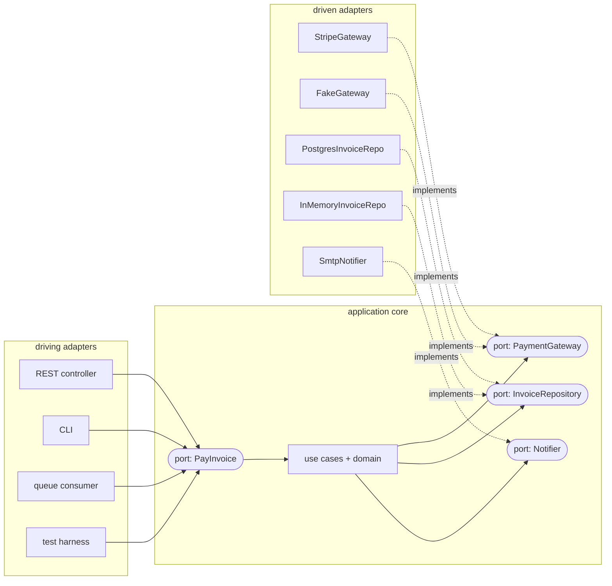
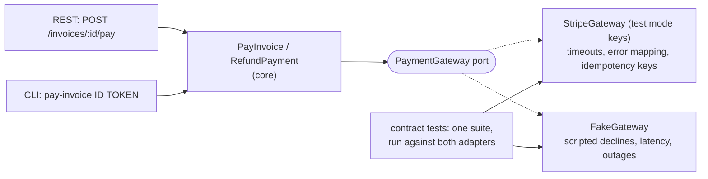

# Chapter 9 — Hexagonal Architecture (Ports & Adapters)

> **Volume 3 — Low-Level Design** · [Contents](index.md) · ← [Chapter 8 — Clean Architecture](ch08-clean-architecture.md) · Next → [Chapter 10 — Domain-Driven Design (Tactical)](ch10-domain-driven-design-tactical.md)

---

## Concept

Ports (the contract) and adapters (the implementations) around a core; driving vs driven sides.

**In one sentence:** put the application core in the middle, let it talk to the outside world only through *ports* (interfaces it defines), and plug in *adapters* for each technology — the ones that call the core on one side (web, CLI, tests) and the ones the core calls on the other (DB, payments, email).

**Mental model — a game console.** The console (core) has standard ports: controller ports on the front, HDMI and network ports on the back. Any controller brand, any TV, any router works if its plug fits the port. You can test the console with a fake controller and a fake screen on a workbench. The shape is a hexagon only to suggest "many sides, many ports" — the number six means nothing.

**Driving vs driven**

| | Driving (primary) side | Driven (secondary) side |
|-|------------------------|-------------------------|
| Who starts the conversation | the outside world calls the core | the core calls the outside world |
| Port | a **use-case interface** the core offers (`PayInvoice.execute`) | an **SPI interface** the core needs (`PaymentGateway.charge`) |
| Adapters | REST controller, CLI, gRPC handler, message consumer, **test harness** | Postgres repository, Stripe client, SMTP mailer, S3 storage, **fakes** |
| Direction of dependency | adapter → port (the adapter depends on the core) | adapter → port (the adapter implements the core's interface) |

Both kinds of adapters depend on the core, never the reverse.

**Ports & adapters vs Clean Architecture**

| | Hexagonal (Cockburn, 2005) | Clean Architecture (Martin, 2012) |
|-|---------------------------|-----------------------------------|
| Core idea | inside vs outside, connected by ports | concentric rings with the dependency rule |
| Layers inside the core | not prescribed | entities vs use cases, explicitly |
| Emphasis | symmetry: every external actor (even tests) is just an adapter | layer responsibilities and the direction of dependencies |
| Compatible? | yes — Clean Architecture is essentially hexagonal plus a layered core; Onion Architecture is similar too |

**How it helps testing** — the tests are just another driving adapter, and fakes are just other driven adapters. You can run the whole core — every use case — with in-memory adapters in milliseconds, then run a small set of *adapter contract tests* against the real technologies.

**Design a good port** — speak the *domain's* language (`charge(Money, CardToken) -> ChargeId`), not the vendor's (`PaymentIntent.create(amount, currency, confirm=True)`); keep it small; return domain types or domain errors (`PaymentDeclined`), never vendor exceptions.

---

## Prereqs

* [Chapter 8 — Clean Architecture](ch08-clean-architecture.md)

---

## Diagram

**A hexagon with driving adapters on the left, driven adapters on the right**



```
            ╱‾‾‾‾‾‾‾‾‾‾‾‾‾‾‾‾‾‾‾‾╲
   REST ──►╱   port: PayInvoice   ╲──► port: PaymentGateway ──► Stripe | Fake
   CLI  ──►   ┌────────────────┐    ──► port: InvoiceRepo    ──► Postgres | Memory
   Test ──►╲  │ core (domain)  │  ╱ ──► port: Notifier       ──► SMTP | Spy
            ╲ └────────────────┘ ╱
             ╲__________________╱
   left: things that CALL the core      right: things the core CALLS
```

**The same core, two configurations**

```
 production:   REST → PayInvoice → StripeGateway + PostgresRepo + SmtpNotifier
 test:         pytest → PayInvoice → FakeGateway + InMemoryRepo + SpyNotifier   (no network, ~1 ms)
```

---

## Example

```python
from dataclasses import dataclass
from typing import Protocol

# ---- core: domain types + ports --------------------------------------------
@dataclass(frozen=True)
class Money:
    cents: int
    currency: str

class PaymentDeclined(Exception):
    """A domain error — adapters translate vendor errors into this."""

class PaymentGateway(Protocol):                    # driven port, in the domain's language
    def charge(self, amount: Money, card_token: str) -> str: ...

@dataclass
class Invoice:
    id: str
    amount: Money
    paid: bool = False
    charge_id: str | None = None

class InvoiceRepository(Protocol):
    def get(self, invoice_id: str) -> Invoice: ...
    def save(self, invoice: Invoice) -> None: ...

class PayInvoice:                                   # driving port = this use case's API
    def __init__(self, invoices: InvoiceRepository, payments: PaymentGateway):
        self.invoices, self.payments = invoices, payments
    def execute(self, invoice_id: str, card_token: str) -> str:
        inv = self.invoices.get(invoice_id)
        if inv.paid:
            return inv.charge_id                    # idempotent: paying twice is a no-op
        inv.charge_id = self.payments.charge(inv.amount, card_token)
        inv.paid = True
        self.invoices.save(inv)
        return inv.charge_id

# ---- driven adapters ---------------------------------------------------------
class FakeGateway:
    def __init__(self, decline_tokens=()): self.decline, self.charges = set(decline_tokens), []
    def charge(self, amount, card_token):
        if card_token in self.decline: raise PaymentDeclined(card_token)
        self.charges.append((amount, card_token)); return f"ch_{len(self.charges)}"

class StripeGateway:
    def __init__(self, stripe): self.stripe = stripe          # the real SDK, injected
    def charge(self, amount, card_token):
        try:
            pi = self.stripe.PaymentIntent.create(amount=amount.cents, currency=amount.currency.lower(),
                                                  payment_method=card_token, confirm=True)
        except self.stripe.error.CardError as e:
            raise PaymentDeclined(str(e)) from e              # vendor error → domain error
        return pi.id

class InMemoryInvoices:
    def __init__(self, *invoices): self.rows = {i.id: i for i in invoices}
    def get(self, invoice_id): return self.rows[invoice_id]
    def save(self, invoice): self.rows[invoice.id] = invoice

# ---- test: the core with fake adapters, no network -------------------------------
gw = FakeGateway(decline_tokens={"tok_declined"})
repo = InMemoryInvoices(Invoice("inv-1", Money(4200, "EUR")), Invoice("inv-2", Money(99, "EUR")))
pay = PayInvoice(repo, gw)
print(pay.execute("inv-1", "tok_visa"), pay.execute("inv-1", "tok_visa"), len(gw.charges))   # ch_1 ch_1 1
try:
    pay.execute("inv-2", "tok_declined")
except PaymentDeclined:
    print("declined; paid =", repo.get("inv-2").paid)          # declined; paid = False
```

---

## Exercises

1. Define a port and two adapters.

   <details><summary>Solution</summary><code>ExchangeRates.rate(src, dst) -&gt; Decimal</code> as the port. Adapter 1: an HTTP client for a rates API with caching and timeouts, translating HTTP failures into <code>RatesUnavailable</code>. Adapter 2: <code>FixedRates({("EUR","USD"): Decimal("1.08")})</code> for tests and local development. The core only imports the port.</details>

2. Test the core with a fake adapter, no network.

   <details><summary>Solution</summary>See the example: build <code>PayInvoice</code> with <code>FakeGateway</code> and <code>InMemoryInvoices</code>, and test happy paths, declines, and idempotency. Add a pytest socket blocker (<code>pytest-socket</code>) to prove no test opens a connection.</details>

3. Your port is `create_payment_intent(amount, currency, confirm, payment_method_types)`. What's wrong with it?

   <details><summary>Solution</summary>It mirrors the vendor's API, so the core depends on Stripe's model and switching vendors means changing the core. Define the port by what the <i>domain</i> needs (<code>charge(Money, CardToken) -&gt; ChargeId</code>, raising <code>PaymentDeclined</code>), and let the adapter do the translation.</details>

---

## Mini project

**A payments component with a real and fake gateway adapter.**



**Steps**

1. Core: `Invoice`, `Money`, `PayInvoice`, and `RefundPayment` use cases with domain errors.
2. Driving adapters: a FastAPI route and a CLI command that call the same use cases.
3. Driven adapters: a `StripeGateway` using Stripe *test mode* (or a local stub server), plus a `FakeGateway` with scriptable behaviors.
4. One contract-test suite parameterized over both gateways (charge, decline, refund, idempotent retry).
5. Unit-test all core behaviors with the fake only; run the real adapter's contract tests separately.

**Done when:** the core suite runs in under a second with no network, both adapters pass the same contract tests, and swapping gateways is one line in the composition root.

---

## Open source

* [`thombergs/buckpal`](https://github.com/thombergs/buckpal) (Spring hexagonal example) — a small banking app from the book *Get Your Hands Dirty on Clean Architecture*: `application/port/in` (driving ports), `application/port/out` (driven ports), and `adapter/in` and `adapter/out`. Also read Alistair Cockburn's original "Hexagonal Architecture" article.

---

## Interview

1. **"Ports & adapters vs clean architecture?"**
   <details><summary>Answer</summary>Hexagonal splits the world into an inside (the application) and an outside, connected only through ports, with adapters for each technology on the driving and driven sides — it doesn't prescribe layers inside the core. Clean Architecture keeps that idea and adds explicit inner rings (entities, then use cases) with the dependency rule. They're compatible; many codebases are both.</details>

2. **"How does hexagonal help testing?"**
   <details><summary>Answer</summary>Tests are just another driving adapter calling the use-case ports, and every external dependency is behind a driven port that can take a fake. So all business behavior can be tested fast, deterministically, and without infrastructure. Real adapters are then verified separately with contract and integration tests, which keeps the slow tests few and focused.</details>

---

## Checklist

- [ ] define explicit ports
- [ ] implement adapters outside the core
- [ ] swap adapters without touching the core

---

> [Contents](index.md) · ← [Chapter 8 — Clean Architecture](ch08-clean-architecture.md) · Next → [Chapter 10 — Domain-Driven Design (Tactical)](ch10-domain-driven-design-tactical.md)
