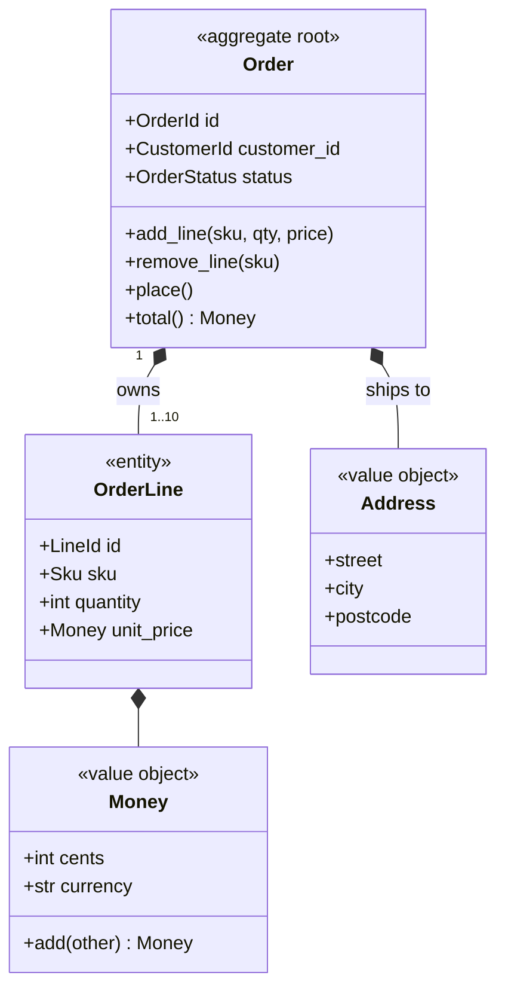
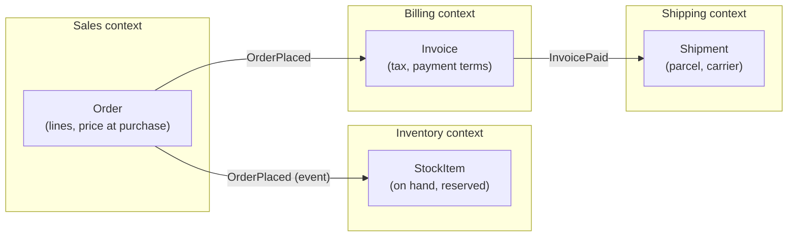
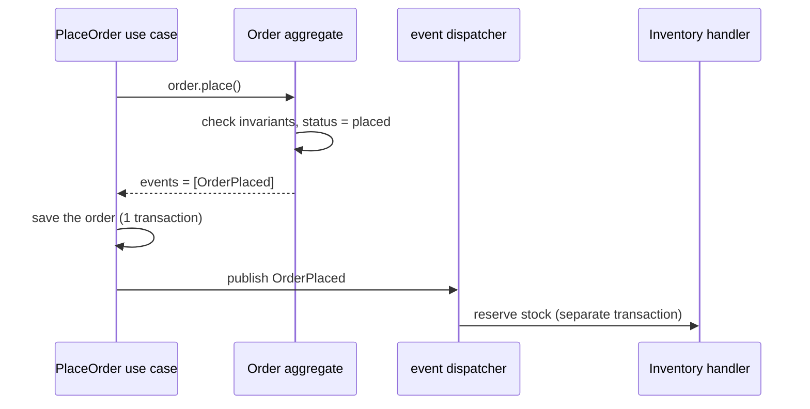
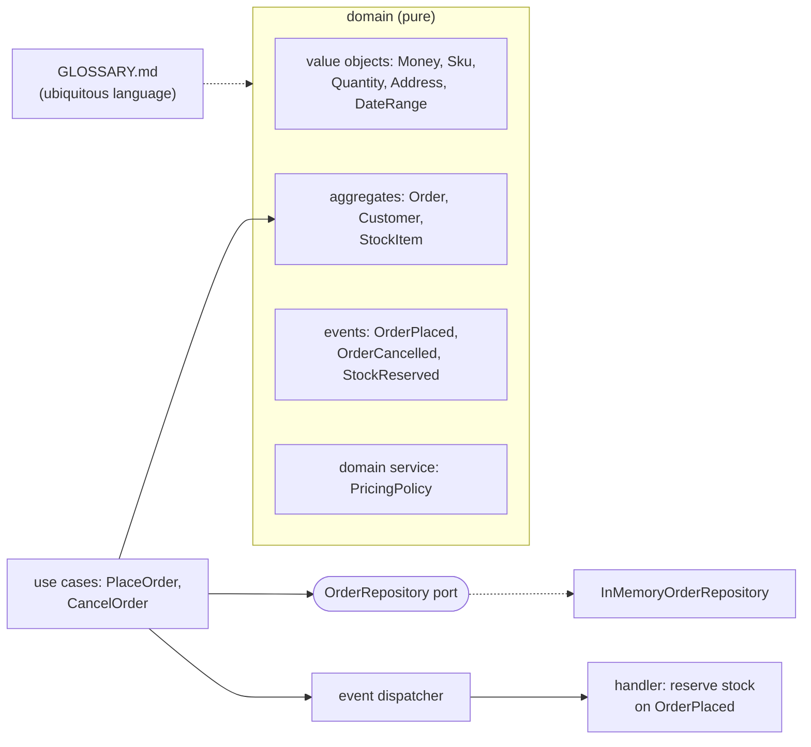

# Chapter 10 — Domain-Driven Design (Tactical)

> **Volume 3 — Low-Level Design** · [Contents](index.md) · ← [Chapter 9 — Hexagonal Architecture (Ports & Adapters)](ch09-hexagonal-architecture-ports-and-adapters.md) · Next → [Chapter 11 — Repository Pattern & Data Mapping](ch11-repository-pattern-and-data-mapping.md)

---

## Concept

Entities, value objects, aggregates, repositories, domain events, ubiquitous language; bounded contexts (intro).

**In one sentence:** DDD's tactical patterns are building blocks for modeling business rules in code — objects with identity (entities), objects defined by their values (value objects), consistency boundaries that guard their own rules (aggregates), and named business facts (domain events) — all using the words the business actually uses.

**Mental model — a hotel.** A *guest* is an entity: the same person even if they change rooms or names. A *room rate of €120* is a value object: any €120 equals any other €120. A *reservation* is an aggregate: it owns its nights, guests, and payments, and it alone decides whether a change is allowed ("you can't remove the last guest"). "Reservation confirmed" is a domain event. The hotel's front desk and its accounting department each use the word "booking" slightly differently — those are two bounded contexts.

**The building blocks**

| Block | Defined by | Mutable? | Example | Rule of thumb |
|-------|-----------|:-:|---------|---------------|
| **Entity** | a stable **identity** (ID) over time | yes | `Customer(id=42)`, `Order(id=…)` | equality by ID |
| **Value object** | its **attributes** only | **no** (immutable) | `Money(1999, "EUR")`, `Address`, `DateRange`, `Email` | equality by value; validate in the constructor; replace, don't modify |
| **Aggregate** | a cluster of entities and values with **one root** | through the root | `Order` (root) + `OrderLine`s + `ShippingAddress` | enforce invariants inside; reference other aggregates **by ID**; one transaction = one aggregate |
| **Aggregate root** | the only entry point into the aggregate | — | `order.add_line(...)`, never `order.lines.append(...)` from outside | guards all invariants |
| **Repository** | a collection-like interface to load and save *whole aggregates* | — | `orders.get(id)`, `orders.add(order)` | one per aggregate root ([Ch 11](ch11-repository-pattern-and-data-mapping.md)) |
| **Domain event** | something that *happened*, in past tense | no | `OrderPlaced`, `PaymentFailed` | raised by aggregates; drives side effects in other aggregates or contexts |
| **Domain service** | an operation that doesn't belong to one entity | — | `TransferFunds(from, to, amount)` | stateless, in domain terms |
| **Factory** | complex creation logic | — | `Order.from_cart(cart)` | keeps constructors simple |

**Ubiquitous language** — one shared vocabulary between developers and domain experts, used *in the code*: if the business says "a policy lapses", the method is `policy.lapse()`, not `policy.set_status(3)`.

**Designing aggregates**

* Keep them **small**: just enough to protect a real invariant.
* **Invariants** are rules that must always be true after every operation: "an order total ≥ 0", "no more than 10 lines", "can't ship an unpaid order".
* Cross-aggregate rules are **eventually consistent** through domain events ("when an order is placed, reserve stock").
* Reference other aggregates by ID (`customer_id`), not by object, so each loads and saves independently.

**Bounded contexts (intro)** — a boundary inside which a model and its language are consistent. "Product" in *Catalog* (descriptions, images) differs from "Product" in *Inventory* (stock levels, warehouse bins) and *Billing* (tax class, price). Each context has its own model and maps to the others through explicit contracts — this is strategic DDD, and it often maps to service or module boundaries.

---

## Prereqs

* [Chapter 8 — Clean Architecture](ch08-clean-architecture.md)

---

## Diagram

**An aggregate with a root, entities, and value objects**



```
 outside code ──► order.add_line(...)          ✓ through the root
 outside code ──► order.lines[0].quantity = 0  ✗ bypasses the invariants
 Order holds customer_id (an ID), NOT a Customer object → separate aggregate
```

**A bounded-context map**



**Domain events decouple aggregates**



---

## Example

```python
from __future__ import annotations
from dataclasses import dataclass, field
from datetime import datetime, timezone

# ---- value objects: immutable, validated, equal by value ----------------------
@dataclass(frozen=True)
class Money:
    cents: int
    currency: str
    def __post_init__(self):
        if self.cents < 0: raise ValueError("money cannot be negative")
        if len(self.currency) != 3: raise ValueError("currency must be an ISO code")
    def __add__(self, other: Money) -> Money:
        if other.currency != self.currency: raise ValueError("currency mismatch")
        return Money(self.cents + other.cents, self.currency)
    def times(self, n: int) -> Money: return Money(self.cents * n, self.currency)

assert Money(500, "EUR") == Money(500, "EUR")            # value equality

# ---- domain events: past-tense facts ---------------------------------------------
@dataclass(frozen=True)
class OrderPlaced:
    order_id: str
    customer_id: str
    total: Money
    at: datetime

# ---- aggregate root ------------------------------------------------------------------
class DomainError(Exception): ...

@dataclass
class OrderLine:                                        # entity inside the aggregate
    sku: str
    quantity: int
    unit_price: Money

@dataclass
class Order:
    id: str
    customer_id: str                                     # reference by ID, not object
    currency: str = "EUR"
    status: str = "draft"
    _lines: dict[str, OrderLine] = field(default_factory=dict)
    events: list = field(default_factory=list)

    MAX_LINES = 10

    def add_line(self, sku: str, qty: int, unit_price: Money) -> None:
        self._require_draft()
        if qty <= 0: raise DomainError("quantity must be positive")
        if unit_price.currency != self.currency: raise DomainError("wrong currency")
        if sku not in self._lines and len(self._lines) >= self.MAX_LINES:
            raise DomainError("an order has at most 10 lines")
        if sku in self._lines:
            self._lines[sku].quantity += qty
        else:
            self._lines[sku] = OrderLine(sku, qty, unit_price)

    def total(self) -> Money:
        t = Money(0, self.currency)
        for line in self._lines.values():
            t = t + line.unit_price.times(line.quantity)
        return t

    def place(self) -> None:
        self._require_draft()
        if not self._lines: raise DomainError("cannot place an empty order")
        self.status = "placed"
        self.events.append(OrderPlaced(self.id, self.customer_id, self.total(),
                                       datetime.now(timezone.utc)))

    def _require_draft(self):
        if self.status != "draft": raise DomainError(f"order is {self.status}")

o = Order("o-1", "c-7")
o.add_line("pen", 2, Money(150, "EUR"))
o.add_line("pad", 1, Money(400, "EUR"))
o.place()
print(o.total(), type(o.events[0]).__name__)            # Money(cents=700, currency='EUR') OrderPlaced
try:
    o.add_line("ink", 1, Money(900, "EUR"))
except DomainError as e:
    print(e)                                              # order is placed
```

---

## Exercises

1. Model a domain as aggregates with invariants.

   <details><summary>Solution</summary>Library lending: <code>Member</code> (aggregate: ID, tier, active loans count, "a max of 5 loans" invariant), <code>Loan</code> (aggregate: <code>book_copy_id</code>, <code>member_id</code>, <code>due_date: DateRange</code>, "can renew at most twice", "can't renew when overdue"), and <code>BookCopy</code> (aggregate: status available/on-loan). Rules spanning aggregates ("a copy can be on only one active loan") are enforced by a unique constraint or an event-driven process, not by one giant aggregate.</details>

2. Publish a domain event on a state change.

   <details><summary>Solution</summary>As in <code>Order.place()</code>: append the event to <code>self.events</code>. After the use case saves the aggregate (ideally the events go into an outbox in the same transaction), a dispatcher publishes them and clears the list. Handlers in other aggregates or contexts react in their own transactions.</details>

3. Should `Address` be an entity or a value object?

   <details><summary>Solution</summary>Usually a value object: two identical addresses are interchangeable, and you replace an address rather than mutate it. It becomes an entity only if the business tracks a specific address over time with its own identity (e.g. a delivery-point registry for a postal service).</details>

---

## Mini project

**An order-management domain with aggregates, value objects, and a repository.**



**Steps**

1. Interview a "domain expert" (or write the rules yourself) and produce `GLOSSARY.md` with 10–15 terms.
2. Implement value objects with validation and value equality.
3. Implement `Order` and `StockItem` aggregates with at least 5 invariants, covered by tests.
4. Raise domain events; dispatch them after saving; a handler reserves stock (eventual consistency between aggregates).
5. A repository port with an in-memory adapter (a SQL one comes in [Ch 11](ch11-repository-pattern-and-data-mapping.md)).
6. Check that every class and method name appears in the glossary.

**Done when:** no invariant can be broken through the public API (tests try), aggregates reference each other only by ID, and the code reads like the glossary.

---

## Open source

* [`AxonFramework/AxonFramework`](https://github.com/AxonFramework/AxonFramework) — a Java framework for DDD, CQRS, and event sourcing: `@Aggregate`, command handlers, and event sourcing handlers.
* [`dotnet-architecture/eShopOnContainers`](https://github.com/dotnet-architecture/eShopOnContainers) — see the `Ordering.Domain` project: an `Order` aggregate root, `Address` value object, and domain events. Read Eric Evans' *Domain-Driven Design* and Vaughn Vernon's "Effective Aggregate Design".

---

## Interview

1. **"Entity vs value object?"**
   <details><summary>Answer</summary>An entity has an identity that persists over time and through changes: two customers with the same name are still different customers, and equality is by ID. A value object is defined only by its attributes, is immutable, and is interchangeable with any other with the same values: <code>Money(5, "EUR")</code> equals any other. Prefer value objects — they're simpler, safe to share, and validate themselves on construction.</details>

2. **"What's an aggregate root's job?"**
   <details><summary>Answer</summary>To be the single entry point to its aggregate and guard its invariants: all changes go through the root's methods, which check the rules before changing any internal entity, so the aggregate is always consistent after each operation. It defines the transaction and loading boundary (a repository loads and saves the whole aggregate), and it records domain events about its changes. Other aggregates refer to it only by ID.</details>

---

## Checklist

- [ ] keep invariants inside the aggregate
- [ ] use value objects for domain types
- [ ] name things in domain language

---

> [Contents](index.md) · ← [Chapter 9 — Hexagonal Architecture (Ports & Adapters)](ch09-hexagonal-architecture-ports-and-adapters.md) · Next → [Chapter 11 — Repository Pattern & Data Mapping](ch11-repository-pattern-and-data-mapping.md)
