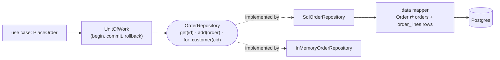
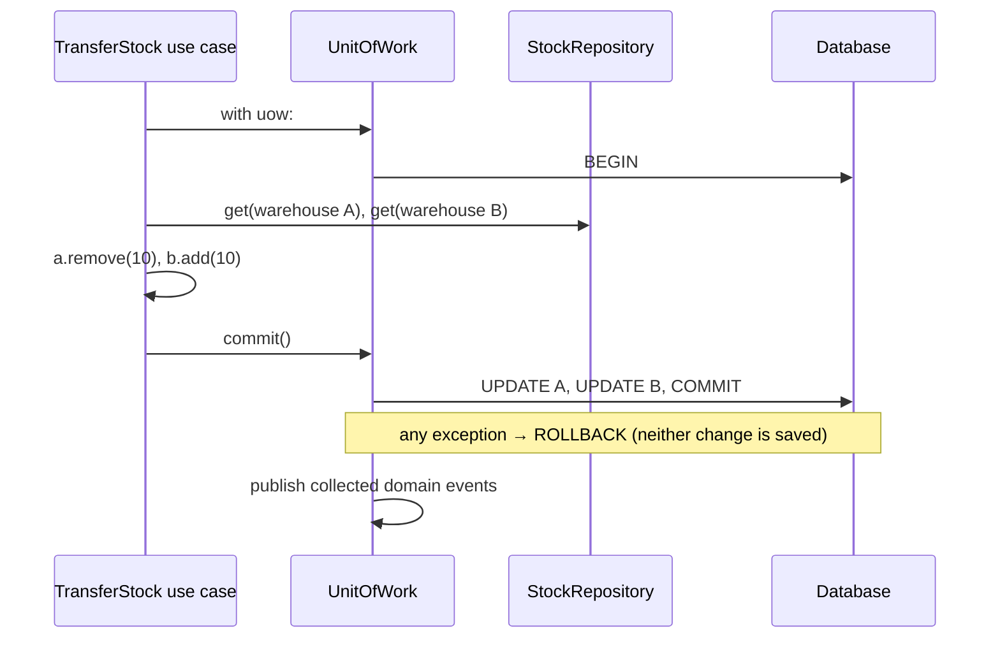
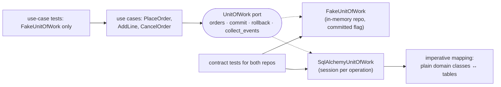

# Chapter 11 — Repository Pattern & Data Mapping

> **Volume 3 — Low-Level Design** · [Contents](index.md) · ← [Chapter 10 — Domain-Driven Design (Tactical)](ch10-domain-driven-design-tactical.md) · Next → [Chapter 12 — Event Bus, CQRS & Event Sourcing](ch12-event-bus-cqrs-and-event-sourcing.md)

---

## Concept

A collection-like abstraction over persistence; mapping domain objects to storage; unit of work.

**In one sentence:** a repository lets domain code treat stored aggregates like an in-memory collection (`orders.get(id)`, `orders.add(order)`), a data mapper translates between domain objects and table rows so neither knows the other's shape, and a unit of work groups all changes of one business operation into a single commit.

**Mental model — a library's front desk.** You ask the librarian for "book 42" and get the book; you hand it back and it's shelved. You don't know whether it lives in the basement, a warehouse, or on microfilm (repository). The cataloguer translates between the physical book and the catalogue card (data mapper). When you check out three books at once, either all three are recorded or none are (unit of work).

**Patterns compared**

| Pattern | Shape | Who knows SQL? | Good for |
|---------|-------|----------------|----------|
| **Active Record** | the domain object saves itself: `order.save()` | the domain object (via the ORM base class) | simple CRUD; Rails, Django models |
| **DAO** (Data Access Object) | table-oriented methods: `insert_order_row`, `find_by_status` | the DAO | thin persistence layer, one per table |
| **Repository** | **collection of aggregates** in domain terms: `get`, `add`, `for_customer` | the repository implementation (outside the domain) | rich domains; DDD ([Ch 10](ch10-domain-driven-design-tactical.md)) |
| **Data Mapper** | a separate object maps domain ↔ rows | the mapper | keeping domain classes plain (SQLAlchemy's imperative mapping, MyBatis) |
| **Unit of Work** | tracks changed objects; commits them in one transaction | the UoW | multi-aggregate operations, consistency |

**Repository vs DAO** — a DAO is organized around *tables* and exposes data-access operations; a repository is organized around *aggregates* and speaks the domain language, returning fully built domain objects. A repository may use several DAOs or tables inside.

**Rules for repositories**

* **One repository per aggregate root** — `OrderRepository`, not `OrderLineRepository`.
* Load and save the **whole aggregate**, so invariants hold.
* The *interface* lives in the domain/application layer; the *implementation* (SQL, ORM, API) lives in an adapter ([Ch 9](ch09-hexagonal-architecture-ports-and-adapters.md)).
* Query methods use domain language (`overdue_loans(today)`), not generic SQL builders.
* Complex read-only queries for screens/reports can bypass repositories and use a query service or read model (CQRS, [Ch 12](ch12-event-bus-cqrs-and-event-sourcing.md)).

**Unit of Work** — begin → load aggregates through repositories → change them → **commit once** (or roll back everything). It also collects domain events to publish after commit, and often gives an *identity map* (the same row loaded twice returns the same object).

**Why keep persistence out of the domain?** Domain tests run without a database; storage can change (SQL → document store) without touching business rules; the domain model is designed for behavior, not for table layout; and ORM concerns (lazy loading, sessions) don't leak into business logic.

---

## Prereqs

* [Chapter 10 — Domain-Driven Design (Tactical)](ch10-domain-driven-design-tactical.md)

---

## Diagram

**A repository interface between the domain and the data mapper/ORM**



**Mapping one aggregate to two tables**

```
 domain object                               tables
 Order(id="o-1", customer="c-7",             orders
       status="placed",                      ┌──────┬──────────┬────────┐
       lines=[OrderLine(pen, 2, €1.50),      │ id   │ customer │ status │
              OrderLine(pad, 1, €4.00)])     │ o-1  │ c-7      │ placed │
                                             └──────┴──────────┴────────┘
               ⇅ mapper                      order_lines
                                             ┌───────┬─────┬─────┬────────────┐
                                             │ order │ sku │ qty │ price_cents│
                                             │ o-1   │ pen │ 2   │ 150        │
                                             │ o-1   │ pad │ 1   │ 400        │
                                             └───────┴─────┴─────┴────────────┘
```

**Unit of work: all or nothing**



---

## Example

```python
import sqlite3
from dataclasses import dataclass, field
from typing import Protocol

# ---- domain (no persistence code) ------------------------------------------------
@dataclass
class OrderLine:
    sku: str
    qty: int
    price_cents: int

@dataclass
class Order:
    id: str
    customer_id: str
    status: str = "draft"
    lines: list[OrderLine] = field(default_factory=list)
    def total(self): return sum(l.qty * l.price_cents for l in self.lines)

class OrderRepository(Protocol):
    def get(self, order_id: str) -> Order | None: ...
    def add(self, order: Order) -> None: ...
    def for_customer(self, customer_id: str) -> list[Order]: ...

# ---- adapter 1: in memory -----------------------------------------------------------
class InMemoryOrders:
    def __init__(self): self._rows: dict[str, Order] = {}
    def get(self, order_id): return self._rows.get(order_id)
    def add(self, order): self._rows[order.id] = order
    def for_customer(self, cid): return [o for o in self._rows.values() if o.customer_id == cid]

# ---- adapter 2: SQL with an explicit data mapper --------------------------------------
class SqlOrders:
    def __init__(self, conn: sqlite3.Connection): self.conn = conn
    def get(self, order_id):
        row = self.conn.execute("SELECT id, customer_id, status FROM orders WHERE id = ?",
                                (order_id,)).fetchone()
        return self._to_domain(row) if row else None
    def add(self, order):                                        # upsert the whole aggregate
        self.conn.execute("INSERT INTO orders (id, customer_id, status) VALUES (?, ?, ?) "
                          "ON CONFLICT(id) DO UPDATE SET status = excluded.status",
                          (order.id, order.customer_id, order.status))
        self.conn.execute("DELETE FROM order_lines WHERE order_id = ?", (order.id,))
        self.conn.executemany("INSERT INTO order_lines VALUES (?, ?, ?, ?)",
                              [(order.id, l.sku, l.qty, l.price_cents) for l in order.lines])
    def for_customer(self, cid):
        rows = self.conn.execute("SELECT id, customer_id, status FROM orders WHERE customer_id = ?",
                                 (cid,)).fetchall()
        return [self._to_domain(r) for r in rows]
    def _to_domain(self, row):                                   # the mapper: rows → aggregate
        lines = [OrderLine(s, q, p) for s, q, p in self.conn.execute(
            "SELECT sku, qty, price_cents FROM order_lines WHERE order_id = ?", (row[0],))]
        return Order(row[0], row[1], row[2], lines)

# ---- unit of work ---------------------------------------------------------------------
class SqlUnitOfWork:
    def __init__(self, path=":memory:"):
        self.conn = sqlite3.connect(path, isolation_level=None)  # we control transactions
        self.conn.executescript("""
            CREATE TABLE IF NOT EXISTS orders (id TEXT PRIMARY KEY, customer_id TEXT, status TEXT);
            CREATE TABLE IF NOT EXISTS order_lines (order_id TEXT, sku TEXT, qty INT, price_cents INT);""")
        self.orders = SqlOrders(self.conn)
    def __enter__(self): self.conn.execute("BEGIN"); return self
    def __exit__(self, exc_type, *_):
        self.conn.execute("ROLLBACK" if exc_type else "COMMIT")  # all or nothing
        return False

uow = SqlUnitOfWork()
with uow:
    uow.orders.add(Order("o-1", "c-7", "placed", [OrderLine("pen", 2, 150), OrderLine("pad", 1, 400)]))
try:
    with uow:
        uow.orders.add(Order("o-2", "c-7"))
        raise RuntimeError("payment failed")                     # → rollback: o-2 is not saved
except RuntimeError:
    pass
print(uow.orders.get("o-1").total(), uow.orders.get("o-2"))      # 700 None
```

---

## Exercises

1. Implement a repository over SQL and over in-memory.

   <details><summary>Solution</summary>See <code>SqlOrders</code> and <code>InMemoryOrders</code>. Then write one contract-test suite parameterized over both: add then get returns an equal aggregate, updating lines replaces them, <code>for_customer</code> filters correctly, and a missing ID returns <code>None</code>. Both must pass, so tests using the in-memory version are trustworthy.</details>

2. Add a unit-of-work for a multi-write transaction.

   <details><summary>Solution</summary>See <code>SqlUnitOfWork</code>: <code>BEGIN</code> on enter, <code>COMMIT</code> on a clean exit, <code>ROLLBACK</code> on an exception. All repositories share its connection. Extend it: collect <code>aggregate.events</code> from every aggregate touched and publish them only after a successful commit (or write them to an outbox table inside the same transaction).</details>

3. Why is `OrderLineRepository` usually a design smell?

   <details><summary>Solution</summary>Order lines belong to the <code>Order</code> aggregate. Saving them independently lets code bypass the root's invariants (a max of 10 lines, totals, status checks). Load and save lines only through the <code>Order</code> repository.</details>

---

## Mini project

**A repository + unit-of-work for a small aggregate, testable against SQL and in-memory.**



**Steps**

1. Use the `Order` aggregate from [Ch 10](ch10-domain-driven-design-tactical.md) unchanged (no ORM base class).
2. Map it with SQLAlchemy's imperative mapping (`registry.map_imperatively`), so the domain classes stay plain.
3. Implement `SqlAlchemyUnitOfWork` (session per unit of work, commit/rollback) and `FakeUnitOfWork`.
4. Use cases depend only on the UoW port; unit tests use the fake and assert `committed is True` or that nothing was saved on errors.
5. Contract tests run against both repositories; one integration test proves a rollback leaves the DB unchanged.

**Done when:** the domain has no SQLAlchemy imports, both repositories pass the same contract suite, and a failure mid-operation never leaves partial writes.

---

## Open source

* [`sqlalchemy/sqlalchemy`](https://github.com/sqlalchemy/sqlalchemy) (data mapper) — the `Session` is a Unit of Work with an identity map; imperative ("classical") mapping keeps domain classes free of ORM base classes. See *Architecture Patterns with Python* (cosmicpython.com), chapters 2 and 6, for exactly this pattern in Python.

---

## Interview

1. **"Repository vs DAO?"**
   <details><summary>Answer</summary>A DAO is a persistence-oriented object, usually one per table, exposing CRUD and query methods that return data records — it models the database. A repository is domain-oriented: one per aggregate root, collection-like (<code>get</code>, <code>add</code>, domain-named queries), returning fully built aggregates, with its interface owned by the domain. A repository may be implemented using DAOs underneath.</details>

2. **"Why keep persistence out of the domain?"**
   <details><summary>Answer</summary>So business rules can be tested without a database (fast, deterministic), the model is shaped by behavior rather than table layout, ORM mechanics (sessions, lazy loading, dirty tracking) don't leak into business logic, and storage technology can change behind the repository interface without touching the domain. The cost is mapping code, which is worth it when the domain is complex.</details>

---

## Checklist

- [ ] domain stays persistence-agnostic
- [ ] one repository per aggregate
- [ ] wrap multi-writes in a unit of work

---

> [Contents](index.md) · ← [Chapter 10 — Domain-Driven Design (Tactical)](ch10-domain-driven-design-tactical.md) · Next → [Chapter 12 — Event Bus, CQRS & Event Sourcing](ch12-event-bus-cqrs-and-event-sourcing.md)
