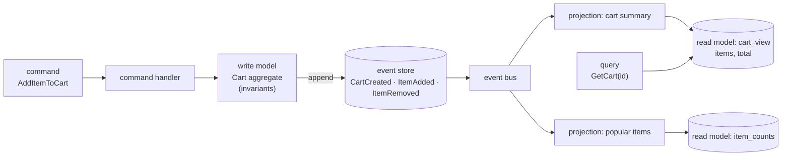
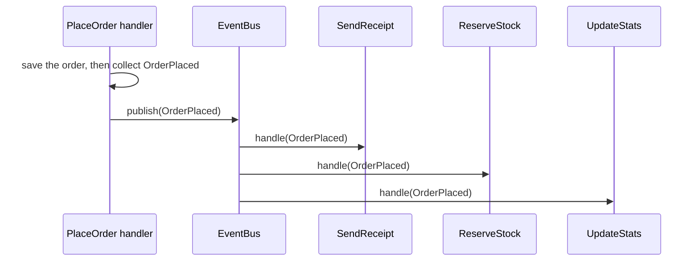
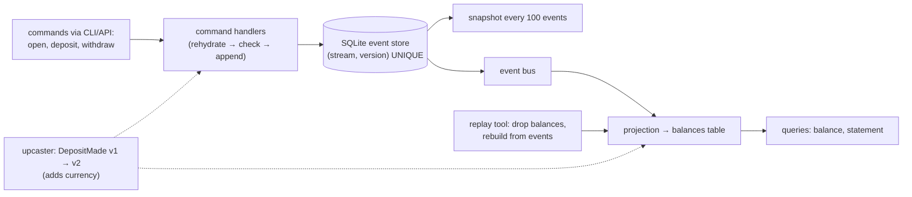

# Chapter 12 — Event Bus, CQRS & Event Sourcing

> **Volume 3 — Low-Level Design** · [Contents](index.md) · ← [Chapter 11 — Repository Pattern & Data Mapping](ch11-repository-pattern-and-data-mapping.md) · Next → [Chapter 13 — Concurrency Patterns & Thread Safety](ch13-concurrency-patterns-and-thread-safety.md)

---

## Concept

In-process event bus; command/query separation; storing events as the source of truth and projecting state.

**In one sentence:** inside one application, an event bus lets parts of the code react to "something happened" without calling each other directly; CQRS splits the code that *changes* data from the code that *reads* it so each can be shaped for its job; and event sourcing stores the list of changes itself as the truth and rebuilds current state by replaying it.

**Mental model — a chess game.** The board you see is the *read model*. The move list ("e4, e5, Nf3…") is the *event store*: from it you can rebuild the board at any point, replay the game, or analyze it in new ways later. A move request ("move the knight to f3") is a *command*, which the rules may reject. Announcing "white played Nf3" to the commentators is publishing an *event* on a bus.

This chapter is the **in-process, code-level** view. For the distributed version (Kafka, projections across services, the outbox), see [Vol 1 Ch 52](../volume-1-cs-foundations/ch52-event-sourcing-and-cqrs-distributed-view.md).

**Three ideas, separable**

| Idea | What it is | You can use it without the others? |
|------|-----------|:-:|
| **Event bus** (in-process) | `bus.publish(OrderPlaced(...))` → registered handlers run | yes |
| **CQRS** | commands (write side, domain model, invariants) are separate from queries (read side: denormalized, fast, no domain logic) | yes — even with a normal DB and no events |
| **Event sourcing** | the write model's state = `fold(events)`; the event store is append-only; read models are *projections* | usually paired with CQRS |

**Commands vs queries vs events**

| | Command | Query | Event |
|-|---------|-------|-------|
| Tense | imperative: `PlaceOrder` | question: `GetOrderSummary` | past: `OrderPlaced` |
| Changes state? | yes | **never** | it *records* a change |
| Can fail / be rejected? | yes | no (may return empty) | no — it already happened |
| Handlers | exactly one | exactly one | zero or many |

**CQRS — when is it worth it?**

| Worth it | Not worth it |
|----------|--------------|
| reads and writes have very different shapes or scale (1000:1 reads, dashboards, search) | simple CRUD screens |
| complex domain invariants on the write side | a small team and a simple domain |
| several read models from the same data (list, search, analytics) | when strong read-after-write consistency is required everywhere |
| paired with event sourcing | "because it's modern" |

**How event sourcing enables replay** — because every change is stored as an immutable event in order, you can: rebuild the aggregate's state at any time (`fold`); build a *new* read model later from the full history; fix a buggy projection and rebuild it; answer "what did this look like last Tuesday?" (temporal queries); and audit every change. Costs: event versioning forever, snapshots for long streams, and eventual consistency between write and read models.

**Event bus rules** — handlers must not depend on each other's order; one failing handler shouldn't break others (or should fail the whole command, as a deliberate choice); publish *after* the state change is committed (or use an outbox); keep handlers idempotent if events can be redelivered.

---

## Prereqs

* [Chapter 10 — Domain-Driven Design (Tactical)](ch10-domain-driven-design-tactical.md)
* [Chapter 11 — Repository Pattern & Data Mapping](ch11-repository-pattern-and-data-mapping.md)

---

## Diagram

**A CQRS flow: command → write model → events → projections → read model**



**State = fold over events**

```
 stream cart-7
 #1 CartCreated(customer=c1)        → {items: {}, total: 0}
 #2 ItemAdded(pen, 2, 150)          → {pen: 2}          total 300
 #3 ItemAdded(pad, 1, 400)          → {pen: 2, pad: 1}  total 700
 #4 ItemRemoved(pen)                → {pad: 1}          total 400
 state(cart-7) = reduce(apply, events, initial)   — replay any prefix to time-travel
```

**An in-process event bus**



---

## Example

```python
from collections import defaultdict
from dataclasses import dataclass, field
from functools import reduce

# ---- events ---------------------------------------------------------------------
@dataclass(frozen=True)
class CartCreated:  cart_id: str; customer: str
@dataclass(frozen=True)
class ItemAdded:    cart_id: str; sku: str; qty: int; price: int
@dataclass(frozen=True)
class ItemRemoved:  cart_id: str; sku: str

# ---- in-process event bus ----------------------------------------------------------------
class EventBus:
    def __init__(self): self._handlers = defaultdict(list)
    def subscribe(self, event_type, handler): self._handlers[event_type].append(handler)
    def publish(self, event):
        for h in self._handlers[type(event)]:
            h(event)

# ---- event store (append-only, per stream) + optimistic concurrency ------------------------
class ConcurrencyError(Exception): ...

class EventStore:
    def __init__(self, bus): self.streams, self.bus = defaultdict(list), bus
    def load(self, stream): return list(self.streams[stream])
    def append(self, stream, events, expected_version):
        if len(self.streams[stream]) != expected_version:
            raise ConcurrencyError(f"{stream}: expected v{expected_version}")
        self.streams[stream].extend(events)
        for e in events:
            self.bus.publish(e)                     # after append; in a real system via an outbox

# ---- write model: aggregate state = fold(events) ------------------------------------------
@dataclass
class Cart:
    id: str = ""
    items: dict = field(default_factory=dict)       # sku → (qty, price)
    version: int = 0

def apply(cart: Cart, e) -> Cart:
    match e:
        case CartCreated(): cart.id = e.cart_id
        case ItemAdded():
            q, _ = cart.items.get(e.sku, (0, e.price))
            cart.items[e.sku] = (q + e.qty, e.price)
        case ItemRemoved(): cart.items.pop(e.sku, None)
    cart.version += 1
    return cart

def rehydrate(events): return reduce(apply, events, Cart())

# ---- command handlers (write side) ----------------------------------------------------------
def add_item(store, cart_id, sku, qty, price):
    cart = rehydrate(store.load(cart_id))
    if qty <= 0: raise ValueError("qty must be positive")           # invariant check
    if sum(q for q, _ in cart.items.values()) + qty > 20: raise ValueError("cart limit is 20 items")
    store.append(cart_id, [ItemAdded(cart_id, sku, qty, price)], expected_version=cart.version)

# ---- projection (read side) -------------------------------------------------------------
cart_view = {}                                        # the read model: ready-to-serve rows
def project(e):
    v = cart_view.setdefault(e.cart_id, {"lines": {}, "total": 0})
    if isinstance(e, ItemAdded):
        q = v["lines"].get(e.sku, (0, e.price))[0] + e.qty
        v["lines"][e.sku] = (q, e.price)
    elif isinstance(e, ItemRemoved):
        v["lines"].pop(e.sku, None)
    v["total"] = sum(q * p for q, p in v["lines"].values())

bus = EventBus()
for t in (CartCreated, ItemAdded, ItemRemoved):
    bus.subscribe(t, project)
store = EventStore(bus)

store.append("cart-7", [CartCreated("cart-7", "c1")], expected_version=0)
add_item(store, "cart-7", "pen", 2, 150)
add_item(store, "cart-7", "pad", 1, 400)
store.append("cart-7", [ItemRemoved("cart-7", "pen")], expected_version=3)
print(cart_view["cart-7"])                        # {'lines': {'pad': (1, 400)}, 'total': 400}

# Replay: rebuild the read model from scratch
cart_view.clear()
for e in store.load("cart-7"):
    project(e)
print(cart_view["cart-7"]["total"], rehydrate(store.load("cart-7")).version)   # 400 4
```

---

## Exercises

1. Implement an in-process event bus.

   <details><summary>Solution</summary>See <code>EventBus</code>. Extensions: subscribe by base class (dispatch on <code>type(event).__mro__</code>); an error policy (collect handler exceptions and log them vs fail the command); an async variant with <code>asyncio</code>; and publishing only after the unit of work commits (<a href="ch11-repository-pattern-and-data-mapping.md">Ch 11</a>).</details>

2. Split a read/write model and build a projection.

   <details><summary>Solution</summary>The write side keeps the <code>Cart</code> aggregate with invariants and accepts commands only. The read side is <code>cart_view</code>: denormalized, shaped exactly for the "show cart" screen, updated by a projection handler, and queried directly. Queries never touch the aggregate; commands never read the view.</details>

3. Two requests add items to the same cart at the same moment. How does the example stop a lost update?

   <details><summary>Solution</summary>Optimistic concurrency: each command reads the stream at version n and appends with <code>expected_version=n</code>. The second append sees the version is now n+1 and raises <code>ConcurrencyError</code>; the handler reloads and retries, re-checking the invariants against the new state.</details>

---

## Mini project

**An event-sourced counter/aggregate with replay and a CQRS read model.**



**Steps**

1. A bank-account aggregate (`AccountOpened`, `MoneyDeposited`, `MoneyWithdrawn`) with the invariant "no overdraft".
2. A SQLite event store with a `UNIQUE(stream_id, version)` constraint for optimistic concurrency.
3. Projections for `balances` and `statements`; queries read only these tables.
4. A replay command that rebuilds all projections from zero and compares them with the current ones.
5. Snapshots every N events; prove that loading from snapshot + tail equals a full replay.
6. Add a v2 event schema and an upcaster so old events still load.

**Done when:** replay reproduces the read models exactly, concurrent withdrawals can't overdraw, and old v1 events load through the upcaster.

---

## Open source

* [`microsoft/orleans`](https://github.com/microsoft/orleans) — virtual actors ("grains") with `JournaledGrain` for event-sourced state.
* [`EventStore/EventStore`](https://github.com/EventStore/EventStore) — a purpose-built event store: streams, expected-version appends, subscriptions, and projections. For Python, see the `eventsourcing` library.

---

## Interview

1. **"CQRS — when is it worth it?"**
   <details><summary>Answer</summary>When the write side has rich invariants and the read side needs very different, often multiple, shapes or scale — dashboards, search, feeds, heavy read traffic — so optimizing one model for both hurts. It pairs naturally with event sourcing. It isn't worth it for simple CRUD, since it adds code, two models, and eventual consistency between them. You can also apply it lightly: separate query services over the same database.</details>

2. **"How does event sourcing enable replay?"**
   <details><summary>Answer</summary>The events are the source of truth: an ordered, append-only, immutable log of every change. Current state is a deterministic fold over them, so you can recompute it at any point in time, rebuild corrupted or buggy projections, create brand-new read models over the full history, and debug by replaying exactly what happened. That requires deterministic apply functions (no clock or random calls inside them), versioned events, and snapshots for long streams.</details>

---

## Checklist

- [ ] decouple via events
- [ ] separate read/write models when needed
- [ ] rebuild state by replaying events

---

> [Contents](index.md) · ← [Chapter 11 — Repository Pattern & Data Mapping](ch11-repository-pattern-and-data-mapping.md) · Next → [Chapter 13 — Concurrency Patterns & Thread Safety](ch13-concurrency-patterns-and-thread-safety.md)
