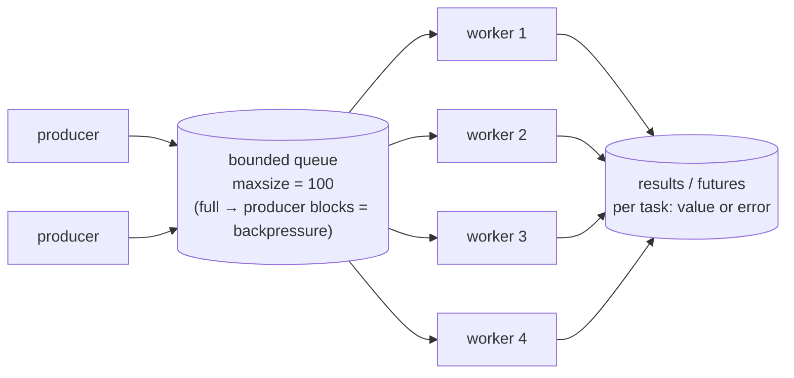
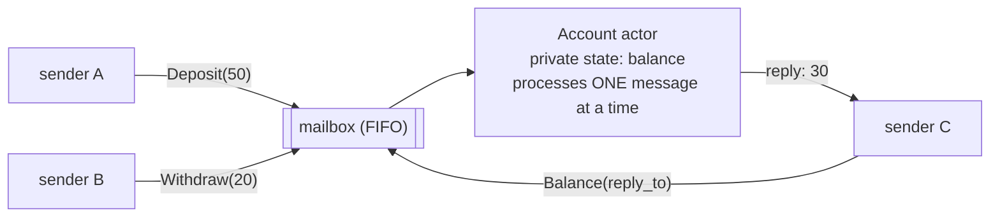
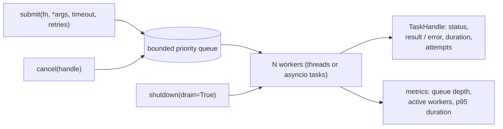

# Chapter 13 — Concurrency Patterns & Thread Safety

> **Volume 3 — Low-Level Design** · [Contents](index.md) · ← [Chapter 12 — Event Bus, CQRS & Event Sourcing](ch12-event-bus-cqrs-and-event-sourcing.md) · Next → [Chapter 14 — Resilience Patterns (Idempotency, Retries, Backoff, Circuit Breakers)](ch14-resilience-patterns-idempotency-retries-backoff-circuit-breakers.md)

---

## Concept

Mutexes, channels, worker pools, actor model, lock-free patterns, and eliminating races.

**In one sentence:** safe concurrent code either *shares* data and guards it carefully (locks, atomics) or *doesn't share* data at all and passes messages instead (channels, actors) — and the second is usually easier to get right.

**Mental model — a shared kitchen.** Shared state with a mutex is one knife that cooks must take turns with — safe, but they wait and can deadlock. A channel is a pass-through window: one cook puts a plate in, another takes it out, and nobody touches the same plate at once. An actor is a cook with a private station and an order slip inbox — you never touch their station, you just drop slips in. A worker pool is a fixed number of cooks pulling tickets from one rail.

**The patterns**

| Pattern | Idea | Good for | Watch out for |
|---------|------|----------|---------------|
| **Mutex / lock** | one thread at a time in a critical section | small shared state (counters, caches) | deadlocks, contention, forgetting to lock |
| **RW lock** | many readers or one writer | read-mostly shared data | writer starvation |
| **Atomics** | indivisible CPU operations (`fetch_add`, compare-and-swap) | counters, flags, lock-free structures | subtle memory ordering; hard beyond simple cases |
| **Channel / queue** | threads communicate by sending values; the receiver owns them | pipelines, producer–consumer | unbounded queues hide overload |
| **Worker pool** | N workers pull tasks from a shared queue | bounded parallelism for many tasks | choosing N; per-task errors and results |
| **Actor model** | each actor owns private state and processes one message at a time from its mailbox | many independent stateful entities (sessions, devices, game objects) | mailbox overflow; request/reply is async |
| **Immutable data** | nothing changes, so nothing races | config, snapshots, messages | copying cost |
| **Thread confinement** | only one thread ever touches an object | UI threads, event loops, per-thread buffers | enforcing the rule |
| **Future / promise** | a handle to a result computed elsewhere | collecting per-task results | blocking on `.result()` in the wrong place |

**Shared state vs message passing** — "Do not communicate by sharing memory; share memory by communicating" (Go proverb). With message passing, each piece of data has *one owner at a time*, which removes data races by construction and makes the flow visible. Shared state is faster for tiny, hot data, but every access must be guarded, and composing locks invites deadlock ([Vol 1 Ch 38](../volume-1-cs-foundations/ch38-os-processes-threads-scheduling-synchronization-and-deadlocks.md)).

**Making a class thread-safe — options, in order of preference**

1. **Make it immutable** (frozen dataclass; return new objects).
2. **Confine it** to one thread or actor and talk to it through a queue.
3. **Guard it** with one internal lock around every method that touches shared fields (a *monitor*); never hand out references to internal mutable state; keep critical sections short; don't call unknown code (callbacks) while holding the lock.
4. Use **atomics / concurrent collections** (`queue.Queue`, `ConcurrentHashMap`, `AtomicU64`).
5. **Document the contract**: "thread-safe", "not thread-safe — confine to one thread", or "safe for concurrent reads only".

**Bound concurrency** — always cap it (pool size, semaphore, bounded queue), so overload turns into backpressure instead of a thousand threads or an out-of-memory crash.

---

## Prereqs

* [Vol 1 Ch 13 — Concurrency: Threads, Processes, Async, Futures & Coroutines](../volume-1-cs-foundations/ch13-concurrency-threads-processes-async-futures-and-coroutines.md)
* [Vol 1 Ch 38 — OS: Processes, Threads, Scheduling, Synchronization & Deadlocks](../volume-1-cs-foundations/ch38-os-processes-threads-scheduling-synchronization-and-deadlocks.md)

---

## Diagram

**A worker pool (queue → N workers)**



**An actor mailbox**



**Shared state vs message passing**

```
 SHARED STATE + LOCK                         MESSAGE PASSING
 T1 ─┐   ┌────────────┐                      T1 ──msg──►┐
 T2 ─┼─► │ lock ▸ data│ ◄─ everyone waits    T2 ──msg──►├─► [queue] ─► owner thread ─► data
 T3 ─┘   └────────────┘    here               T3 ──msg──►┘                 (only it touches data)
 races possible if anyone forgets the lock   no races by construction
```

---

## Example

```python
import threading, queue, time
from concurrent.futures import ThreadPoolExecutor, as_completed

# ---- 1. Mutex-protected counter (a monitor) --------------------------------------
class Counter:
    """Thread-safe: every access to _n holds _lock."""
    def __init__(self): self._n, self._lock = 0, threading.Lock()
    def incr(self):
        with self._lock:
            self._n += 1
    @property
    def value(self):
        with self._lock:
            return self._n

c = Counter()
threads = [threading.Thread(target=lambda: [c.incr() for _ in range(10_000)]) for _ in range(8)]
for t in threads: t.start()
for t in threads: t.join()
print(c.value)                                              # 80000

# ---- 2. Channel-based worker pool: no shared mutable state -----------------------
def worker_pool(tasks, fn, n_workers=4):
    inbox, outbox = queue.Queue(maxsize=100), queue.Queue()
    STOP = object()
    def worker():
        while (item := inbox.get()) is not STOP:
            idx, arg = item
            try:
                outbox.put((idx, fn(arg), None))
            except Exception as e:
                outbox.put((idx, None, e))                  # per-task error, pool keeps running
    ws = [threading.Thread(target=worker) for _ in range(n_workers)]
    for w in ws: w.start()
    for i, t in enumerate(tasks): inbox.put((i, t))         # blocks when full → backpressure
    for _ in ws: inbox.put(STOP)
    for w in ws: w.join()
    results = [outbox.get() for _ in tasks]
    return [r for r in sorted(results, key=lambda r: r[0])]

out = worker_pool([1, 2, 0, 4], lambda x: 10 // x)
print([(i, v, type(e).__name__ if e else None) for i, v, e in out])
# [(0, 10, None), (1, 5, None), (2, None, 'ZeroDivisionError'), (3, 2, None)]

# ---- 3. An actor with a mailbox -------------------------------------------------
class AccountActor(threading.Thread):
    def __init__(self):
        super().__init__(daemon=True)
        self.mailbox, self._balance = queue.Queue(), 0      # _balance is touched ONLY by run()
    def run(self):
        while True:
            msg, arg, reply = self.mailbox.get()
            if msg == "deposit": self._balance += arg
            elif msg == "withdraw" and arg <= self._balance: self._balance -= arg
            elif msg == "balance": reply.put(self._balance)
    def tell(self, msg, arg=None): self.mailbox.put((msg, arg, None))
    def ask(self, msg):
        reply = queue.Queue(maxsize=1); self.mailbox.put((msg, None, reply)); return reply.get(timeout=1)

acct = AccountActor(); acct.start()
for _ in range(100): acct.tell("deposit", 5)
acct.tell("withdraw", 120)
print(acct.ask("balance"))                                  # 380

# ---- 4. The standard library does most of this for you --------------------------
with ThreadPoolExecutor(max_workers=8) as pool:             # bounded worker pool + futures
    futs = {pool.submit(time.sleep, 0.01): i for i in range(20)}
    print(sum(1 for f in as_completed(futs) if f.exception() is None))   # 20
```

---

## Exercises

1. Implement a thread-safe worker pool.

   <details><summary>Solution</summary>See <code>worker_pool</code>: a bounded input queue (backpressure), a fixed number of worker threads, a sentinel per worker for shutdown, per-task results with errors captured, and results re-ordered by index. Production additions: timeouts per task, cancellation, graceful shutdown on SIGTERM, and metrics for queue depth. Compare with <code>ThreadPoolExecutor</code>.</details>

2. Fix a data race with a channel instead of shared state.

   <details><summary>Solution</summary>Racy version: 8 threads append results to one global dict or counter without a lock. Fix: each thread sends <code>(key, value)</code> into a <code>queue.Queue</code>, and one aggregator thread (or the main thread, after joining) is the only code that updates the dict. The dict now has a single owner, so no lock is needed.</details>

3. Why is `if key not in cache: cache[key] = compute(key)` not thread-safe even though dict operations are atomic in CPython?

   <details><summary>Solution</summary>The check and the set are two separate steps. Two threads can both see the key missing and both compute and write (check-then-act race). Guard the whole sequence with a lock (per key if <code>compute</code> is slow), or use an atomic helper such as <code>dict.setdefault</code> when the value is cheap.</details>

---

## Mini project

**A concurrent task executor with a bounded worker pool and per-task results.**



**Steps**

1. `Executor(workers=N, queue_size=M)` with `submit()` returning a `TaskHandle` (a future: `result(timeout)`, `cancel()`, `status`).
2. A bounded priority queue; `submit` blocks or raises `QueueFull` depending on a flag (backpressure policy).
3. Per-task timeout and retry with backoff (see [Ch 14](ch14-resilience-patterns-idempotency-retries-backoff-circuit-breakers.md)); errors are captured per task.
4. Graceful shutdown: stop accepting, drain or cancel queued tasks, join the workers.
5. Document the thread-safety contract of every public method; run a stress test with 10,000 tasks and random failures under `pytest-repeat`.

**Done when:** the stress test passes 100 runs in a row, the number of running tasks never exceeds N, and every submitted task ends with a result, an error, or "cancelled".

---

## Open source

* [`tokio-rs/tokio`](https://github.com/tokio-rs/tokio) — `tokio::sync` has `mpsc` channels, `Mutex`, `Semaphore`, and `oneshot` (a reply channel, as in the actor's `ask`). Alice Ryhl's "Actors with Tokio" article shows the actor pattern in Rust.
* [`python/cpython`](https://github.com/python/cpython) `concurrent.futures` — `Lib/concurrent/futures/thread.py` is a short, readable worker pool built on a work queue and futures.

---

## Interview

1. **"Shared state vs message passing?"**
   <details><summary>Answer</summary>Shared state lets threads access the same memory under locks or atomics: low overhead for small hot data, but every access must be synchronized, races are easy to introduce, and combining locks risks deadlocks. Message passing gives each piece of data one owner at a time, and others communicate by sending messages over channels or mailboxes: no data races by construction and a clearer flow, at the cost of copying or queueing and asynchronous request/reply. Default to message passing; use shared state for small, well-encapsulated cases.</details>

2. **"How do you make a class thread-safe?"**
   <details><summary>Answer</summary>Prefer immutability. Otherwise confine the object to one thread or actor, or encapsulate its state behind a single private lock that every method acquires (a monitor), making compound operations atomic, never leaking references to internal mutable state, keeping critical sections short, and not calling external code while holding the lock. Use concurrent collections or atomics where they fit. Then document the guarantee and stress-test it.</details>

---

## Checklist

- [ ] prefer channels over shared state
- [ ] bound concurrency
- [ ] document thread-safety contracts

---

> [Contents](index.md) · ← [Chapter 12 — Event Bus, CQRS & Event Sourcing](ch12-event-bus-cqrs-and-event-sourcing.md) · Next → [Chapter 14 — Resilience Patterns (Idempotency, Retries, Backoff, Circuit Breakers)](ch14-resilience-patterns-idempotency-retries-backoff-circuit-breakers.md)
