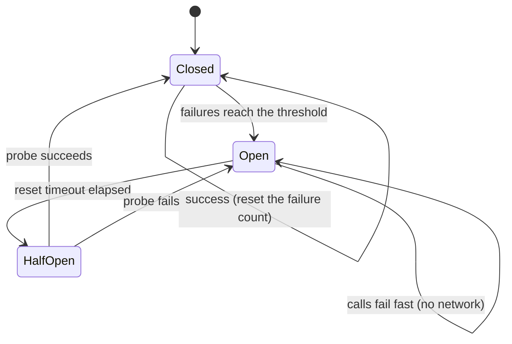
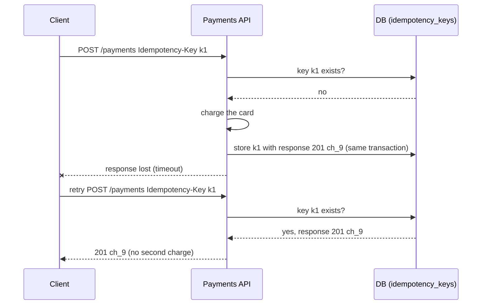
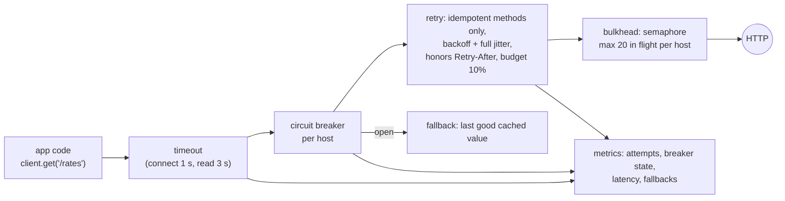

# Chapter 14 — Resilience Patterns (Idempotency, Retries, Backoff, Circuit Breakers)

> **Volume 3 — Low-Level Design** · [Contents](index.md) · ← [Chapter 13 — Concurrency Patterns & Thread Safety](ch13-concurrency-patterns-and-thread-safety.md)

---

## Concept

Making components survive failure — idempotency keys, retry with exponential backoff + jitter, and circuit breakers.

**In one sentence:** networks and dependencies fail all the time, so resilient code retries *safe* operations with growing, randomized waits, makes writes idempotent so a retry can't do something twice, and stops calling a dependency that is clearly down so it can recover.

**Mental model — calling a busy restaurant.** If the line is busy, you don't redial every second (you'd jam the line for everyone): you wait a bit longer each time, and a bit randomly so all the callers don't redial together (exponential backoff with jitter). If you're not sure your order went through, you give your order number so they don't cook it twice (idempotency key). If the restaurant has been closed all evening, you stop calling for a while and just check once later (circuit breaker).

**The patterns**

| Pattern | Protects against | Key idea |
|---------|-----------------|----------|
| **Timeout** | hanging forever | every remote call has a deadline; it's the prerequisite for everything else |
| **Retry** | transient failures (timeouts, 503, connection resets) | try again, but only for *retryable* errors and *idempotent* operations, with a limit |
| **Exponential backoff** | hammering a struggling dependency | wait `base × 2^attempt`, capped |
| **Jitter** | synchronized retry storms ("thundering herd") | randomize the wait: "full jitter" = `random(0, backoff)` |
| **Idempotency key** | duplicate side effects from retries | the client sends a unique key; the server stores key → result and returns the stored result on repeats |
| **Circuit breaker** | wasting time and resources on a dead dependency; cascading failure | after N failures, *open*: fail fast; after a cooldown, *half-open*: allow a probe; success → *closed* |
| **Bulkhead** | one slow dependency exhausting all threads | a separate pool or semaphore per dependency |
| **Fallback / graceful degradation** | total failure of a feature | cached value, default, or reduced functionality |
| **Retry budget** | retries multiplying load (3 layers × 3 retries = 27×) | retry at one layer only; cap retries at ~10% of requests |

**What is retryable?**

| Retry ✓ | Don't retry ✗ |
|---------|---------------|
| timeouts, connection errors (if idempotent) | 400, 401, 403, 404, 422 — retrying won't help |
| 502, 503, 504 | 500 without idempotency (it may have succeeded partly) |
| 429 — but honor `Retry-After` | non-idempotent `POST` without an idempotency key |
| database serialization failures, deadlocks | business rejections (card declined) |

**Idempotency** — an operation is idempotent if doing it twice has the same effect as doing it once. `GET`, `PUT`, and `DELETE` are idempotent by definition; `POST /payments` is not, unless you make it so:

1. The client generates `Idempotency-Key: <uuid>` once per logical operation and reuses it on every retry.
2. The server, in one transaction: if the key exists → return the stored response; otherwise do the work and store (key, request hash, response).
3. Same key with a *different* request body → `422` (a client bug).
4. Keys expire after a retention window (e.g. 24 h).

**Circuit breaker states**

| State | Behavior | Transition |
|-------|----------|------------|
| **Closed** | calls pass through; failures are counted | failure rate/count over a threshold → **open** |
| **Open** | calls fail immediately (`CircuitOpenError`), no network call | after `reset_timeout` → **half-open** |
| **Half-open** | allow a limited number of probe calls | probes succeed → **closed**; any probe fails → **open** again |

---

## Prereqs

* [Chapter 13 — Concurrency Patterns & Thread Safety](ch13-concurrency-patterns-and-thread-safety.md)

---

## Diagram

**A circuit breaker state machine (closed → open → half-open)**



**Exponential backoff with and without jitter**

```
 base 100 ms, cap 5 s
 attempt:        1       2       3       4        5
 no jitter:    100 ms  200 ms  400 ms  800 ms  1600 ms   ← 1,000 clients retry at the SAME instants
 full jitter:  0–100   0–200   0–400   0–800   0–1600    ← retries spread out evenly

 load on the recovering service
 no jitter    █        █        █        █        spikes that knock it down again
 full jitter  ▃▃▃▃▃▃▃▃▃▃▃▃▃▃▃▃▃▃▃▃▃▃▃▃▃▃▃▃▃▃▃▃   smooth
```

**Idempotency key flow**



---

## Example

```python
import random, time, threading, functools

# ---- retry with exponential backoff + full jitter ---------------------------------
class TransientError(Exception): ...

def retry(times=5, base=0.1, cap=5.0, retry_on=(TransientError, TimeoutError), sleep=time.sleep):
    def deco(fn):
        @functools.wraps(fn)
        def wrapper(*args, **kwargs):
            for attempt in range(times):
                try:
                    return fn(*args, **kwargs)
                except retry_on:
                    if attempt == times - 1:
                        raise                                         # out of attempts
                    backoff = min(cap, base * 2 ** attempt)
                    sleep(random.uniform(0, backoff))                 # full jitter
        return wrapper
    return deco

calls = {"n": 0}
@retry(times=4, sleep=lambda s: None)                                 # no real sleeping in the demo
def flaky():
    calls["n"] += 1
    if calls["n"] < 3: raise TransientError("503")
    return "ok"
print(flaky(), calls["n"])                                            # ok 3

# ---- circuit breaker ------------------------------------------------------------
class CircuitOpenError(Exception): ...

class CircuitBreaker:
    def __init__(self, threshold=3, reset_timeout=10.0, clock=time.monotonic):
        self.threshold, self.reset_timeout, self.clock = threshold, reset_timeout, clock
        self.state, self.failures, self.opened_at = "closed", 0, 0.0
        self._lock = threading.Lock()

    def call(self, fn, *args, **kwargs):
        with self._lock:
            if self.state == "open":
                if self.clock() - self.opened_at < self.reset_timeout:
                    raise CircuitOpenError("failing fast")
                self.state = "half_open"                             # allow one probe
        try:
            result = fn(*args, **kwargs)
        except Exception:
            with self._lock:
                self.failures += 1
                if self.state == "half_open" or self.failures >= self.threshold:
                    self.state, self.opened_at = "open", self.clock()
            raise
        with self._lock:
            self.state, self.failures = "closed", 0
        return result

now = [0.0]
cb = CircuitBreaker(threshold=2, reset_timeout=10, clock=lambda: now[0])
def down(): raise ConnectionError("refused")
for _ in range(2):
    try: cb.call(down)
    except ConnectionError: pass
print(cb.state)                                                       # open
try: cb.call(down)
except CircuitOpenError as e: print(e)                                # failing fast (no call made)
now[0] = 11                                                           # cooldown passes
print(cb.call(lambda: "recovered"), cb.state)                          # recovered closed

# ---- idempotency key (server side) ------------------------------------------------
_store: dict[str, tuple[int, dict]] = {}                              # in production: a DB table, same transaction
def create_payment(idem_key: str, body: dict, charge=lambda b: {"id": f"ch_{len(_store) + 1}"}):
    fingerprint = hash(frozenset(body.items()))
    if idem_key in _store:
        fp, response = _store[idem_key]
        if fp != fingerprint:
            return 422, {"error": "idempotency key reused with a different request"}
        return 201, response                                          # replay: no second charge
    response = charge(body)
    _store[idem_key] = (fingerprint, response)
    return 201, response

print(create_payment("k1", {"amount": 500}), create_payment("k1", {"amount": 500}))
# (201, {'id': 'ch_1'}) (201, {'id': 'ch_1'})
print(create_payment("k1", {"amount": 900})[0])                        # 422
```

---

## Exercises

1. Add idempotency to a payment endpoint.

   <details><summary>Solution</summary>Require an <code>Idempotency-Key</code> header on <code>POST /payments</code>. Create table <code>idempotency_keys(key PK, request_hash, status, response_json, created_at)</code>. In one transaction: <code>INSERT … ON CONFLICT DO NOTHING</code>; if it already existed, return the stored response (or 409 "in progress" if the first attempt is still running); otherwise charge (passing the same key to the payment provider), store the response, and commit. A different body with the same key → 422. Expire keys after 24 h.</details>

2. Implement a circuit breaker with half-open probing.

   <details><summary>Solution</summary>See <code>CircuitBreaker</code>. Improvements: a failure <i>rate</i> over a sliding window instead of a count (so rare errors under high traffic don't trip it); only count relevant errors (timeouts and 5xx, not 4xx); allow N concurrent probes in half-open; emit metrics on state changes; and give each dependency its own breaker. Test it with an injected clock.</details>

3. Service A retries 3× calling B, which retries 3× calling C, which retries 3× calling D. D is down. How many calls does D get per user request?

   <details><summary>Solution</summary>Up to 3 × 3 × 3 = 27 — a retry storm that makes the outage worse. Retry at only one layer (usually the outermost, or the one closest to the failing dependency), use retry budgets, and add circuit breakers so the others fail fast.</details>

---

## Mini project

**A resilient HTTP client with retries, backoff, and a circuit breaker.**



**Steps**

1. Wrap `httpx` in `ResilientClient(base_url, timeouts, retry_policy, breaker_policy)`.
2. Retry only idempotent methods (or requests carrying an `Idempotency-Key`), only on retryable errors, with capped exponential backoff and full jitter, honoring `Retry-After`.
3. One circuit breaker per host; fail fast when open; an optional fallback function.
4. A bulkhead semaphore per host.
5. Test against a local fault-injecting server (random 503s, slow responses, hard down) with a fake clock; show that recovery closes the breaker.
6. Chart attempts and load on the fake server with and without jitter.

**Done when:** under a 30% failure rate the success rate stays near 100%, a dead host costs callers under 5 ms per call (breaker open), and the jitter chart shows no synchronized spikes.

---

## Open source

* [`resilience4j/resilience4j`](https://github.com/resilience4j/resilience4j) — Java: CircuitBreaker (sliding-window failure rate, half-open permits), Retry, Bulkhead, RateLimiter, TimeLimiter.
* [`ihrwein/backoff`](https://github.com/ihrwein/backoff) — Rust exponential backoff with jitter. In Python: `tenacity` for retries and `pybreaker` for circuit breakers. Read the AWS Architecture Blog post "Exponential Backoff and Jitter" and Stripe's "Designing robust and predictable APIs with idempotency".

---

## Interview

1. **"Why jitter in backoff?"**
   <details><summary>Answer</summary>Without jitter, clients that failed at the same moment retry at the same moments too (100 ms, 200 ms, 400 ms…), creating synchronized spikes that hit the recovering service just when it's weakest and can knock it down again. Randomizing each wait (full jitter: uniform between 0 and the backoff) spreads retries evenly over time, reducing peak load and total completion time.</details>

2. **"How does a circuit breaker recover?"**
   <details><summary>Answer</summary>After it opens, it fails calls immediately for a cooldown period, giving the dependency room to recover and protecting the caller's resources. When the cooldown expires it goes half-open and lets a limited number of trial requests through. If they succeed, it closes and normal traffic resumes, with counters reset. If a trial fails, it opens again for another cooldown (often with growing cooldowns).</details>

---

## Checklist

- [ ] idempotent writes
- [ ] back off with jitter
- [ ] fail fast with a breaker when downstream is down

---

> [Contents](index.md) · ← [Chapter 13 — Concurrency Patterns & Thread Safety](ch13-concurrency-patterns-and-thread-safety.md)
