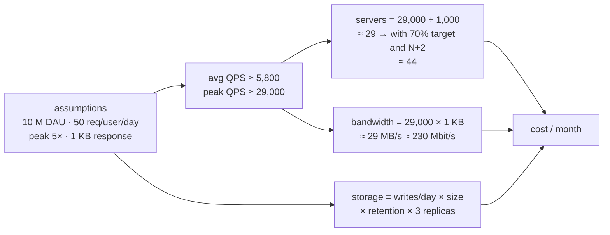
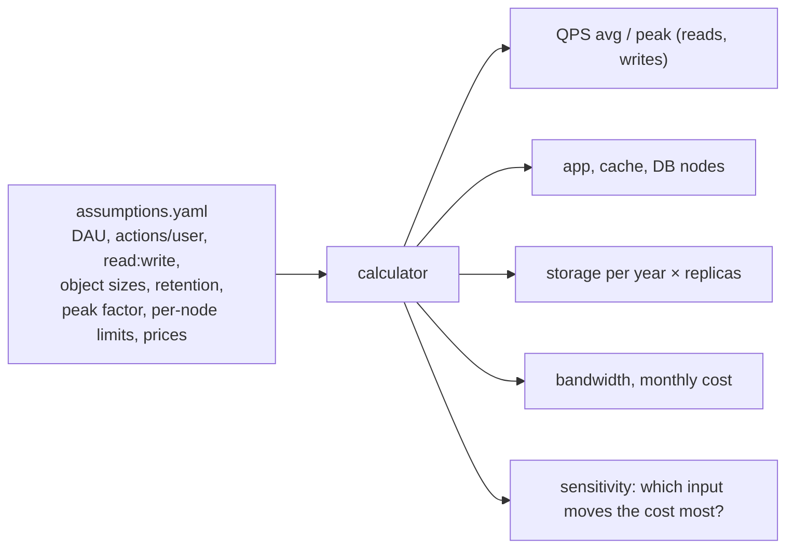
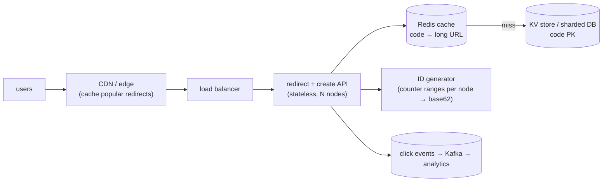

# Chapter 1 — Capacity Planning

> **Volume 4 — High-Level Design** · [Contents](index.md) · Next → [Chapter 2 — Scalability & Reliability Fundamentals](ch02-scalability-and-reliability-fundamentals.md)

---

## Concept

QPS, latency percentiles (p50/p99), throughput, storage sizing, and translating requirements into hardware/tier estimates.

**In one sentence:** capacity planning turns product numbers ("10 million daily users") into engineering numbers (requests per second, servers, terabytes, dollars) with quick, explicit, back-of-envelope math — sized for the peak, not the average.

**Mental model — planning a wedding.** You know the guest count (DAU), how much each guest eats (requests per user), and that everyone arrives at dinner time (the peak). From that you work out tables (servers), food (storage), and budget (cost). You don't need the exact count to the plate — within 2× is enough to pick the right venue.

**Core quantities**

| Quantity | Formula / meaning |
|----------|-------------------|
| Average QPS | `DAU × requests per user per day ÷ 86,400` |
| Peak QPS | `average × peak factor` (2–10×; 5× is a common assumption) |
| Read : write ratio | often 10:1 to 100:1 for consumer apps |
| Servers | `peak QPS ÷ QPS per server`, then add headroom (target ~60–70% utilization) and N+2 for failures |
| Storage | `items per day × bytes per item × retention days × replication factor` |
| Bandwidth | `QPS × response size` |
| Throughput vs latency | requests/second the system handles vs how long one request takes |

**Latency percentiles** — the *p99* is the time under which 99% of requests finish. Averages hide the tail. With fan-out, the tail dominates: a page calling 100 services each with a 1% chance of being slow is slow ~63% of the time (`1 − 0.99¹⁰⁰`). Track **p50** (typical), **p99** (tail users feel), and **p99.9** for high-volume services.

**Numbers worth memorizing**

| Item | Value |
|------|-------|
| Seconds per day | 86,400 ≈ 10⁵ |
| 1 M requests/day | ≈ 12 QPS |
| 1 B requests/day | ≈ 12,000 QPS |
| Memory read, 1 MB sequential | ~3 µs (RAM), ~50 µs (SSD), ~1 ms (network in DC) |
| Round trip in a datacenter | ~0.5 ms; cross-continent ~100–150 ms |
| One app server (typical web API) | ~1,000 QPS (varies 100–10,000+) |
| One Postgres primary (simple queries) | ~10k–50k QPS |
| Powers of 2 | 2¹⁰ ≈ 10³ (KB), 2²⁰ ≈ 10⁶ (MB), 2³⁰ ≈ 10⁹ (GB), 2⁴⁰ ≈ 10¹² (TB) |

**State assumptions explicitly.** Every estimate is only as good as its inputs. Write them down so others can challenge the right number.

---

## Prereqs

* [Vol 1 Ch 44 — Delivery: Load Balancing, Reverse Proxies & CDN](../volume-1-cs-foundations/ch44-delivery-load-balancing-reverse-proxies-and-cdn.md)
* [Vol 2 Ch 9 — Performance Engineering](../volume-2-software-engineering/ch09-performance-engineering.md)

---

## Diagram

**A capacity worksheet: QPS → servers → storage → cost**



**Average vs peak traffic over a day**

```
 QPS
 29k ┤                        ╭──╮              ← size for this
     │                    ╭───╯  ╰──╮
 5.8k┤ ─ ─ ─ ─ ─ ─ ─ ─╭───╯─ ─ ─ ─ ─╰───╮─ ─ ─  average (misleading)
     │ ╮          ╭───╯                 ╰───╮
     │ ╰──────────╯                         ╰──
     └──────────────────────────────────────────► hour
       00   04   08   12   16   20   24
```

**Percentiles on a latency distribution**

```
 requests
   │ ▇
   │ ██▇
   │ ████▆
   │ ██████▅▃▂▁▁      ▁           ▁
   └─┬───────┬──────────┬───────────┬──► latency (ms)
    p50=40  mean=55   p99=320    p99.9=900
    "the average user" is fine; 1 in 100 waits 8× longer
```

---

## Example

**Estimate servers for 10M DAU with 50 req/user/day and 1000 QPS/server**

```
 requests/day = 10,000,000 × 50              = 500,000,000
 average QPS  = 500,000,000 ÷ 86,400          ≈ 5,800
 peak QPS     = 5,800 × 5                     ≈ 29,000
 raw servers  = 29,000 ÷ 1,000                ≈ 29
 headroom     = 29 ÷ 0.7 (run at 70%)         ≈ 42
 redundancy   = + 2 (lose a node during a deploy or failure) ≈ 44 servers
 spread over 3 availability zones             → 15 per zone (45)
```

```python
def plan(dau, req_per_user, peak=5, qps_per_server=1000, target_util=0.7, spare=2):
    avg = dau * req_per_user / 86_400
    peak_qps = avg * peak
    servers = -(-peak_qps // (qps_per_server * target_util)) + spare   # ceiling
    return round(avg), round(peak_qps), int(servers)

print(plan(10_000_000, 50))        # (5787, 28935, 44)
```

---

## Exercises

1. Size storage for a chat app (messages/user/day).

   <details><summary>Solution</summary>Assume 50 M DAU × 40 messages/day × 200 bytes (text + metadata) = 400 GB/day ≈ 146 TB/year raw. ×3 replicas ≈ 440 TB/year. Media is stored separately in object storage and usually dominates; text is the small part. Add indexes (~30–50%) and plan tiering: recent months hot, older data cold.</details>

2. Estimate peak QPS with a 5× daily peak factor.

   <details><summary>Solution</summary>For 50 M DAU sending 40 messages: 2 B/day ÷ 86,400 ≈ 23,000 writes/s average, ≈ 116,000/s at a 5× peak. Each message is delivered to on average 1–2 recipients, so the fan-out read/push rate is higher. Size queues and connection servers for the peak.</details>

3. A page calls 20 backend services in parallel. Each has a p99 of 100 ms. What fraction of page loads take ≥ 100 ms?

   <details><summary>Solution</summary><code>1 − 0.99²⁰ ≈ 18%</code>. Fan-out amplifies tail latency, which is why p99 per dependency matters, and why hedged requests and timeouts exist.</details>

---

## Mini project

**A capacity calculator that turns product assumptions into a resource plan.**



**Steps**

1. A YAML file of assumptions, with a comment on every number saying where it came from.
2. Compute reads/writes QPS (avg and peak), servers with headroom, storage over 1/3/5 years with replication, bandwidth, and cost.
3. Print a Markdown table plus the list of assumptions.
4. Sensitivity analysis: vary each input ±50% and show which changes the cost most.
5. Run it for two systems from this volume (URL shortener, chat).

**Done when:** changing one assumption reruns the whole plan, and the output lists every assumption next to the result.

---

## Design

**Design the data model and capacity plan for a URL shortener.**

Requirements: 100 M new short URLs per month; 100:1 read:write; links kept 5 years; redirect p99 < 50 ms.



**Capacity**

| Item | Estimate |
|------|----------|
| Writes | 100 M / month ≈ 39 QPS avg, ~200 peak |
| Reads | 100 × writes ≈ 3,900 QPS avg, ~20,000 peak |
| URLs in 5 years | 100 M × 60 = 6 B |
| Storage | 6 B × ~500 B/row ≈ 3 TB (× 3 replicas ≈ 9 TB) |
| Code length | base62: 62⁷ ≈ 3.5 × 10¹² ≫ 6 B, so 7 characters is plenty |
| Cache | 20% of links get 80% of traffic: hot set of ~20 M × 500 B ≈ 10 GB — fits in a small Redis cluster |

**Data model:** `urls(code PK, long_url, owner_id, created_at, expires_at)`; `clicks` go to an event stream, not the hot table.

**Decisions to justify**

* **ID generation:** a counter handed out in ranges per node, then base62-encoded, avoids collisions without a lookup; hashing the URL instead gives dedup but needs collision handling.
* **Storage choice:** access is purely by key, so a KV store (DynamoDB/Cassandra) or a sharded table keyed by `code` scales linearly.
* **301 vs 302:** 301 lets browsers cache the redirect (less load) but hides repeat clicks from analytics; 302 keeps analytics accurate.
* **Reads are cache-first,** so the DB sees only misses.

---

## Open source

* [`donnemartin/system-design-primer`](https://github.com/donnemartin/system-design-primer) — the "Back-of-the-envelope calculations" section, latency numbers every programmer should know, and a worked Pastebin/URL-shortener design.

---

## Interview

1. **"How do you estimate QPS from DAU?"**
   <details><summary>Answer</summary>QPS ≈ DAU × actions per user per day ÷ 86,400 (about 10⁵). Split reads from writes by the expected ratio, multiply by a peak factor (2–10×, state which), and add headroom. Example: 10 M DAU × 50 requests ≈ 5,800 QPS average, ≈ 29,000 peak. Always state the assumptions so they can be challenged.</details>

2. **"What percentile matters most for latency?"**
   <details><summary>Answer</summary>Usually p99 (or p99.9 at high volume). The average hides the slow requests real users hit, and with fan-out one slow dependency makes many pages slow. Set SLOs on high percentiles, watch p50 for general speed, and never alert on the average alone.</details>

---

## Checklist

- [ ] use back-of-envelope math
- [ ] plan for peak, not average
- [ ] state assumptions explicitly

---

> [Contents](index.md) · Next → [Chapter 2 — Scalability & Reliability Fundamentals](ch02-scalability-and-reliability-fundamentals.md)
