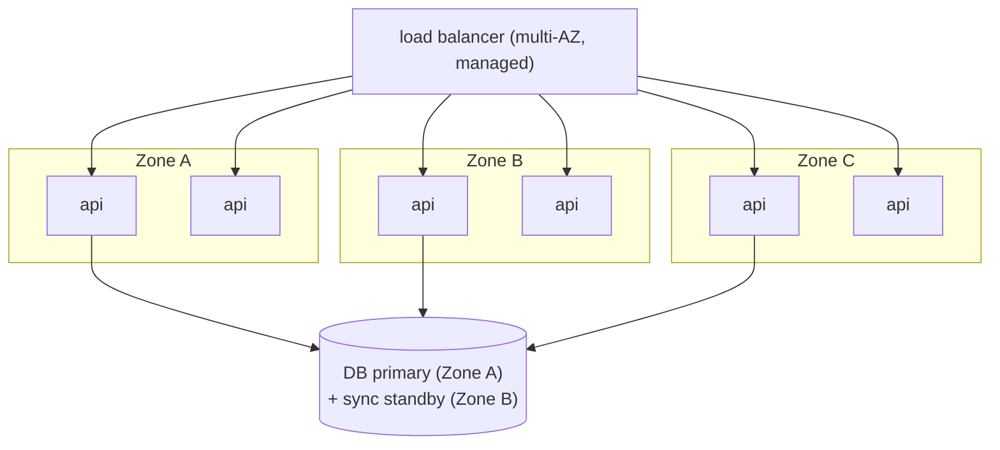
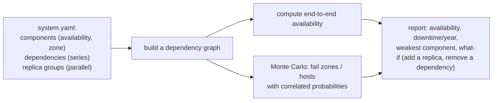
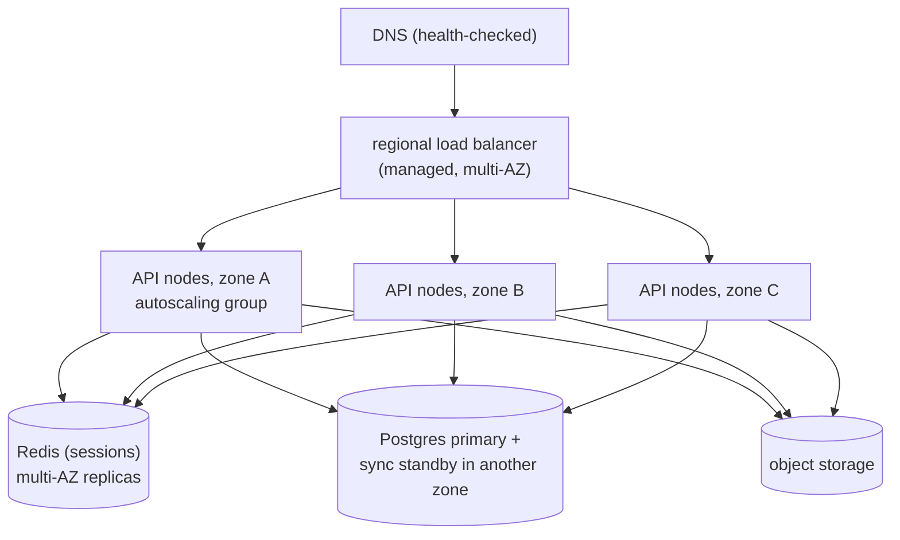

# Chapter 2 — Scalability & Reliability Fundamentals

> **Volume 4 — High-Level Design** · [Contents](index.md) · ← [Chapter 1 — Capacity Planning](ch01-capacity-planning.md) · Next → [Chapter 3 — Distributed Systems Patterns](ch03-distributed-systems-patterns.md)

---

## Concept

Vertical vs horizontal scaling, statelessness, redundancy, failure domains, availability math (N nines).

**In one sentence:** you scale by buying a bigger machine (vertical) or more machines (horizontal); horizontal scaling needs stateless servers; and reliability comes from redundancy spread across independent failure domains, which you can reason about with simple probability.

**Mental model — a bakery.** Vertical scaling is buying a bigger oven: easy, but there's a largest oven money can buy, and if it breaks, no bread. Horizontal scaling is adding more ovens: more complex to coordinate, but no ceiling, and one broken oven doesn't stop the shop. Stateless bakers can work at any oven because the recipe is on the wall (shared storage), not in one baker's head.

**Vertical vs horizontal**

| | Vertical (scale up) | Horizontal (scale out) |
|-|---------------------|------------------------|
| How | bigger CPU, RAM, disk | more nodes behind a load balancer |
| Limit | the biggest machine available | effectively none (coordination costs grow) |
| Complexity | low: no code changes | needs stateless apps, partitioning, service discovery |
| Failure | one box = single point of failure | survives node loss |
| Cost curve | gets expensive fast at the top end | roughly linear with commodity nodes |
| Good for | databases (first), quick wins | stateless web/API tiers, workers, caches |

**Statelessness** — a server is stateless when any request can go to any instance. Move session data, uploads, and caches out of process memory into shared stores (Redis, a database, object storage) or into signed client tokens. Then you can add, remove, and replace instances freely.

**Failure domains** — things that fail together: a process, a host, a rack, an availability zone (AZ), a region, a cloud provider, a deploy, a config push. Spread replicas across domains so one failure never takes out all copies. Correlated failures (same bad deploy everywhere, same dependency) are the real enemy.

**Availability math**

| Setup | Formula | Example with 99.9% parts |
|-------|---------|--------------------------|
| **Series** (A needs B needs C) | `A × B × C` | 2 in series: 99.8% |
| **Parallel** (any one of n is enough) | `1 − (1 − A)ⁿ` | 2 in parallel: 99.9999% |
| 5 services in series | `0.999⁵` | 99.5% |

Parallel math assumes *independent* failures — the reason to use different AZs.

**What the nines allow**

| Availability | Downtime per year | per month |
|--------------|------------------:|----------:|
| 99% | 3.65 days | 7.3 h |
| 99.9% | 8.76 h | 43.8 min |
| 99.99% | 52.6 min | 4.4 min |
| 99.999% | 5.26 min | 26 s |

**Reliability levers** — redundancy (N+1, N+2), health checks and automatic failover, timeouts, retries with backoff, circuit breakers ([Vol 3 Ch 14](../volume-3-low-level-design/ch14-resilience-patterns-idempotency-retries-backoff-circuit-breakers.md)), load shedding, graceful degradation, and gradual rollouts.

---

## Prereqs

* [Chapter 1 — Capacity Planning](ch01-capacity-planning.md)

---

## Diagram

**Scale-up vs scale-out**

```
 SCALE UP                                SCALE OUT
 ┌──────────────┐                        ┌────┐ ┌────┐ ┌────┐ ┌────┐
 │              │                        │ 4c │ │ 4c │ │ 4c │ │ 4c │  … add more
 │   64 cores   │                        └────┘ └────┘ └────┘ └────┘
 │   512 GB     │                             ▲      ▲      ▲
 │              │                        ┌────┴──────┴──────┴────┐
 └──────────────┘                        │     load balancer     │
 one box, one failure = outage           └───────────────────────┘
```

**Redundancy across failure domains, with the availability formula**



```
 zone availability 99.9%, 3 zones in parallel:   1 − (0.001)³ = 99.9999999%  (if independent)
 in series with the DB pair (99.99%):             ≈ 99.99%  ← the DB now limits the system
```

**Series vs parallel**

```
 SERIES    [A 99.9%]──[B 99.9%]           = 0.999 × 0.999        = 99.80%
 PARALLEL  ┌─[A 99.9%]─┐
           └─[B 99.9%]─┘                  = 1 − 0.001 × 0.001    = 99.9999%
```

---

## Example

```python
from functools import reduce

def series(*parts):   return reduce(lambda a, b: a * b, parts, 1.0)
def parallel(a, n):   return 1 - (1 - a) ** n

print(f"{series(0.999, 0.999):.4%}")          # 99.8001%
print(f"{parallel(0.999, 2):.6%}")            # 99.999900%
print(f"{series(*[0.999] * 5):.4%}")          # 99.5010% — 5 services in a chain

def downtime(avail, period_h=24 * 365):
    return (1 - avail) * period_h * 60        # minutes
for a in (0.99, 0.999, 0.9999, 0.99999):
    print(f"{a:.3%}: {downtime(a):8.1f} min/year")
```

**Making a stateful service horizontally scalable**

```
 BEFORE: sessions in process memory      AFTER: sessions in Redis
 user → LB → api-2 (has the session)     user → LB → any api node → Redis session:abc
 api-2 dies → the user is logged out     node dies → the next request goes elsewhere, still logged in
 sticky sessions needed                  no stickiness needed; autoscale freely
```

---

## Exercises

1. Compute availability of three nines across 5 services.

   <details><summary>Solution</summary>In series: 0.999⁵ ≈ 99.50%, about 44 hours of downtime a year — much worse than any single service. Fixes: remove dependencies from the critical path, make calls optional (degrade gracefully), add redundancy per service, or use async processing.</details>

2. Make a stateful service horizontally scalable.

   <details><summary>Solution</summary>Find all state held in memory or on local disk: sessions, uploads, caches, scheduled jobs, in-memory queues. Move sessions to Redis or signed tokens, files to object storage, caches to a shared cache (or accept per-node caches), queues to a broker, and cron to a single scheduler with leader election. Then any node can serve any request.</details>

3. Why doesn't running 3 replicas in the same rack give "three nines times three"?

   <details><summary>Solution</summary>The parallel formula needs independent failures. A rack power or switch failure takes all three down together. Spread across racks, zones, or regions to make failures independent.</details>

---

## Mini project

**An availability/reliability calculator with failure-domain modeling.**



**Steps**

1. Describe components, their availability, their failure domain (zone), and how they combine.
2. Compute availability analytically for series/parallel groups.
3. Monte Carlo simulation where a zone failure takes down all components in it; compare with the analytic (independent) result.
4. Report the weakest link and the effect of each "what-if".

**Done when:** the simulation shows how correlated zone failures lower availability compared with the naive formula.

---

## Design

**Design a highly available stateless API tier.**

Target: 99.99% for the API tier, 20,000 peak QPS, zero-downtime deploys.



**Capacity:** 20,000 QPS ÷ (1,000 QPS/node × 0.7) ≈ 29 nodes; to survive losing a whole zone, the remaining two zones must carry the peak, so 29 ÷ 2 ≈ 15 per zone → **45 nodes** (15 × 3).

**Decisions to justify**

* **Stateless nodes** (sessions in Redis, files in object storage), so the autoscaler can replace nodes freely.
* **N+1 zones:** each zone holds enough capacity to lose one zone at peak.
* **Health checks** (readiness vs liveness) and connection draining for zero-downtime rolling deploys.
* **Timeouts, retries with jitter, and circuit breakers** around the DB and cache; serve degraded responses if a non-critical dependency fails.
* **The DB is the availability bottleneck:** synchronous standby in another zone with automatic failover; read replicas for scale.

---

## Open source

* [`donnemartin/system-design-primer`](https://github.com/donnemartin/system-design-primer) — sections on "Availability vs consistency", "Availability in numbers", and scaling a web app step by step. See also Google's *Site Reliability Engineering* book.

---

## Interview

1. **"Horizontal vs vertical scaling?"**
   <details><summary>Answer</summary>Vertical: a bigger machine — simple, no code change, but it has a ceiling and remains a single point of failure. Horizontal: more machines behind a load balancer — no hard ceiling and tolerant of node loss, but it requires stateless design, data partitioning, and coordination. Typically scale the stateless tier horizontally from the start and scale the database vertically first, then with replicas and sharding.</details>

2. **"What does 99.99% allow per year?"**
   <details><summary>Answer</summary>About 52.6 minutes of downtime per year (~4.4 minutes per month). That is too little time for a human to notice, diagnose, and fix most problems, so it requires automatic failover, redundancy across zones, safe deploys, and fast rollbacks.</details>

---

## Checklist

- [ ] design for statelessness
- [ ] spread across failure domains
- [ ] compute availability correctly

---

> [Contents](index.md) · ← [Chapter 1 — Capacity Planning](ch01-capacity-planning.md) · Next → [Chapter 3 — Distributed Systems Patterns](ch03-distributed-systems-patterns.md)
