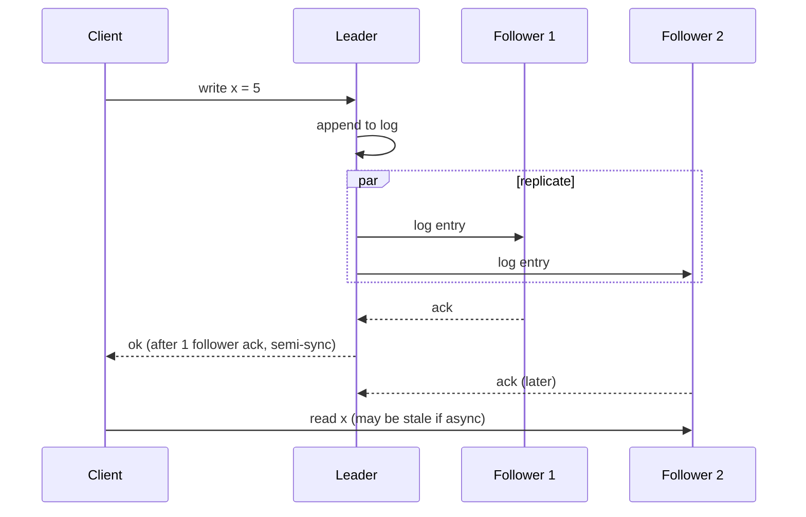
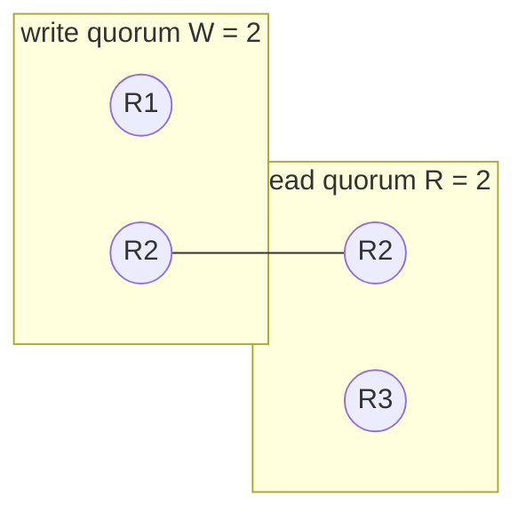
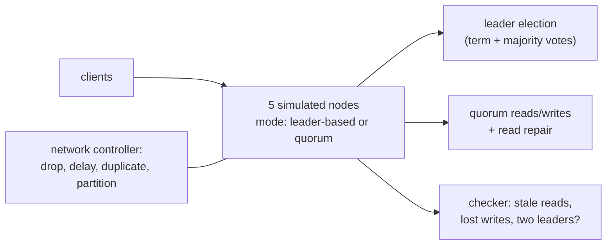
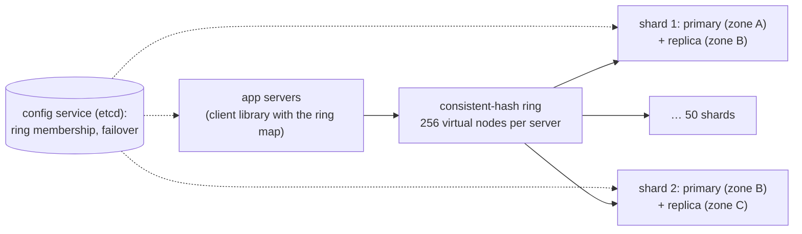

# Chapter 3 — Distributed Systems Patterns

> **Volume 4 — High-Level Design** · [Contents](index.md) · ← [Chapter 2 — Scalability & Reliability Fundamentals](ch02-scalability-and-reliability-fundamentals.md) · Next → [Chapter 4 — Load Balancing](ch04-load-balancing.md)

---

## Concept

Replication, partitioning, leader/follower, quorums, idempotency, and the failure modes that shape every design.

**In one sentence:** almost every large system combines a few patterns — copy data for safety (replication), split data for scale (partitioning), let one node decide writes (leader/follower), require overlapping majorities (quorums), and make repeated requests harmless (idempotency) — because networks lose, delay, and duplicate messages and nodes fail in partial, confusing ways.

**Mental model — a team spread across cities.** Each office keeps copies of important files (replication), each office owns certain customers (partitioning), one manager signs off changes (leader), big decisions need a majority vote (quorum), and every instruction has a reference number so doing it twice doesn't double-pay anyone (idempotency). The phone lines are unreliable, so every rule assumes a message may be lost or arrive twice.

**The patterns**

| Pattern | Solves | Key trade-off | Deep dive |
|---------|--------|---------------|-----------|
| Replication | durability, availability, read scale | consistency lag (async) vs latency (sync) | [Vol 1 Ch 51](../volume-1-cs-foundations/ch51-replication-sharding-raft-and-paxos.md) |
| Partitioning / sharding | write scale, data size | cross-partition queries, hot spots, resharding | [Ch 9](ch09-database-scaling.md) |
| Leader / follower | a single place to order writes | failover time; leader bottleneck | |
| Leader election / consensus | exactly one leader, even after failures | needs a majority; slower writes | Raft, etcd |
| **Quorums** | tunable consistency without a single leader | R + W > N for overlap | Dynamo, Cassandra |
| **Idempotency** | safe retries in a world of duplicates | storing keys / dedup state | [Vol 3 Ch 14](../volume-3-low-level-design/ch14-resilience-patterns-idempotency-retries-backoff-circuit-breakers.md) |
| Leases + fencing tokens | safe locks despite pauses | clock assumptions | |
| Heartbeats + timeouts | failure detection | false positives vs slow detection | |

**Quorums** — with N replicas, a write waits for W acknowledgments and a read asks R replicas. If **R + W > N**, every read set overlaps every write set in at least one replica, so a read sees the latest acknowledged write (use version numbers to pick it). Common: N = 3, W = 2, R = 2. Trade: W = 1 is fast writes but weak durability; R = 1 is fast reads but possibly stale.

**Failure modes that shape every design**

| Failure | What it looks like | Defense |
|---------|--------------------|---------|
| Crash | a node stops | replication + failover |
| **Partial failure** | a node is slow, or some requests fail | timeouts, retries with backoff, hedging, circuit breakers |
| Network partition | two groups can't talk | quorums; the minority side refuses writes |
| **Split-brain** | two nodes both think they are leader | majority-based election, fencing tokens, STONITH |
| Message loss / duplication / reordering | retries create duplicates | idempotency keys, sequence numbers |
| Clock skew | timestamps disagree across nodes | logical clocks, avoid last-write-wins on wall time |
| Gray failure | health checks pass but real traffic fails | health checks that exercise real paths; outlier detection |
| Cascading failure | retries and overload spread to neighbors | load shedding, backpressure ([Ch 6](ch06-rate-limiting-throttling-and-backpressure.md)), retry budgets |

**The eight fallacies of distributed computing** — the network is reliable; latency is zero; bandwidth is infinite; the network is secure; topology doesn't change; there is one administrator; transport cost is zero; the network is homogeneous. Every one is false.

---

## Prereqs

* [Vol 1 Ch 47 — ACID, Transactions & Isolation](../volume-1-cs-foundations/ch47-acid-transactions-and-isolation.md)
* [Vol 1 Ch 49 — Redis, Elasticsearch, Neo4j & Vector Databases](../volume-1-cs-foundations/ch49-redis-elasticsearch-neo4j-and-vector-databases.md)

---

## Diagram

**Leader-follower replication**



**A quorum read/write (N = 3, W = 2, R = 2)**

```
 write x=5 (v7) → R1 ✓  R2 ✓  R3 ✗ (down)      W = 2 reached → success
 read x         → R2 (v7)  R3 (v6)               R = 2 → overlap on R2 → pick highest version v7
 R + W = 4 > N = 3  → every read quorum contains at least one replica from the write quorum
```



**Split-brain and how a majority prevents it**

```
 5 nodes split into {A, B} | {C, D, E}
 {A, B}: 2 of 5 — no majority → cannot elect a leader, refuses writes
 {C, D, E}: 3 of 5 — majority → elects a leader, keeps serving
 without the majority rule, both sides accept writes → conflicting data (split-brain)
```

---

## Example

```python
import random

class Replica:
    def __init__(self, name): self.name, self.data, self.up = name, {}, True
    def write(self, k, v, ver):
        if not self.up: raise ConnectionError(self.name)
        if ver > self.data.get(k, (None, -1))[1]:
            self.data[k] = (v, ver)
    def read(self, k):
        if not self.up: raise ConnectionError(self.name)
        return self.data.get(k, (None, -1))

class QuorumKV:
    def __init__(self, n=3, w=2, r=2):
        assert r + w > n, "R + W must exceed N for read-your-latest-write"
        self.reps, self.w, self.r, self.ver = [Replica(f"r{i}") for i in range(n)], w, r, 0

    def put(self, k, v):
        self.ver += 1
        acks = 0
        for rep in self.reps:
            try: rep.write(k, v, self.ver); acks += 1
            except ConnectionError: pass
        if acks < self.w: raise RuntimeError(f"only {acks} acks, need {self.w}")

    def get(self, k):
        answers = []
        for rep in random.sample(self.reps, len(self.reps)):
            try: answers.append(rep.read(k))
            except ConnectionError: continue
            if len(answers) == self.r: break
        if len(answers) < self.r: raise RuntimeError("no read quorum")
        return max(answers, key=lambda a: a[1])[0]      # newest version wins

kv = QuorumKV()
kv.put("x", 1)
kv.reps[2].up = False
kv.put("x", 5)                        # succeeds with 2 of 3
kv.reps[2].up, kv.reps[0].up = True, False
print(kv.get("x"))                    # 5 — the overlap guarantees it
```

---

## Exercises

1. Explain a split-brain and its prevention.

   <details><summary>Solution</summary>A partition or a paused leader leads a second node to become leader while the first still thinks it is one; both accept writes and data diverges. Prevent with majority-based election (only the side with more than half the nodes can have a leader), leases that expire, fencing tokens checked by storage, and STONITH (forcibly fencing the old leader) in older HA setups.</details>

2. Design a replicated KV store with quorum reads.

   <details><summary>Solution</summary>N = 3 replicas per key (consistent-hash placement across zones); writes carry a version (a vector clock, or a per-key counter from a leader); W = 2, R = 2; reads compare versions and return the newest, with read repair to update stale replicas; hinted handoff when a replica is down; periodic anti-entropy (Merkle trees). Tune W/R per use case.</details>

3. With N = 5, which (R, W) pairs guarantee overlap? Which is best for a read-heavy workload?

   <details><summary>Solution</summary>Any with R + W ≥ 6: (1, 5), (2, 4), (3, 3), (4, 2), (5, 1). For read-heavy, R = 1, W = 5 gives the fastest reads but every write needs all 5 (writes fail if one node is down). (2, 4) or (3, 3) are usually better balances.</details>

---

## Mini project

**A small replicated KV store simulator with leader election and quorum.**



**Steps**

1. Nodes exchange messages through a controller that can drop, delay, duplicate, or partition them.
2. Leader mode: majority election by term; writes go to the leader and commit on a majority.
3. Quorum mode: configurable N/W/R with versions and read repair.
4. Idempotent client writes: a request ID so a retried write isn't applied twice.
5. Inject failures and check invariants: never two leaders in one term; with R + W > N, no stale reads.

**Done when:** the checker finds violations when you set R + W ≤ N or disable the majority rule, and none with the correct settings.

---

## Design

**Design a distributed cache.**

Requirements: 5 TB of cached data, 1 M reads/s and 100k writes/s at peak, p99 < 2 ms inside the datacenter, survive a node or zone loss.



**Capacity:** 5 TB ÷ 100 GB usable RAM per node = 50 primaries (+ 50 replicas = 100 nodes). 1 M reads/s ÷ 100 nodes (replicas serve reads) = 10k reads/s per node — comfortable for Redis/Memcached, which handle ~100k/s each. Network: 1 M × 1 KB ≈ 1 GB/s total, ~10 MB/s per node.

**Decisions to justify**

* **Consistent hashing with virtual nodes** so adding a node moves only ~1/N of keys.
* **Primary + async replica in another zone**; on primary failure, the config service promotes the replica. Some recent writes may be lost — acceptable for a cache.
* **Client-side routing** (no proxy hop) for the lowest latency; or a proxy tier (Twemproxy/Envoy) for simpler clients.
* **Hot keys:** replicate them to several nodes or add a small in-process L1 cache.
* **Eviction:** LRU/LFU per node; TTLs with jitter to avoid synchronized expiry ([Ch 5](ch05-caching-strategies.md)).

---

## Open source

* [`etcd-io/etcd`](https://github.com/etcd-io/etcd) — Raft-based leader election and a consistent config store.
* [`redis/redis`](https://github.com/redis/redis) (replication) — `src/replication.c` (async replication, `WAIT` for synchronous acks) and Redis Cluster's hash slots. Read the Amazon Dynamo paper for quorums, hinted handoff, and read repair.

---

## Interview

1. **"How do quorums give consistency?"**
   <details><summary>Answer</summary>With N replicas, requiring W acknowledgments for writes and R responses for reads with R + W > N means every read set intersects every write set in at least one replica. That replica has the latest acknowledged write; versions let the reader pick it. Choosing W and R trades latency and availability against consistency; sloppy quorums and concurrent writes still need conflict resolution.</details>

2. **"What is split-brain?"**
   <details><summary>Answer</summary>A failure mode where two parts of a cluster each believe they are the authority (for example two leaders after a partition or a long GC pause), so both accept writes and the data diverges. It's prevented by majority-based leadership, leases with expiry, and fencing tokens that make storage reject a stale leader's writes.</details>

---

## Checklist

- [ ] choose replication strategy
- [ ] use quorums deliberately
- [ ] handle partial failures

---

> [Contents](index.md) · ← [Chapter 2 — Scalability & Reliability Fundamentals](ch02-scalability-and-reliability-fundamentals.md) · Next → [Chapter 4 — Load Balancing](ch04-load-balancing.md)
