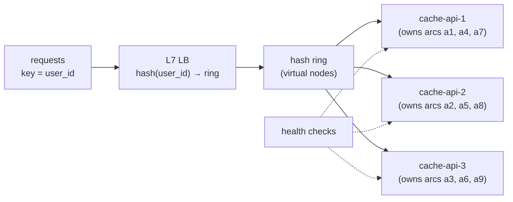
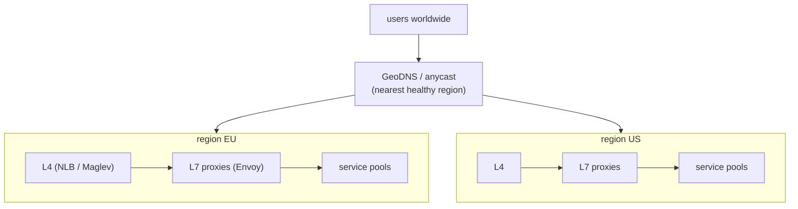
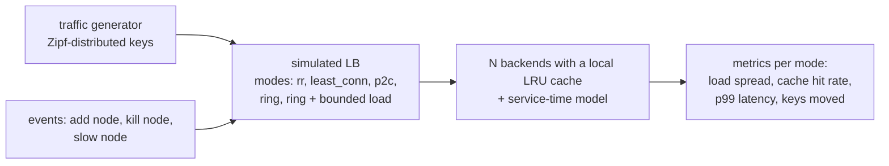
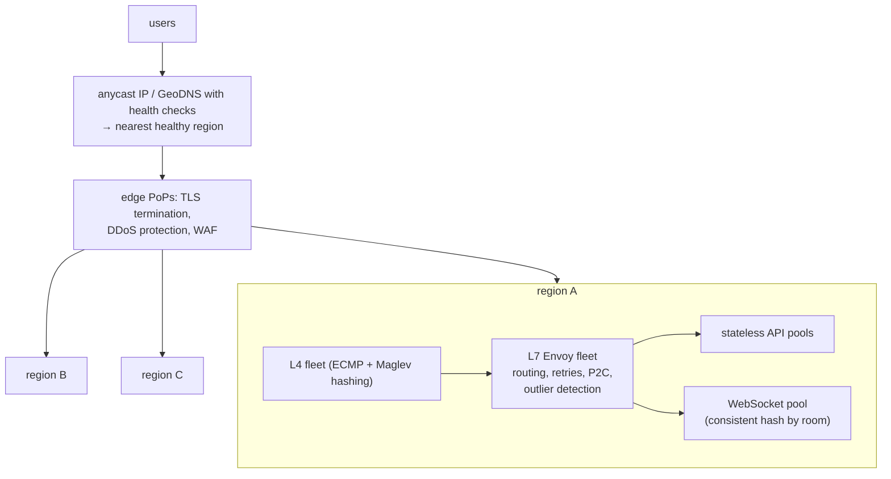

# Chapter 4 — Load Balancing

> **Volume 4 — High-Level Design** · [Contents](index.md) · ← [Chapter 3 — Distributed Systems Patterns](ch03-distributed-systems-patterns.md) · Next → [Chapter 5 — Caching Strategies](ch05-caching-strategies.md)

---

## Concept

L4 vs L7, algorithms (round-robin, least-conn, consistent hashing), health checks, and sticky sessions.

**In one sentence:** a load balancer decides which backend gets each connection or request, and at system-design level the questions are *which layer* it works at, *which algorithm* fits the workload, *how it learns* a backend is unhealthy, and *what happens when the load balancer itself fails*.

**Mental model — airport check-in.** An L4 balancer is the person at the entrance pointing each traveler to a desk by ticket number only. An L7 balancer reads your boarding pass and sends business class to one desk and baggage drop to another. Consistent hashing is "the same family always goes to the same desk" — handy when that desk already knows them (cache affinity).

The mechanics (nginx/Envoy config, basic algorithms) are in [Vol 1 Ch 44](../volume-1-cs-foundations/ch44-delivery-load-balancing-reverse-proxies-and-cdn.md). This chapter is about **design choices**.

**Which algorithm for which workload**

| Workload | Algorithm | Why |
|----------|-----------|-----|
| Short, uniform requests; identical servers | round robin / weighted RR | simple, even |
| Long or variable requests (uploads, reports, streaming) | **least connections** / least outstanding requests | adapts to real load |
| Latency-sensitive, large fleets | power of two choices (P2C) with EWMA latency | near-optimal, no global state |
| **Cache or state affinity** (sharded caches, per-user state, WebSocket rooms) | **consistent hashing** (ring, Maglev, rendezvous) | the same key → the same backend, and minimal remapping when backends change |
| Hot keys with consistent hashing | consistent hashing **with bounded loads** | caps any backend at, e.g., 1.25× average |
| Canary / A/B | weighted routing by percentage or header | controlled exposure |

**Why consistent hashing?** With `hash(key) % N`, adding one server remaps almost every key (≈ (N−1)/N of them), which empties every cache at once. With a hash ring, adding one of N servers moves only ~1/(N+1) of keys.

**Sticky sessions** — pin a client to one backend (cookie or IP hash). Useful for legacy stateful apps and WebSockets, but it unbalances load, breaks when that backend dies, and complicates scaling. Prefer stateless backends ([Ch 2](ch02-scalability-and-reliability-fundamentals.md)).

**Health checks**

| Type | How | Catches |
|------|-----|---------|
| Active | LB probes `/readyz` every few seconds; rise/fall thresholds | dead or not-ready nodes |
| Passive / outlier detection | eject backends that return 5xx or time out on real traffic | gray failures active checks miss |
| Deep vs shallow | deep checks test dependencies | deep checks can cascade: one DB blip ejects *every* node — keep readiness about the node itself |

**The LB itself must not be a single point of failure** — run pairs with a floating VIP (keepalived/VRRP), use managed cloud LBs (multi-AZ by design), use anycast + ECMP for L4 fleets, and put DNS health checks across regions.

**Global load balancing** — GeoDNS or latency-based DNS (Route 53), anycast IPs (Cloudflare, Google), and global L7 load balancers that route users to the nearest healthy region and fail over when a region is down.

---

## Prereqs

* [Vol 1 Ch 44 — Delivery: Load Balancing, Reverse Proxies & CDN](../volume-1-cs-foundations/ch44-delivery-load-balancing-reverse-proxies-and-cdn.md)

---

## Diagram

**An LB distributing to backends with a consistent-hash ring**



```
 hash(key) % N (N 3 → 4):     ~75% of keys move → every cache goes cold
 consistent hashing (3 → 4):  ~25% of keys move → only the new node starts cold
```

**Layers of load balancing for a global service**



**Least connections with long requests**

```
 round robin:   b1 ████████████ (3 long uploads)   b2 █ (3 quick)   b3 █ (3 quick)  ← b1 overloaded
 least-conn:    b1 ████          b2 ████           b3 ████                        ← balanced by work
```

---

## Example

```python
import bisect, hashlib
from collections import Counter

def h(s):
    return int.from_bytes(hashlib.sha1(s.encode()).digest()[:8], "big")

class Ring:
    def __init__(self, nodes, vnodes=160):
        self.vnodes = vnodes
        self.points = sorted((h(f"{n}#{i}"), n) for n in nodes for i in range(vnodes))
    def add(self, node):
        self.points = sorted(self.points + [(h(f"{node}#{i}"), node) for i in range(self.vnodes)])
    def remove(self, node):                        # health check failed
        self.points = [p for p in self.points if p[1] != node]
    def pick(self, key):
        i = bisect.bisect(self.points, (h(key),)) % len(self.points)
        return self.points[i][1]

keys = [f"user:{i}" for i in range(20_000)]
ring = Ring(["b1", "b2", "b3"])
before = {k: ring.pick(k) for k in keys}
print(Counter(before.values()))                    # roughly even
ring.add("b4")
moved = sum(before[k] != ring.pick(k) for k in keys) / len(keys)
print(f"ring: {moved:.0%} moved")                  # ≈ 25% (28% in one run: vnodes aren't perfectly even)

mod_before = {k: h(k) % 3 for k in keys}
mod_moved = sum(mod_before[k] != h(k) % 4 for k in keys) / len(keys)
print(f"mod N: {mod_moved:.0%} moved")             # ≈ 75%
```

```python
# Least connections
class LeastConn:
    def __init__(self, backends): self.active = {b: 0 for b in backends}
    def acquire(self):
        b = min(self.active, key=self.active.get); self.active[b] += 1; return b
    def release(self, b): self.active[b] -= 1
```

---

## Exercises

1. Implement consistent hashing and show minimal remapping.

   <details><summary>Solution</summary>See <code>Ring</code>: going from 3 to 4 nodes moves ≈ 25% of keys vs ≈ 75% with modulo hashing. Show the effect of virtual nodes: with 1 vnode per server the load is very uneven; with 100–200 it's within a few percent.</details>

2. Add health-check-based removal.

   <details><summary>Solution</summary>A checker probes each backend every 2 s; after 3 consecutive failures call <code>ring.remove(node)</code> (only that node's keys move to their neighbors); after 2 successes <code>ring.add(node)</code> back. Use hysteresis (different rise/fall counts) to avoid flapping, and cap how many nodes can be ejected at once (e.g. 30%) so a bad check can't empty the pool.</details>

3. A service is behind consistent hashing and one celebrity user's key sends 20% of all traffic to one node. What do you do?

   <details><summary>Solution</summary>Consistent hashing with bounded loads (spill to the next node when a node exceeds 1.25× average); replicate hot keys to several nodes and pick one at random; add a local cache in front; or split that key by a suffix.</details>

---

## Mini project

**A consistent-hashing LB simulator.**



**Steps**

1. Backends with a local LRU cache (a hit is fast, a miss is slow) and a queue.
2. Implement round robin, least connections, P2C, a ring, and a ring with bounded loads.
3. Zipf-distributed keys (a few very hot); measure load imbalance, hit rate, and p99 per mode.
4. Events: add a node, kill a node, make one node slow; plot what each algorithm does.

**Done when:** the charts show the ring keeping cache hit rate high through node changes, and bounded loads protecting against hot keys.

---

## Design

**Design the load-balancing layer for a global service.**

Requirements: users on 4 continents, 500k peak RPS, p99 < 150 ms, survive a full region failure, some endpoints need WebSockets.



**Capacity:** with 3 regions and N+1 planning, each region must carry half the peak if one region fails: 500k ÷ 2 = 250k RPS per region. Envoy at ~20k RPS per proxy node at 60% target → 250k ÷ 12k ≈ 21 L7 nodes per region (round up to 24 across 3 zones). The L4 tier forwards packets and needs far fewer nodes.

**Decisions to justify**

* **Anycast/GeoDNS** for steering users to the nearest region, with health-checked failover and short DNS TTLs (30–60 s).
* **L4 in front of L7**: L4 scales packets cheaply and spreads connections; L7 does per-request routing and resilience.
* **P2C + outlier detection** for stateless APIs; **consistent hashing** for WebSocket rooms so members of a room land on the same node.
* **No single point of failure:** every tier is a fleet across zones; the edge absorbs DDoS.
* **Connection draining** on deploys, especially for long-lived WebSockets (clients reconnect with jitter).

---

## Open source

* [`envoyproxy/envoy`](https://github.com/envoyproxy/envoy) — ring hash and Maglev load balancers, least request with P2C, and outlier detection in `source/common/upstream/`.
* [`nginx/nginx`](https://github.com/nginx/nginx) — `upstream` with `hash $key consistent;` (ketama). Read Google's Maglev paper for L4 consistent hashing at scale.

---

## Interview

1. **"Consistent hashing — why?"**
   <details><summary>Answer</summary>To map keys to a changing set of servers while moving as few keys as possible. With modulo hashing, changing N remaps nearly all keys, destroying cache locality and causing a thundering herd on the backing store. On a hash ring, adding or removing a node only moves the keys in its arcs (~1/N). Virtual nodes even out the distribution, and bounded-load variants handle hot keys.</details>

2. **"L4 vs L7 LB?"**
   <details><summary>Answer</summary>L4 routes TCP/UDP connections by addresses and ports — very fast, protocol-agnostic, but blind to requests. L7 understands HTTP/gRPC, so it can route by path or header, balance per request (important for HTTP/2 multiplexing), retry, apply auth and rate limits, and terminate TLS, at a higher CPU cost. Large systems usually use both: L4 in front for scale, L7 behind for smart routing.</details>

---

## Checklist

- [ ] pick an algorithm per workload
- [ ] health-check everything
- [ ] plan for LB itself failing

---

> [Contents](index.md) · ← [Chapter 3 — Distributed Systems Patterns](ch03-distributed-systems-patterns.md) · Next → [Chapter 5 — Caching Strategies](ch05-caching-strategies.md)
